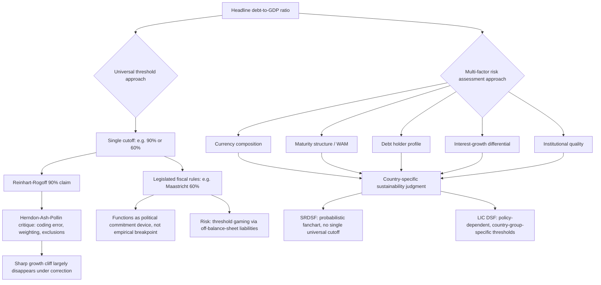

## Debt-to-GDP Thresholds and Their Empirical and Political Limits

### Definition and the Appeal of a Single Number

A **debt-to-GDP threshold** is a specific numerical level of the public debt-to-GDP ratio proposed, formally or informally, as a boundary beyond which debt sustainability risk is understood to rise sharply, or beyond which a sovereign is considered to enter a qualitatively more dangerous zone. The appeal of such thresholds to policymakers, legislators, and financial commentators is straightforward: a single number is easy to communicate, easy to legislate as a fiscal rule, and easy to use as a shorthand in political debate — "keep debt below X% of GDP" is vastly simpler messaging than "maintain a primary balance consistent with a favorable interest-growth differential under plausible stress scenarios," even though, as this item demonstrates, the latter is closer to what actually determines sustainability. This tension — between the political-communication value of a single threshold and its weak empirical foundation as a universal sustainability boundary — is the central subject of this item.

### The Reinhart-Rogoff 90% Threshold and Its Rise

The most historically consequential debt-to-GDP threshold claim in modern fiscal policy debate originated with the 2010 paper "Growth in a Time of Debt" by economists Carmen Reinhart and Kenneth Rogoff, which presented cross-country historical evidence that median real GDP growth rates fell markedly once a country's public debt-to-GDP ratio exceeded approximately 90%, with the implication — widely adopted in policy discourse, though the authors' own academic framing was more cautious — that 90% functioned as a meaningful inflection point beyond which debt began to materially impair growth. This finding was seized upon rapidly and prominently in the post-2010 fiscal policy debate, cited by finance ministers, legislators, and international commentators across multiple advanced economies as empirical justification for austerity-oriented fiscal consolidation programs during the European sovereign debt crisis period, functioning for several years as something close to a *de facto* universal debt ceiling in mainstream policy discourse.

### The Herndon-Ash-Pollin Critique and Its Aftermath

In 2013, researchers Thomas Herndon, Michael Ash, and Robert Pollin at the University of Massachusetts Amherst published a widely publicized re-examination of the Reinhart-Rogoff dataset and found several significant issues undermining the original 90% threshold finding: a spreadsheet coding error that excluded several countries' data from part of the calculation, a debated methodological choice regarding how to weight countries' growth-debt observations (Reinhart and Rogoff had given equal weight to each country regardless of how many years of high-debt data that country contributed, a choice the critics argued distorted the result), and selective exclusion of certain high-debt, high-growth observations (notably New Zealand's early post-war data) from the original sample. When the critics recalculated using the corrected data and an alternative weighting approach, the sharp growth cliff at the 90% threshold largely disappeared, replaced by a more gradual, continuous negative association between debt and growth with no clear discontinuous breakpoint at any specific ratio. Reinhart and Rogoff acknowledged the spreadsheet error but maintained that their qualitative conclusion — that high debt levels tend to be associated with slower growth — remained valid even after correction, while disputing some aspects of the critics' alternative weighting methodology. This episode is now a frequently cited case study in both economics methodology courses and public policy circles regarding the risks of translating a contested empirical finding into confident policy prescription, particularly one used to justify major, economically and politically costly austerity decisions across multiple sovereigns.

### The Core Empirical Problem: Threshold Effects Versus Continuous Relationships

Beyond the specific Reinhart-Rogoff episode, a broader and more fundamental empirical critique applies to virtually any claimed universal debt-to-GDP threshold: the academic literature examining the debt-growth relationship across many subsequent studies has generally found that, to the extent a negative association between high debt and growth exists at all, it tends to be **continuous and gradual** rather than exhibiting a sharp **threshold effect** (a discontinuous jump in risk or growth impact at one specific ratio value) — and, more importantly, that the relationship is highly **country-specific and context-dependent** rather than universal. The same nominal debt-to-GDP ratio can represent dramatically different underlying risk depending on factors that a single ratio, by construction, cannot capture: the currency composition of the debt (recall that foreign-currency-denominated debt introduces exchange-rate risk absent in local-currency debt), the maturity structure (recall that weighted average maturity determines rollover-risk exposure independent of the debt stock's absolute size), who holds the debt (recall the debt-holder profile distinction between domestic and foreign, official and private creditors — a domestically-held debt stock, particularly one held substantially by a country's own banking system, pension funds, or central bank, behaves very differently under stress than an identical ratio dominated by foreign private bondholders), the country's own growth potential and the prevailing interest-growth differential (recall the debt dynamics equation, under which the same debt ratio is far more sustainable under a favorable $g > i$ regime than an adverse one), and the strength of the country's institutions and revenue-raising capacity (recall the shared emphasis across sovereign rating agency methodology, the SRDSF, and the LIC DSF on institutional quality and debt-carrying capacity as inherently country-specific, not universal, parameters).

### Contrasting Threshold Practice: Fiscal Rules vs. Risk Assessment Frameworks

It is analytically useful to distinguish two very different ways debt-to-GDP thresholds are actually used in practice, since conflating them is a common source of confusion in public debate:

**Legislated fiscal rules**: A specific numerical debt-to-GDP ceiling written into binding or semi-binding domestic or supranational law, functioning as a hard political-economy commitment device rather than a claimed universal empirical breakpoint. The most prominent example is the **European Union's Maastricht Treaty** 60% debt-to-GDP reference value (alongside the 3%-of-GDP deficit reference value), embedded in the EU's fiscal governance framework since the 1990s. Critically, the 60% Maastricht figure was never derived from a rigorous empirical study identifying it as a sustainability breakpoint — it was selected largely because it approximated the average debt-to-GDP ratio across the founding eurozone member states at the time of the treaty's negotiation, making it as much a politically negotiated consensus figure reflecting the bloc's starting conditions as an evidence-based risk threshold. Numerous eurozone members have subsequently operated for extended periods well above this reference value without triggering the sharp discontinuous crisis dynamics a strict "threshold" interpretation might predict, though the rule continues to function as a genuine political and legal anchor point shaping EU fiscal surveillance procedures (the Excessive Deficit Procedure) regardless of its weak empirical grounding as a universal sustainability line.

**Risk-assessment framework indicative thresholds**: By contrast, recall that both the SRDSF and the LIC DSF deliberately reject the single-universal-number approach in their formal methodology. The LIC DSF's indicative debt-burden thresholds are explicitly **policy-dependent and country-group-specific** (varying by strong/medium/weak debt-carrying-capacity classification, recall), not a single universal figure, and the SRDSF's medium-term risk assessment is built around a probabilistic fanchart of simulated debt paths and a calibrated three-zone risk signal rather than any single fixed debt-to-GDP breakpoint at all. This design choice directly reflects the accumulated post-Reinhart-Rogoff-critique institutional lesson: the IMF and World Bank's own current-generation frameworks are structured specifically to avoid the single-universal-threshold trap that the 90% figure's political misuse exemplified, even though both frameworks still report and discuss debt-to-GDP levels prominently as one input among several.

### Political Limits: Why Thresholds Persist Despite Weak Empirical Grounding

Given the empirical fragility of any universal debt-to-GDP threshold, it is worth directly addressing why such thresholds nonetheless persist so prominently in political and public discourse — a genuine political-economy phenomenon distinct from, but interacting with, the empirical question:

**Communicative simplicity and political accountability**: A single, easily monitored number provides legislators, opposition parties, media, and the public with a low-cost, easily verifiable benchmark against which to hold a government accountable for fiscal management, in a way that a more accurate but more complex message (involving currency composition, maturity structure, interest-growth differentials, and institutional quality simultaneously) cannot easily replicate in a political communication environment with limited public attention and financial literacy.

**Credible commitment device function**: Even when a specific numerical threshold lacks strong independent empirical justification as a sustainability breakpoint, a legislated rule can still serve a genuine and valuable function as a **credible commitment device** — a self-imposed constraint that helps a government resist short-term political pressure toward fiscal indiscipline, precisely because the rule's rigidity (its lack of case-by-case flexibility) is the source of its credibility to markets and to future political administrations, not a design flaw. This is analytically the same logic underlying central bank independence and inflation targeting: a rule's value can lie substantially in its predictability and resistance to discretionary override, independent of whether the specific numerical target itself is empirically optimal in every circumstance.

**Coordination and comparability value**: A common threshold, even an imperfect one, provides a shared reference point that facilitates cross-country comparison, market benchmarking, and coordinated multilateral surveillance (the EU's Maastricht framework serves exactly this coordination function across member states with otherwise divergent fiscal histories and institutional starting points) — a genuine practical value distinct from, and not fully undermined by, the threshold's empirical fragility as a universal risk breakpoint.

**Risk of threshold gaming and cliff-edge behavior**: A documented, genuine cost of rigid legislated thresholds is that they can induce **threshold gaming** — governments structuring transactions, timing expenditures, or using off-balance-sheet vehicles specifically to keep a headline debt figure just below a binding legal or political threshold, rather than genuinely improving underlying fiscal sustainability (recall this is directly the mechanism by which contingent liabilities and off-balance-sheet SOE or PPP exposure can proliferate — a debt ceiling that is rigid on the headline number but poorly enforced on the debt-coverage perimeter creates a direct incentive to push liabilities into whatever category remains uncounted, precisely the transparency gap the IMF's public-sector-perimeter guidance under the SRDSF is designed to close).

### The Genuine Empirical Consensus: Context-Dependence, Not "No Threshold Matters"

It would be an overcorrection to conclude from the Reinhart-Rogoff episode that debt-to-GDP levels carry no meaningful information at all — that reading is not supported by the broader post-2013 empirical literature either. The more accurate synthesis, reflecting the genuine current state of the debate, is that elevated debt-to-GDP ratios are consistently associated with elevated sustainability risk on average across countries, but the specific ratio at which risk becomes acute for any *given* sovereign varies substantially and is mediated by the country-specific factors enumerated above (currency composition, maturity, holder profile, growth potential, institutional quality) — which is precisely why the current-generation multilateral frameworks (SRDSF, LIC DSF) have moved toward probabilistic, country-differentiated, and multi-indicator risk assessment architectures rather than any single universal cutoff, and why a genuinely well-grounded fiscal-sustainability judgment for a specific sovereign requires engaging with that sovereign's specific debt-dynamics equation, portfolio risk profile, and institutional context — the material covered throughout the rest of this chapter — rather than checking a single ratio against a remembered round number.

### Worked Illustration: Divergent Sustainability at an Identical Ratio

Consider two hypothetical sovereigns, both at exactly 75% debt-to-GDP, illustrating directly why the ratio alone is insufficient:

| Characteristic | Sovereign A | Sovereign B |
| --- | --- | --- |
| Debt-to-GDP | 75% | 75% |
| Currency composition | 90% local currency | 60% foreign currency |
| Weighted average maturity | 9 years | 3 years |
| Primary holder base | Domestic pension funds, banks | Foreign private bondholders |
| Interest-growth differential | Favorable ($g > i$) | Adverse ($i > g$) |
| Institutional quality (rating-agency proxy) | Strong, stable track record | Weak, recent political volatility |

Sovereign A, despite an identical headline ratio to Sovereign B, faces materially lower rollover risk (longer WAM), lower currency risk (predominantly local-currency), a more favorable underlying debt dynamics trajectory (favorable interest-growth differential, recall this alone can stabilize or reduce the ratio even absent primary surpluses), and a more resilient investor base less prone to sudden capital flight. A rating agency, an SRDSF assessment, or a legislated 60%-style fiscal rule applied mechanically to the headline ratio alone would treat these two sovereigns identically or nearly so — precisely the analytical failure mode this item's core critique addresses, and precisely why every framework discussed elsewhere in this chapter deliberately layers additional country-specific structural indicators on top of, rather than in place of, the headline debt-to-GDP figure.

### Mermaid Diagram: From Single Threshold to Multi-Factor Assessment

### SVG Illustration: Continuous Relationship vs. Claimed Threshold Effect (svg_diagram)

<svg xmlns="http://www.w3.org/2000/svg" viewBox="0 0 700 420">
\<style\>
.ax{stroke:#333;stroke-width:2;}
.claimed{stroke:#c0392b;stroke-width:3;fill:none;}
.actual{stroke:#2c5c99;stroke-width:3;fill:none;stroke-dasharray:0;}
.lbl{font-family:sans-serif;font-size:12px;fill:#222;}
.ttl{font-family:sans-serif;font-size:15px;fill:#111;font-weight:bold;}
.dash{stroke:#888;stroke-width:1;stroke-dasharray:4,3;}
\</style\>
<text x="20" y="25" class="ttl">Claimed Threshold Effect vs. Corrected Continuous Relationship (svg_diagram)</text>
<line x1="70" y1="350" x2="650" y2="350" class="ax" />
<line x1="70" y1="350" x2="70" y2="50" class="ax" />
<text x="330" y="390" class="lbl">Debt-to-GDP ratio →</text>
<text x="20" y="200" class="lbl" transform="rotate(-90 20 200)">Median real GDP growth</text>
<path d="M 90 150 L 350 145 L 360 280 L 620 285" class="claimed" />
<path d="M 90 150 C 250 165, 400 220, 620 260" class="actual" />
<line x1="355" y1="50" x2="355" y2="350" class="dash" />
<text x="360" y="65" class="lbl" fill="#c0392b">Claimed 90% cliff</text>
<text x="480" y="140" class="lbl" fill="#c0392b">Original Reinhart-Rogoff</text>
<text x="480" y="156" class="lbl" fill="#c0392b">reading (sharp drop)</text>
<text x="440" y="300" class="lbl" fill="#2c5c99">Corrected: gradual,</text>
<text x="440" y="316" class="lbl" fill="#2c5c99">continuous relationship</text>
</svg>

### Practical Implications for Fiscal Statecraft

For a finance ministry navigating both the political reality that debt-to-GDP thresholds will continue to dominate public and legislative debate, and the empirical reality that no universal threshold reliably predicts sustainability risk for a specific sovereign, the practically useful synthesis is twofold: first, a legislated domestic fiscal rule anchored to a debt-to-GDP ceiling can retain genuine value as a credible commitment device and communication anchor even without strong independent empirical derivation, provided it is designed with adequate flexibility (escape clauses for genuine shocks) to avoid encouraging exactly the off-balance-sheet threshold-gaming behavior that rigid, poorly-enforced rules tend to produce; and second, the substantive sustainability analysis that actually informs sound fiscal-policy decisions — as opposed to the political communication surrounding those decisions — should rest on the country-specific, multi-factor architecture exemplified by the SRDSF and LIC DSF frameworks (debt dynamics, currency and maturity structure, holder profile, institutional quality, stress-tested scenarios) rather than on any single remembered round-number ratio, however politically salient that number may remain in public debate.

**Related Topics**

- The debt dynamics equation: primary balance, growth, and interest-rate differentials
- The IMF Sovereign Risk and Debt Sustainability Framework for market-access countries
- The IMF-World Bank Debt Sustainability Framework for low-income countries
- Fiscal rules design: escape clauses, debt brakes, and the Maastricht framework
- Contingent liabilities, guarantees, and off-balance-sheet fiscal risk
- Credit rating agency methodology and the determinants of sovereign ratings