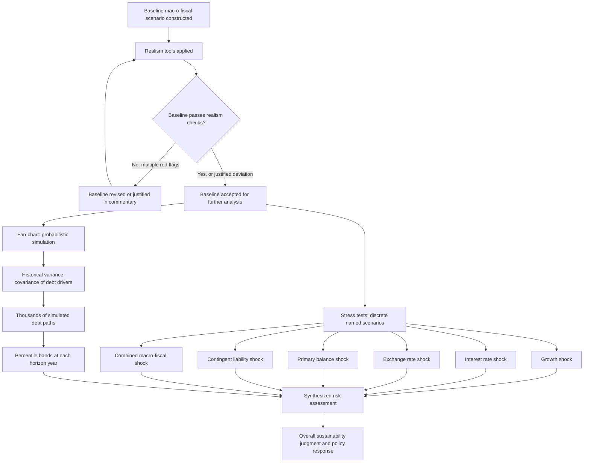

## Stress Testing, Realism Tools, and Debt Fan-Charts in Sustainability Analysis

### Definition and Function

**Stress testing**, **realism tools**, and **debt fan-charts** are the three complementary analytical instruments that convert a debt sustainability analysis (DSA) from a single deterministic baseline projection into a genuinely risk-informed assessment. Recall that the debt dynamics equation, applied mechanically to one set of assumed future values for the primary balance, growth, and the interest rate, produces exactly one debt-to-GDP trajectory — a single line on a chart. That single line, taken alone, conveys almost nothing about *risk*, since it says nothing about how likely that specific path is, how the trajectory would behave under adverse conditions, or whether the assumptions feeding it are themselves credible given the country's own track record. These three tools exist precisely to address that gap, each addressing a distinct question: stress tests ask "what happens to the baseline if a specific adverse shock occurs?"; realism tools ask "are the baseline assumptions themselves credible, given historical experience?"; and fan-charts ask "what is the full probabilistic range of outcomes, accounting for the historical variance and correlation of all the shocks simultaneously?"

### Stress Testing: Deterministic Scenario Analysis

A **stress test** in the DSA context is a deterministic alternative scenario in which one or more baseline assumptions (growth, the interest rate, the exchange rate, the primary balance, or a contingent liability) is shocked by a specified magnitude, and the resulting debt-to-GDP and gross financing needs (GFN) trajectories are recomputed and compared against the baseline path. Unlike the fan-chart's probabilistic approach (discussed below), a stress test is a **single deterministic "what if" scenario**, not a probability distribution — it answers "how much worse does the trajectory look if this specific bad thing happens?" rather than "how likely is a bad outcome overall?"

**Standard stress test types applied across sustainability frameworks:**

- **Growth shock**: real GDP growth is set to some number of standard deviations below the baseline for a specified number of years (commonly calibrated using the country's own historical growth volatility), testing the sensitivity of the debt trajectory to a recession or a structural growth slowdown.
- **Interest rate shock**: the effective interest rate on new and rolled-over debt is shocked upward by a specified number of basis points, testing sensitivity to a monetary tightening cycle or a sudden repricing of sovereign risk — recall that this shock operates directly through the interest-growth differential term in the debt dynamics equation, and its impact is mechanically larger for a sovereign with a shorter average time to refixing (ATR), since a larger share of the debt stock reprices to the new higher rate within the stress-test horizon.
- **Primary balance shock**: the primary balance is assumed to deteriorate relative to baseline, testing sensitivity to fiscal slippage, whether from a legislative failure to implement planned consolidation or an unanticipated spending pressure.
- **Exchange rate shock**: the local currency is assumed to depreciate by a specified percentage, testing sensitivity of the debt-to-GDP ratio through the foreign-currency debt revaluation channel — recall this operates through the real exchange rate term in the SRDSF's formal debt dynamics decomposition, and its magnitude scales directly with the foreign-currency share of the debt stock, $\alpha_t^f$.
- **Combined macro-fiscal shock**: several of the above shocks applied simultaneously, representing a more severe but still plausible joint adverse scenario (a recession accompanied by both a market-driven interest-rate spike and currency depreciation is a historically common joint pattern in emerging-market crises, rather than an unusual combination of independent events).
- **Contingent liability shock**: a specified one-off addition to the debt stock (or a stock-flow adjustment), representing the crystallization of a previously off-balance-sheet exposure — recall this is the direct DSA-level mechanism through which SOE guarantees, PPP demand-guarantee calls, or banking-sector recapitalization costs enter the sustainability analysis, and it is precisely the triggered contingent-liability stress test that the SRDSF activates automatically for countries with a narrower-than-general-government debt perimeter, reflecting the elevated risk that material exposures sit outside the recognized debt stock.
- **Commodity price shock**: for resource-dependent sovereigns, a shock to the price of a dominant export commodity, testing sensitivity of both growth and fiscal revenue (where royalty or resource-tax revenue is a material budget component) to a terms-of-trade deterioration.

### Interpreting Stress Test Output

The core output of a stress test is a comparison chart showing the baseline debt-to-GDP (and GFN-to-GDP) trajectory alongside the stressed trajectory, typically over the medium-term (5-year) horizon. The key interpretive questions a debt manager or DSA analyst asks of this output are: does the debt ratio under the stress scenario still eventually stabilize, or does it become genuinely explosive (rising without bound over the projection horizon)? How large is the peak deviation from baseline, and does that peak deviation push the debt ratio through a policy-relevant threshold (recall the prior item's caution against treating any single threshold as a universal sustainability cutoff, but a threshold can still be a meaningful reference point for a specific country's own institutional or legal context, such as a domestic fiscal rule ceiling)? And critically, does the GFN trajectory under stress exceed a level the sovereign could plausibly finance given its market access and investor base — since, recall, a sovereign can be stress-tested as *solvent* over the medium term while still failing a *liquidity* stress test, if a concentrated near-term financing requirement collides with impaired market access at exactly the wrong moment.

### Realism Tools: Testing the Credibility of the Baseline Itself

**Realism tools** address a categorically different question from stress tests: rather than asking what happens if the baseline is shocked, realism tools ask whether the baseline assumptions themselves are *plausible* in the first place, given the country's own historical track record and cross-country experience. This distinction matters enormously in practice, because a debt sustainability conclusion of "stable and declining" produced from an unrealistically optimistic baseline is far more dangerous than an honestly pessimistic baseline that is stress-tested — the former can create false confidence that masks a genuinely deteriorating trajectory, while the latter at least surfaces the risk explicitly.

Recall the SRDSF's suite of nine realism tools introduced specifically to guard against this failure mode: comparing projected fiscal-adjustment magnitude against the historical cross-country distribution and the country's own past adjustment record (flagging a projected consolidation exceeding the 75th percentile of either as a potential optimism signal); comparing projected debt-to-GDP reduction against historical experience on the same basis; checking whether a projected real effective exchange rate misalignment is realistically expected to unwind rather than persist indefinitely; checking whether projected growth remains consistent with potential output and the historical average rather than assuming an unexplained acceleration; and checking whether the growth path implied by a planned fiscal consolidation, using standard fiscal-multiplier assumptions, is internally consistent with the baseline growth assumption (a baseline that assumes both aggressive fiscal tightening *and* accelerating growth simultaneously, without a clear structural justification, is a classic realism red flag, since standard multiplier logic would predict at least a temporary growth drag from consolidation). Recall also that the LIC DSF's 2017 reform introduced its own parallel realism-tool suite for the same purpose within the low-income-country context.

The forecast-track-record tool deserves particular emphasis as the most direct and mechanically grounded of the realism checks: it compares the country's own historical forecast errors for each debt driver (the primary deficit, the real interest-growth differential, exchange-rate depreciation, and stock-flow adjustments) at one-, three-, and five-year horizons against a relevant peer comparator group, using a color-coded scale ranging from persistent historical pessimism to persistent historical optimism. A country whose past DSA baselines have systematically over-predicted fiscal consolidation or under-predicted debt-increasing shocks — visible as a pattern of "red cells" in this tool — provides direct empirical grounds for applying additional skepticism to the *current* baseline, independent of any stress test applied on top of it, since the pattern reveals a structural bias in how that specific country's projections tend to be constructed, whether from institutional optimism, data limitations, or systematic underestimation of specific risk channels.

### Debt Fan-Charts: Probabilistic Risk Visualization

The **debt fan-chart** represents the most methodologically sophisticated of the three tools, converting the deterministic baseline-plus-discrete-stress-scenarios approach into a full **probability distribution** of possible future debt-to-GDP paths. Rather than showing a small number of specific alternative scenarios (as stress testing does), a fan-chart simulates a very large number of possible future paths by drawing repeated random shocks to the key debt-driver variables (growth, the interest rate, the exchange rate, the primary balance) from a distribution calibrated to match the **historical variance and cross-correlation structure** of those variables' actual past behavior for the country in question — critically, capturing not just how much each variable has historically varied on its own, but how those variables have historically moved *together* (a growth shock and an exchange-rate shock, for instance, have often historically co-occurred rather than arriving independently, and a fan-chart methodology that ignores this correlation would understate genuine joint-tail risk).

**Constructing the fan-chart, conceptually:**

1. Estimate the historical joint distribution (means, variances, and correlations) of the shocks to the core debt-driver variables, typically using a multi-decade cross-country or country-specific historical dataset.
2. Simulate a very large number (commonly several thousand) of alternative future debt-to-GDP paths, each constructed by drawing a random shock sequence from this estimated joint distribution and applying it to the debt dynamics equation over the projection horizon.
3. At each point along the projection horizon, calculate the percentile distribution of the simulated outcomes (for instance, the 10th, 25th, 50th/median, 75th, and 90th percentile debt-to-GDP values across all simulated paths).
4. Plot these percentile bands as a fan shape emanating from the current (known, non-random) debt level, widening progressively as the projection horizon extends further into the future — reflecting the intuitive and economically correct property that uncertainty about the debt ratio compounds and widens the further out one projects, since each additional year of simulated shocks adds further variance to the cumulative outcome.

The resulting visual — a widening cone or "fan" of shaded probability bands around the central baseline projection — directly communicates what a single deterministic line cannot: the genuine width of the plausible outcome range, and, critically, what *share* of that simulated probability distribution falls above any specific reference level (a legislated fiscal-rule ceiling, a rating-agency-relevant threshold, or simply the current ratio itself, allowing a direct read of the probability that debt fails to decline from its current level over the horizon).

### The SRDSF Debt Fanchart Module in Specific Detail

Recall that the SRDSF's medium-term risk assessment combines exactly this fan-chart methodology (the **Debt Fanchart Module**) with the separate Gross Financing Needs Module, addressing solvency and liquidity risk respectively. The Fanchart Module's specific innovation, beyond the general fan-chart concept described above, is that it does not treat every simulated wide-distribution outcome as equally informative for risk assessment — instead, it derives a single summary risk index from the *width and skew* of the simulated distribution (a fan that is wide and skewed toward high-debt outcomes signals materially higher risk than a fan of similar median but narrower and more symmetric dispersion), and this index is itself calibrated against the historical record of which countries' fan-chart characteristics preceded actual sovereign stress episodes, feeding into the same missed-crisis/false-alarm threshold calibration methodology (recall the 10-percent-error-rate calibration) that governs the SRDSF's other risk indices. A realism diagnostic is applied directly within the fanchart algorithm itself, flagging cases where the simulated distribution's width or skew appears implausible relative to the country's own historical shock experience — directly integrating the realism-tool philosophy into the fan-chart construction process itself, rather than treating realism-checking as a separate, disconnected exercise.

### Worked Example: Interpreting a Stylized Fan-Chart

Consider a stylized 5-year debt fan-chart for illustration, with a baseline (median) debt-to-GDP trajectory starting at 60% and reaching a projected 58% by year 5:

| Year | 10th percentile | Median (baseline) | 90th percentile |
| --- | --- | --- | --- |
| 0 (current) | 60% | 60% | 60% |
| 1 | 56% | 60% | 65% |
| 2 | 52% | 59% | 69% |
| 3 | 49% | 59% | 74% |
| 4 | 46% | 58% | 79% |
| 5 | 43% | 58% | 85% |

The widening gap between the 10th and 90th percentile bands (a 5-point range in year 1 widening to a 42-point range by year 5) directly illustrates the compounding-uncertainty property described above. Critically, the *median* path alone — the number a single deterministic baseline projection would report — shows a modestly declining, apparently comfortable trajectory reaching 58% by year 5. But the fan-chart reveals that the 90th percentile outcome reaches 85%, a materially different risk picture: roughly one in ten simulated paths, given the historical shock distribution this country has actually experienced, produces a debt ratio 27 percentage points above the median projection by year 5 — information a single-line baseline chart simply cannot convey, and precisely the kind of tail risk that a mechanical debt-to-GDP threshold check against the median line alone would miss entirely.

### The Complementary Relationship Between the Three Tools

These three tools are not substitutes for one another but function as sequential, complementary layers within a rigorous DSA. **Realism tools** are applied first, or in parallel, to establish whether the baseline itself — the central path around which everything else is built — is credible; a baseline that fails multiple realism checks undermines the value of any subsequent stress-testing or fan-charting built on top of it, since both remaining tools inherit whatever bias sits in the baseline. **Stress tests** then provide specific, interpretable, policy-relevant "what if" scenarios that a finance ministry can directly discuss and plan contingency responses around (a named growth shock or a named interest-rate shock is far more actionable for policy planning purposes than an abstract percentile from a simulated distribution). **Fan-charts** then provide the comprehensive probabilistic picture that stress tests, by their necessarily limited and discrete number of named scenarios, cannot fully capture — the genuine tail risk and the correlated, joint nature of real-world shocks. A rigorous SRDSA or LIC DSA report, accordingly, presents all three layers together: a realism-checked baseline, a small number of clearly labeled stress scenarios illustrating specific vulnerabilities, and a fan-chart giving the full probabilistic risk picture — with the final risk assessment and any accompanying policy judgment drawing on the combined weight of evidence across all three, rather than on any single tool in isolation.

### Mermaid Diagram: The Three-Tool Analytical Sequence

### SVG Illustration: The Debt Fan-Chart Concept (svg_diagram)

<svg xmlns="http://www.w3.org/2000/svg" viewBox="0 0 700 420">
\<style\>
.ax{stroke:#333;stroke-width:2;}
.band90{fill:#f7cfc7;opacity:0.6;}
.band75{fill:#fdf3c4;opacity:0.7;}
.median{stroke:#2c5c99;stroke-width:3;fill:none;}
.lbl{font-family:sans-serif;font-size:12px;fill:#222;}
.ttl{font-family:sans-serif;font-size:15px;fill:#111;font-weight:bold;}
\</style\>
<text x="20" y="25" class="ttl">Debt-to-GDP Fan-Chart: Widening Uncertainty Over Horizon (svg_diagram)</text>
<line x1="70" y1="360" x2="650" y2="360" class="ax" />
<line x1="70" y1="360" x2="70" y2="50" class="ax" />
<text x="330" y="400" class="lbl">Projection year →</text>
<text x="20" y="200" class="lbl" transform="rotate(-90 20 200)">Debt-to-GDP (%)</text>
<path d="M 100 250 L 200 240 L 300 220 L 400 195 L 500 165 L 600 130 L 600 340 L 500 320 L 400 295 L 300 270 L 200 258 L 100 250 Z" class="band90" />
<path d="M 100 250 L 200 248 L 300 238 L 400 232 L 500 222 L 600 210 L 600 280 L 500 275 L 400 262 L 300 255 L 200 252 L 100 250 Z" class="band75" />
<path d="M 100 250 L 200 253 L 300 247 L 400 248 L 500 250 L 600 250" class="median" />
<text x="500" y="155" class="lbl" fill="#a33">90th percentile band</text>
<text x="500" y="240" class="lbl" fill="#7a6600">Interquartile band</text>
<text x="500" y="265" class="lbl" fill="#2c5c99">Median (baseline)</text>
<text x="90" y="380" class="lbl">Year 0</text>
<text x="580" y="380" class="lbl">Year 5</text>
</svg>

### Practical Implications for Fiscal Statecraft

For a finance ministry or debt management office, the practical lesson of this three-tool architecture is that a debt sustainability conclusion is only as trustworthy as the weakest of its three supporting layers: a beautifully constructed fan-chart built on an unrealistic baseline produces a falsely precise-looking but fundamentally misleading probability distribution, just as a rigorously realism-checked baseline that is never stress-tested leaves genuine, specific policy-relevant vulnerabilities (a particular currency exposure, a particular refinancing concentration) undiscussed and unplanned-for. A debt management office's own internal risk-monitoring practice — recall the MTDS cost-risk simulation framework — benefits directly from adopting this same three-layer discipline domestically, rather than relying solely on whichever single scenario or single ratio happens to be most politically convenient to present in a given budget cycle, since it is precisely the combination of a credible baseline, clearly communicated discrete stress scenarios, and an honest accounting of the genuine probabilistic tail risk that supports sound medium-term financing strategy and, ultimately, credible engagement with rating agencies, multilateral partners, and the market itself.

**Related Topics**

- The debt dynamics equation: primary balance, growth, and interest-rate differentials
- The IMF Sovereign Risk and Debt Sustainability Framework for market-access countries
- Debt management office functions and sovereign portfolio risk
- Contingent liabilities, guarantees, and off-balance-sheet fiscal risk
- Debt-to-GDP thresholds and their empirical and political limits
- Medium-Term Debt Management Strategy (MTDS) cost-risk simulation methodology