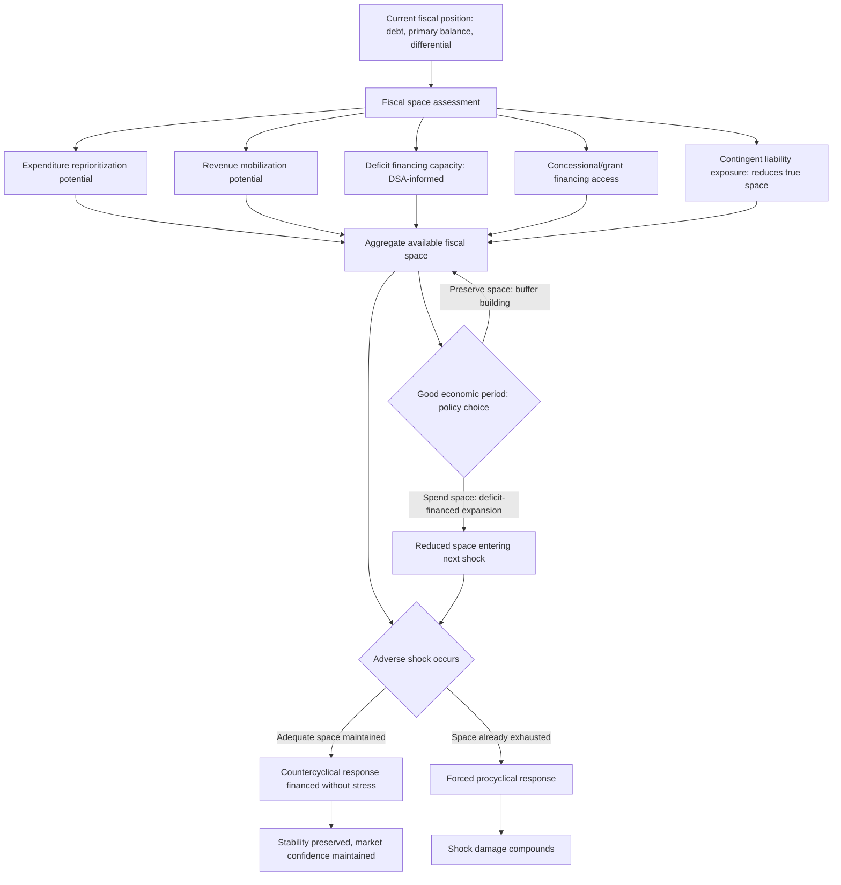

## Fiscal Space and Its Role in Crisis Prevention

### Definition and Core Intuition

**Fiscal space** is the room a government has within its fiscal position to raise spending, cut taxes, or absorb a shock — through additional borrowing or reallocation — without endangering market access, debt sustainability, or macroeconomic stability. First given systematic analytical treatment in Peter Heller's 2005 IMF working paper, which defined it as room in a government's budget that allows it to provide resources for a desired purpose without jeopardizing the sustainability of its financial position or the stability of the economy, fiscal space is best understood not as a single number but as a **relative, forward-looking, and state-contingent concept**: it asks not "how much debt does this country currently have?" but rather "how much *additional* fiscal burden could this country absorb, starting from where it is now, before its debt trajectory or market access became genuinely threatened?"

This distinction from a simple debt-to-GDP reading matters directly for fiscal statecraft: recall that debt-to-GDP thresholds carry weak universal predictive power precisely because sustainability depends on country-specific structural factors (currency composition, maturity, holder profile, the interest-growth differential, institutional quality). Fiscal space is the concept that explicitly operationalizes this country-specific, forward-looking judgment into something usable for real-time crisis-prevention policy — it is, in effect, the answer a debt sustainability analysis exists to help estimate, translated into a policy-actionable "how much room do we actually have" framing.

### Fiscal Space Versus Debt Sustainability: A Necessary Distinction

Fiscal space and debt sustainability are closely related but analytically distinct concepts, and the distinction is worth making precise. **Debt sustainability** (recall the SRDSF's formal definition) is a binary-adjacent judgment about whether a given debt trajectory can be stabilized through economically and politically feasible policy without recourse to restructuring — it describes a *boundary condition*. **Fiscal space** describes the *distance* from that boundary — how much additional fiscal burden the sovereign could absorb before approaching it. A country can be assessed as having sustainable debt while simultaneously having very little fiscal space (a sovereign with a stable but already elevated debt ratio, financed at the edge of what its interest-growth differential and primary balance can comfortably support, is sustainable under the current baseline but has essentially no room to absorb a further shock without requiring painful adjustment). Conversely, a country with low current debt can still have limited *effective* fiscal space if its revenue base is narrow, its institutions are weak, or its growth prospects are fragile, such that even modest additional borrowing would rapidly erode market confidence — fiscal space is therefore a function of the same structural factors that determine debt-carrying capacity generally (recall the shared emphasis on institutional quality across sovereign ratings, the SRDSF, and the LIC DSF composite indicator), not merely the current debt level in isolation.

### The Analytical Components of Fiscal Space

Following the framework Heller's original analysis established and subsequent IMF and academic work has elaborated, fiscal space can be decomposed into several distinct, partially overlapping channels through which a government can actually create room for additional spending or shock absorption:

**Expenditure reprioritization**: Reallocating existing spending away from lower-priority uses toward the desired purpose or toward crisis response, without any net change in the overall fiscal envelope — the "cheapest" form of fiscal space in the sense that it requires no new financing, but is frequently politically difficult given the entrenched interests and legal or contractual commitments (recall the analytical distinction between mandatory and discretionary spending) attached to existing expenditure lines.

**Revenue mobilization**: Raising additional resources through improved tax administration, base-broadening reforms, or new revenue measures — recall the Philippines' 2012 Sin Tax Reform Law as a concrete worked example of exactly this channel, directly expanding fiscal space through structural revenue-side reform rather than through additional borrowing.

**Deficit financing (additional borrowing)**: Raising the desired resources through new debt issuance, the channel most directly governed by the debt sustainability constraints, market access conditions, and debt management considerations covered throughout the rest of this chapter — this is the channel where fiscal space and debt sustainability analysis most directly intersect, since the *amount* of deficit-financing space available is, in substantial part, precisely what a well-constructed DSA (baseline plus stress tests plus fan-chart, recall) is designed to help quantify.

**External grants and concessional financing**: For lower-income sovereigns in particular, access to grants or concessional loans (recall the IDA/PRGT concessional financing channel discussed in the LIC DSF context) can expand effective fiscal space without adding proportionate debt-service burden, since concessional terms (below-market interest rates, extended grace periods and maturities) directly improve the interest-growth differential relative to market-rate borrowing of the same nominal amount.

**Monetary financing and seigniorage** (with significant caveats): In principle, a sovereign with full monetary sovereignty over its own currency could, in extremis, finance a portion of its deficit through central bank money creation rather than debt issuance — but this channel carries such severe risks to price stability and central bank independence (recall the "fiscal dominance" concern raised in the debt management office context, where a central bank subordinated to financing government spending compromises its inflation-control mandate) that it is treated in virtually all credible fiscal-space frameworks as a last-resort or emergency-only channel rather than a normal component of planned fiscal space, and its overuse is itself a classic historical driver of the chronic excessive inflation category of sovereign stress (recall this is one of the SRDSF's explicit sovereign stress criteria).

### Fiscal Space and Crisis Prevention: The Core Mechanism

The direct crisis-prevention function of fiscal space operates through a straightforward but consequential logic: a sovereign that has maintained adequate fiscal space *during normal times* — meaning it has not exhausted its capacity to run a larger deficit or take on additional debt — retains the policy flexibility to respond countercyclically to an adverse shock (a recession, a natural disaster, a terms-of-trade shock, a financial-sector crisis requiring recapitalization support) precisely when that response is most needed, without that crisis-response borrowing itself triggering a loss of market confidence or a sovereign stress event. Conversely, a sovereign that enters a shock already near the effective limit of its fiscal space faces a much starker choice: either respond to the shock with additional borrowing that itself risks precipitating the market-confidence crisis the fiscal space concept exists to help avoid, or forgo an adequate policy response and allow the shock's real economic damage to compound unmitigated — the classic **procyclical fiscal policy trap** that has recurred across numerous historical emerging-market crisis episodes, where fiscal space exhaustion during a boom period left no room for countercyclical support once the boom reversed.

This crisis-prevention logic directly explains why fiscal space maintenance during favorable economic periods — sometimes summarized in fiscal-policy literature as "fixing the roof while the sun is shining" — is treated as a first-order policy priority in sound fiscal statecraft, distinct from and prior to the crisis-response question itself. Recall the debt dynamics equation's demonstration that a favorable interest-growth differential can support a stable or declining debt ratio even under a moderate primary deficit; a government experiencing strong growth and a favorable differential during good times, but which chooses to run large deficits during that same favorable period rather than building fiscal buffers, effectively spends down its fiscal space precisely when it is cheapest to preserve it, leaving a materially worse starting position — less space, and often a less favorable differential given how quickly market conditions can shift — once an adverse shock eventually arrives.

### Quantifying and Assessing Fiscal Space in Practice

Unlike debt sustainability, which the SRDSF and LIC DSF formally quantify through structured mechanical tools (recall the fanchart, GFN module, and composite-indicator threshold architecture), fiscal space itself does not have an equivalently standardized, universally adopted single quantitative metric — it is more often assessed as a synthesized judgment drawing on several complementary indicators simultaneously:

- **Distance from the debt-stabilizing primary balance**: recall this exact metric, $pb_t^{*}$, from the debt dynamics equation — a country currently running a primary balance well above its debt-stabilizing level has more evident room to relax fiscal policy (spend more, tax less) before the debt ratio would even stop declining, let alone begin rising; a country running close to or below its debt-stabilizing level has correspondingly less room.
- **Debt sustainability assessment risk signals**: recall the SRDSF's low/moderate/high risk-zone architecture and the LIC DSF's low/moderate/high/in-distress classification — a country assessed at low risk across near-, medium-, and long-term horizons generally, though not automatically, corresponds to greater fiscal space than one already flagged as high risk on multiple horizons, since the risk assessment itself is substantially a forward-looking read on how much adverse-shock absorption capacity remains.
- **Market-based indicators**: sovereign bond spreads, CDS premia, and recent auction performance (recall the bid-to-cover ratio and tailing-auction signals from primary issuance mechanics) provide a real-time, market-determined read on how much additional borrowing the market itself would currently be willing to absorb from a given sovereign without demanding a materially higher risk premium — a market-based proxy for fiscal space that updates far more frequently than a formal DSA cycle.
- **Revenue mobilization potential**: an assessment (often benchmarked against comparator countries at a similar income level) of how far a country's actual tax-to-GDP ratio sits below its structurally achievable potential, given its economic structure and administrative capacity — a wide gap suggests meaningful *latent* fiscal space available through revenue-side reform, distinct from and additive to the debt-financing channel.
- **Contingent liability exposure**: recall that a comprehensive fiscal risk statement and guarantee register materially affects the *true* fiscal space available, since a sovereign carrying large undisclosed or poorly quantified contingent liabilities has genuinely less usable fiscal space than its headline direct-debt figures alone would suggest — precisely the transparency-gap concern raised throughout the contingent-liabilities discussion.

### Worked Example: Fiscal Space Erosion and the COVID-19 Shock

The COVID-19 pandemic provides a globally shared, directly comparable illustration of fiscal space in action as a genuine crisis-prevention and crisis-response resource. Sovereigns entering 2020 with comparatively low debt-to-GDP ratios, favorable interest-growth differentials, and strong institutional credibility were broadly able to mount large countercyclical fiscal responses — expanded health spending, income-support programs, business-continuity financing — funded through rapid new debt issuance at historically low borrowing costs, without triggering a sovereign stress event, precisely because their pre-crisis fiscal space provided the room to absorb this shock. Sovereigns entering the pandemic already closer to the limits of their fiscal space — a combination of elevated pre-existing debt, a less favorable differential, or weaker institutional credibility — faced a starker trade-off: some were still able to respond with substantial multilateral and, in some cases, market support (recall the SRDSF's explicit "COVID-19 and other severely exogenous events" realism-flag exception, acknowledging that the pandemic's scale justified departures from normal historical benchmarks), but others faced meaningfully constrained response capacity, and several LIC-DSF-assessed sovereigns saw risk ratings deteriorate toward high risk or, in a subset of cases, into actual debt distress during and after the pandemic period, reflecting fiscal space that had already been substantially eroded before the shock arrived. [Inference: the general pattern described here — that pre-crisis fiscal space materially shaped the scale and market-cost of countries' pandemic fiscal response — is well documented in cross-country IMF and academic post-pandemic assessment literature; specific current country-level debt or risk-rating outcomes attributable to this dynamic should be verified against the latest published SRDSA or LIC DSA documentation for any given sovereign before use in a specific analysis.]

### The Political Economy Tension: Fiscal Space Preservation Versus Development Needs

A genuine and frequently debated tension exists between the crisis-prevention logic of fiscal space preservation and the legitimate developmental case for utilizing available fiscal space for productive investment, particularly in emerging-market and lower-income sovereign contexts. The strongest case for preserving fiscal space emphasizes precisely the procyclical-trap risk described above: a government that borrows up to its apparent current limit during good times, even for genuinely productive investment (infrastructure, human capital), leaves itself without a buffer when the next shock arrives, and the resulting forced procyclical austerity during that shock can impose costs — on growth, on poverty, on the very developmental objectives the earlier borrowing aimed to serve — that exceed the benefit of the additional investment undertaken during the good period. The strongest counter-case emphasizes that fiscal space preserved rather than used is not costless either: genuine infrastructure and human-capital gaps in many developing sovereigns represent a real constraint on long-run growth and debt-carrying capacity itself, such that a policy of excessive fiscal-space conservatism can become self-defeating — under-investing in the very growth-enhancing measures (recall the debt dynamics equation's emphasis on real growth $\gamma_t$ as the more sustainable channel for improving the interest-growth differential, as opposed to relying on fiscal contraction alone) that would, over the medium term, expand rather than erode the country's genuine long-run fiscal space. This tension does not resolve into a universal formula; it is a genuine judgment call specific to each sovereign's growth-versus-buffer trade-off, informed by, but not mechanically determined by, the quantitative tools (DSA, fanchart, stress tests) discussed elsewhere in this chapter.

### Mermaid Diagram: Fiscal Space as Crisis-Prevention Buffer

### SVG Illustration: Fiscal Space as Distance from the Sustainability Boundary (svg_diagram)

<svg xmlns="http://www.w3.org/2000/svg" viewBox="0 0 700 400">
\<style\>
.ax{stroke:#333;stroke-width:2;}
.safe{fill:#d6ecd2;}
.space{fill:#a8d5f0;opacity:0.7;}
.boundary{stroke:#c0392b;stroke-width:3;stroke-dasharray:6,4;}
.current{fill:#2c5c99;}
.lbl{font-family:sans-serif;font-size:12px;fill:#222;}
.ttl{font-family:sans-serif;font-size:15px;fill:#111;font-weight:bold;}
\</style\>
<text x="20" y="25" class="ttl">Fiscal Space as Distance from the Sustainability Boundary (svg_diagram)</text>
<rect x="70" y="60" width="580" height="260" class="safe" />
<line x1="580" y1="60" x2="580" y2="320" class="boundary" />
<text x="590" y="55" class="lbl" fill="#c0392b">Sustainability boundary</text>
<text x="590" y="70" class="lbl" fill="#c0392b">(unsustainable beyond this line)</text>
<circle cx="220" cy="190" r="10" class="current" />
<text x="150" y="165" class="lbl">Country A: current position</text>
<line x1="220" y1="190" x2="580" y2="190" stroke="#2c5c99" stroke-width="2" stroke-dasharray="3,3" />
<text x="330" y="210" class="lbl" fill="#2c5c99">Wide fiscal space</text>
<circle cx="480" cy="260" r="10" class="current" />
<text x="400" y="290" class="lbl">Country B: current position</text>
<line x1="480" y1="260" x2="580" y2="260" stroke="#2c5c99" stroke-width="2" stroke-dasharray="3,3" />
<text x="420" y="245" class="lbl" fill="#2c5c99">Narrow space</text>
<text x="90" y="345" class="lbl">Both countries may show identical debt-to-GDP; distance to boundary differs by structural factors</text>
</svg>

### Practical Implications for Fiscal Statecraft

The fiscal space concept's central practical value for a finance ministry is that it reframes the sustainability question away from a backward-looking "is our current debt level acceptable?" toward the forward-looking, genuinely policy-relevant question "how much additional burden could we absorb, and how do we ensure that capacity is available precisely when an unforeseen shock demands it?" — the question the entire preceding sequence of tools in this chapter (the debt dynamics equation, the SRDSF and LIC DSF risk frameworks, stress testing and fan-charts, and a sober reading of debt-to-GDP thresholds' genuine empirical limits) collectively exists to help answer with rigor rather than intuition. A finance ministry that treats fiscal space maintenance as a deliberate, continuously monitored policy objective — rather than an incidental byproduct of whatever fiscal stance happens to emerge from each year's budget negotiations — is, in the most direct sense, practicing crisis prevention rather than merely crisis response, since by the time an actual shock arrives, the available fiscal space is no longer a policy choice but simply whatever was preserved, or exhausted, during the preceding period of relative calm.

**Related Topics**

- The debt dynamics equation: primary balance, growth, and interest-rate differentials
- Debt-to-GDP thresholds and their empirical and political limits
- Stress testing, realism tools, and debt fan-charts in sustainability analysis
- The IMF Sovereign Risk and Debt Sustainability Framework for market-access countries
- Countercyclical fiscal policy and the procyclicality trap in emerging markets
- Revenue mobilization and tax administration reform as a fiscal space channel