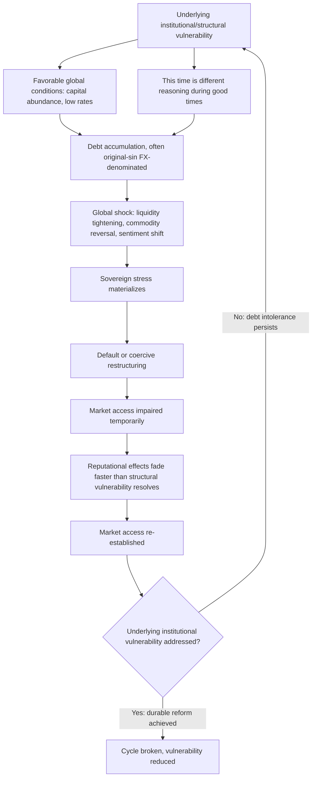

## Historical Patterns of Sovereign Default and Serial-Defaulter Dynamics

### Definition and Function

**Sovereign default** is a government's failure to meet a debt obligation on its contractually specified terms — most commonly a missed principal or interest payment, but also encompassing a unilaterally imposed restructuring, a forced maturity extension, or a coercive exchange offer executed under implicit threat of nonpayment. **Serial default** (or **serial defaulter dynamics**) describes the empirically well-documented phenomenon, most systematically catalogued in Carmen Reinhart and Kenneth Rogoff's 2009 historical study *This Time Is Different: Eight Centuries of Financial Folly*, that a substantial subset of sovereigns default repeatedly across their independent fiscal history, with prior default strongly predictive of future default risk — a finding with direct and significant implications for how rating agencies, the SRDSF's near-term logit model, and market pricing all treat a country's stress history as a first-order risk variable (recall the SRDSF's explicit inclusion of "stress history" as a structural-characteristics input to its near-term Logit Stress Probability, calculated precisely to weight recent default episodes more heavily than distant ones).

For a borrower-side finance ministry, understanding historical default patterns is not merely an academic exercise — it directly shapes how a sovereign's own credit history is read by markets and institutions long after any individual default episode has been resolved, and it clarifies why certain structural vulnerabilities recur across otherwise very different sovereigns and eras rather than being unique to any single country's circumstances.

### The Historical Base Rate: Default Is a Recurring, Not Exceptional, Phenomenon

The Reinhart-Rogoff historical dataset, spanning eight centuries and dozens of sovereigns, documents that sovereign default and restructuring episodes are a recurring structural feature of sovereign borrowing history rather than a rare aberration confined to a small number of unusual cases. Waves of default cluster around identifiable global shocks and eras — the 1820s–1840s wave following Latin American independence and early sovereign bond issuance; the 1870s–1890s wave connected to global commodity price cycles and railway-financing booms; the interwar and Depression-era wave of the 1930s; and the 1980s Latin American debt crisis, followed by a further wave across emerging markets in the 1990s and early 2000s (Russia 1998, Argentina 2001, among others) — each cluster sharing a broadly similar underlying pattern: a period of abundant global capital availability and low borrowing costs encouraging substantial sovereign debt accumulation, followed by a global liquidity tightening, commodity price reversal, or investor sentiment shift that exposes previously masked vulnerabilities simultaneously across many borrowers.

### Serial Default: The Empirical Pattern and Its Explanations

The serial-default finding itself is empirically striking: a relatively small number of sovereigns — heavily concentrated in Latin America and parts of Africa and the Middle East in the historical dataset — account for a disproportionate share of *all* recorded sovereign default episodes across the full eight-century sample, with several individual countries having defaulted or restructured external debt multiple times across separate, non-overlapping decades. This pattern has attracted several complementary, non-mutually-exclusive explanations in the subsequent academic literature:

**Persistent institutional weakness**: Recall the shared emphasis across sovereign rating methodology, the SRDSF, and the LIC DSF on institutional quality as a fundamental determinant of debt-carrying capacity — a country whose underlying institutional weaknesses (weak rule of law, political instability, limited fiscal and monetary policy credibility) drove an earlier default episode frequently has not durably resolved those same underlying weaknesses by the time the next debt cycle begins, making renewed default more likely than for a comparator country whose earlier default arose from a more idiosyncratic, non-recurring shock.

**Debt intolerance**: A related concept developed by Reinhart, Rogoff, and Miguel Savastano, describing the empirical observation that countries with a history of default or high inflation appear able to tolerate materially lower absolute debt levels before experiencing renewed distress, compared to countries without such a history — even after controlling for current observable fundamentals. This finding provides a direct empirical foundation for the "stress history" variable's inclusion in modern risk-assessment tools like the SRDSF's logit model: a prior default appears to function as an independent risk factor in its own right, not merely as a marker correlated with other, more directly observable current vulnerabilities.

**Reputational and market-access effects that fade over time, incompletely**: A sovereign's access to international capital markets is typically impaired for a period following a default — sometimes formally through continued litigation with holdout creditors, more often informally through elevated risk premia and cautious investor sentiment — but market access is empirically observed to be re-established, often surprisingly quickly by some historical measures (several post-restructuring sovereigns have returned to bond markets within a small number of years). This relatively rapid *re-access*, combined with underlying vulnerabilities that a restructuring resolves only partially, is itself part of the mechanism that can set the stage for a subsequent default cycle: market memory of sovereign default risk appears to decay faster, in practice, than the underlying structural vulnerabilities that produced the original default.

**Political economy and the "original sin" currency mismatch**: Many historically serial-defaulting sovereigns have also historically faced **"original sin"** — the inability to borrow internationally in their own domestic currency, a concept developed by Barry Eichengreen and Ricardo Hausmann, forcing reliance on foreign-currency-denominated debt regardless of the sovereign's own preference. Recall directly that foreign-currency debt introduces the currency-mismatch risk channel discussed in sovereign portfolio risk management — a structural vulnerability that, for countries facing original sin, is not fully within domestic policy control to resolve unilaterally, since it depends on international investors' willingness to hold that sovereign's local-currency debt, itself a function of the same institutional-credibility factors driving the broader serial-default pattern.

### Distinguishing Default Types: A Necessary Taxonomy

Historical and contemporary default analysis distinguishes several distinct categories, each with different mechanics, different creditor populations, and different resolution processes:

**External default**: Default on debt owed to foreign creditors, typically denominated in foreign currency or governed by foreign law — historically the most extensively documented category, since foreign-currency external bonds have long been the most liquid, actively traded, and therefore best-recorded sovereign debt instrument class.

**Domestic default**: Default on debt owed to domestic creditors, typically local-currency-denominated and governed by domestic law — historically under-documented relative to external default (a limitation Reinhart and Rogoff's own work explicitly sought to address by compiling one of the more comprehensive domestic-default historical datasets available), but empirically significant: domestic default, while less common than external default in the aggregate historical record, has occurred with meaningful frequency, particularly during periods of severe fiscal distress where a government judges domestic creditors more politically and legally tractable to impose losses upon than foreign creditors, or where domestic default is achieved implicitly through financial repression or inflation rather than explicit nonpayment.

**Explicit default (arrears/nonpayment)**: A direct, acknowledged failure to make a scheduled payment — the most legally unambiguous default category.

**De facto default via coercive restructuring**: A restructuring imposed on creditors under implicit threat of a worse outcome (nonpayment) if they decline to participate — recall that the SRDSF's own stress-event criteria explicitly capture "renegotiations of repayment terms on outstanding debt instruments" as a distinct stress category from explicit nonpayment arrears, reflecting the recognized reality that many historical "default" episodes take the form of a negotiated-but-coercive restructuring rather than outright nonpayment.

**Default via inflation and financial repression**: Historically, and particularly for domestic-currency-denominated debt, sovereigns have frequently "defaulted" in real economic terms through sustained high inflation that erodes the real value of fixed-rate domestic debt obligations, or through financial repression (regulatory measures forcing domestic institutions — banks, pension funds — to hold government debt at below-market yields) — recall this connects directly to the debt dynamics equation's stock-flow adjustment and relative-inflation terms, where unexpected inflation functions as a mechanism reducing the real debt burden without any formal default event being recorded, blurring the line between "successful" fiscal consolidation through growth and inflation and a more coercive, default-adjacent form of real burden-shifting onto domestic bondholders and savers.

### The "This Time Is Different" Syndrome

A central behavioral and political-economy insight from the Reinhart-Rogoff historical analysis, embedded directly in their book's title, is what might be termed the **"this time is different" syndrome**: the recurring pattern by which policymakers, investors, and analysts in the period preceding a new default wave persistently conclude that prevailing conditions — new financial instruments, a more sophisticated policy framework, a structurally transformed economy, a more favorable global environment — mean that historical default patterns and vulnerability signals no longer apply with the same force to the current cycle, only for the underlying vulnerability to reassert itself once the favorable conditions reverse. This is not presented in the underlying literature as a claim that historical patterns mechanically repeat in every detail, but rather as a caution against the specific cognitive pattern of dismissing accumulated historical evidence on the grounds that current circumstances are novel — a caution directly relevant to, without contradicting, the earlier item's own caution against treating any single historical threshold (recall the Reinhart-Rogoff 90% debt-to-GDP finding itself, and its subsequent empirical correction) as a rigid, mechanically applicable rule. The two lessons operate at different levels: skepticism toward "this time is different" reasoning cautions against dismissing genuine accumulated risk signals, while skepticism toward rigid universal thresholds cautions against over-mechanizing those same signals into a single number that ignores genuine country-specific structural variation — both cautions are, properly understood, arguments for the same underlying discipline: engaging seriously and specifically with a sovereign's actual structural risk factors, rather than either dismissing history or reducing it to an oversimplified rule.

### Worked Case: Argentina as an Illustrative Serial-Defaulter Pattern

Argentina provides a widely cited, extensively documented illustration of serial-defaulter dynamics in the modern era, having experienced multiple sovereign default or restructuring episodes across the nineteenth, twentieth, and twenty-first centuries, including its landmark 2001–2002 default — at the time among the largest sovereign defaults in history by nominal value — followed by a prolonged, contentious restructuring process extending over more than a decade, including protracted litigation with holdout creditors that continued well past the initial restructuring's completion (directly illustrative of the collective-action and holdout-creditor mechanics covered in sovereign debt restructuring more specifically), and a subsequent additional default episode in 2014 stemming precisely from that unresolved holdout litigation, followed by yet another debt restructuring process undertaken in 2020. This recurring pattern — a major default, an extended and contested restructuring, and renewed distress within a relatively compressed subsequent period — is frequently cited in the academic and policy literature as a canonical illustration of exactly the persistent-institutional-vulnerability and debt-intolerance mechanisms described above, where each individual restructuring resolved the immediate payment crisis without durably resolving the underlying structural and institutional drivers of the original vulnerability. [Verify current Argentine sovereign debt status and most recent restructuring terms directly against current reporting before citing specific present-day figures; this synthesis describes the well-documented historical pattern rather than current-day specific debt levels or terms.]

### Mermaid Diagram: The Serial-Default Cycle

### SVG Illustration: Historical Default Wave Clustering (svg_diagram)

<svg xmlns="http://www.w3.org/2000/svg" viewBox="0 0 700 380">
\<style\>
.ax{stroke:#333;stroke-width:2;}
.wave{fill:#c0392b;opacity:0.7;}
.lbl{font-family:sans-serif;font-size:11px;fill:#222;}
.ttl{font-family:sans-serif;font-size:15px;fill:#111;font-weight:bold;}
\</style\>
<text x="20" y="25" class="ttl">Illustrative Clustering of Sovereign Default Waves (svg_diagram)</text>
<line x1="70" y1="320" x2="650" y2="320" class="ax" />
<line x1="70" y1="320" x2="70" y2="50" class="ax" />
<text x="300" y="355" class="lbl">Era →</text>
<text x="20" y="200" class="lbl" transform="rotate(-90 20 200)">Relative number of defaults</text>
<rect x="100" y="220" width="50" height="100" class="wave" />
<text x="90" y="335" class="lbl">1820s-40s</text>
<rect x="200" y="250" width="50" height="70" class="wave" />
<text x="190" y="335" class="lbl">1870s-90s</text>
<rect x="300" y="150" width="50" height="170" class="wave" />
<text x="290" y="335" class="lbl">1930s</text>
<rect x="450" y="180" width="50" height="140" class="wave" />
<text x="430" y="335" class="lbl">1980s LatAm</text>
<rect x="550" y="230" width="50" height="90" class="wave" />
<text x="530" y="335" class="lbl">1990s-2000s EM</text>
<text x="150" y="70" class="lbl">Each wave: capital abundance → accumulation → global shock → cluster of defaults</text>
</svg>

### Practical Implications for Fiscal Statecraft

For a finance ministry, the serial-default literature carries a direct, actionable implication distinct from the purely academic historical record: a sovereign's own default or restructuring history functions as a persistent, only slowly decaying input into how markets, rating agencies, and multilateral institutions assess current and future risk — recall the SRDSF's explicit stress-history variable, calculated to weight recent stress more heavily but never fully resetting to zero — meaning that the most effective long-run strategy for improving a sovereign's genuine debt-carrying capacity is not merely resolving the immediate terms of any given restructuring, but durably addressing the underlying institutional, fiscal, and currency-structure vulnerabilities (recall fiscal space preservation, sound debt management office portfolio-risk practice, and genuine institutional-quality improvement) that the historical pattern shows recur across default cycles when left unaddressed. The persistence of "this time is different" reasoning during favorable periods is itself a predictable political-economy phenomenon rather than a personal failing of any particular administration, which is precisely why institutionalized, rules-based fiscal discipline mechanisms (recall the earlier discussion of legislated fiscal rules as credible commitment devices, and MTDS-based portfolio risk management) carry genuine value specifically *because* they constrain discretionary decision-making during the exact favorable periods when the temptation to dismiss accumulated historical risk signals is strongest.

**Related Topics**

- Sovereign debt restructuring: collective action clauses and the Paris Club/private creditor process
- Holdout creditors, litigation, and the Argentina 2001–2020 case study
- Debt management office functions and sovereign portfolio risk
- Fiscal space and its role in crisis prevention
- Original sin and currency mismatch in emerging-market sovereign borrowing
- Credit rating agency methodology and the determinants of sovereign ratings