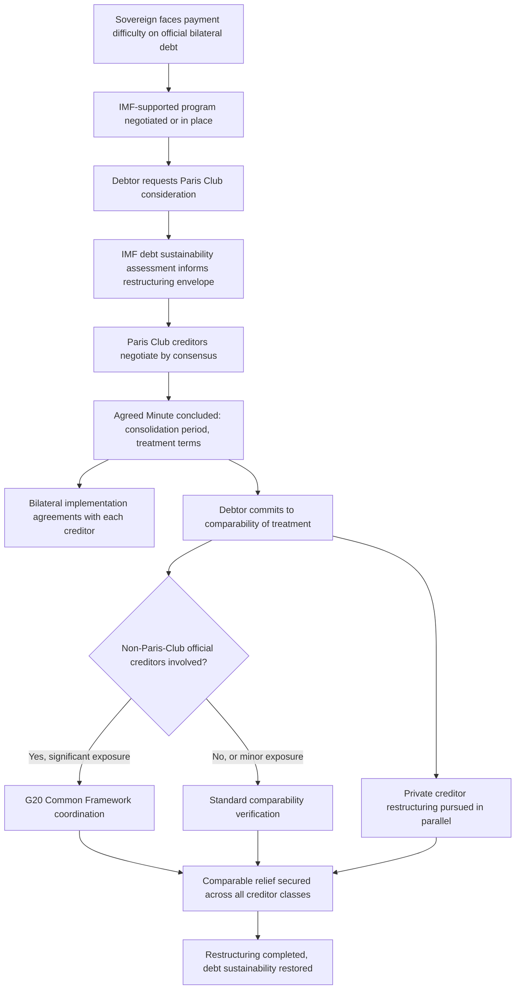

## Paris Club Mechanics for Official Bilateral Debt Restructuring

### Definition and Institutional Origin

The **Paris Club** is an informal, non-treaty-based group of official creditor governments — historically dominated by major advanced-economy creditors — that coordinates the restructuring of **official bilateral debt**: sovereign-to-sovereign loans, export credits, and other government-to-government claims, as distinct from debt owed to private bondholders and commercial banks (the domain of separate restructuring processes) or to multilateral institutions such as the IMF and World Bank (which generally maintain **preferred creditor status** and are not restructured through the Paris Club or any comparable mechanism). Formed in 1956 when Argentina agreed to meet its official creditors in Paris — hence both the name and the group's continued practice of convening at the French Treasury — the Paris Club has no founding treaty, no permanent legal personality, and no binding charter; it operates instead through a set of consistently applied, evolved-by-practice principles and procedural conventions that creditor governments have voluntarily observed across several hundred individual country restructuring agreements since its founding.

For a borrower-side finance ministry facing genuine debt distress with a material share of official bilateral creditor exposure, the Paris Club functions as the primary coordination mechanism through which that specific creditor category's claims are renegotiated — understanding its procedural logic, its underlying principles, and its practical limitations is directly relevant to any sovereign whose creditor base includes substantial official bilateral lending, a category that remains significant for many emerging-market and lower-income sovereigns even as commercial and market-based financing has grown in relative importance.

### Core Principles Governing Paris Club Operation

The Paris Club's practice rests on several consistently applied principles, functioning collectively as an informal but remarkably durable governance framework despite the absence of any binding legal foundation:

**Consensus decision-making**: Paris Club creditor decisions are reached by consensus among participating creditor governments rather than majority vote, meaning any individual major creditor can, in practice, significantly shape or delay an agreement — a structural feature that has historically slowed the process in cases where creditor interests diverge, but which also lends outcomes a degree of durability once reached, since a consensus-based agreement reflects genuine multilateral creditor buy-in rather than an outcome imposed over dissent.

**Conditionality linkage to an IMF program**: A defining structural feature of Paris Club practice is that a debtor country seeking a restructuring must generally have, or be actively negotiating, an appropriate **IMF-supported program** — reflecting the Paris Club's foundational logic that official bilateral debt relief should be granted specifically to support a coherent, IMF-monitored macroeconomic and fiscal adjustment program, rather than as a standalone concession disconnected from broader reform commitments. This linkage directly connects Paris Club restructuring to the debt sustainability assessment machinery covered throughout this chapter — recall that under the SRDSF, where a debt sustainability assessment concludes debt is unsustainable, the framework itself provides the methodology for setting the restructuring targets that inform exactly this kind of negotiation, meaning the Paris Club's actual restructuring terms are typically calibrated against, and legitimated by, the IMF's own quantitative sustainability analysis rather than negotiated as a purely political or ad hoc figure.

**Comparability of treatment**: Perhaps the single most consequential and frequently contested Paris Club principle, comparability of treatment requires that a debtor country receiving Paris Club relief must seek **comparable treatment** from its other official bilateral creditors outside the Paris Club and from its private creditors, ensuring that Paris Club creditors do not effectively subsidize non-Paris-Club creditors by absorbing a disproportionate share of the total relief burden while other creditor classes escape equivalent concessions. This principle exists specifically to prevent a **free-rider problem** across creditor classes — without it, a debtor might rationally seek relief first from the most cooperative or procedurally structured creditor group (historically the Paris Club) while continuing to service other creditors in full, effectively using the concessions extracted from disciplined creditors to fund continued payment to less cooperative ones, undermining the incentive for any creditor to participate constructively in future restructurings.

**Solidarity among Paris Club creditors**: Paris Club members do not negotiate separate bilateral deals with a debtor outside the coordinated multilateral framework once a Paris Club agreement has been reached for that debtor, reflecting the principle that the group's collective bargaining position and consistent application of terms across creditors is itself a source of the mechanism's ongoing credibility and value to all participating creditors.

**Case-by-case treatment**: While operating according to consistent underlying principles, the Paris Club treats each debtor country's specific circumstances individually rather than applying a single mechanical formula, allowing restructuring terms to reflect the debtor's particular debt sustainability position, program design, and creditor exposure structure — directly analogous to the SRDSF's own explicit rejection of universal mechanical rules in favor of country-specific, judgment-informed risk assessment (recall this is a recurring design philosophy across virtually every framework covered in this chapter).

### The Restructuring Process: Standard Sequence

**1. Debtor request and eligibility assessment**: A sovereign facing genuine payment difficulty on its official bilateral obligations formally requests Paris Club consideration, typically in parallel with, or following, the initiation of an IMF-supported program negotiation, since program status is a near-universal precondition for Paris Club engagement.

**2. Negotiation of an Agreed Minute**: Paris Club creditors and the debtor country negotiate the terms of relief, culminating in an **Agreed Minute** — the formal document recording the restructuring terms agreed at the multilateral Paris Club level, specifying the consolidation period (the window of debt service payments being restructured), the treatment terms applied (the specific relief menu, discussed below), and the debtor's undertakings, including its comparability-of-treatment commitment toward other creditors.

**3. Bilateral implementation agreements**: The Agreed Minute is a multilateral framework document, not itself a set of individually binding legal instruments — following its conclusion, the debtor country must negotiate and sign **individual bilateral agreements** with each participating Paris Club creditor government, translating the Agreed Minute's collectively negotiated terms into legally binding bilateral implementation, a process that can itself take a meaningful additional period beyond the initial multilateral agreement.

**4. Comparability of treatment verification**: Following the Agreed Minute, the debtor is expected to secure comparable treatment from non-Paris-Club official creditors and, where relevant, from private creditors, with the Paris Club Secretariat monitoring the debtor's progress on this commitment as part of the overall restructuring's completion.

### The Treatment Menu: Historical Evolution of Relief Terms

Paris Club treatment terms have evolved substantially since the 1980s in response to accumulated experience with debtor countries requiring repeated restructuring rounds, moving progressively from simple rescheduling toward deeper concessional relief for the most vulnerable debtors:

**Classic terms**: The original, non-concessional Paris Club approach — rescheduling of principal and interest at market-consistent rates, extending maturities without reducing the underlying present value of the claims, appropriate for debtors facing a temporary liquidity difficulty rather than a fundamental solvency problem.

**Concessional terms for low-income countries (Toronto, London, Naples, Cologne, and subsequent terms)**: Beginning with the 1988 Toronto terms and progressively deepened through subsequent named term sets (London terms in 1991, Naples terms in 1994, and Cologne terms in 1999, among others), the Paris Club introduced increasingly generous debt-reduction terms specifically for the poorest, most heavily indebted debtor countries, moving from partial interest-rate concessions toward substantial **face-value debt reduction** (write-offs of a defined percentage of the eligible debt stock, not merely rescheduling), reflecting the accumulated recognition that repeated rescheduling of an unsustainable debt stock without genuine reduction simply deferred, rather than resolved, the underlying sustainability problem — directly the same "too little too late" restructuring-adequacy critique discussed in the LIC DSF context, and one the Paris Club's own evolving terms structure was explicitly designed to address over time.

**HIPC and MDRI**: The most substantial evolution came through the **Heavily Indebted Poor Countries (HIPC) Initiative**, launched in 1996 and enhanced in 1999, under which the Paris Club (alongside multilateral creditors and other official bilateral creditors) provided deep debt-stock reduction — up to and including complete cancellation in many cases — for qualifying low-income countries meeting specified debt-sustainability and poverty-reduction-program criteria, followed by the **Multilateral Debt Relief Initiative (MDRI)** in 2005, which extended full cancellation of remaining eligible multilateral debt for countries that had reached the HIPC completion point. This progression illustrates directly, at the institutional-policy level, the same "too little too late" concern the LIC DSF critique literature raises about restructuring adequacy — HIPC and MDRI were themselves the multilateral system's own explicit response to the accumulated recognition that earlier, shallower Paris Club rescheduling rounds had frequently failed to restore genuine sustainability for the most heavily indebted low-income sovereigns.

### The Declining Relevance of Official Bilateral Debt and the Rise of Non-Paris-Club Creditors

A structurally significant development in recent decades, directly relevant to the Paris Club's current operational relevance, is the substantial shift in the composition of many sovereigns' external creditor base away from traditional Paris Club member countries and toward both private bondholders (recall this shift is precisely why sovereign debt restructuring more broadly increasingly requires separate, parallel private-creditor negotiation processes alongside or instead of Paris Club engagement) and toward **non-Paris-Club official bilateral creditors** — most prominently China, which has become a very substantial bilateral creditor to numerous emerging-market and low-income sovereigns without being a full Paris Club member, alongside other non-traditional official lenders. This shift has generated a documented and ongoing coordination challenge: because comparability of treatment requires securing equivalent concessions from non-Paris-Club creditors, but the Paris Club has no formal authority to compel a non-member creditor's participation or terms, achieving genuine comparability has become materially more complex in restructurings where a large, non-Paris-Club creditor holds a substantial share of total official bilateral exposure — a documented friction point in several recent restructuring cases (Zambia and Sri Lanka among the more prominently discussed recent examples) where negotiating adequate, comparable participation from non-traditional bilateral creditors extended the overall restructuring timeline considerably beyond historical Paris-Club-dominated precedent. [Verify the current specific status and outcome of any named country's restructuring process directly against current reporting, since these are actively evolving situations; this synthesis describes the well-documented general coordination challenge rather than a specific current resolution.]

### The G20 Common Framework: A Response to This Coordination Gap

In direct response to the growing gap between the traditional Paris-Club-centered restructuring architecture and the reality of an increasingly diverse official bilateral creditor base, the **G20 Common Framework for Debt Treatments beyond the DSSI**, launched in November 2020, established a coordination mechanism explicitly designed to bring together both Paris Club and key non-Paris-Club official bilateral creditors (most significantly China, alongside other G20 members) under a single negotiating process for eligible low-income debtor countries, aiming to extend the Paris Club's core comparability-of-treatment and IMF-program-linkage principles to a broader creditor coalition better reflecting the actual current composition of many debtors' official bilateral exposure. The Common Framework's practical implementation has itself been a subject of substantial ongoing analysis and critique regarding processing speed and creditor coordination effectiveness, reflecting the genuinely difficult institutional challenge of replicating, across a more heterogeneous and less institutionally aligned creditor group, the consensus-based coordination discipline the Paris Club achieved over decades among a more homogeneous set of traditional advanced-economy creditors.

### Distinguishing Paris Club Restructuring from Private Creditor Restructuring

It is worth stating explicitly, given the parallel treatment these two processes typically require in any real sovereign debt crisis, that Paris Club mechanics and private-creditor bond restructuring (governed by collective action clauses, bondholder committees, and litigation risk from holdout creditors, covered elsewhere in this chapter) are structurally distinct processes with different legal frameworks, different creditor coordination mechanisms, and different historical precedent, even though comparability of treatment requires that both processes deliver broadly equivalent relief to the debtor's overall restructuring objective. A sovereign facing a genuine debt crisis with a mixed creditor base — official bilateral, multilateral, and private bondholder exposure simultaneously — must typically navigate all of these processes in a coordinated but procedurally separate fashion, a structural complexity that is itself a documented source of extended restructuring timelines in modern sovereign debt crises with diversified creditor bases, relative to earlier eras when official bilateral creditors (and thus Paris Club-centered processes) represented a much larger share of most debtor sovereigns' total external exposure.

### Mermaid Diagram: The Paris Club Restructuring Process

### SVG Illustration: Evolution of Paris Club Treatment Terms (svg_diagram)

<svg xmlns="http://www.w3.org/2000/svg" viewBox="0 0 700 380">
\<style\>
.ax{stroke:#333;stroke-width:2;}
.bar{fill:#2c5c99;}
.lbl{font-family:sans-serif;font-size:11px;fill:#222;}
.ttl{font-family:sans-serif;font-size:15px;fill:#111;font-weight:bold;}
\</style\>
<text x="20" y="25" class="ttl">Evolution of Paris Club Concessionality Over Time (svg_diagram)</text>
<line x1="70" y1="320" x2="650" y2="320" class="ax" />
<line x1="70" y1="320" x2="70" y2="50" class="ax" />
<text x="300" y="355" class="lbl">Term set (chronological) →</text>
<text x="20" y="200" class="lbl" transform="rotate(-90 20 200)">Degree of debt-stock reduction</text>
<rect x="100" y="290" width="60" height="30" class="bar" />
<text x="85" y="335" class="lbl">Classic (pre-1988)</text>
<rect x="200" y="260" width="60" height="60" class="bar" />
<text x="190" y="335" class="lbl">Toronto 1988</text>
<rect x="300" y="220" width="60" height="100" class="bar" />
<text x="290" y="335" class="lbl">Naples 1994</text>
<rect x="400" y="180" width="60" height="140" class="bar" />
<text x="390" y="335" class="lbl">Cologne 1999</text>
<rect x="500" y="90" width="60" height="230" class="bar" />
<text x="480" y="335" class="lbl">HIPC/MDRI 1996-2005</text>
</svg>

### Practical Implications for Fiscal Statecraft

For a finance ministry engaging with the Paris Club, the practical operational reality is that a genuine restructuring requires simultaneous, coordinated engagement across at least three distinct fronts — an active IMF program providing both the sustainability-analysis foundation and the conditionality framework the Paris Club requires, the Paris Club negotiation itself, and parallel comparability-of-treatment engagement with any non-Paris-Club official and private creditors — with the growing prominence of non-traditional official bilateral creditors and the Common Framework's still-maturing coordination mechanics making the second and third of these fronts considerably more complex than in the Paris Club's earlier, more institutionally homogeneous operating era. Understanding the Paris Club's comparability-of-treatment principle specifically is directly relevant even for a sovereign not currently facing distress, since it clarifies that any future restructuring negotiation with official bilateral creditors will be explicitly and formally linked to equivalent treatment demands on that sovereign's other creditor relationships — a structural feature of the process worth factoring into debt management office portfolio-composition decisions well before any actual distress scenario materializes.

**Related Topics**

- Historical patterns of sovereign default and serial-defaulter dynamics
- Sovereign debt restructuring: collective action clauses and the private creditor process
- The IMF Sovereign Risk and Debt Sustainability Framework for market-access countries
- The G20 Common Framework and the challenge of non-traditional bilateral creditors
- Debt management office functions and sovereign portfolio risk
- The HIPC Initiative and Multilateral Debt Relief Initiative for low-income sovereigns