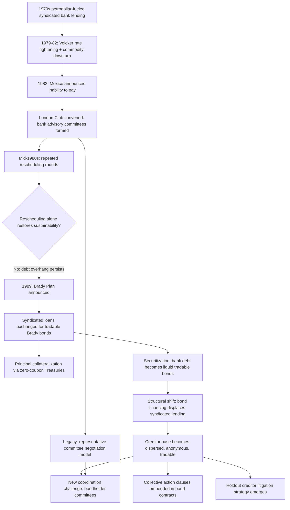

## London Club and Syndicated Private-Creditor Coordination in Restructuring

### Definition and Historical Origin

The **London Club** is the informal, ad hoc coordination mechanism through which commercial bank creditors negotiate the restructuring of sovereign debt owed to them as **syndicated bank loans** — the private-sector, commercial-bank counterpart to the Paris Club's official bilateral coordination role, and historically the dominant private-creditor restructuring mechanism during the era, roughly the 1970s through the early 1990s, when commercial bank syndicated lending rather than tradable sovereign bonds constituted the primary channel through which private capital flowed to sovereign borrowers. Unlike the Paris Club, the London Club has no fixed secretariat, no consistent meeting location (despite the name, London Club negotiations have occurred in numerous cities), and no standing institutional membership — it exists purely as a recurring negotiating format convened on a case-by-case basis whenever a sovereign debtor with substantial syndicated commercial bank exposure requires restructuring, with the specific participating banks and the coordinating **bank advisory committee** structure assembled anew for each debtor situation.

For a finance ministry studying sovereign debt restructuring mechanics, the London Club is historically significant less as a currently dominant restructuring channel — its practical relevance has diminished substantially as sovereign private financing shifted from syndicated bank lending toward tradable bond issuance from the 1990s onward — than as the essential historical bridge explaining *why* contemporary bond-based restructuring mechanics (bondholder committees, collective action clauses, exchange offers) evolved in the specific form they did: much of the creditor-coordination logic embedded in modern sovereign bond restructuring practice traces directly back to lessons learned, and problems encountered, during the London Club era's syndicated-loan restructurings.

### The Bank Advisory Committee Structure

Because syndicated sovereign loans typically involved dozens, sometimes hundreds, of individual participating commercial banks spread across multiple jurisdictions, direct simultaneous negotiation between the debtor sovereign and every individual creditor bank was administratively impractical. The London Club addressed this coordination problem through the **bank advisory committee** (sometimes called a steering committee) — a smaller representative group of the largest, most heavily exposed creditor banks, selected to negotiate restructuring terms on behalf of the full syndicate, with any agreement reached by the committee then presented to the broader creditor group for individual bank consent. This structure is the direct conceptual ancestor of the **bondholder committees** that coordinate private-creditor negotiations in contemporary sovereign bond restructurings — the underlying coordination problem (a large, dispersed creditor base needing a workable negotiating counterparty) and the underlying solution (a smaller representative committee) are structurally identical across both eras, even though the specific legal instruments involved (syndicated loan agreements versus tradable bonds) differ substantially.

### The 1980s Debt Crisis: The London Club's Defining Historical Episode

The London Club's most consequential historical episode was the **1980s Latin American debt crisis**, triggered by the confluence of aggressive 1970s petrodollar-fueled syndicated lending to Latin American and other emerging-market sovereigns, followed by a sharp global interest-rate increase (the Federal Reserve's disinflationary tightening under Chairman Paul Volcker beginning in 1979) that dramatically raised debt-service costs on floating-rate syndicated loans, combined with a commodity-price downturn that simultaneously depressed many debtor countries' export revenue — precisely the kind of combined, correlated adverse shock (recall the "combined macro-fiscal shock" stress-test category and the debt dynamics equation's demonstration that a deteriorating interest-growth differential directly worsens the debt trajectory) that historical default-wave clustering analysis identifies as the recurring pattern preceding major sovereign distress episodes. Mexico's August 1982 announcement that it could not meet its scheduled debt-service payments is conventionally treated as the crisis's opening event, rapidly followed by comparable distress across numerous other heavily syndicated-loan-exposed sovereigns, particularly across Latin America.

The initial London Club response through the mid-1980s consisted primarily of repeated rounds of **debt rescheduling** — extending maturities and adjusting terms without meaningful reduction in the underlying claim's present value — a pattern that, in close parallel to the Paris Club's own pre-1988 "classic terms" era discussed elsewhere in this chapter, proved insufficient to restore genuine sustainability for many debtors, instead producing a prolonged period of repeated restructuring rounds through the 1980s without resolving the underlying overhang.

### The Brady Plan: Converting Bank Debt Into Tradable Bonds

The definitive resolution mechanism for the 1980s debt crisis's syndicated bank debt overhang was the **Brady Plan**, announced in 1989 by then-U.S. Treasury Secretary Nicholas Brady, which represented a structural innovation of major and lasting consequence for sovereign debt markets generally, well beyond its immediate crisis-resolution function. The Brady Plan's core mechanism allowed debtor countries to exchange their existing syndicated bank loans for new, tradable **Brady bonds**, typically incorporating a meaningful degree of principal or interest reduction (directly addressing the debt-stock-reduction inadequacy of the preceding rescheduling-only approach) and frequently featuring **principal collateralization** — the new bonds' principal repayment backed by zero-coupon U.S. Treasury securities purchased using financing support from the IMF, World Bank, and Japanese Export-Import Bank, providing credit enhancement that made the restructured claims considerably more attractive to the creditor banks than an unsecured write-down alone would have been, thereby helping secure the broad creditor participation the restructuring required.

The Brady Plan's structural significance extends directly into the architecture of contemporary sovereign debt markets in two specific ways worth making explicit. First, it converted a large stock of previously non-tradable, individually-held syndicated bank loans into standardized, liquid, tradable bond instruments — Brady bonds became actively traded securities held by a much broader and more diversified investor base than the original syndicate of relationship-lending banks, directly accelerating the broader market-wide **securitization shift** away from syndicated bank lending and toward bond-market financing as the dominant channel for sovereign private-sector borrowing, the shift that ultimately rendered the London Club's syndicated-loan-specific coordination mechanism largely obsolete for subsequent restructuring episodes. Second, the Brady Plan's exchange-offer structure — offering existing creditors a menu of new instrument options (varying combinations of principal reduction, interest-rate concessions, and collateralization) rather than a single uniform take-it-or-leave-it term — established a template that subsequent bond-based sovereign restructurings (including, much later, Argentina's 2005 and 2010 exchanges and Greece's 2012 restructuring) would draw upon directly, even though those later restructurings involved bondholders rather than syndicate banks as the creditor counterparty.

### From Syndicated Loans to Bonds: Why the Coordination Problem Changed Character

The shift from London-Club-era syndicated bank lending to contemporary bond-based sovereign financing did not eliminate the creditor-coordination problem underlying any restructuring — it transformed its character in ways directly relevant to understanding why modern restructuring mechanics look structurally different from the London Club model, even while addressing a fundamentally similar underlying challenge:

**Creditor concentration versus dispersion**: A syndicated loan's creditor base, while numerous, was typically composed of identifiable, relationship-based commercial banks that could be directly contacted, organized into a representative committee, and held to a degree of ongoing relationship-based cooperative discipline (a bank's broader lending relationship with a sovereign or region provided some incentive to participate constructively in a restructuring rather than defect). A tradable bond's creditor base, by contrast, is far more dispersed, anonymous, and subject to continuous secondary-market turnover — a bondholder identified as a creditor at the time of issuance may have sold the position to an entirely different investor, including potentially a **holdout-strategy-oriented distressed-debt fund**, by the time a restructuring is actually negotiated, making the London Club's relationship-based, committee-negotiated cooperative model considerably harder to replicate directly in a pure bond context.

**The legal instrument and enforcement mechanics**: A syndicated loan agreement is a single, unified legal contract among the syndicate members and the debtor, which meant a restructuring amendment, once the requisite majority of syndicate lenders agreed (governed by the loan agreement's own amendment provisions), bound the full syndicate more straightforwardly than is possible under the fragmented, multi-instrument legal structure of a typical sovereign bond stock, where each individual bond series is a separate legal instrument, potentially issued at different times, under different governing law, with different individual terms — precisely the fragmentation problem that **collective action clauses (CACs)** in modern sovereign bond contracts were specifically designed to address, by building an aggregation and binding-majority mechanism directly into each bond's own legal terms, rather than relying on the kind of ad hoc, relationship-based cooperative committee structure the London Club used for syndicated loans.

**Holdout creditor risk**: The London Club era faced comparatively limited holdout-creditor litigation risk relative to the modern bond-restructuring era, both because the relationship-based banking-syndicate structure provided softer cooperative incentives against defection, and because the specialized **distressed-debt litigation strategy** — acquiring defaulted sovereign bonds at a steep secondary-market discount specifically to pursue full-value legal recovery through litigation rather than participating in a negotiated restructuring — became a much more developed and consequential strategy specifically in the bond-restructuring era (recall Argentina's protracted post-2001 holdout litigation as the canonical modern illustration), a dynamic that had a less pronounced syndicated-loan-era precedent, given both the differing legal structure and the differing creditor composition just described.

### Worked Illustration: Comparing the Two Coordination Models

| Dimension | London Club (syndicated bank loans) | Modern bond restructuring |
| --- | --- | --- |
| Creditor identity | Known, relationship-based commercial banks | Dispersed, anonymous, actively traded |
| Coordination mechanism | Bank advisory committee | Bondholder committee |
| Legal binding mechanism | Syndicated loan agreement amendment provisions | Collective action clauses embedded per bond series |
| Instrument fragmentation | Single unified loan agreement | Multiple separate bond series, potentially different law/terms |
| Holdout risk | Comparatively limited | Significant, well-developed distressed-debt litigation strategy |
| Historically defining episode | 1980s Latin American debt crisis | Argentina 2001–2016 holdout litigation; Greece 2012 CAC-based exchange |
| Resolution innovation | Brady Plan: debt-for-bond exchange with collateralization | CACs, aggregation clauses, exchange offers with exit consents |

### The Enduring Conceptual Legacy

Despite its diminished current-era practical relevance as an actively used restructuring channel — the overwhelming majority of contemporary sovereign external private debt is bond-based rather than syndicated-loan-based, meaning genuinely new London-Club-format restructurings have become comparatively rare — the London Club's historical experience remains directly pedagogically and analytically relevant for three specific reasons worth making explicit. First, it established the **representative-committee negotiation model** that persists in modern form as the bondholder committee structure. Second, its 1980s-era rescheduling-without-reduction shortcomings, and the Brady Plan's subsequent deeper-relief correction, directly illustrate the same "too little too late" restructuring-adequacy lesson recurring across the Paris Club's own parallel evolution toward deeper concessional terms and the LIC DSF literature's documented critique of shallow modern restructurings — a genuinely recurring pattern across creditor categories and eras, not a lesson unique to any single restructuring channel. Third, the Brady Plan's securitization of previously illiquid bank claims into tradable bonds is the direct historical origin point of the modern, bond-dominated sovereign private-creditor landscape whose distinct coordination challenges (dispersed holders, CAC-based aggregation, holdout litigation risk) define contemporary sovereign debt restructuring practice.

### Mermaid Diagram: From Syndicated Loans to Modern Bond Restructuring

### SVG Illustration: Evolution of Private Creditor Coordination Structures (svg_diagram)

<svg xmlns="http://www.w3.org/2000/svg" viewBox="0 0 700 380">
\<style\>
.box{stroke:#333;stroke-width:1.5;}
.era1{fill:#fdf3c4;}
.era2{fill:#a8d5f0;}
.lbl{font-family:sans-serif;font-size:12px;fill:#222;text-anchor:middle;}
.ttl{font-family:sans-serif;font-size:15px;fill:#111;font-weight:bold;}
.arrow{stroke:#555;stroke-width:2;marker-end:url(#ah2);}
\</style\>
<text x="20" y="25" class="ttl">London Club Era vs. Modern Bond Restructuring (svg_diagram)</text>
<rect x="60" y="60" width="260" height="220" rx="8" class="box era1" />
<text x="190" y="90" class="lbl" font-weight="bold">London Club Era (1970s-90s)</text>
<text x="190" y="120" class="lbl">Syndicated bank loans</text>
<text x="190" y="145" class="lbl">Known, relationship-based creditors</text>
<text x="190" y="170" class="lbl">Bank advisory committee</text>
<text x="190" y="195" class="lbl">Single unified loan agreement</text>
<text x="190" y="220" class="lbl">Limited holdout litigation risk</text>
<text x="190" y="245" class="lbl">Defining event: 1980s LatAm crisis</text>
<line x1="330" y1="170" x2="390" y2="170" class="arrow" />
<text x="360" y="160" class="lbl">Brady Plan</text>
<rect x="400" y="60" width="260" height="220" rx="8" class="box era2" />
<text x="530" y="90" class="lbl" font-weight="bold">Modern Bond Era (1990s-present)</text>
<text x="530" y="120" class="lbl">Tradable sovereign bonds</text>
<text x="530" y="145" class="lbl">Dispersed, anonymous creditors</text>
<text x="530" y="170" class="lbl">Bondholder committee</text>
<text x="530" y="195" class="lbl">Multiple bond series, CACs</text>
<text x="530" y="220" class="lbl">Significant holdout litigation risk</text>
<text x="530" y="245" class="lbl">Defining event: Argentina 2001-16</text>
</svg>

### Practical Implications for Fiscal Statecraft

For a finance ministry, the London Club's historical trajectory offers a direct lesson relevant well beyond its now-diminished practical use as an active restructuring channel: creditor-coordination mechanisms evolve specifically in response to the structural features of the prevailing dominant financing instrument, meaning a debt management office's own instrument-mix decisions (recall the primary issuance mechanics chapter's discussion of syndication versus auction, and bond versus loan financing more broadly) carry restructuring-scenario implications that extend well beyond the immediate cost-risk trade-off calculus typically applied at issuance — a sovereign's current creditor composition (concentrated relationship-based official or syndicated lending versus dispersed tradable bond holdings) will directly shape which coordination mechanism, and which associated risks (holdout litigation exposure being the most consequential modern example), would govern any future restructuring negotiation, should one ultimately prove necessary.

**Related Topics**

- Paris Club mechanics for official bilateral debt restructuring
- Historical patterns of sovereign default and serial-defaulter dynamics
- Collective action clauses, bondholder committees, and holdout creditor litigation
- The Brady Plan and the securitization of sovereign bank debt
- Primary issuance mechanics: auctions, syndications, and benchmark bonds
- The Argentina 2001–2020 default, restructuring, and holdout litigation case study