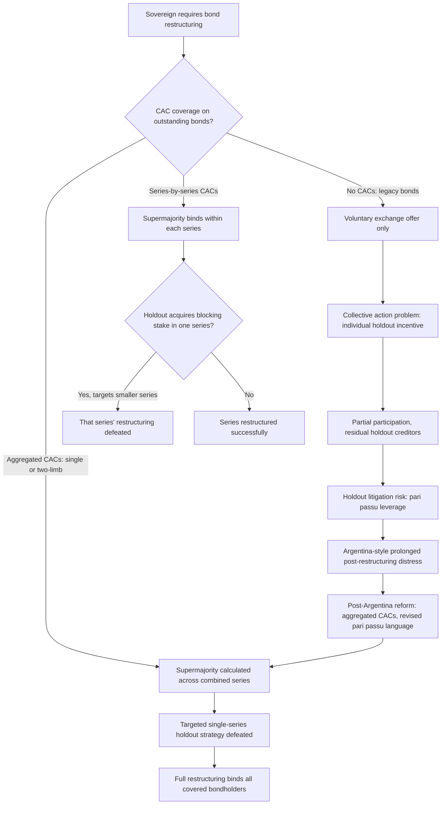

## Collective Action Clauses and Coordinated Sovereign Bond Restructuring

### Definition and Core Function

A **collective action clause (CAC)** is a contractual provision embedded directly within a sovereign bond's own legal terms that allows a specified supermajority of bondholders — commonly a threshold in the range of 75% of outstanding principal, though the precise figure varies by bond series and jurisdiction — to approve a restructuring of the bond's payment terms (maturity extension, coupon reduction, principal write-down, or a combination) in a manner that becomes **legally binding on all bondholders of that instrument**, including those who voted against the restructuring or did not vote at all. This binding-supermajority mechanism is the direct, purpose-built contractual solution to precisely the coordination problem introduced in the London Club discussion: recall that a modern sovereign bond's creditor base is dispersed, anonymous, and subject to continuous secondary-market turnover, making the London Club's relationship-based, cooperative-committee negotiation model poorly suited to bond restructuring — CACs solve this problem not through negotiated cooperation but through a pre-agreed contractual rule, built into the bond at the moment of issuance, specifying in advance exactly how a future restructuring decision will be made and enforced.

### The Underlying Problem: Collective Action Failure and the Holdout Incentive

To understand why CACs exist as a specific contractual innovation, it is necessary to understand precisely the coordination failure they are designed to prevent. In the absence of a binding-majority mechanism, a sovereign facing genuine debt distress that wishes to restructure its bonds must instead pursue a **voluntary exchange offer**: proposing that existing bondholders voluntarily surrender their old bonds in exchange for new bonds with less favorable terms (recall this is precisely the Brady Plan's exchange-offer template, and the mechanism Argentina and Greece both later employed). Because participation in a voluntary exchange is not contractually compulsory, each individual bondholder faces a **collective action problem** structurally identical to the classic free-rider dilemma: if enough *other* bondholders participate in the exchange to restore the sovereign's debt sustainability and resume normal debt service, an individual bondholder who instead **holds out** — refusing the exchange and retaining the original bond's full contractual claim — stands to benefit disproportionately, either by continuing to receive full payment on the original unrestructured terms from a now-solvent-again sovereign, or, more aggressively, by pursuing full-value legal recovery through litigation against a sovereign whose improved post-restructuring fiscal position and market access may leave it more able, and more exposed, to satisfy a holdout judgment than it would have been mid-crisis. Because every individual bondholder faces this identical incentive simultaneously, the rational individual strategy — holding out while hoping others restructure — can, if pursued broadly enough, undermine achievement of the very restructuring that would benefit the collective creditor body as a whole, a textbook collective action failure directly analogous to any other free-rider dynamic in economics, but with unusually high stakes given the sums and the sovereign-immunity complications involved.

### Argentina as the Historical Catalyst for Modern CAC Adoption

Recall the earlier discussion of Argentina's serial-default history and its protracted post-2001 holdout litigation as the canonical illustration of exactly this collective-action failure playing out at full scale: Argentina's 2001 default and subsequent 2005 and 2010 voluntary exchange offers achieved high — but not universal — creditor participation (in the range of 92–93% of eligible bondholders by the completion of the 2010 exchange), leaving a residual holdout creditor group, most prominently a set of specialized distressed-debt funds, who pursued aggressive litigation in U.S. federal courts rather than participating in either exchange. This litigation ultimately succeeded in obtaining favorable rulings — including the consequential **pari passu** ("equal footing") clause interpretation that barred Argentina from making payments to the exchanged-bond creditors unless it simultaneously paid the holdouts in full, a ruling that effectively forced Argentina back into a technical default on its already-restructured bonds in 2014 despite having a functioning restructuring in place for the overwhelming majority of its original bondholders — precisely the "renewed distress stemming from unresolved holdout litigation" episode referenced in the serial-defaulter discussion. This episode functioned as the single most influential real-world demonstration of holdout risk's severity under a voluntary-exchange-only restructuring architecture, and it directly catalyzed the subsequent widespread market and policy push toward standardized, robust CAC adoption in newly issued sovereign bonds — a reform effort discussed specifically below.

### CAC Mechanics: Threshold Structures and Aggregation

**Single-series (bond-by-bond) CACs**: The earlier generation of collective action clauses, still found in many outstanding bond series, operate at the level of an individual bond series only — a supermajority vote among holders of that specific bond can bind the remaining holders of that same series, but has no binding effect on holders of the sovereign's other, separately issued bond series. This series-by-series structure leaves a residual coordination vulnerability precisely where a sovereign's debt stock consists of multiple separate bond series issued at different times under different terms (recall this is the normal condition for any sovereign with a developed benchmark-bond issuance history, per the earlier discussion of reopening and benchmark construction) — a determined holdout strategy can specifically target and acquire a blocking minority position within one *particular* smaller or more thinly-held series, defeating that series' own supermajority threshold even while the sovereign achieves overwhelming aggregate participation across its bond stock as a whole.

**Aggregated CACs (single-limb and two-limb structures)**: In direct response to this series-by-series vulnerability, and substantially informed by the lessons of the Argentina holdout episode, newer-generation CACs — most prominently developed and promoted through a coordinated effort involving the International Capital Market Association (ICMA), the IMF, and major sovereign issuers beginning around 2014 — introduced **aggregation clauses** allowing a restructuring vote to be conducted, and a binding supermajority threshold calculated, across multiple bond series simultaneously rather than series-by-series. Two principal aggregation structures have become standard:

- **Two-limb aggregation**: Requires both an aggregate supermajority across all affected bond series combined (commonly around 75%) *and* a supermajority within each individual affected series (commonly a lower threshold, often around 50%) — providing some protection for holders concentrated in any single series against being outvoted purely by holders in other series, while still substantially raising the bar against a single-series-targeted holdout strategy relative to the pure series-by-series structure.
- **Single-limb aggregation**: Requires only a single aggregate supermajority threshold (commonly 75%) calculated across all affected series combined, with no separate series-level voting requirement — the strongest available protection against a targeted single-series holdout strategy, since a determined holdout investor cannot defeat the restructuring merely by acquiring a blocking position in one smaller series, but correspondingly offers the least individual protection to holders concentrated in a single, potentially smaller series who might be outvoted by holders of the sovereign's other bond series entirely.

### Exit Consents: A Complementary Pressure Mechanism

Alongside formal CAC voting mechanisms, sovereign issuers pursuing a voluntary exchange offer have also historically employed **exit consents** as a complementary technique to discourage holdout behavior, even in bonds lacking full CAC coverage. An exit consent structure asks bondholders who are exchanging their old bonds into new bonds to simultaneously vote, as a condition of participating in the exchange, to amend the *non-payment* terms of the old bond they are surrendering — stripping out protective covenants, cross-default provisions, or other terms that made the old bond attractive or legally advantageous to hold — even though payment terms themselves typically require the higher CAC-specific supermajority to amend. Because participating bondholders are exchanging out of the old bond anyway, they generally have limited incentive to object to degrading the old bond's remaining protections, while a holdout who declines the exchange is left holding a materially less protected, less liquid, and less legally advantageous instrument than the original bond they refused to exchange — a deliberate structural disincentive against holding out, distinct from but complementary to the formal binding-supermajority mechanism CACs provide directly.

### Pari Passu Clauses and Their Post-Argentina Reform

Recall that the Argentina litigation's most consequential specific legal development centered on the interpretation of the standard **pari passu clause** — a long-standard boilerplate provision stating that a bond ranks equally in right of payment with the sovereign's other unsecured external debt, traditionally understood by market participants as a general non-discrimination principle rather than a specific payment-sequencing requirement. The U.S. court's Argentina-specific interpretation — that pari passu barred payment to exchanged-bond creditors without ratable, simultaneous payment to unpaid holdout creditors — was widely regarded across the sovereign debt market and legal community as an unexpected and potentially destabilizing reading of previously boilerplate contractual language, since it threatened to materially increase future holdout leverage across the market generally, not just for Argentina specifically. In direct response, market participants and standard-setting bodies (again substantially through ICMA-coordinated efforts) developed and promoted revised, more explicit pari passu clause language for newly issued sovereign bonds, clarifying that the clause does not require ratable, simultaneous payment in the manner the Argentina courts had found, directly closing off the specific legal avenue that had proven so consequential in extending Argentina's holdout litigation leverage.

### Worked Illustration: Aggregation Structure and Holdout Vulnerability

Consider a stylized sovereign with three outstanding bond series requiring restructuring, illustrating directly why the choice of CAC aggregation structure matters:

| Bond series | Outstanding amount | Holdout-acquired blocking stake | Series-level CAC threshold (75%) met? |
| --- | --- | --- | --- |
| Series A (benchmark, large) | $3.0 billion | None | Yes, easily |
| Series B (benchmark, large) | $2.5 billion | None | Yes, easily |
| Series C (smaller, off-benchmark) | $0.3 billion | 30% acquired by holdout fund | No — falls short of 75% within this series alone |

Under a pure **series-by-series** CAC structure, the holdout fund's 30% blocking stake in the small Series C defeats that series' own restructuring vote, even though the sovereign achieved overwhelming aggregate support (roughly 94% of total debt across all three series combined) — precisely the targeted-minority-series vulnerability described above. Under **single-limb aggregation**, the same 94% aggregate participation clears the single combined threshold, binding Series C holders — including the holdout fund — to the restructuring terms despite the fund's series-level blocking position, directly illustrating why the post-Argentina shift toward aggregated CAC structures represents a genuine, mechanically consequential strengthening of the collective-action-problem solution relative to the earlier series-by-series generation of clauses.

### Adoption, Coverage Gaps, and the Legacy-Bond Problem

Despite the strong post-2014 market and policy push toward standardized aggregated CACs, a meaningful **legacy-bond problem** persists: CACs, including their aggregated form, apply only to bonds issued *after* the relevant clause was incorporated into that bond's own legal terms — they cannot be retroactively imposed on already-outstanding bonds issued under the older, weaker, or entirely absent CAC terms prevailing at that earlier issuance date. This means a sovereign's actual restructuring-coordination exposure at any given moment depends substantially on the vintage composition of its currently outstanding bond stock: a sovereign whose recent issuance has consistently incorporated modern aggregated CACs, but which still carries a meaningful volume of older, pre-reform bonds issued before roughly the mid-2010s, retains genuine holdout vulnerability specifically concentrated in that older legacy-bond segment of its total debt stock — a consideration directly relevant to a debt management office's own bond-reopening and new-issuance strategy (recall the benchmark-bond reopening mechanism discussed under primary issuance mechanics), since consistently issuing new debt under the strongest currently available CAC standard is itself a form of forward-looking restructuring-risk mitigation, even though it cannot retroactively cure the coordination vulnerability embedded in a sovereign's existing legacy bond stock.

### Mermaid Diagram: CAC-Enabled Restructuring Versus Holdout Risk

### SVG Illustration: Series-by-Series vs. Aggregated CAC Voting (svg_diagram)

<svg xmlns="http://www.w3.org/2000/svg" viewBox="0 0 700 400">
\<style\>
.box{stroke:#333;stroke-width:1.5;}
.pass{fill:#d6ecd2;}
.fail{fill:#f7cfc7;}
.lbl{font-family:sans-serif;font-size:12px;fill:#222;text-anchor:middle;}
.ttl{font-family:sans-serif;font-size:15px;fill:#111;font-weight:bold;}
\</style\>
<text x="20" y="25" class="ttl">Series-by-Series vs. Aggregated CAC Outcomes (svg_diagram)</text>
<text x="175" y="55" class="lbl" font-weight="bold">Series-by-Series Structure</text>
<rect x="60" y="70" width="110" height="70" rx="6" class="pass" />
<text x="115" y="100" class="lbl">Series A</text>
<text x="115" y="118" class="lbl">100% support</text>
<rect x="180" y="70" width="110" height="70" rx="6" class="pass" />
<text x="235" y="100" class="lbl">Series B</text>
<text x="235" y="118" class="lbl">100% support</text>
<rect x="300" y="70" width="110" height="70" rx="6" class="fail" />
<text x="355" y="100" class="lbl">Series C</text>
<text x="355" y="118" class="lbl">70% support</text>
<text x="355" y="150" class="lbl" fill="#a33">Fails 75% threshold</text>
<text x="355" y="166" class="lbl" fill="#a33">Holdout blocks this series</text>
<text x="530" y="55" class="lbl" font-weight="bold">Aggregated Structure</text>
<rect x="440" y="70" width="220" height="120" rx="6" class="pass" />
<text x="550" y="105" class="lbl">All series combined</text>
<text x="550" y="125" class="lbl">94% aggregate support</text>
<text x="550" y="145" class="lbl">Clears single 75% threshold</text>
<text x="550" y="165" class="lbl" fill="#2a6">Holdout stake overridden</text>
<text x="350" y="230" class="lbl">Same underlying holdout position; different structural outcome</text>
</svg>

### Practical Implications for Fiscal Statecraft

For a finance ministry and debt management office, the CAC evolution described here carries a direct, actionable lesson for ongoing debt management practice rather than only for a hypothetical future crisis scenario: the strength of CAC coverage across a sovereign's outstanding bond stock is a genuine, quantifiable component of overall sovereign portfolio risk (recall the earlier debt management office risk taxonomy's emphasis on refinancing, interest-rate, currency, and contingent-liability risk — CAC coverage quality functions as a closely related fifth dimension specifically bearing on **restructuring-execution risk**, the risk that a future restructuring, should one become necessary, proves unnecessarily protracted or incomplete due to legacy contractual weaknesses rather than due to the underlying economic distress itself). A debt management office's consistent practice of issuing new debt under the strongest currently available CAC and pari passu clause standards — and, where feasible, considering liability management operations (recall this concept from the debt management office discussion) specifically aimed at exchanging older legacy-CAC bonds into modern aggregated-CAC instruments during periods of favorable market access, well before any distress scenario — represents a genuine, proactive form of crisis-preparedness distinct from, but complementary to, the fiscal-space preservation and portfolio-risk-management practices covered elsewhere in this chapter.

**Related Topics**

- Historical patterns of sovereign default and serial-defaulter dynamics
- Paris Club mechanics for official bilateral debt restructuring
- London Club and syndicated private-creditor coordination in restructuring
- The Argentina 2001–2020 default, restructuring, and holdout litigation case study
- Primary issuance mechanics: auctions, syndications, and benchmark bonds
- Debt management office functions and sovereign portfolio risk