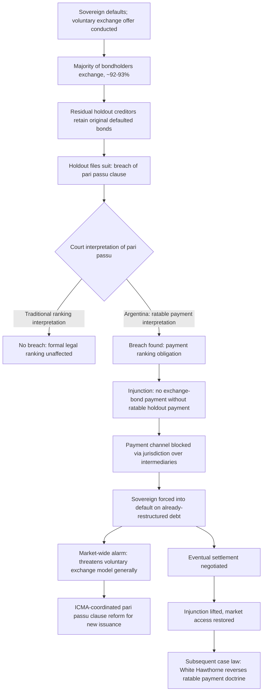

## Holdout Creditor Litigation and the Pari Passu Problem

### Definition and Function

**Holdout creditor litigation** refers to the legal strategy pursued by a sovereign bond creditor who declines to participate in a voluntary debt restructuring exchange offer, instead retaining the original, unrestructured bond's full contractual claim and pursuing legal enforcement of that claim — typically through litigation in the courts of the jurisdiction whose law governs the bond, most commonly New York or English law for internationally issued sovereign bonds — seeking either a money judgment for the bond's full original face value plus accrued interest, or, more consequentially, an injunction restraining the sovereign from making payments to the creditors who *did* participate in the restructuring unless the holdout is paid as well. The **pari passu problem** refers specifically to the interpretive and remedial controversy that arose when a U.S. federal court accepted a novel reading of a standard sovereign bond contractual clause — the pari passu clause — as the specific legal vehicle enabling exactly this kind of injunctive leverage, an interpretation that, for roughly a decade, threatened to fundamentally destabilize the voluntary-exchange-offer restructuring model underlying most modern sovereign debt restructurings.

Recall from the collective action clauses discussion that holdout behavior is, at its root, a collective action problem: any individual bondholder has an incentive to refuse a restructuring exchange if enough *other* bondholders participate to restore the sovereign's solvency, since the holdout can then seek full recovery from a sovereign now better able to pay. This item examines in specific mechanical and legal detail how that theoretical incentive was actually operationalized into an extraordinarily consequential litigation strategy — the Argentina NML Capital litigation — and how the market and legal community subsequently responded.

### The Standard Pari Passu Clause and Its Traditional Meaning

A **pari passu clause** ("equal footing," from the Latin) is a long-standard, largely boilerplate provision in sovereign bond documentation stating that the bond ranks at least equally with the sovereign's other unsecured, unsubordinated external indebtedness. For decades prior to the Argentina litigation, market participants and legal practitioners broadly understood this clause under what is now termed the **"ranking interpretation"**: a purely formal, legal-priority protection against the sovereign *subsequently and formally subordinating* the bond's legal ranking relative to other unsecured debt — for instance, by legislating that some other class of creditor would have a formally superior legal claim on the sovereign's assets. Under this traditional reading, the clause said nothing about the sovereign's actual, practical *payment* decisions among equally-ranked creditors; a sovereign choosing to pay one class of bondholders while not paying another (precisely what happens whenever a sovereign completes a restructuring exchange and resumes payment to exchanged bondholders while non-exchanged holdout bonds remain unpaid and in default) was, under the ranking interpretation, not considered a breach of pari passu at all, since no formal legal subordination had occurred — the holdout bonds retained their formal legal ranking; they simply were not being paid because they remained in default.

### The Argentina NML Capital Litigation: The Payment Interpretation

Argentina's litigation, principally *NML Capital, Ltd. v. Republic of Argentina* in the U.S. District Court for the Southern District of New York, arose from the specific two-sentence wording of the pari passu clause in Argentina's 1994 Fiscal Agency Agreement (FAA), which governed the bonds Argentina defaulted on in 2001. Where a traditional single-sentence pari passu clause addresses ranking only, Argentina's FAA clause contained an additional second sentence stating that Argentina's payment obligations under the securities would at all times rank at least equally with its other present and future unsecured and unsubordinated external indebtedness. Presiding judge Thomas Griesa, in a December 2011 ruling, found that Argentina breached this clause specifically by relegating the holdout creditors' bonds to a non-paying class while making regular payments on the bonds exchanged in the 2005 and 2010 restructurings — reading the clause's second sentence as encompassing not merely formal legal ranking but an actual **payment-ranking obligation**, a materially broader and more consequential interpretation than the traditional understanding, subsequently termed the **"ratable payment" interpretation**. This reading was substantially reinforced by an Argentine domestic law (the so-called "lock law") that formally prohibited Argentina from reopening or making payments on the defaulted bonds outside a restructuring, a measure the court treated as direct evidence that Argentina had gone beyond simply not paying the holdouts and had affirmatively legislated their subordination in practical effect.

### The Injunctive Remedy: The Ratable Payment Mechanism

The consequential force of the pari passu ruling came not from the liability finding alone but from the specific **injunctive remedy** Judge Griesa crafted to enforce it, upheld on appeal by the U.S. Court of Appeals for the Second Circuit. The injunction provided that whenever Argentina made a payment to holders of the exchange bonds (the restructured bonds issued in the 2005 and 2010 exchanges), Argentina was simultaneously required to make a **"ratable payment"** to the holdout plaintiffs — and, critically, the injunction explicitly prohibited any payment under the exchange bonds unless the corresponding ratable payment to the FAA (holdout) bondholders was made at the same time. Because Argentina's exchange-bond payments were processed through U.S.-based and other international financial intermediaries subject to the jurisdiction of the U.S. courts, this structure gave the injunction genuine practical enforcement teeth: any attempt by Argentina to pay its exchange bondholders while bypassing the ratable-payment requirement risked the paying intermediary itself being held in violation of the injunction, effectively blocking the payment channel entirely rather than merely creating a legal claim Argentina could choose to ignore. This is the precise mechanical reason the ruling proved so consequential — it did not merely give holdout creditors a judgment to enforce through ordinary asset-seizure procedures (historically difficult against a sovereign given sovereign immunity protections and the practical difficulty of locating attachable sovereign assets), but instead weaponized the sovereign's own desire to maintain good standing with its restructured, cooperating creditor majority as the enforcement lever.

### The 2014 Consequence: Forced Technical Default on Already-Restructured Debt

Argentina, having refused to pay the holdouts in full, found itself unable to make its scheduled 2014 payments to exchange bondholders without violating the injunction — the U.S. Supreme Court's June 2014 denial of Argentina's petition for certiorari (declining to review the Second Circuit's ruling) removed Argentina's last avenue of judicial appeal and activated the injunction's practical enforcement. Argentina attempted to make the scheduled exchange-bond payment through channels outside the reach of the U.S. injunction, an effort the courts blocked, and Argentina's exchange bondholders consequently did not receive their scheduled payment — producing what is conventionally termed **Argentina's 2014 default**, a highly unusual episode in that it constituted a default specifically on bonds that had *already been successfully restructured* roughly a decade earlier, triggered not by any renewed underlying fiscal incapacity to pay, but directly and solely by the pari passu injunction's enforcement mechanics — precisely the "renewed distress stemming from unresolved holdout litigation" episode referenced in the earlier discussion of Argentina's serial-default pattern.

### Why the Ruling Alarmed the Broader Sovereign Debt Market

The Argentina ruling's significance extended immediately and substantially beyond Argentina's own specific situation, generating widespread concern across the sovereign debt market, multilateral institutions, and academic commentary — reflected directly in the U.S. government's own amicus brief supporting Argentina's position on appeal, arguing the ruling would upset the accepted framework of sovereign debt restructuring generally. The core concern was structural and forward-looking: if a holdout creditor's threat of pari-passu-based injunctive relief could reliably force a sovereign into renewed default on its *already-restructured* debt, the ruling would materially strengthen the holdout strategy's expected payoff relative to voluntary restructuring participation for creditors facing any future sovereign restructuring generally, not merely for Argentina's specific creditors — potentially undermining the voluntary-exchange-offer restructuring model's basic viability across the sovereign debt market as a whole, precisely the free-rider amplification concern collective action clauses are designed to prevent through binding-majority mechanics rather than reliance on cooperative voluntary participation. The Second Circuit itself, in a subsequent opinion, explicitly pushed back against this broader alarm, characterizing the Argentina case as exceptional given its particular contractual language and Argentina's own affirmative "lock law" legislation, and stating that the ruling did not control the interpretation of pari passu clauses generally or establish that a sovereign breaches pari passu merely by paying one creditor and not another — an important judicial clarification worth noting directly, since it means the ratable-payment interpretation was never formally established as a universal rule applicable to all pari passu clauses, only to Argentina's specific two-sentence FAA formulation combined with its specific domestic legislative conduct.

### Market and Institutional Response: Contract Reform

Notwithstanding the Second Circuit's own case-specific framing, the market and legal community's practical response was a substantial, coordinated effort toward **contractual reform** of standard pari passu clause language in newly issued sovereign bonds, aimed at closing off any ambiguity that might permit a future court to reach a similarly consequential ratable-payment reading. Working substantially through the International Capital Market Association (ICMA), alongside the IMF and major market participants — in close parallel with, and often as part of, the same broader post-Argentina reform effort that produced the aggregated collective action clause standards discussed in the preceding item — revised model pari passu clause language was developed and promoted for adoption in newly issued sovereign bonds, explicitly clarifying that the clause addresses formal legal ranking only and does not impose any ratable-payment obligation of the kind the Argentina courts had found.

### Resolution: The Eventual Reversal and Argentina's 2016 Settlement

The pari passu ratable-payment interpretation's practical dominance proved less durable than its initial 2012–2014 impact suggested. Following a change in Argentine government in December 2015, Argentina reached a settlement with the great majority of its remaining holdout creditors in 2016, paying a negotiated settlement amount (reported at a substantial discount to the holdouts' full claimed value, but a significant premium relative to the terms offered in the original 2005 and 2010 exchange offers) in exchange for the holdouts' agreement to withdraw their litigation and the courts' corresponding lifting of the injunction, allowing Argentina to resume normal servicing of its exchange bonds and regain international bond market access. Separately and subsequently, in 2016–2017, in a case captioned *White Hawthorne, LLC v. Republic of Argentina*, the Southern District of New York moved away from the ratable-payment interpretation directly, holding that a sovereign's decision to pay some creditors and not others does not, on its own, breach a standard pari passu clause — substantially unwinding, at the level of subsequent New York case law, the specific "ratable payment" doctrine that had driven the 2012–2016 litigation, roughly five years after Griesa's original ruling had first unsettled the market's understanding of the clause.

### Worked Illustration: The Litigation Timeline and Mechanism

| Date | Event | Mechanism |
| --- | --- | --- |
| 2001 | Argentina defaults on FAA bonds | Underlying sovereign stress event |
| 2005, 2010 | Voluntary exchange offers | ~92–93% creditor participation; holdouts include NML Capital and others |
| Dec 2011 | Griesa finds pari passu breach | "Ratable payment" interpretation of FAA's two-sentence clause |
| Feb 2012 | Injunctive relief granted | Prohibits exchange-bond payment without simultaneous ratable holdout payment |
| 2012–2013 | Second Circuit affirms | Case-specific framing; not a universal pari passu rule |
| June 2014 | Supreme Court denies certiorari | Injunction becomes fully enforceable |
| 2014 | Argentina defaults on exchange bonds | Direct consequence of blocked payment channel |
| 2016 | Argentina settles with holdouts | Negotiated payment; injunction lifted; market access restored |
| 2016–17 | *White Hawthorne* | Ratable-payment doctrine substantially reversed in subsequent NY case law |

### Mermaid Diagram: The Pari Passu Litigation Mechanism

### SVG Illustration: The Injunction's Payment-Blocking Mechanism (svg_diagram)

<svg xmlns="http://www.w3.org/2000/svg" viewBox="0 0 700 380">
\<style\>
.box{stroke:#333;stroke-width:1.5;}
.sov{fill:#a8d5f0;}
.exch{fill:#d6ecd2;}
.hold{fill:#f7cfc7;}
.lbl{font-family:sans-serif;font-size:12px;fill:#222;text-anchor:middle;}
.ttl{font-family:sans-serif;font-size:15px;fill:#111;font-weight:bold;}
.arrow{stroke:#555;stroke-width:2;marker-end:url(#ah3);}
.blocked{stroke:#c0392b;stroke-width:3;stroke-dasharray:6,3;}
\</style\>
<text x="20" y="25" class="ttl">The Ratable Payment Injunction Mechanism (svg_diagram)</text>
<rect x="280" y="50" width="140" height="60" rx="8" class="sov" />
<text x="350" y="85" class="lbl">Sovereign</text>
<line x1="300" y1="110" x2="200" y2="200" class="arrow" />
<rect x="100" y="200" width="180" height="60" rx="8" class="exch" />
<text x="190" y="225" class="lbl">Exchange bondholders</text>
<text x="190" y="243" class="lbl">(restructured, ~93%)</text>
<line x1="400" y1="110" x2="500" y2="200" class="blocked" />
<rect x="420" y="200" width="180" height="60" rx="8" class="hold" />
<text x="510" y="225" class="lbl">Holdout creditors</text>
<text x="510" y="243" class="lbl">(unrestructured, ~7%)</text>
<text x="450" y="185" class="lbl" fill="#c0392b">No ratable payment made</text>
<text x="150" y="285" class="lbl" fill="#c0392b">Injunction blocks THIS payment too,</text>
<text x="150" y="300" class="lbl" fill="#c0392b">via jurisdiction over payment intermediaries,</text>
<text x="150" y="315" class="lbl" fill="#c0392b">unless holdouts are paid simultaneously</text>
</svg>

### Practical Implications for Fiscal Statecraft

The pari passu episode's enduring lesson for fiscal statecraft extends beyond its now-substantially-reversed specific legal doctrine to a more general and durable insight about sovereign debt restructuring risk: contractual language that had been treated as harmless, standardized boilerplate for decades — the pari passu clause — proved capable of generating an entirely unanticipated and severely consequential legal exposure once tested by a sufficiently determined, well-resourced holdout litigant in a favorable jurisdiction, a reminder directly relevant to why a debt management office's ongoing attention to bond contractual terms (recall the parallel discussion of collective action clause strength and legacy-bond coverage gaps) is not merely a technical legal formality but a genuine, quantifiable dimension of sovereign portfolio risk. The episode also illustrates directly why governing law and jurisdiction selection at the point of bond issuance — a technical decision easily treated as secondary to pricing and tenor considerations — carries real downstream consequence for a sovereign's restructuring flexibility, since the specific interpretive posture of the courts whose jurisdiction governs a given bond series can materially shape the leverage available to a future holdout creditor in a way not fully knowable, or at least not fully weighted, at the original point of issuance.

**Related Topics**

- Collective action clauses and coordinated sovereign bond restructuring
- Historical patterns of sovereign default and serial-defaulter dynamics
- London Club and syndicated private-creditor coordination in restructuring
- The Argentina 2001–2020 default, restructuring, and holdout litigation case study
- Sovereign immunity waivers and enforcement jurisdiction in bond documentation
- Primary issuance mechanics: auctions, syndications, and benchmark bonds