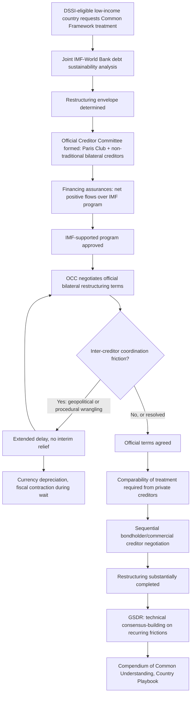

## The G20 Common Framework for Debt Treatment Beyond the Paris Club

### Definition and Institutional Origin

The **G20 Common Framework for Debt Treatments beyond the DSSI** is a coordination mechanism launched in November 2020, explicitly designed to bring together traditional Paris Club creditor governments and key non-Paris-Club official bilateral creditors — most significantly China, alongside other G20 members — into a single, unified negotiating process for restructuring the sovereign debt of eligible low-income countries. Recall from the Paris Club discussion that the traditional Paris Club architecture, built around a relatively homogeneous group of advanced-economy creditor governments, faces a structural coordination gap when a debtor's official bilateral creditor base includes substantial non-Paris-Club exposure — the Common Framework exists specifically to close that gap by extending the Paris Club's core organizing principles (IMF-program linkage, comparability of treatment, coordinated multilateral negotiation) to a broader and more heterogeneous creditor coalition better reflecting the actual current composition of many debtor sovereigns' official bilateral exposure.

The Common Framework was initially scoped to apply to the 73 low-income countries eligible for the pandemic-era **Debt Service Suspension Initiative (DSSI)**, which had provided a temporary, time-limited grace period on debt-service payments during the acute phase of the COVID-19 shock — the Common Framework was conceived as the follow-on, durable restructuring mechanism for DSSI-eligible countries whose debt distress proved structural rather than merely a temporary liquidity problem the DSSI's payment suspension alone could resolve.

### Core Structural Mechanics: The Official Creditor Committee

The Common Framework's central procedural innovation is the **Official Creditor Committee (OCC)** — a single negotiating body bringing together all relevant official bilateral creditors, both traditional Paris Club members and non-Paris-Club official lenders (China being the most consequential in practice), to negotiate restructuring terms with the debtor sovereign as one coordinated group, rather than the debtor needing to separately negotiate comparable terms with the Paris Club and then separately seek comparable, but procedurally disconnected, terms from other official bilateral creditors. The standard sequence, following the general G20 process guidance, proceeds as follows:

**1. Debtor request and IMF-WBG debt sustainability analysis**: A debtor country requests Common Framework treatment, triggering a joint IMF-World Bank Group debt sustainability analysis (recall the SRDSF and LIC DSF methodologies covered earlier in this chapter) to determine the required restructuring envelope — directly analogous to, and continuing, the Paris Club's own foundational practice of anchoring restructuring terms in the Fund's quantitative sustainability assessment rather than a purely negotiated figure.

**2. Official Creditor Committee formation and financing assurances**: Participating official bilateral creditors form the OCC and provide financing assurances supporting an IMF-supported program, with the specific commitment — as documented in G20 process guidance for the Zambia, Ghana, and Ethiopia cases — typically structured around **net positive financial flows** over the IMF program period, meaning creditors commit that debt-service payments received from the debtor will not exceed new financing extended, a structural commitment providing the debtor genuine near-term cash-flow relief even before the full restructuring terms are finalized.

**3. Restructuring terms negotiation and comparability of treatment**: Following the same comparability-of-treatment principle inherited directly from Paris Club practice, the OCC negotiates restructuring terms with the debtor, and the debtor is subsequently required to secure broadly comparable treatment from its remaining official bilateral creditors outside the OCC and from its private creditors (bondholders and commercial lenders) — the private-creditor negotiation typically proceeding sequentially, following the official creditor agreement, through separate bondholder committee and commercial-creditor negotiation processes of the kind covered in the collective action clauses discussion.

### Actual Track Record: A Small Number of Cases, Documented Delays

In practice, and this is a central, extensively documented feature of the Common Framework's actual operation rather than a peripheral detail, only four countries — **Chad, Ethiopia, Ghana, and Zambia** — have applied for debt treatment under the Common Framework, with Ghana's application in December 2022 being the most recent of the four. This narrow uptake, combined with the extended timelines each of the four cases has required, has generated substantial and sustained criticism of the framework's practical effectiveness, from sources including the World Bank's own chief economist and the IMF's Managing Director.

**Zambia**, the Common Framework's first test case, requested debt treatment in February 2021; despite the country's documented cooperative engagement with the process throughout, Zambia was only able to sign a Memorandum of Understanding with its official bilateral creditors in April 2024 — a gap of thirty-eight months from initial request to that milestone agreement. As of the most recent Global Sovereign Debt Roundtable progress reporting (April 2026), Zambia's restructuring is close to full completion, with Zambia having completed the sixth and final review of its IMF-supported program in January 2026, with residual negotiation remaining focused on a small group of non-bonded commercial creditors.

**Ghana** proceeded somewhat faster than Zambia through its own restructuring process, and its bondholder restructuring — alongside Zambia's — was among the landmark bondholder restructurings finalized under the Common Framework structure by the end of 2024.

**Ethiopia** has proceeded considerably more slowly than either Zambia or Ghana and, as of the most recent available reporting, has yet to finalize its negotiations — the slowest-progressing of the four active Common Framework cases.

**Chad** was the first country to apply, and its case, while smaller in absolute debt terms than the other three, illustrated early structural features of the Common Framework process that subsequently recurred across the other cases.

### Why the Process Has Proven Slow: Documented Structural Frictions

The extended timelines observed across all four Common Framework cases are attributed, across the analytical and critical literature examining the framework's performance, to several specific, recurring structural frictions worth distinguishing clearly:

**Inter-creditor coordination costs among a genuinely heterogeneous creditor group**: Unlike the Paris Club's relatively institutionally aligned traditional membership, the OCC must coordinate creditors with substantially different institutional structures, decision-making processes, and, in some documented cases, differing strategic and geopolitical interests in the outcome — Zambia's restructuring process specifically was documented as having been held up by repeated instances of what has been characterized as geopolitically-tinged inter-creditor wrangling, reflecting the genuine difficulty of replicating Paris Club-style consensus discipline across a more heterogeneous creditor coalition, exactly the challenge the Common Framework was designed to address but has evidently not yet fully resolved in practice.

**Sequencing between official and private creditor negotiation**: Because comparability of treatment requires private creditors to also participate on broadly comparable terms, but the private-creditor negotiation typically proceeds only after official creditor terms are substantially settled, delays or disagreements at the OCC stage directly cascade into corresponding delays in initiating the subsequent private-creditor negotiation phase — a sequential dependency that compounds any friction encountered at the earlier official-creditor stage rather than allowing the two negotiation tracks to proceed genuinely in parallel.

**Absence of interim relief during the process**: A specifically documented critique holds that the Common Framework, unlike some alternative restructuring architectures, provides no meaningful interim debt-service relief while a case remains under negotiation, meaning a debtor country experiences the full economic cost of continued debt distress — currency depreciation, forced fiscal contraction, collapsed access to new market financing — throughout the often multi-year negotiation period itself, independent of and prior to whatever ultimate relief the completed restructuring eventually delivers. Zambia's currency lost over 30% of its value at several points during its multi-year wait for an agreement, and Zambia was documented as having cut public investment to under 3% of GDP during the impasse period — concrete, quantified illustrations of exactly the kind of real economic cost that extended negotiation timelines impose, directly connecting this item to the fiscal space discussion's core argument that a sovereign entering a shock without adequate buffers faces a starkly worse set of choices than one that retains genuine room to absorb the shock while restructuring proceeds.

### Sri Lanka: A Comparison Outside the Common Framework

Sri Lanka's own major sovereign debt restructuring, substantially completed by the most recent reporting with bilateral agreement signatures well advanced though not yet fully finalized, provides a directly useful comparison precisely because Sri Lanka, as a middle-income rather than DSSI-eligible low-income country, was not eligible for the Common Framework at all, and instead pursued its restructuring through separate creditor committees — negotiating individually and in parallel with its official bilateral creditors, its Chinese creditors specifically, and its bondholders — rather than through a single unified OCC structure. This comparison is analytically useful because it illustrates that Sri Lanka's restructuring, despite lacking the Common Framework's unified-negotiation structure, has not proceeded dramatically faster or slower than the Common-Framework-governed Zambia and Ghana cases, a pattern some analysts have cited as raising a genuine open question about how much of the Common Framework cases' extended timelines reflects the framework's own specific structural features versus the more general, structurally difficult nature of coordinating a diverse modern sovereign creditor base (official bilateral, non-traditional bilateral, and private bondholder simultaneously) regardless of which specific coordination architecture is used to manage that underlying complexity.

### The Global Sovereign Debt Roundtable: A Complementary Institutional Response

In direct response to the accumulated Common Framework implementation difficulties, the **Global Sovereign Debt Roundtable (GSDR)** — a joint initiative launched in 2023 by the G20, the IMF, and the World Bank — was established specifically to bring together official bilateral creditors, private creditors, and debtor countries in a shared forum aimed at building consensus on the specific technical and procedural issues that have most consistently generated friction and delay in practice, including comparability-of-treatment calculation methodology and broader debt transparency and debt management practice. The GSDR has produced a **Compendium of Common Understanding on Technical Issues**, documenting concrete, negotiated consensus positions on recurring technical sticking points, and a **Sovereign Debt Restructuring Playbook for Country Authorities**, aimed specifically at helping debtor-country finance ministries navigate the restructuring process more effectively — a direct institutional acknowledgment that the Common Framework's practical shortcomings required a dedicated, ongoing forum for technical problem-solving beyond the original framework's founding structure alone.

### Worked Illustration: Comparative Timelines

| Country | Framework | Initial request | First major milestone | Status as of most recent reporting |
| --- | --- | --- | --- | --- |
| Zambia | G20 Common Framework | February 2021 | MoU with official creditors, April 2024 (38 months) | Near-complete; 6th IMF program review completed January 2026; residual commercial-creditor negotiation ongoing |
| Ghana | G20 Common Framework | December 2022 | Bondholder restructuring finalized by end-2024 | Substantially complete |
| Ethiopia | G20 Common Framework | (among the four applicants) | — | Not yet finalized; slowest of the four cases |
| Chad | G20 Common Framework | First applicant | — | Smaller case; early illustrative precedent |
| Sri Lanka | Outside Common Framework (separate creditor committees) | — | Six official bilateral agreements signed by mid-2025 | Nearly complete; bilateral signatures well advanced |

[Verify current specific status of any of these cases directly against the latest IMF, World Bank, or G20 reporting before citing in any time-sensitive analysis, since these restructurings remain actively evolving processes even as of the most recent documented progress reports.]

### Mermaid Diagram: The G20 Common Framework Process

### SVG Illustration: Common Framework Case Timelines (svg_diagram)

<svg xmlns="http://www.w3.org/2000/svg" viewBox="0 0 700 340">
\<style\>
.ax{stroke:#333;stroke-width:2;}
.bar{fill:#2c5c99;}
.barsri{fill:#7d9e6b;}
.lbl{font-family:sans-serif;font-size:12px;fill:#222;}
.ttl{font-family:sans-serif;font-size:15px;fill:#111;font-weight:bold;}
\</style\>
<text x="20" y="25" class="ttl">Illustrative Restructuring Timelines: Request to Major Milestone (svg_diagram)</text>
<line x1="150" y1="280" x2="650" y2="280" class="ax" />
<line x1="150" y1="280" x2="150" y2="50" class="ax" />
<text x="350" y="315" class="lbl">Months elapsed →</text>
<rect x="150" y="70" width="300" height="35" class="bar" />
<text x="30" y="93" class="lbl">Zambia (CF)</text>
<text x="460" y="93" class="lbl">~38 months to MoU</text>
<rect x="150" y="120" width="180" height="35" class="bar" />
<text x="30" y="143" class="lbl">Ghana (CF)</text>
<text x="340" y="143" class="lbl">Faster, finalized by end-2024</text>
<rect x="150" y="170" width="340" height="35" class="bar" />
<text x="30" y="193" class="lbl">Ethiopia (CF)</text>
<text x="500" y="193" class="lbl">Still ongoing, slowest</text>
<rect x="150" y="220" width="260" height="35" class="barsri" />
<text x="30" y="243" class="lbl">Sri Lanka (non-CF)</text>
<text x="420" y="243" class="lbl">Comparable pace, outside CF</text>
</svg>

### Practical Implications for Fiscal Statecraft

For a finance ministry evaluating whether and how to engage the Common Framework, should genuine debt distress ever require it, the documented track record carries a directly sobering practical implication distinct from the framework's founding aspirations: a debtor sovereign entering this process should realistically anticipate a multi-year timeline before final resolution, with no guaranteed interim debt-service relief during that period — meaning the fiscal space and buffer-preservation practices discussed earlier in this chapter become, if anything, even more consequential precisely because a sovereign that has exhausted its fiscal space before entering a Common Framework negotiation faces the documented real economic costs (currency depreciation, forced investment cuts, collapsed new-market access) compounding over a negotiation period that has, in every case observed to date, extended considerably longer than the framework's original design contemplated. The framework's own evolution — including the GSDR's establishment specifically to address recurring implementation friction — also illustrates a broader pattern recurring throughout this chapter's coverage of sovereign default and restructuring mechanics: each generation of restructuring architecture (Paris Club classic terms, then concessional terms, then HIPC/MDRI; London Club rescheduling, then the Brady Plan; series-by-series CACs, then aggregated CACs; and now the Common Framework, with the GSDR as its own subsequent refinement) has emerged specifically in response to the documented inadequacy of the preceding generation's mechanics, a pattern worth bearing in mind as a genuinely ongoing, unfinished institutional evolution rather than a settled, final architecture.

**Related Topics**

- Paris Club mechanics for official bilateral debt restructuring
- Collective action clauses and coordinated sovereign bond restructuring
- Holdout creditor litigation and the pari passu problem
- Historical patterns of sovereign default and serial-defaulter dynamics
- Fiscal space and its role in crisis prevention
- The IMF-World Bank Debt Sustainability Framework for low-income countries