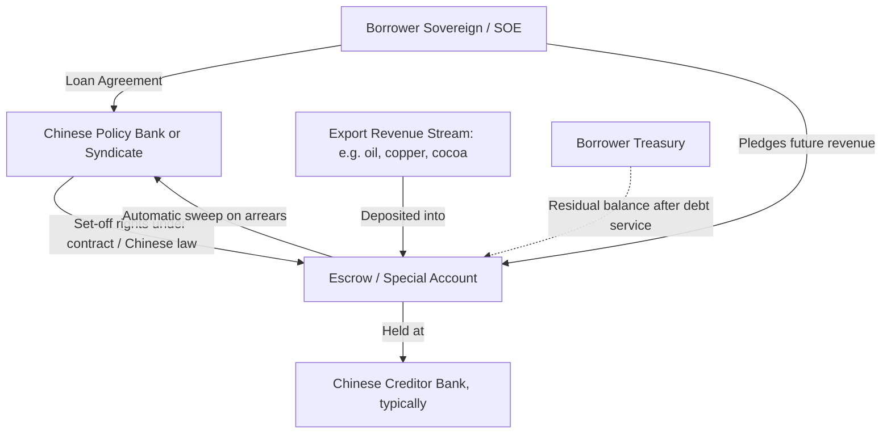

## Belt and Road Initiative Lending Structures and Collateralized Finance

### Institutional Architecture of BRI Lending

The Belt and Road Initiative (BRI), launched in 2013, is not a single lending facility but a coordination framework under which several distinct Chinese state entities extend sovereign and quasi-sovereign credit. Understanding the borrower's exposure requires disaggregating these channels, since each carries different terms, oversight, and renegotiation pathways.

**Policy banks** — China Development Bank (CDB) and the Export-Import Bank of China (China Eximbank) — provide the bulk of non-concessional BRI financing. These are wholly state-owned but operate on commercial or semi-concessional terms rather than as aid agencies; they price loans close to market rates and expect full repayment, distinguishing them from the Ministry of Commerce's traditional concessional aid loans. Overlaid on this base is **state-owned commercial bank** participation — principally Bank of China, ICBC, and China Construction Bank — which has grown substantially during the BRI era, especially through **syndicated lending**, where multiple banks jointly fund a single credit facility under one agreement, sharing risk and, often, security interests pro rata. A borrowing finance ministry negotiating with "China" is frequently negotiating simultaneously, or sequentially, with several of these institutions, each with its own credit committee, risk tolerance, and (critically) confidentiality practices.

A defining structural feature — and the central subject of this item — is **collateralization**: the practice of securing a loan not merely by the sovereign's general repayment promise (as in a typical Paris Club or multilateral loan) but by a specific, legally pledged revenue stream or asset that the creditor can access directly upon default, without first obtaining a court judgment or the borrower's renewed consent.

### The Collateralization Mechanism: Cash, Not Concrete

A persistent misconception in public commentary treats BRI collateral as primarily physical — ports, railways, mines pledged as security in the manner of a mortgage. AidData's 2025 dataset of 371 unredacted contracts across 155 borrowers, produced with the Kiel Institute and the Peterson Institute, corrects this: roughly 79% of collateralized Chinese loans are secured by cash deposited into escrow or "special" accounts rather than by liens on physical assets, contrary to the common perception that China secures its overseas loans with ports, power plants, or other physical infrastructure. The scale of this shift is significant for a finance ministry assessing its own exposure: at the turn of the century, only 19% of China's overseas lending to low- and middle-income countries was collateralized; this figure now stands at 72%. [Substack](https://scceichinabriefs.substack.com/p/how-china-collateralizes-inside-a)[Aiddata](https://docs.aiddata.org/reports/belt-and-road-reboot/executive-summary.html)

The mechanical design, as documented from contract text rather than press reporting, works as follows. A borrower (typically a state-owned enterprise executing the financed project, with the sovereign as guarantor, or the treasury directly) agrees to route a defined foreign-currency revenue stream — export proceeds from a commodity, toll or tariff receipts, or SOE dividend flows — into a **restricted or escrow account**, most commonly domiciled at a bank in China, and frequently at the lending bank itself. A typical security package supporting a Chinese public and publicly guaranteed (PPG) loan includes one or more restricted accounts at banks located in China, funded by revenues from the borrowing country, bolstered by contract and property rights in the cash flows; because the deposit account often sits at the creditor bank itself, the lender gains a high level of control over the borrower's core revenue stream along with set-off rights under Chinese law — meaning the bank can apply the deposited funds directly against the outstanding loan balance without a separate legal proceeding. [W&M News](https://news.wm.edu/2025/06/26/wms-aiddata-a-driving-force-behind-report-on-lending-practices-of-chinese-creditors/)

A second AidData finding bears directly on sovereign risk assessment: **collateral is frequently unconnected to the financed project**. More than 60% of all collateralized loans are secured by foreign currency earnings from oil, gas, copper, cocoa, and other raw materials, often with no direct connection to the financed project — Angola's oil exports, for instance, were pledged to back loans for public infrastructure, while Ghana's cocoa revenues secured unrelated power and road projects. From a debt-management perspective, this means a state's *entire* export base, not merely the financed asset's revenue, can become encumbered — a critical input to any debt sustainability analysis (DSA), the IMF/World Bank framework that projects a state's debt-to-GDP and debt-service trajectories under baseline and stress scenarios to gauge repayment capacity, because encumbered revenue is unavailable to service *other* creditors in a restructuring. [FSI](https://sccei.fsi.stanford.edu/china-briefs/how-china-collateralizes-inside-400-billion-cash-secured-lending-system)

**Table: Collateral type by prevalence in Chinese PPG lending (AidData 2025 dataset)**

| Collateral type | Approximate share of collateralized volume | Key characteristic |
| --- | --- | --- |
| Cash in escrow/restricted accounts | ~79–80% | Held mostly at Chinese banks; direct creditor control |
| Commodity export receivables | ~60%+ of collateralized loans | Often unrelated to financed project |
| Physical asset liens (equipment, land) | Minority share | "Rare" per Kiel Institute researchers |
| Local-currency accounts in borrower country | Minority share | Also comparatively rare |

"It's rare that Chinese creditors secure their exposures with local currency revenues and bank accounts in the borrowing country, or with physical assets such as land or equipment," the Kiel Institute's lead researcher noted — the strong creditor preference is for liquid, foreign-currency, extraterritorial collateral, which is easier to seize without engaging the borrower's domestic legal system. [W&M News](https://news.wm.edu/2025/06/26/wms-aiddata-a-driving-force-behind-report-on-lending-practices-of-chinese-creditors/)

### Confidentiality and Seniority: The Practical Effect for Borrower Debt Managers

Two structural features of these contracts matter disproportionately for a sovereign debt manager preparing for a restructuring negotiation.

**First, non-disclosure clauses.** When a sovereign borrower signs an escrow account agreement or debt rescheduling agreement with a Chinese lender, it is not unusual for the parties to agree upon an expansive set of confidentiality obligations. This has historically impeded a finance ministry's own ability to present a complete external liabilities picture — and, at the multilateral level, has repeatedly slowed the IMF's DSA process for borrowers with material Chinese exposure, since the debt sustainability analysis requires a full accounting of contingent and collateralized claims, not just headline face values. [Aiddata](https://docs.aiddata.org/reports/belt-and-road-reboot/executive-summary.html)

**Second, de facto seniority via unilateral sweep.** In distress, Chinese state banks have been documented "paying themselves" — when borrowers fall behind on repayments, Beijing sweeps dollars and euros out of cash collateral accounts unilaterally, and these seizures are mostly executed in secret, outside the immediate reach of domestic oversight institutions. Because this sweep occurs at the account level rather than through a formal default declaration or court process, it can happen *before* a borrower even enters a formal restructuring track, effectively subordinating other creditors who lack equivalent collateral. This is precisely the dynamic that Paris Club, multilateral, and commercial creditors have flagged as a comparability-of-treatment concern in recent Group of Twenty (G20) Common Framework cases: these creditors fear — with some justification — that they are becoming junior creditors relative to collateralized Chinese claims that sit, in practice if not in law, ahead of them in the repayment queue. [Aiddata](https://docs.aiddata.org/reports/Competing_With_Belt_and_Road_2_0.pdf)[Aiddata](https://docs.aiddata.org/reports/Competing_With_Belt_and_Road_2_0.pdf)

For a finance ministry, the policy implication is direct: any new borrowing agreement offering collateral to one class of creditor is not a bilateral matter contained to that loan — it alters the sovereign's *effective* creditor hierarchy for every subsequent restructuring, a fact often invisible in the headline face value of the loan and difficult to model in a standard DSA unless collateralized exposure is separately flagged as quasi-senior debt.

### Worked Case: Hambantota Port — Mechanics, Not Myth

Hambantota Port in Sri Lanka is the most cited case in the "debt-trap diplomacy" debate and merits precise treatment, because the common shorthand — that China seized the port because Sri Lanka defaulted on the loans that built it — is not accurate to the contract structure, and getting this wrong misleads borrower-side risk assessment more than it informs it.

The actual sequence: the port was constructed in two phases (2007 and 2012) with buyer's-credit loans from China Eximbank to the Sri Lanka Ports Authority (SLPA), separate from the 2017 transaction. In 2017, facing balance-of-payments pressure unrelated in origin to these specific loans, the Sri Lankan government executed a **99-year concession lease**, not a debt cancellation: a 70% stake in the port was leased to China Merchants Port Holdings (CM Port) for 99 years, in exchange for $1.12 billion, with no cancellation of the underlying Eximbank debt. Of the $1.12 billion CM Port equity investment, $974 million was used to acquire an 85% stake in the operating holding company, while responsibility for repaying the original China Eximbank construction loans was simultaneously transferred from SLPA to Sri Lanka's General Treasury. Because the treasury received the cash infusion and the Eximbank loans remained on the sovereign's books rather than being extinguished, many media outlets characterized the arrangement as a "debt-for-equity" swap, though the loan agreements themselves were not amended and were not in default at the time. [Myths about the Hambantota Port Deal: The Diplomat | The Business Standard +2](https://www.tbsnews.net/features/panorama/myths-about-hambantota-port-deal-diplomat-374647)

The precise, defensible characterization for a public finance official is therefore: **a sale-and-leaseback-style equity monetization of a state asset, used to generate foreign-exchange liquidity, executed concurrently with (but legally separate from) continued sovereign liability for the original construction debt.** The commodity/asset conflation matters for policy: it was Sri Lanka's broader external debt position — Chinese loans constituted just 9% of Sri Lankan government debt by 2016, with the Hambantota loans specifically at 4.8%, while the dominant driver of the 2022 default was market borrowing made cheap by post-2008 quantitative easing and then abruptly expensive once the U.S. Federal Reserve began tapering in 2013 — that produced the crisis, not this transaction in isolation. A finance ministry drawing lessons from Hambantota should focus less on "avoid Chinese lenders" as a categorical rule and more on the specific mechanism: **equity monetization of strategic infrastructure is a real fiscal-space tool with real sovereignty trade-offs, and its terms (lease length, security-oversight arrangements, revenue-sharing) deserve the same scrutiny as any debt instrument**, independent of creditor nationality. [Srilankamirror](https://srilankamirror.com/features/sri-lankas-hambantota-port-and-the-complete-collapse-of-the-debt-trap-narrative/)

### Debt-Trap Diplomacy Framing: Strongest Form of Each Position

Because this is a genuinely contested empirical question, both positions merit accurate statement.

**The debt-trap case.** Proponents point to the documented rise in collateralization (19% to 72% of lending), the concentration of collateralized lending on already-distressed borrowers (0% of collateralized commitments went to financially distressed countries at the turn of the century, rising to 74% by 2021), the opacity created by confidentiality clauses, and the demonstrated willingness to sweep escrow accounts unilaterally and in secret. Even researchers skeptical of a coordinated "trap" strategy accept that the *effect* — de facto seniority, reduced restructuring transparency, and asset-specific leverage in weak-governance states — is real and documented in contract text, not merely alleged. [Aiddata](https://docs.aiddata.org/reports/belt-and-road-reboot/executive-summary.html)

**The counter-case.** Critics of the debt-trap framing argue it mischaracterizes both intent and causality. In the Hambantota case specifically, the arrangement was not a debt/equity swap, Sri Lanka's own government actively solicited the project, and Chinese debt remained a small fraction of Sri Lanka's total sovereign liabilities — undermining the claim that China engineered dependency to extract the asset. More broadly, cash collateralization backed by commodity exports is a longstanding instrument in sovereign lending generally (resource-backed lending predates the BRI and is used by commercial and other bilateral lenders), and the shift toward collateralization is at least as plausibly explained by China's own creditor-risk management in response to a *rising* share of distressed borrowers — a defensive response to bad loans already made — as by an offensive strategy to acquire strategic assets. AidData's own 2024 "BRI 2.0" analysis frames the recent hardening of terms as **creditor risk management amid a portfolio crisis** rather than a coherent extraction strategy: Chinese creditors and contractors are described as "firefighting," refocusing time and money on distressed borrowers, troubled projects, and sources of public backlash, while a longer-term reinvention of the BRI is underway to future-proof the program against repayment, project-performance, and reputational risk. [Georgetown Journal of International Affairs](https://gjia.georgetown.edu/2021/06/05/questioning-the-debt-trap-diplomacy-rhetoric-surrounding-hambantota-port/)[Aiddata](https://docs.aiddata.org/reports/Competing_With_Belt_and_Road_2_0.pdf)

A defensible synthesis for a policymaker: the evidence supports "opportunistic and defensively structured high-leverage lending with genuine sovereignty costs for the borrower" more strongly than it supports "premeditated strategy to seize assets," but the distinction may matter less to a finance ministry than the practical fact that both framings agree on the underlying contract mechanics described above.

### Practical Implications for Borrower-Side Debt Management

**Key Points**

- Treat any Chinese state-bank loan offer with a collateral or escrow clause as *de facto* senior debt for internal DSA purposes, regardless of its formal legal ranking, given documented unilateral sweep practice.
- Request, and where possible negotiate for removal of, broad confidentiality clauses — these directly impair the ministry's own consolidated debt reporting and complicate later Paris Club or Common Framework coordination.
- Distinguish project-linked collateral from unrelated revenue-stream collateral (e.g., pledging *cocoa* export receipts for a *power plant* loan) — the latter cross-encumbers fiscal space well beyond the specific project and should be flagged separately in any medium-term debt strategy.
- An asset-monetization transaction (lease, concession, equity sale) executed alongside continued debt service is legally and fiscally distinct from a debt-for-equity swap; ministries should insist on, and journalists and legislators should be briefed on, this distinction to avoid mischaracterizing the sovereign's own contingent liability position.
- Syndicated structures involving Western commercial banks alongside Chinese policy banks (now covering roughly 50% of China's non-emergency lending portfolio, more than 80% of it involving Western commercial banks or multilateral institutions) may offer marginally more standardized, disclosed terms than pure bilateral Chinese policy-bank loans, and are worth distinguishing in a borrower's own credit-risk mapping. [Aiddata](https://docs.aiddata.org/reports/belt-and-road-reboot/executive-summary.html)

**Example**

A simplified escrow mechanic, as it would appear in a debt-management ministry's internal risk note:

$$\text{Available Fiscal Buffer} = \text{Total Export Receipts} - \sum_{i} \text{Collateralized Receipts}_i$$

where each $\text{Collateralized Receipts}_i$ term represents a revenue stream diverted automatically to a specific creditor's escrow account before it reaches the treasury's general account — meaning these funds are unavailable for discretionary fiscal use or as security for subsequent borrowing from any other creditor, a constraint that standard debt-to-GDP ratios do not capture on their own.

### Related Topics

- Debt Sustainability Analysis (DSA) methodology under the IMF-World Bank Low-Income Country Debt Sustainability Framework
- G20 Common Framework for Debt Treatment and comparability-of-treatment disputes
- Collective action clauses in sovereign bond contracts versus bilateral loan renegotiation
- Resource-backed lending outside the BRI context (e.g., pre-BRI Angola-mode oil-backed loans)
- Special purpose vehicles and on-lending arrangements in sovereign infrastructure finance
- Paris Club comparability-of-treatment principle and its erosion by non-Paris-Club bilateral creditors
- Sovereign asset monetization (leases, concessions) as a fiscal-space tool distinct from debt issuance