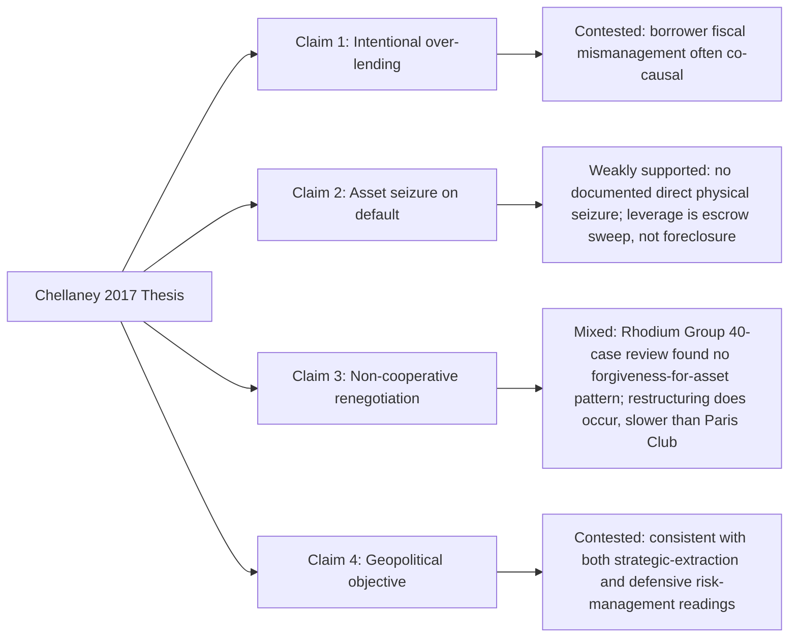

## The "Debt-Trap Diplomacy" Thesis and Its Central Claims

### Origin and Precise Formulation

The term was coined by Indian strategic-affairs scholar Brahma Chellaney in a January 2017 *Project Syndicate* essay, published before the Hambantota Port concession agreement that would later become the thesis's central illustrative case. Chellaney's formulation is a specific causal chain, not merely an observation that China lends to fiscally weak states, and a debt-management official should be precise about which link in that chain any given piece of evidence actually tests. The founding formulation holds that debt-trap diplomacy is a policy tool whereby a lending state (China) supports infrastructure projects in a strategically located borrower state, often via excessive loans, causing the borrower to become economically dependent and thus more firmly under the lender's influence — the borrower becomes ensnared in a debt trap that leaves it vulnerable to the lender's pressure. Chellaney's original essay went further, asserting that the underlying purpose of Belt and Road Initiative (BRI) lending was not to support the local economy of the recipient but to facilitate Chinese access to natural resources or to open markets for Chinese goods, and that when a recipient state fell into debt distress, this outcome was strategically favorable to Beijing, since it created leverage to extract further loans, state-asset concessions, or foreign-policy alignment in exchange for relief.

Decomposed into testable sub-claims, the thesis makes at minimum four distinct assertions, each requiring separate empirical evaluation:

1. **Intentionality**: China structures loan terms deliberately to produce unsustainable debt burdens, rather than debt distress arising as an unintended consequence of commercial risk-taking or borrower-side fiscal mismanagement.
2. **Asset-extraction mechanism**: When distress occurs, China's standard response is to convert defaulted debt into control of strategic physical assets (ports, mines, land) via formal or de facto seizure.
3. **Non-cooperative renegotiation posture**: China is comparatively unwilling to restructure, forgive, or reschedule debt relative to other bilateral or multilateral creditors, preferring leverage over resolution.
4. **Geopolitical objective**: The ultimate purpose is strategic — military access, resource capture, or foreign-policy alignment — rather than commercial return.

### The Empirical Record: What the Case Evidence Shows

**On intentionality and the Hambantota precedent.** As established in the treatment of Belt and Road Initiative lending structures and collateralized finance, the 2017 Hambantota transaction was a 99-year equity lease generating $1.12 billion in fresh liquidity, executed alongside — not in cancellation of — continuing Sri Lankan sovereign liability for the original China Eximbank construction loans; contemporary Chinese lending constituted only 9% of Sri Lanka's total government debt in 2016, with the Hambantota-specific loans at 4.8%. Scholars disputing the debt-trap reading of this case argue that Chinese finance was not the primary source of Sri Lanka's financial distress, pointing instead to Sri Lanka's much larger exposure to Western capital markets, borrowing that had been made cheap by post-2008 quantitative easing and then suddenly expensive once the U.S. Federal Reserve began tapering in 2013.

**On the asset-seizure mechanism specifically.** This is the sub-claim with the weakest empirical support and the one most directly falsifiable by contract-level evidence. A substantial body of academic and journalistic review — cited in the Wikipedia synthesis of the debate but reflecting a broader scholarly consensus including Deborah Brautigam's contract-based research program — concludes that Chinese banks have never seized a physical asset from a sovereign borrower as a direct consequence of default, and have generally shown willingness to restructure existing loan terms rather than foreclose. This finding is consistent with the mechanism established in the collateralization literature: because approximately 79% of Chinese collateralized lending is secured by cash flows into escrow accounts rather than liens on physical assets, the leverage China's creditors actually exercise in distress is *automated repayment interception* (unilaterally sweeping foreign currency from escrow accounts), not asset foreclosure in the mortgage-default sense the debt-trap thesis implies. The empirical picture is therefore one of significant, documented creditor leverage — but exercised through a different mechanism than the thesis's central illustrative claim.

**On the empirical test of asset-for-debt swaps directly.** The most direct test of the extraction-mechanism sub-claim was conducted by the Rhodium Group, an independent research institute, which in a 2019 study reviewed 40 cases of Chinese external debt renegotiation specifically to test for a pattern of debt forgiveness conditioned on asset or natural-resource transfer. This is the single most load-bearing empirical citation in the counter-debt-trap literature, and a public finance official should note precisely what it does and does not show: it tests renegotiation *outcomes* across a reasonably large sample, rather than relying on a single case, which is the principal methodological weakness of debt-trap advocacy that leans heavily on Hambantota alone.

**On renegotiation posture.** Separately from the Rhodium Group finding, the broader empirical literature on Chinese sovereign debt restructuring — including cases under the G20 Common Framework for Debt Treatment (Zambia, Chad, Ethiopia, Ghana) — documents genuine and repeated Chinese participation in debt rescheduling and, in some cases, maturity extension or interest-rate reduction, though typically on a slower timeline and with less standardized terms than Paris Club creditors, and frequently complicated by the confidentiality clauses discussed in the collateralization item, which obstruct the comparability-of-treatment assessments multilateral creditors require before extending their own relief.

### Competing Frameworks: Strategic Intent versus Institutional Risk Management

The strongest form of the pro-thesis position does not rest on Hambantota alone. It rests on the aggregate, contract-documented shift in Chinese lending behavior: collateralization of Chinese overseas lending rose from 19% to 72% of the portfolio since the turn of the century, with collateralized lending increasingly concentrated on borrowers already in financial distress — 0% of collateralized commitments went to distressed borrowers at the turn of the century, rising to 74% by 2021 — combined with extensive confidentiality practices and documented unilateral, secret sweeping of escrow accounts on arrears. Proponents argue this pattern is consistent with using debt distress as leverage even without formal asset seizure: control over a sovereign's foreign-exchange-earning revenue streams, exercised automatically and without borrower consent, is a substantive form of the "vulnerability to influence" Chellaney's original thesis describes, even though it does not match his illustrative image of physical asset transfer.

The strongest form of the counter-thesis position, associated most closely with Brautigam's contract-based research program and echoed in AidData's own 2024 institutional analysis, reframes the same evidence as **defensive creditor risk management** rather than premeditated strategy: Chinese policy banks and commercial banks, facing a genuinely deteriorating borrower portfolio — emergency rescue lending rose from 13% of Beijing's low- and middle-income-country loan portfolio in 2014 to 58% by 2021 — are hardening collateral requirements and account-sweep practices in the same way any concentrated, at-risk commercial lender would, in reaction to bad loans already extended during the high-volume early-BRI period rather than as an instrument to engineer dependency from the outset. Under this reading, the sequence runs from *over-extension → portfolio distress → defensive collateralization*, not from *intentional entrapment → extraction*.

For a borrower-state debt manager, the practical distinction between these two framings is smaller than the rhetorical distance between them suggests: both agree on the observable facts — rising collateralization, opacity, unilateral sweep authority, slow and non-standardized restructuring — and disagree chiefly about unobservable Chinese state intent, a question that is largely non-falsifiable with currently available contract and negotiation data and, from a fiscal-risk-management standpoint, arguably less decision-relevant than the observable mechanics themselves.

### Policy-Relevant Distinctions for a Borrowing Government

**Key Points**

- The debt-trap thesis is not a single claim but a bundle of four separable empirical propositions (intentionality, asset extraction, non-cooperative renegotiation, geopolitical objective); evidence should be weighed against each separately rather than treated as confirming or refuting the thesis wholesale.
- The empirically best-supported claim is the pattern of rising, opaque, cash-based collateralization with de facto seniority effects; the empirically weakest-supported claim is direct physical asset seizure on default, which has no clearly documented case.
- Single-case reasoning from Hambantota — still the thesis's dominant illustrative example nearly a decade after the term was coined — is methodologically fragile given that the port lease was contractually distinct from the underlying construction debt and that Chinese lending was a small share of Sri Lanka's total exposure.
- The G20 Common Framework experience suggests the more consequential borrower-side risk is not asset seizure but **restructuring friction**: slower timelines, non-standardized terms, and confidentiality-driven comparability-of-treatment disputes that delay a country's overall debt resolution across *all* creditor classes, not just Chinese claims.
- A debt-management strategy premised on avoiding Chinese lenders categorically, versus one premised on scrutinizing specific contract terms (collateral scope, confidentiality clauses, escrow domicile) regardless of creditor nationality, are different policy responses supported by different readings of this same evidence base — the latter is more consistent with what the disaggregated empirical record actually shows.

### Related Topics

- Belt and Road Initiative lending structures and collateralized finance (contract-level mechanics underlying this debate)
- G20 Common Framework for Debt Treatment and comparability-of-treatment disputes
- Debt Sustainability Analysis (DSA) treatment of collateralized and contingent liabilities
- Sri Lanka's 2022 sovereign default: causal decomposition of external creditor exposure
- Zambia's Common Framework restructuring as a comparative case in Chinese creditor participation
- Deborah Brautigam's "debt book diplomacy" contract-archive research program
- Paris Club versus non-Paris-Club bilateral creditor coordination challenges