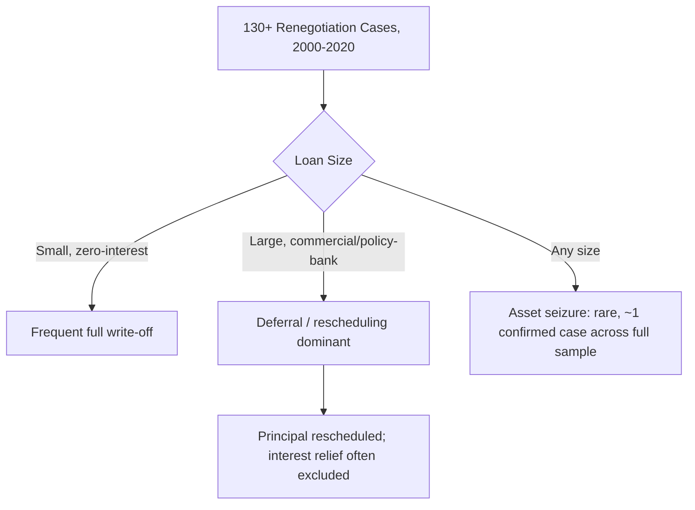

## Empirical Pushback on Debt-Trap Diplomacy: Renegotiation and Write-Off Patterns

### Why Renegotiation Data Is the Decisive Test

Recall that the debt-trap diplomacy thesis, as formulated by Brahma Chellaney in 2017, rests on a specific causal claim: that when a borrower defaults on Chinese lending, Beijing's characteristic response is to convert the resulting leverage into control of strategic physical assets rather than pursue conventional debt relief. This is an empirically testable proposition, and unlike single-case reasoning from Hambantota, it is best evaluated against a large sample of actual renegotiation outcomes rather than one illustrative transaction. This item surveys the principal quantitative studies of Chinese sovereign debt renegotiation behavior and the outcome patterns they document.

### The Rhodium Group Baseline Study (2019)

The most influential empirical test of the debt-trap thesis was conducted by Rhodium Group, an independent New York-based research firm, which in April 2019 published a review of 40 cases of Chinese external debt renegotiation spanning 24 countries in Asia, Africa, and Latin America between 2007 and 2019. The study's design directly targets the thesis's central mechanism claim: rather than accepting or rejecting the debt-trap narrative on the basis of a single case, the researchers systematically coded renegotiation outcomes across a much larger sample to test whether a pattern of debt-forgiveness-for-asset-transfer actually exists.

The finding was unambiguous on the narrow question of asset seizure: among the 40 cases reviewed, researchers found only one confirmed case of asset seizure, occurring in Sri Lanka. The study's authors further qualified even this single instance — asset seizures were characterized as by far the exception, and even in cases where an acquisition of assets did occur, it was often difficult to establish that the acquisition was directly linked to the debt renegotiation process itself, rather than being a separate commercial transaction (a distinction directly consistent with the Hambantota case mechanics, where the port lease was contractually and temporally distinct from the underlying, still-serviced Eximbank construction loans).

On the broader question of what Chinese renegotiations *do* typically produce, the study identified three recurring patterns, and found that Beijing's leverage in negotiations was in fact comparatively limited relative to the debt-trap thesis's assumption of Chinese negotiating dominance:

| Outcome type | Rhodium 2019 characterization |
| --- | --- |
| Debt forgiveness / write-off | Most common outcome in the 40-case sample |
| Term extension / rescheduling | Frequent; extends maturities and grace periods |
| Explicit refinancing | Occurs where the borrower retains market access |
| Asset seizure | One confirmed case (Sri Lanka) out of 40 |

The study also found that outcomes tended to favor the borrower more where the borrowing country retained access to alternative sources of financing — a finding consistent with a standard bargaining-power model of sovereign debt renegotiation generally, rather than with a model in which China uniquely engineers borrower dependency.

### The 2020 Expansion and COVID-19-Era Confirmation

Rhodium subsequently expanded its dataset to more than 130 cases spanning 2000 through September 2020, incorporating the sharp rise in renegotiation demand triggered by the pandemic — the firm identified at least 18 distinct renegotiation processes with China in 2020 alone, with 12 countries still in active talks as of that September, covering a combined $28 billion in Chinese loans. This larger, more recent sample reinforced rather than overturned the original finding on the size-dependent structure of Chinese renegotiation outcomes: for large loans specifically, both debt cancellation and asset seizure were found to be unlikely outcomes, with debt write-offs almost always limited to small, zero-interest loans, while for large commercial and quasi-commercial loans the study continued to find very limited evidence that China's policy banks had cancelled debt in exchange for control of strategic assets. The modal outcome for large-loan distress, per this expanded dataset, was **deferral** — rescheduling of principal repayment, sometimes without corresponding relief on interest — aligned in form with the G20's contemporaneous Debt Service Suspension Initiative (DSSI), though Rhodium noted this Chinese approach remained partial, non-standardized, and comparatively opaque relative to multilateral or Paris Club practice.

### The Africa-Specific Evidence: CARI Database

A parallel and independently constructed body of evidence comes from the China-Africa Research Initiative (CARI) at Johns Hopkins SAIS, led by Deborah Brautigam, whose contract-archive research program compiled a database of more than 1,000 individual Chinese loans to African governments and state entities. This database was examined specifically for evidence of the debt-trap thesis's second core claim — that China leverages debt distress to extract concessions, typically asset or resource transfers. The CARI dataset produced no cases providing clear evidence of debt being leveraged specifically to extract concessions from an African borrower, a finding independently convergent with the Rhodium Group's global result despite differing geographic scope, data sources, and research teams — a convergence that strengthens the evidentiary weight of both findings beyond what either study alone would support.

The associated SAIS-CARI working paper on "Debt Relief with Chinese Characteristics" characterized the typical Chinese institutional response to African borrower distress as case-by-case accommodation rather than confrontation: when debt distress occurs, Chinese lenders have not pursued formal asset seizure, and — as of that research — no cases in Africa had involved international arbitration or court proceedings between Chinese creditors and African sovereign borrowers. The paper documented debt write-offs as the single most common outcome of a completed renegotiation, with most restructurings simply extending repayment periods; in at least one case (the Republic of Congo), the borrower itself proposed and executed a conversion of a major infrastructure loan into a public-private toll-road partnership — an outcome initiated by the borrower to generate project-linked revenue, rather than a creditor-imposed asset transfer.

### The Post-Zambia Test: Does Common Framework Experience Change the Picture?

The empirical pushback literature substantially predates the more recent and more consequential test of Chinese renegotiation behavior: participation in the G20 Common Framework for Debt Treatment, the multilateral mechanism launched in 2020 to coordinate restructuring among official bilateral creditors including non-Paris-Club members. Zambia's case, as the first sovereign to request treatment under the framework in early 2021, is the most-studied instance and offers a useful corrective to any reading of the earlier Rhodium/CARI findings as showing Chinese renegotiation to be *straightforward*.

China, as Zambia's largest single bilateral creditor, did ultimately join the official creditor committee and participate in restructuring negotiations covering roughly $17 billion in external debt — consistent with the broader finding that Chinese creditors do engage in cooperative restructuring rather than pursuing asset extraction. However, the process took more than three and a half years to complete, a duration a May 2026 Center for Global Development working paper attributes in substantial part to structural weaknesses in the Common Framework mechanism itself rather than to Chinese obstruction alone — friction also arose from disputes over comparability-of-treatment standards between official bilateral creditors and private bondholders. Zambia's own debt-management officials described the practical experience of being caught between China, as the largest creditor, and bondholders who disagreed on what constituted genuinely "comparable" relief, with delays and a lack of transparency cited as recurring complaints across Zambia, Ghana, and Ethiopia's parallel Common Framework cases.

The synthesis relevant to a borrower-side debt manager: the post-2020 Common Framework evidence is **consistent with, not contradictory to**, the earlier Rhodium and CARI findings on the narrow question of asset seizure (no case has involved Chinese asset extraction through the Framework), but it substantially complicates the more optimistic framing of Chinese renegotiation as fast or straightforward. The empirically supported conclusion is therefore two-sided: the debt-trap thesis's asset-extraction mechanism remains empirically unsupported across three independent, convergent datasets (Rhodium 2019, Rhodium 2020, CARI); but the thesis's underlying concern about the *practical burden* of Chinese debt distress on borrower states is partially vindicated — not through asset loss, but through multi-year restructuring delays, opacity, and comparability disputes that impose real fiscal and macroeconomic costs on the borrower during the negotiation period itself.

### Interpretation for Borrower-Side Debt Management

**Key Points**

- Across the largest available samples (40 cases in 2019, expanded to 130+ by 2020, and a separate 1,000+-loan African dataset), asset seizure following Chinese loan default is documented in essentially one case (Sri Lanka/Hambantota), and even that case is contested on causal-linkage grounds.
- The empirically dominant outcome of Chinese debt renegotiation is **write-off for small/zero-interest loans** and **deferral or rescheduling for large loans** — not confrontation or extraction.
- China's negotiating leverage, per the Rhodium studies, has proven more limited in practice than the debt-trap thesis assumes, particularly where the borrower retains access to alternative financing sources — a factor a finance ministry can treat as an actionable negotiating-position variable rather than a fixed constraint.
- The genuine, empirically supported borrower-side risk is **process risk** — multi-year delay, confidentiality-driven opacity, and comparability-of-treatment disputes with other creditor classes under the Common Framework — rather than asset-loss risk.
- A debt-management strategy should therefore weight preparation for a *long, opaque negotiation process* more heavily than preparation against *outright asset confiscation*, since the empirical record supports the former risk far more strongly than the latter.

### Related Topics

- The "debt-trap diplomacy" thesis and its central claims (theoretical framing this item empirically tests)
- Belt and Road Initiative lending structures and collateralized finance (contract mechanics underlying renegotiation leverage)
- G20 Common Framework for Debt Treatment: design, participants, and structural critique
- Debt Service Suspension Initiative (DSSI) and its treatment of Chinese state-owned lenders
- Comparability-of-treatment principle in multilateral versus bilateral versus private-creditor coordination
- China-Africa Research Initiative (CARI) contract-archive methodology
- Zambia's 2020–2024 sovereign default and restructuring as a Common Framework case study