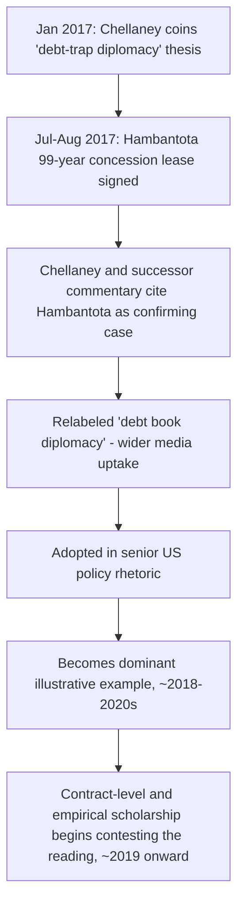

## The Hambantota Port Narrative and Its Contested Evidentiary Basis

### Why This Item Is Distinct from the Prior Treatments

This item is not a repetition of the transaction mechanics already established for the Belt and Road Initiative lending structures and collateralized finance item, nor of the general debt-trap-thesis debate. Its scope is narrower and more specific: **how the Hambantota narrative was constructed, propagated, and subsequently contested as a matter of evidence** — the historiography of the case itself, treated as an object of study for a public finance official who must be able to distinguish a well-evidenced sovereign-risk lesson from a politically useful but imprecise shorthand.

### Construction of the Narrative

Recall that debt-trap diplomacy, as a formal thesis, was first articulated by Brahma Chellaney in a January 2017 essay — published several months *before* the Hambantota concession agreement was signed in July–August 2017. The narrative's construction therefore followed an unusual sequence: the theoretical framework preceded its own signature case, and the port lease was subsequently read into the pre-existing thesis as confirming evidence, rather than the thesis being derived inductively from the Hambantota facts. Chellaney himself explicitly invoked the port transaction shortly after it closed as the clearest illustration of his prior claim, cementing the association in policy and media discourse.

From there, propagation followed a well-documented path. Two Harvard graduate students republished and extended Chellaney's framing under the label "debt book diplomacy," a rebranding that broadened media uptake. The narrative was subsequently adopted at the highest levels of Western policy discourse — invoked by senior U.S. officials, including in later remarks from the U.S. Secretary of State characterizing Chinese lending as designed to leave developing countries "trapped in debt" — and by 2020s commentary the Hambantota case had become, in the words of one Singapore-based regional-security analysis, "something approaching conventional wisdom," particularly within Washington policy circles. A 2025 bibliometric estimate cited in the academic literature on the topic notes that a search for the phrase returned on the order of two million results, indicative of the narrative's scale of diffusion well beyond specialist debt-policy audiences into general foreign-affairs commentary.

### The Contested Facts: What the Underlying Documents Show

The evidentiary challenge to the narrative rests on public record documents that were, in principle, always available but were not centrally engaged by the narrative's early proponents: the 2017 Cabinet Memorandum authorizing the concession, the Hong Kong Exchange disclosure filing by China Merchants Port Holdings (as a publicly listed entity, CM Port was required to disclose the transaction's material terms), and the separate loan agreements with China Eximbank for the port's original 2007 and 2012 construction phases. Cross-referencing these documents against the popular narrative surfaces three specific factual discrepancies.

**Discrepancy one: the transaction was a lease, not a debt cancellation.** The 2017 agreement leased a 70% operating stake in the port to China Merchants Port Holdings for 99 years in exchange for $1.12 billion in fresh equity investment. The China Eximbank loans that financed the port's original construction were not cancelled, forgiven, or renegotiated as part of this transaction — responsibility for their repayment was administratively transferred from the Sri Lanka Ports Authority to the General Treasury, and debt service continued on the original terms. The popular "China seized the port because Sri Lanka couldn't repay the loan that built it" formulation conflates two legally and temporally distinct instruments: a construction loan still being serviced, and a separate equity-lease transaction generating new liquidity.

**Discrepancy two: the "debt-for-equity swap" label does not match the accounting.** Because the Treasury was simultaneously identified as recipient of the $974 million cash portion of CM Port's investment and as the party newly responsible for continued Eximbank debt service, several media outlets characterized the transaction as a debt-for-equity swap — a term with a specific technical meaning (cancellation of a debt claim in direct exchange for an equity stake in the debtor). Scholarly review of the actual mechanics has directly disputed the applicability of this label: this reading is disputed on the grounds that it cannot be interpreted as a debt-equity swap, since there was no cancellation of debt in the transaction — the correct characterization is a concurrent but legally separate equity monetization used to generate foreign-exchange liquidity, some of which the borrower could then apply toward *any* of its external obligations, not specifically or exclusively the port debt.

**Discrepancy three: the magnitude of Chinese exposure relative to Sri Lanka's total external debt.** The narrative's implicit causal claim — that Chinese lending was the proximate driver of Sri Lanka's fiscal distress — is difficult to reconcile with the composition of Sri Lanka's external liabilities at the relevant time: Chinese loans constituted only about 9% of Sri Lanka's total government debt as of 2016, with the Hambantota-specific loans representing roughly 4.8%. Sri Lanka's dominant external exposure was to international capital markets, on terms shaped by the global monetary cycle — debt that had been issued cheaply during the post-2008 quantitative-easing period and became substantially more expensive to service and roll over once the U.S. Federal Reserve began tapering asset purchases from 2013 onward. Sri Lanka's eventual 2022 sovereign default occurred against this broader debt structure, five years after the Hambantota lease and driven by a balance-of-payments and fiscal crisis with causes substantially independent of the 2017 transaction.

### Table: Popular Narrative Claim versus Documentary Record

| Popular narrative element | Documentary/contract-level finding |
| --- | --- |
| "China seized the port over unpaid construction debt" | Construction loans remained current and were not in default at the time of the 2017 lease |
| "Debt-for-equity swap" | No debt cancellation occurred; loans continued to be serviced by the Treasury post-transaction |
| "China orchestrated Sri Lanka's dependency" | Chinese debt was a small share (~9%) of Sri Lanka's total external liabilities; the SLPA and Sri Lankan government actively solicited the original project and later proposed the equity-lease solution |
| "Case proves systematic Chinese asset-extraction strategy" | Broader 40-case (Rhodium 2019) and 130-case (Rhodium 2020) renegotiation datasets find only this one confirmed instance of an asset-linked outcome, and dispute whether it is properly characterized as debt-linked at all |

### Why the Case Nonetheless Retains Genuine Analytical Value

Contesting the narrative's causal framing does not mean the case carries no lessons; it means the *correct* lessons differ from the popularized ones, and a finance ministry should extract the former rather than the latter.

The case remains a legitimate and well-documented illustration of: (1) the fiscal-space logic and sovereignty trade-offs of **equity monetization of strategic infrastructure** as a balance-of-payments tool — a technique with real governance costs (an Oversight Committee arrangement was negotiated specifically to manage security-sovereignty concerns around the leased port) independent of any debt-trap framing; (2) the risks of proceeding with a large-scale infrastructure project whose own revenue generation proves insufficient to support its financing, regardless of creditor identity — the port's chronic commercial underperformance after 2010 opening, not Chinese lending terms per se, created the pressure that made an equity-monetization solution necessary in the first place; and (3) the general vulnerability of small open economies with concentrated capital-market exposure to global monetary-policy cycles, a lesson with far broader applicability than China-specific lending and one the narrative's China-centric framing tends to obscure.

**Key Points**

- The Hambantota narrative preceded, rather than derived from, its own signature case — the debt-trap thesis was published before the concession agreement it is now used to illustrate.
- Primary-source documents (Cabinet Memorandum, HKEX disclosure, original loan agreements) support a "concurrent equity lease alongside continued debt service" reading, not a "debt-for-equity swap following default" reading.
- Chinese lending's small share of Sri Lanka's total external debt at the relevant time weakens the case for treating Hambantota as the proximate cause of Sri Lanka's broader debt trajectory.
- The case's durable, well-evidenced lesson is about **infrastructure project revenue risk and equity-monetization mechanics**, not about a documented Chinese asset-seizure strategy — a distinction a borrower-side debt manager should draw explicitly when this case is invoked in domestic policy debate.

### Related Topics

- The "debt-trap diplomacy" thesis and its central claims
- Empirical pushback on debt-trap diplomacy: renegotiation and write-off patterns
- Belt and Road Initiative lending structures and collateralized finance
- Sovereign asset monetization (leases, concessions) as a fiscal-space tool
- Sri Lanka's 2022 sovereign default: causal decomposition of external creditor exposure
- Public-private partnership structuring for underperforming state infrastructure assets