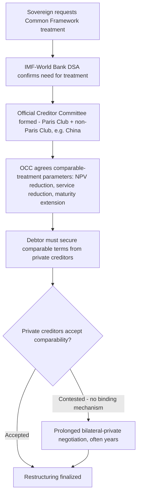

## Non-Paris Club Creditor Coordination in Zambia, Ghana, and Ethiopia

### The Coordination Problem: Why a New Mechanism Was Needed

Recall that a debt sustainability analysis (DSA) projects a sovereign's debt-to-GDP and debt-service trajectory under baseline and stress scenarios to assess repayment capacity; when a DSA indicates unsustainability, resolution requires coordinated relief across a borrower's creditor base. For most of the postwar period, this coordination occurred primarily through the **Paris Club**, an informal group of major creditor governments that negotiates restructuring terms collectively with a distressed sovereign and applies a shared set of principles, chief among them **comparability of treatment** — the requirement that a debtor extend to *all* other creditor classes relief terms at least as favorable as those agreed with the lead creditor group, so that no class of creditor is made better off by free-riding on another's concessions.

The Paris Club's institutional design assumed a creditor landscape it no longer describes. China — not a Paris Club member — became Africa's largest single bilateral lender during the 2010s, while international bond markets simultaneously grew to hold a large and rising share of low-income sovereign external debt. By the 2020s, a typical distressed low-income borrower's creditor base included Paris Club bilateral creditors, non-Paris-Club bilateral creditors (principally China, but also others), multilateral development banks, and a fragmented private creditor base of bondholders, commercial banks, and hedge funds — none of which any single existing mechanism had authority to coordinate.

The **G20 Common Framework for Debt Treatments beyond the DSSI** ("Common Framework," or CF) was created in November 2020 specifically to close this gap: a G20-sponsored process bringing non-Paris-Club official creditors (China foremost) into the same coordination structure as Paris Club members, with private creditors required — under the comparability-of-treatment principle — to match the terms official creditors agree to, though the Framework has no binding mechanism to compel private-creditor participation, which has proven to be its central structural weakness. As of 2025, only four countries have used the Common Framework: Chad (the first applicant, January 2021), Zambia (February 2021), Ethiopia (2021), and Ghana (the most recent applicant, December 2022) — and no country that has applied under the Common Framework has finalized its debt restructuring in its entirety, a fact that itself is significant evidence for evaluating the mechanism's practical effectiveness.

### Zambia: The First and Most Protracted Test Case

Zambia requested Common Framework treatment in February 2021 following its November 2020 default — the first sovereign default of the pandemic era, with debt reaching over 120% of GDP. As China's largest African bilateral-debt exposure at the time, Zambia's case became the Framework's foundational test of whether non-Paris-Club coordination could actually function.

The process took more than three and a half years: despite Zambia's cooperative posture throughout, a Memorandum of Understanding with official bilateral creditors was not signed until April 2024, some 38 months after the initial request. A 2023 bilateral agreement saw Chinese creditors reschedule $6.3 billion of Zambian debt over more than 20 years with a three-year grace period — a genuine, substantial restructuring consistent with the general finding, established in the broader empirical literature on Chinese renegotiation behavior, that Beijing's characteristic response to distress is deferral rather than confrontation. However, it was not until 2024 that even a preliminary agreement could be reached with Zambia's private bondholders, and the deal that finally concluded made Zambia the first country to complete a restructuring under the Common Framework architecture, closing out more than three years of default.

The principal source of delay was not Chinese intransigence in isolation but **inter-creditor equity disputes** — specifically, a perceived zero-sum contest between bondholders and Chinese official creditors over which class would bear the larger share of relief, compounded by contested definitions of what "comparability of treatment" actually required in practice. Analysis of the concluded deal found that bondholders and bilateral (largely Chinese) creditors were not, in fact, repaid on equivalent terms in the Zambia case — a finding with direct relevance to whether the comparability principle functioned as designed, or whether one creditor class in practice bore disproportionate relief.

### Ghana: A Comparatively Faster, Bondholder-Dominated Case

Ghana applied for Common Framework treatment in December 2022 and reached agreement with its Official Creditor Committee by January 2024 — a materially faster timeline than Zambia's, though still leaving roughly 7% of affected external commercial debt unresolved as negotiations continued to seek comparability-consistent terms with holdout commercial lenders. Ghana's creditor structure differed from Zambia's in a way directly relevant to why its process moved faster: private bondholders held the dominant share of Ghana's external debt (as of 2022, private creditors accounted for roughly $16.9 billion of Ghana's external debt, substantially exceeding its multilateral and bilateral shares), meaning the Zambia-style bilateral-versus-bondholder standoff was structurally less central to the Ghana negotiation, even though bondholder coordination itself remained a significant undertaking — Ghana was, as of the restructuring's later stages, in formal talks with holders of more than $13 billion in international bonds.

Comparative analysis of the two concluded deals found a meaningful divergence in outcome equity: in Ghana, bondholders and bilateral creditors ended up being repaid broadly similar amounts, in contrast to the more lopsided Zambia outcome — evidence that the comparability-of-treatment principle, while formally identical across cases, has produced materially different real-world burden-sharing depending on each country's specific creditor composition and negotiating dynamics, rather than functioning as a uniform, predictable rule.

### Ethiopia: The Unresolved Case

Ethiopia's Common Framework request, also dating to 2021, remained substantially unresolved as of the most current reporting: while Ethiopia reached an initial agreement, persistent financing gaps under its IMF-backed program continued until rising oil revenues reduced those gaps sufficiently for creditors to move toward closing the process around January 2025 — but full finalization has continued to lag behind both Zambia's and Ghana's cases, with commentary describing Ethiopia's situation as an extended stalemate. Distinct from Zambia and Ghana, aggregate debt-relief analysis published in 2025 found that of the actual relief delivered across the four Common Framework cases to date, the overwhelming majority went to Ghana and Zambia specifically, while Ethiopia and Chad saw comparatively little realized relief despite years in the process — underscoring that Common Framework "participation" and Common Framework "resolution" are meaningfully different states, with a country's case able to remain formally active for years without delivering the debt-service relief its DSA indicated was necessary.

### Table: Comparative Common Framework Outcomes (as of 2026)

| Country | CF request date | OCC/bilateral agreement | Private-creditor resolution | Relative creditor structure |
| --- | --- | --- | --- | --- |
| Zambia | February 2021 | April 2024 (38 months) | 2024, following prolonged dispute | China-dominated bilateral exposure; bondholder relief ultimately smaller than bilateral relief |
| Ghana | December 2022 | January 2024 (~13 months) | Largely resolved; ~7% of commercial debt still in talks | Bondholder-dominated exposure; bilateral and bondholder relief broadly comparable |
| Ethiopia | 2021 | Partial; still incomplete as of 2025–2026 | Unresolved | Extended stalemate; among the lowest realized relief of the four CF cases |
| Chad | January 2021 (first applicant) | Reached agreement, but complex, contested case | Limited | Among the lowest realized relief of the four CF cases |

### Structural Lessons for a Borrower-State Debt Manager

The cross-case comparison yields findings a finance ministry contemplating Common Framework application, or currently negotiating bilateral terms with a non-Paris-Club creditor, should weigh directly.

**Creditor-structure composition predicts negotiation duration more than any single creditor's behavior.** Ghana's comparatively faster resolution correlates with its bondholder-dominated debt structure, while Zambia's more protracted timeline correlates with its more even split between Chinese bilateral and bondholder exposure — suggesting that a more concentrated, single-dominant-creditor-class structure may in practice be easier to coordinate than a genuinely mixed one, independent of any individual creditor's negotiating posture.

**"Comparability of treatment" is a principle, not a formula, and its real-world application varies by case.** Official creditors have generally favored maturity extensions with limited principal reduction, while private creditors have tended to prefer upfront cash recovery — a structural mismatch in preferred relief *form* that persists across cases and that no current version of the Framework fully resolves, since there is no standardized methodology mandating a specific split.

**Framework participation carries its own opportunity cost.** With average sub-Saharan African public debt-to-GDP rising from roughly 30% of GDP at the end of 2013 to nearly 60% by end-2024, and interest-payment-to-revenue ratios more than doubling over the same period, a multi-year Common Framework process — Zambia's 38 months, Ethiopia's still-unresolved multi-year stalemate — imposes real fiscal costs through continued debt-service uncertainty and constrained market access during the negotiation window itself, independent of the eventual settlement terms.

**Key Points**

- The Common Framework was created specifically because the Paris Club's comparability-of-treatment model had no mechanism for coordinating non-Paris-Club official creditors, chiefly China, alongside a growing private bondholder base.
- Of four applicant countries (Chad, Zambia, Ethiopia, Ghana), only Zambia and Ghana have reached substantially complete restructurings as of 2026; none has been fully finalized end-to-end, and Ethiopia and Chad have received comparatively little realized relief.
- Chinese bilateral creditors have, in both concluded cases, agreed to substantial rescheduling (Zambia's $6.3 billion over 20+ years) — consistent with the broader empirical pattern of Chinese preference for deferral over confrontation — but the surrounding multi-creditor coordination process, not Chinese bilateral terms in isolation, has been the primary source of delay.
- A country's creditor-composition mix (bondholder-dominated versus bilateral-dominated) is a strong predictor of negotiation duration and should factor into a finance ministry's own pre-distress debt-portfolio strategy, since a more homogeneous creditor base appears easier to coordinate under the current Framework design.

### Related Topics

- Empirical pushback on debt-trap diplomacy: renegotiation and write-off patterns
- Debt Sustainability Analysis (DSA) methodology under the IMF-World Bank Low-Income Country Debt Sustainability Framework
- Paris Club comparability-of-treatment principle: origins and erosion
- Collective action clauses in sovereign bond contracts as a private-creditor coordination tool
- Debt Service Suspension Initiative (DSSI) as the Common Framework's institutional predecessor
- Belt and Road Initiative lending structures and collateralized finance
- Proposed reforms to the G20 Common Framework: standardized comparability metrics and binding private-creditor participation