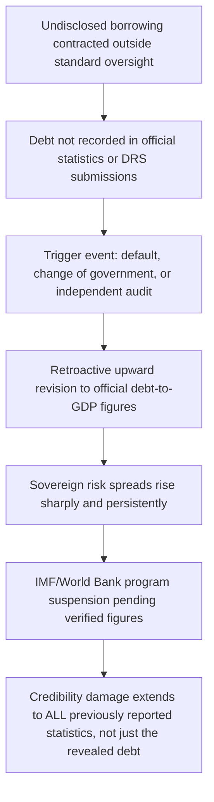

## Debt Transparency Initiatives and the Problem of Hidden Bilateral Debt

### Defining Hidden Debt and Why It Is Structurally Distinct from Ordinary Disclosure Lag

**Debt transparency** is the availability of comprehensive, detailed, timely, and consistent public-sector debt data, sufficient to let policymakers make informed decisions, creditors and rating agencies assess debt sustainability accurately, and citizens hold their own governments accountable. **Hidden debt**, the specific pathology this item addresses, is narrower than mere reporting lag: it refers to liabilities that were not disclosed at the time they were contracted and that later surface — typically through default, audit, or a change in government — forcing a retroactive upward revision to a country's official debt stock. The distinction matters analytically because ordinary disclosure lag is a capacity problem, addressable through technical assistance, while hidden debt frequently involves a governance or legal-authorization failure: liabilities contracted outside standard budget or parliamentary oversight processes, sometimes deliberately concealed from a country's own finance ministry, not merely from external creditors and multilateral trackers.

The scale of the problem is empirically substantial and not confined to weak-institution outliers. Systematic research tracking ex-post upward revisions to the World Bank's own external debt statistics — a methodology that treats each retroactive revision as a direct measure of previously hidden liability — finds that even countries with strong institutions and high statistical capacity underreport their debt, indicating the problem reflects structural incentives to obscure borrowing rather than simple technical incapacity alone.

### Canonical Case: Mozambique's "Tuna Bonds"

Recall that a hidden-debt episode differs from ordinary sovereign default in that the crisis trigger is the *revelation* of previously unknown liabilities, not merely an inability to service known ones. Mozambique's 2016 "tuna bond" episode remains the reference case in the transparency literature for this reason.

Between 2009 and 2014, Mozambican state-owned enterprises contracted loans — publicly disclosed at the time as financing for a tuna-fishing fleet and related maritime-security infrastructure — that were backed by undisclosed sovereign guarantees issued by the government without the scrutiny of the Ministry of Finance or oversight by Parliament. In 2016, when the government defaulted, the scale of the concealment became clear: a total of $2.2 billion in previously hidden loans was uncovered, of which subsequent investigation attributed at least $200 million to bribes and kickbacks paid to bankers and Mozambican officials, while the underlying fishing and security projects largely failed to materialize. The revelation involved roughly 9% of GDP in previously undisclosed non-concessional borrowing, and its disclosure coincided with a sharp rise in Mozambique's sovereign borrowing costs, prompting the IMF and World Bank to freeze support and triggering a currency collapse and a debt crisis that forced deep cuts to public spending, with the burden falling disproportionately on the country's poorest citizens.

The Mozambique case established the now-standard empirical finding in the transparency literature: **when previously undisclosed liabilities become public, sovereign risk spreads rise materially and persistently**, consistent with markets rationally repricing not just the newly revealed debt itself but their confidence in the accuracy of *all* of that borrower's previously reported figures — a contagion effect within a single sovereign's own credibility, distinct from cross-country contagion.

### A Current Parallel Case: Senegal (2025)

The Mozambique pattern is not a historical curiosity; a materially similar episode recurred in Senegal in 2025, illustrating that the underlying governance vulnerability persists even in a G20-monitored transparency era. Concerns that Senegal's actual debt stock was larger than previously reported led to the suspension of its IMF credit facility in late 2024; a subsequent government audit, released in February 2025, produced abrupt revisions to Senegal's previously reported fiscal position, placing end-2023 central government debt at 111% of GDP, up from a previously reported 73.8%, with the 2023 fiscal deficit also revised sharply upward. This scale of revision — roughly 37 percentage points of GDP — is comparable in magnitude to Mozambique's episode and, cross-referenced against a comparative dataset of seven major hidden-debt revelations (spanning Mozambique 2016, Pakistan 2021, Senegal 2025, Türkiye 2005, and Zambia 2013, among others), confirms that debt-stock revisions of this scale are a recurring rather than isolated phenomenon across very different country contexts and time periods.

### Structural Drivers: Why Hidden Debt Recurs Despite Disclosure Requirements

The transparency literature identifies several recurring, non-mutually-exclusive drivers, distinct from simple malfeasance, that a finance ministry should recognize as systemic risk factors in its own institutional design.

**Non-central-government borrowing outside consolidated reporting.** A large share of hidden-debt episodes, including Mozambique's, involve liabilities contracted by state-owned enterprises or sub-national entities with sovereign guarantees that were never routed through the central debt-management office's standard recording process — meaning the debt was not so much actively concealed from *all* parties as it was simply never captured by the institutional channel designed to track it.

**Strategic non-disclosure to preserve future credit access.** Separately from institutional-capacity failures, some governments have been found to intentionally underreport specific repayment obligations — particularly to non-traditional bilateral lenders — out of concern that full disclosure would adversely affect the availability or cost of future credit, a rational-but-corrosive incentive structure in which transparency and near-term financing access are perceived to trade off against each other.

**Collateralized and confidentiality-bound instruments.** As established in the treatment of Belt and Road Initiative collateralized lending, confidentiality clauses attached to escrow-account and collateral agreements structurally impede a ministry's own consolidated reporting, independent of intent — a lender's contractual requirement for secrecy can produce the same statistical opacity as deliberate borrower-side concealment.

**Asymmetric statistical capacity across creditor types.** More than twenty developing countries publish no sovereign debt data at all, and where data is published it frequently fails to meet international coverage and definitional standards; research on the drivers of transparency variation finds that debt transparency is measurably fostered by standardized recording systems, high external scrutiny (such as Eurobond issuance and credit-rating processes, which impose disclosure discipline as a market precondition), and the presence of highly skilled debt-office staff — implying that transparency is not merely a matter of political will but is causally linked to institutional design choices a finance ministry can directly influence.

### The Institutional Transparency Architecture

**The World Bank's Debtor Reporting System (DRS)**, established in 1951, is the foundational global mechanism: World Bank borrowing or guaranteeing member countries are required, under the Bank's "External Debt Reporting and Financial Statements" policy (amended 2005), to provide detailed, loan-by-loan data on long-term external public and publicly guaranteed debt. DRS submissions underpin the Bank's annual International Debt Report and its public International Debt Statistics database, and have been the primary global data infrastructure against which hidden-debt revelations are ultimately measured, since a revelation is definitionally an ex-post correction to a prior DRS-derived figure.

**The Debt Service Suspension Initiative (DSSI)**, launched by the G20 in April 2020 to provide pandemic-era relief to low-income countries, functioned as an unplanned transparency-forcing mechanism: because DSSI required detailed and timely public disclosure of debt-service payments eligible for deferral, participation itself compelled a level of loan-by-loan disclosure that some participating governments had not previously undertaken, illustrating how conditionality tied to financial benefit has proven more effective at inducing disclosure than voluntary transparency norms alone.

**AidData's Tracking Underreported Financial Flows (TUFF) methodology**, first developed and refined since 2015, addresses a specific gap in the DRS/DSSI architecture: non-traditional bilateral creditors, chiefly China, do not participate in DRS or other global reporting systems on a comparable basis, so a large share of their overseas lending would otherwise be invisible in mainstream debt statistics entirely. TUFF is an open-source data-collection methodology that systematically scrapes project-level financing information from an expanding universe of repositories — aid-information management systems, economic and commercial counselor websites, and academic sources — to reconstruct a picture of Chinese overseas lending independent of the lender's own disclosure. AidData's resulting datasets, cross-validated against the Horn-Reinhart-Trebesch "How China Lends" research program, arrived at a convergent and often-cited estimate that roughly half of China's overseas lending to the developing world is effectively "hidden" from standard multilateral debt-tracking systems — not necessarily concealed by the *borrower*, but simply absent from the reporting architecture such systems rely on.

**The World Bank's 2025 "Radical [Debt] Transparency" report and the 2026 DRS upgrade** represent the most recent institutional response, and mark a shift from voluntary-disclosure norms toward more binding instrument-level requirements. The report calls for full disclosure of lending terms, stronger national oversight specifically of collateralized and non-market-based debt instruments, and improved tools for international financial institutions to detect misreporting, alongside a direct appeal for creditors to open their own loan and guarantee books and engage in joint data-reconciliation exercises with borrowers. Consistent with this agenda, an upgraded DRS reporting framework is scheduled to launch in 2026, compelling both debtors and creditors to disclose more granular information, including on collateralization and restructuring-agreement terms specifically — a direct institutional response to the escrow-account opacity issues documented in Belt and Road Initiative lending. Progress to date has been measurable but partial: World Bank tracking found that the share of IDA-eligible countries publishing no debt data at all fell from roughly 40% in 2020 to approximately 20% by 2023, reflecting genuine gains, but leaving a substantial remaining gap even among the specific country group most exposed to debt-sustainability risk.

### Table: Transparency-Forcing Mechanisms Compared

| Mechanism | Primary lever | Key limitation |
| --- | --- | --- |
| DRS (est. 1951) | Mandatory borrower reporting as condition of World Bank relationship | Depends on borrower self-reporting; historically limited granularity on collateral terms |
| DSSI (2020) | Disclosure tied to concrete financial benefit (payment deferral) | One-time, pandemic-specific; not a permanent structural fix |
| AidData TUFF | Independent third-party reconstruction from public-domain sources | Cannot capture terms deliberately kept out of any public record |
| Eurobond/rating-driven disclosure | Market-imposed precondition for capital-market access | Only applies to countries with market access to begin with |
| 2026 DRS upgrade | Expanded mandatory granularity, including collateral/restructuring terms | Implementation and creditor-side compliance still pending as of 2026 |

### Practical Implications for a Finance Ministry's Own Debt-Management Practice

**Key Points**

- Hidden debt is measurably associated with subsequent sharp and persistent increases in sovereign borrowing costs upon revelation; the appropriate framing for a debt-management office is that non-disclosure is not risk-neutral even in the near term — it is a deferred, typically larger, credibility cost.
- The most consistent institutional drivers of stronger transparency are standardized reporting systems, high external market scrutiny, and skilled debt-office staffing — all within a finance ministry's direct control, distinguishing them from external factors like creditor cooperation.
- Non-central-government and state-owned-enterprise borrowing is a recurring blind spot across hidden-debt episodes; consolidating SOE and sub-national guarantee tracking into the central debt-management office's reporting perimeter is a concrete, high-value institutional safeguard.
- Confidentiality clauses in collateralized loan agreements, addressed at the contract level in the treatment of Belt and Road Initiative lending structures, are a specific and increasingly regulated subcategory of the broader hidden-debt problem, now directly targeted by the 2026 DRS reporting upgrade.
- A finance ministry negotiating any new loan agreement should treat a lender's insistence on broad confidentiality provisions as a transparency-policy red flag in its own right, independent of the loan's other commercial terms, given the demonstrated correlation between such clauses and subsequent hidden-debt revelations.

### Related Topics

- Belt and Road Initiative lending structures and collateralized finance (confidentiality clauses as a hidden-debt vector)
- Debt Sustainability Analysis (DSA) treatment of unreported and contingent liabilities
- Non-Paris Club creditor coordination in Zambia, Ghana, and Ethiopia
- Odious debt doctrine and its application to corruption-linked borrowing
- Sovereign credit ratings methodology and the market-discipline channel for disclosure
- State-owned enterprise fiscal risk and contingent-liability management