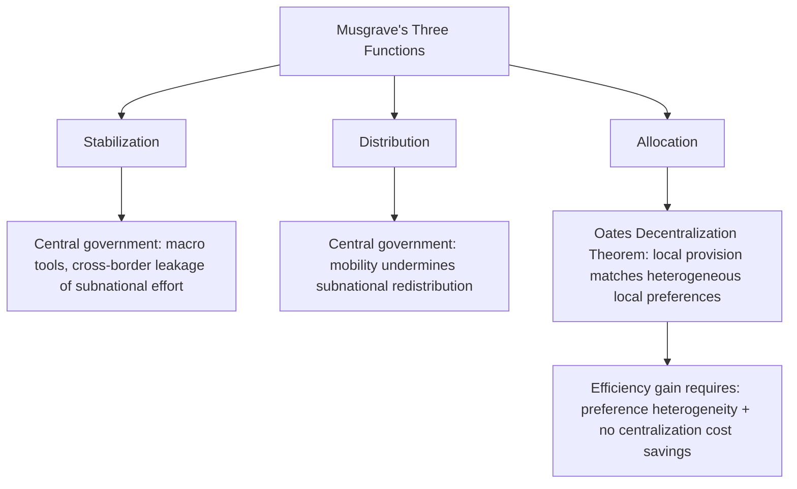

## Theories of Fiscal Decentralization and the Assignment of Taxing Powers

### The Core Analytical Problem: Vertical Structure of Public Finance

Fiscal federalism is the branch of public finance concerned with the allocation of expenditure responsibilities, taxing powers, and intergovernmental transfers across levels of government within a single sovereign state. The field's foundational question, distinct from the general theory of public goods provision, is not *whether* government should provide a given service but *at which level of government* — national, regional, or local — provision and financing should be assigned. **Fiscal decentralization** refers to the devolution of expenditure and/or revenue authority from central to subnational government; the degree and design of that devolution is what this item addresses, distinct from questions of transfer design or subnational borrowing treated elsewhere in this chapter.

### First-Generation Theory: The Normative Assignment Framework

The foundational normative framework, developed principally by Richard Musgrave and extended by Wallace Oates, treats the assignment problem as a matter of matching each of government's core functions to the level of government best positioned to perform it efficiently.

**Musgrave's three-function taxonomy** divides public-sector activity into stabilization, distribution, and allocation functions, and assigns each primarily to a different governmental tier based on that tier's structural capacity:

- **Stabilization** (macroeconomic demand management, countering business-cycle fluctuations) is assigned to the central government, because subnational governments generally lack monetary policy tools, cannot run sustained deficits without credit-market discipline in the way a currency-issuing sovereign can, and — critically — a subnational jurisdiction's own countercyclical spending leaks substantially to other jurisdictions through interregional trade, diluting its local stabilizing effect.
- **Distribution** (income redistribution, progressive taxation, social insurance) is likewise assigned predominantly to the central government, because redistributive policy pursued at the subnational level is vulnerable to a specific mobility problem: if one jurisdiction alone imposes highly progressive taxation or generous transfers, it risks attracting low-income beneficiaries and driving out high-income taxpayers who can relocate to escape the burden — a dynamic that erodes the subnational tax base and undermines the policy's own sustainability.
- **Allocation** (provision of public goods and services whose benefits and costs are geographically bounded) is the function for which decentralization has the strongest efficiency case, addressed directly by the **Decentralization Theorem**.

**Oates's Decentralization Theorem** (1972) formalizes the efficiency case for local provision of geographically bounded public goods: in the absence of cost savings from centralized provision and where a public good's consumption benefits are confined to subsets of the total population (a "local public good"), welfare is maximized, or at minimum never reduced, by having each jurisdiction provide the level of the good that matches its own residents' preferences, rather than having a central government impose a uniform national level of provision across heterogeneous jurisdictions. The theorem's welfare gain derives specifically from preference heterogeneity across jurisdictions combined with the assumption that local governments have better information about local preferences than the center does — an informational and matching argument, not an argument for decentralization independent of jurisdictional preference diversity.

$$W_{decentralized} \geq W_{centralized}$$

with strict inequality whenever jurisdictional preferences for the local public good differ and decentralized provision can be tailored to that heterogeneity without offsetting cost penalties.

### Second-Generation Theory: Political Economy and Incentive Constraints

First-generation theory assumes a benevolent social planner assigning functions to maximize welfare. **Second-generation fiscal federalism theory**, associated with Barry Weingast, Roger Gordon, and others from the 1990s onward, relaxes this assumption and instead models governments — central and subnational alike — as self-interested political actors subject to incentive constraints, asking not merely what assignment is *efficient* but what assignment is *incentive-compatible* given realistic political behavior.

Central contributions include **market-preserving federalism** (Weingast), which argues that a specific institutional configuration — subnational governments with primary regulatory authority over their own economies, a common market preventing subnational governments from erecting trade barriers against each other, and hard budget constraints preventing subnational governments from expecting central bailout of their debts — creates durable incentives for subnational governments to pursue growth-promoting policy, because they bear the fiscal consequences of poor policy choices directly rather than being able to externalize those costs to the center. The companion concept of the **hard budget constraint** is central to this literature precisely because its absence — the expectation of central bailout — generates a specific and well-documented pathology: subnational governments over-borrow or under-tax because they anticipate the center will absorb the consequences of fiscal distress, a dynamic sometimes termed the "soft budget constraint problem" and treated at length in this chapter's subsequent items on subnational borrowing and bailout dynamics.

Second-generation theory also incorporates **fiscal illusion and accountability arguments**: decentralized taxation, particularly through taxes that are visible and directly borne by local residents (such as local property taxation), is argued to improve government accountability by tightening the link between a jurisdiction's spending decisions and the tax burden its own residents must bear to finance them — the **benefit principle** in its clearest institutional form, distinct from a fiscal-illusion critique of centrally-financed local spending, where residents may perceive local services as costless because the financing burden is diffused nationally.

### The Assignment of Taxing Powers: Principles

Building on this theoretical base, the public finance literature — most systematically developed in Musgrave's original framework and subsequently refined by Charles McLure and others — identifies a set of practical principles for assigning specific tax bases to specific levels of government, addressing the question of *which taxes*, not merely *how much revenue*, should be decentralized.

**Mobility of the tax base.** Taxes on highly mobile bases (corporate income, capital, and to a lesser extent labor income of highly skilled individuals) are best assigned to the central government, because subnational taxation of a mobile base invites the same erosion dynamic identified in the distribution-function assignment above: the taxed factor relocates to lower-tax jurisdictions, generating harmful **tax competition** — a race-to-the-bottom dynamic in which subnational governments underprice the true marginal cost of the mobile factor's use of local public services, in an effort to attract or retain the tax base, at the expense of adequate revenue generation. Taxes on immobile bases — real property being the paradigmatic case — are correspondingly well-suited to subnational, particularly local, assignment, since the tax base cannot flee the jurisdiction in response to the tax.

**Benefit-taxation correspondence.** Where a tax can be linked directly to the cost of a locally-provided service — user fees, motor-fuel taxes financing local road maintenance, property taxes financing local schools and public safety — subnational assignment strengthens the accountability mechanism described above and improves allocative efficiency by making local residents internalize the true cost of the services they consume.

**Administrative capacity and economies of scale in collection.** Certain tax bases (value-added tax being the standard example) exhibit substantial administrative economies of scale and are vulnerable to cascading or double-taxation problems if administered independently by multiple subnational jurisdictions within a single economic union — considerations that favor central administration, sometimes with subnational revenue-sharing, over genuinely decentralized VAT authority.

**Macroeconomic and stabilization considerations.** Taxes with a strong cyclical or macroeconomically sensitive base (corporate income tax, in particular) are better retained centrally both because of base mobility and because centralizing volatile revenue sources allows the central government to use them as automatic stabilizers and to pool cyclical risk across the entire national economy, a risk-pooling function individual subnational jurisdictions cannot replicate.

### Table: Standard Tax Assignment by Level (Normative Framework)

| Tax base | Recommended level | Primary rationale |
| --- | --- | --- |
| Corporate income tax | Central | Base mobility; macroeconomic stabilization function |
| Personal income tax (progressive) | Central, or central with limited subnational surcharge | Redistribution function; mobility of high earners |
| Value-added tax (VAT) | Central (or shared/harmonized) | Administrative economies of scale; cascading-tax risk under fragmented subnational administration |
| Real property tax | Local (subnational) | Immobile base; strong benefit-tax correspondence with local services |
| Natural resource royalties | Contested — varies by country; often shared or central with formula-based subnational transfer | Revenue volatility; potential for severe interregional inequity if resource-rich regions retain full local assignment |
| User fees and local excises | Local (subnational) | Direct benefit-tax correspondence; low mobility for services with local consumption point |

### Application: The Philippine Fiscal Decentralization Framework

The Philippines offers a concrete worked illustration of these principles under statutory design, governed primarily by the **Local Government Code of 1991** (Republic Act No. 7160), which assigned expenditure responsibilities for basic services — health, social welfare, agricultural extension, and local infrastructure — to provinces, cities, and municipalities, while granting local government units (LGUs) taxing authority limited largely to real property tax, local business taxes, and a narrow set of local fees and charges — a design consistent with the mobility and benefit-tax principles above, since these are precisely the tax bases theory identifies as suitable for local assignment. Major mobile and macroeconomically significant bases — income tax, VAT, corporate tax, tariffs — remained centrally assigned to the Bureau of Internal Revenue and Bureau of Customs.

The Philippine framework's most consequential departure from pure decentralization theory is its heavy reliance on the **Internal Revenue Allotment (IRA)**, now restructured and expanded following the Philippine Supreme Court's 2018 *Mandanas-Garcia* ruling into the broader **National Tax Allotment (NTA)**, which entitles LGUs to a constitutionally-mandated share of *all* national internal revenue tax collections, not merely internal revenue taxes as previously interpreted, substantially increasing the transfer-dependent share of LGU budgets relative to own-source revenue. This structure illustrates a common real-world tension with the theory surveyed above: while expenditure decentralization under the Local Government Code broadly follows the allocation-function efficiency logic of the Decentralization Theorem, the correspondingly limited scope of genuinely own-source, accountability-linked local taxation means many Philippine LGUs remain fiscally dependent on central transfers for the majority of their budgets — a gap between the *expenditure* decentralization the theory recommends and the *revenue* decentralization needed to sustain the accountability benefits second-generation theory attributes to locally-raised taxation. This transfer-versus-own-source-revenue tension, and its implications for subnational fiscal discipline, is developed further in this chapter's subsequent treatment of intergovernmental transfer design.

### Key Points

**Key Points**

- First-generation theory (Musgrave, Oates) provides the efficiency rationale for decentralization, grounded in matching function to governmental tier and in the Decentralization Theorem's preference-heterogeneity logic; it assumes benevolent government and does not by itself address incentive or accountability questions.
- Second-generation theory (Weingast, Gordon, and others) supplies the incentive-compatibility layer: decentralization's benefits depend on complementary institutional conditions — notably hard budget constraints and accountability-linked local taxation — without which decentralization can produce fiscal indiscipline rather than efficiency gains.
- The standard tax-assignment principles (base mobility, benefit-tax correspondence, administrative economies of scale, stabilization considerations) jointly explain why most functioning federal and decentralized-unitary systems assign mobile, macro-sensitive bases centrally and immobile, service-linked bases locally, rather than decentralizing taxation uniformly.
- A persistent real-world gap between theoretically ideal tax assignment and genuinely adequate subnational own-source revenue — as in the Philippine LGU case — produces heavy reliance on intergovernmental transfers, which carries its own fiscal-discipline and accountability implications distinct from the assignment question addressed in this item.

### Related Topics

- Intergovernmental transfer design: equalization grants, conditional versus unconditional transfers
- Subnational borrowing, hard budget constraints, and bailout expectations
- Tax competition and harmonization in federal and confederal systems
- The Mandanas-Garcia ruling and the Philippine National Tax Allotment framework
- Natural resource revenue sharing and the resource curse at the subnational level
- Local government creditworthiness and municipal bond market development