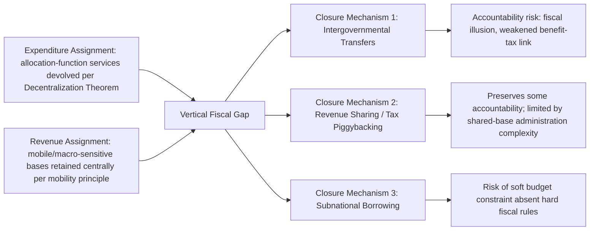

## Revenue Assignment versus Expenditure Assignment Across Levels of Government

### The Sequencing Question and Why It Matters

Recall that fiscal decentralization involves two analytically separable design choices: **expenditure assignment**, the allocation of spending responsibilities across governmental tiers, and **revenue assignment**, the allocation of taxing authority across those same tiers. The prior item in this chapter established the normative principles governing each assignment independently — the Decentralization Theorem for expenditure functions, base-mobility and benefit-correspondence principles for tax bases. This item addresses a distinct and more consequential question: **what happens, and what should happen, when the two assignments do not align** — a condition that is not an edge case but the empirically dominant pattern across nearly all decentralized fiscal systems.

### The Vertical Fiscal Gap: Definition and Universality

Sound fiscal-federalism design conventionally proceeds by assigning expenditure responsibilities first, on efficiency grounds, and only then asking how those responsibilities should be financed — a sequencing captured in the public finance maxim "finance follows function." The practical consequence of applying the tax-assignment principles from the prior item, however, is that subnational governments are typically left with a narrow, largely immobile-base revenue toolkit (principally property taxation, local fees, and limited local business taxation), while efficiency and macroeconomic considerations argue for keeping the largest and most elastic tax bases — income tax, VAT, corporate tax — centrally assigned. The result is a structural mismatch, formally termed the **vertical fiscal gap (VFG)**: the difference between a subnational government's expenditure responsibilities and its own-source revenue capacity, measured as own-source subnational revenue as a share of subnational expenditure, with the residual necessarily financed through intergovernmental transfers, subnational borrowing, or revenue-sharing arrangements.

$$VFG = E_{sub} - R_{sub}^{own}$$

where $E_{sub}$ is subnational expenditure and $R_{sub}^{own}$ is subnational own-source revenue; a positive gap is the empirically near-universal condition across decentralized systems, and its magnitude — not its existence — is the meaningful policy variable.

The vertical fiscal gap is not, on its own, a design failure. It follows directly and predictably from the efficient application of the assignment principles established in the prior item: if mobile and macro-sensitive tax bases are correctly retained centrally while geographically-bounded service provision is correctly decentralized to match local preferences, some gap is the mechanical and expected outcome, not evidence of poor institutional design. The policy question this item addresses is therefore not *whether* a gap should exist, but **how it should be closed**, and what closure mechanisms preserve versus undermine the efficiency and accountability gains the underlying assignment principles were meant to secure.

### Closure Mechanism One: Intergovernmental Transfers

The most common instrument for closing the vertical fiscal gap is the intergovernmental transfer, which itself divides into functionally distinct subtypes with different efficiency and accountability implications.

**Unconditional (general-purpose) transfers** — block grants or formula-based revenue shares with no spending restriction — preserve subnational budgetary autonomy over allocation decisions but, per the second-generation fiscal federalism theory established in the prior item, weaken the accountability link between local spending and local tax burden: because the marginal source of financing for an additional unit of local spending is a transfer rather than local taxation, residents face a diluted incentive to monitor spending efficiency, a phenomenon termed **fiscal illusion** — the perception that locally-consumed public services are cheaper than their true resource cost, because the financing burden is diffused across the national tax base rather than borne visibly by the local electorate.

**Conditional (earmarked) transfers** — grants tied to specific expenditure categories, sometimes with matching requirements — address a different problem: they allow the central government to correct for interjurisdictional **spillovers**, cases where a locally-provided service (public health, for instance) generates benefits that spill beyond the providing jurisdiction's borders, such that a purely locally-financed level of provision would be systematically under-supplied relative to the nationally efficient level, since local decision-makers do not internalize the external benefit accruing to neighboring jurisdictions. Matching conditional grants directly correct this externality by lowering the local marginal cost of provision in proportion to the spillover.

**Equalization transfers** — formula-based grants designed to offset differences in subnational fiscal capacity (tax base per capita) or expenditure need (cost of service provision, often elevated in sparsely populated or geographically difficult jurisdictions) — address the **horizontal fiscal imbalance** problem: even where the vertical gap is closed on average, jurisdictions with weaker tax bases or higher service-delivery costs remain unable to provide comparable service levels at comparable tax rates without additional equalizing transfers, a distinct problem from the vertical gap and requiring a distinct instrument.

### Closure Mechanism Two: Revenue Sharing and Tax Piggybacking

An intermediate instrument between pure own-source taxation and pure transfer dependency is **revenue sharing**, in which subnational governments receive a guaranteed, formula-based share of a centrally-collected tax, and **tax piggybacking** (or "tax base sharing"), in which subnational governments set their own rate on a nationally defined and centrally administered tax base (commonly personal income tax), retaining local rate-setting discretion — and therefore local accountability — while avoiding the administrative duplication costs of fully independent subnational tax administration. Piggybacking arrangements are frequently proposed by the fiscal federalism literature as a partial resolution to the accountability-versus-administrative-efficiency trade-off: the central government retains base definition and collection (preserving the administrative economies-of-scale rationale for central VAT and income-tax administration established in the prior item), while subnational governments retain enough marginal rate-setting authority to preserve a meaningful benefit-tax link at the margin.

### Closure Mechanism Three: Subnational Borrowing

Borrowing is a third closure mechanism, appropriate in principle for financing capital expenditure whose benefits accrue over multiple future budget years (the "golden rule" of subnational finance: borrow to finance capital investment, not recurrent expenditure, so that the debt-service burden is matched against the multi-year benefit stream the investment generates). Its appropriateness as a *vertical-gap* closure mechanism specifically, as opposed to a capital-financing tool used alongside adequate recurrent financing, depends critically on the presence of a **hard budget constraint** — credible market and institutional discipline preventing the expectation of central government bailout — a condition whose absence, per the second-generation theory established in the prior item, converts subnational borrowing from a legitimate capital-financing tool into a mechanism for externalizing fiscal risk onto the central government's balance sheet. This dynamic, and the design of fiscal rules intended to prevent it, is developed at length in this chapter's subsequent treatment of subnational borrowing and bailout dynamics.

### Table: Vertical Gap Closure Mechanisms Compared

| Mechanism | Preserves accountability (benefit-tax link) | Corrects for spillovers | Corrects for horizontal imbalance | Primary risk |
| --- | --- | --- | --- | --- |
| Unconditional transfer | Weak — dilutes local tax-price signal | No | Only if equalization-formula based | Fiscal illusion; weakened spending discipline |
| Conditional/matching transfer | Moderate — spending still locally administered | Yes, by design | Not inherently | Central micromanagement; reduced subnational flexibility |
| Equalization transfer | Moderate | No | Yes, by design | Can dull fiscal-effort incentives if poorly formulated |
| Revenue sharing (fixed formula) | Weak-moderate | No | Depends on formula | Revenue volatility passed through from national tax cycle |
| Tax piggybacking | Strong — local rate-setting preserved | No | No | Requires sufficiently large, non-mobile shared base |
| Subnational borrowing | N/A (intertemporal, not distributional) | No | No | Soft budget constraint risk without hard fiscal rules |

### Application: The Philippine Vertical Fiscal Gap

Recall that under the Philippine Local Government Code of 1991, local government units received expenditure responsibility for basic health, social welfare, and local infrastructure, while retaining own-source taxing authority limited largely to real property tax and local business taxes — a textbook illustration of the vertical fiscal gap this item formalizes, since these locally-assignable bases are structurally narrower than the expenditure mandate layered on top of them. The gap has historically been closed predominantly through the **Internal Revenue Allotment**, now the **National Tax Allotment** following the 2018 *Mandanas-Garcia* Supreme Court ruling, which expanded the constitutionally guaranteed LGU share to cover collections from all national internal revenue taxes rather than the narrower base previously used in computing the allotment.

The Mandanas-Garcia expansion illustrates a structural tension directly relevant to this item's closure-mechanism analysis: it substantially increased the *size* of the transfer-based gap closure without a corresponding expansion of LGU own-source revenue authority, meaning the accountability gains theoretically available from own-source, benefit-linked local taxation were not correspondingly strengthened even as LGU aggregate resources rose — an outcome consistent with the general finding that unconditional, formula-based transfers, whatever their merits for equalization and adequacy, do not by themselves solve the fiscal-illusion problem identified above, and in fact may compound it by further increasing the transfer share of the typical LGU budget relative to locally-raised revenue.

### Key Points

**Key Points**

- Expenditure assignment and revenue assignment are governed by different efficiency principles (established in the prior item) and their misalignment — the vertical fiscal gap — is the structurally expected outcome of applying both correctly, not evidence of design failure in itself.
- The vertical fiscal gap must be distinguished from horizontal fiscal imbalance: the former is about the aggregate mismatch between subnational spending and own-source revenue; the latter is about disparities in fiscal capacity or need across subnational jurisdictions, and the two require different corrective instruments (general gap-closure transfers or piggybacking versus equalization formulas).
- Each closure mechanism carries a distinct trade-off between accountability preservation, spillover correction, and horizontal equity, meaning the choice of instrument should be matched to the specific problem being addressed rather than treated as interchangeable.
- Where gap closure relies heavily on unconditional transfers without corresponding own-source revenue authority — as in the Philippine post-Mandanas-Garcia case — the accountability benefits fiscal decentralization theory attributes to locally-raised taxation are correspondingly weaker, even where aggregate subnational fiscal resources are adequate.

### Related Topics

- Theories of fiscal decentralization and the assignment of taxing powers
- Equalization transfer formula design and horizontal fiscal imbalance
- Subnational borrowing, hard budget constraints, and bailout dynamics
- Tax piggybacking and shared tax base administration in federal systems
- Fiscal illusion and the political economy of grant-financed local spending
- The Mandanas-Garcia ruling and the Philippine National Tax Allotment framework