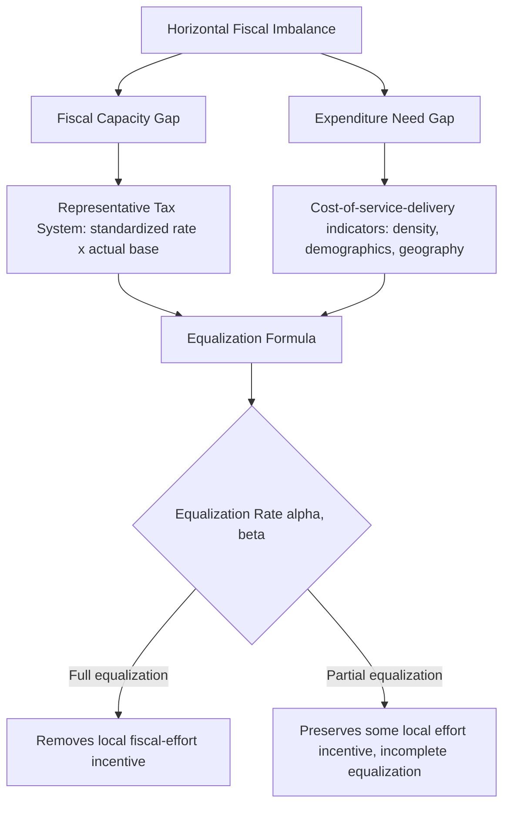

## Intergovernmental Transfers and Equalization Grant Design

### Scope Relative to the Prior Treatment

Recall that the vertical fiscal gap — the structural mismatch between subnational expenditure responsibility and own-source revenue capacity — is typically closed through some combination of intergovernmental transfers, revenue sharing, and subnational borrowing, and that transfers themselves divide into conditional, unconditional, and equalization subtypes with distinct accountability and spillover-correction properties. This item moves from that classification to the technical design problem itself: **how an equalization grant formula should be constructed** to achieve its stated objective without generating the perverse incentives second-generation fiscal federalism theory warns against.

### The Equalization Objective, Precisely Defined

**Fiscal equalization** is the transfer-design objective of enabling subnational governments to provide a comparable standard of public services at a comparable tax burden on their residents, notwithstanding differences in local fiscal capacity or service-delivery cost. This objective must be kept analytically distinct from two things it is often conflated with: it is not the same as closing the vertical fiscal gap (a jurisdiction-independent, aggregate financing problem), and it is not the same as poverty alleviation or income redistribution to individuals (a distributive-function problem assigned to central government under the Musgrave framework). Equalization specifically targets **horizontal fiscal imbalance** — disparities *among* subnational jurisdictions at the same governmental tier — and the formula design choices below follow directly from that narrower target.

Equalization formulas are built from two conceptually separable components, and a well-designed system must decide explicitly whether to address one, the other, or both:

**Fiscal capacity equalization** compensates for differences in a jurisdiction's own-source revenue-raising potential — typically measured not by actual collected revenue (which would perversely penalize high tax effort) but by a **representative tax system (RTS)** approach: applying a common, nationally standardized tax rate to each jurisdiction's actual tax base, yielding a measure of what each jurisdiction *could* raise at average effort, independent of the political choices its own government has made about actual rates.

**Expenditure need equalization** compensates for differences in the cost of delivering a comparable service standard — driven by factors such as population density (sparsely populated jurisdictions facing higher per-capita infrastructure and service-delivery costs), demographic composition (a jurisdiction with an older or younger population facing systematically different service-cost structures), or geographic factors (island or mountainous jurisdictions facing higher transport and construction costs for identical infrastructure).

$$E_i = \alpha \left( \bar{C} - C_i \right) + \beta \left( N_i - \bar{N} \right)$$

where $E_i$ is jurisdiction $i$'s equalization entitlement, $C_i$ is its representative fiscal capacity, $\bar{C}$ is the national average or a defined standard, $N_i$ is its assessed expenditure need, $\bar{N}$ is the average need, and $\alpha, \beta$ are weighting parameters reflecting how much of the capacity gap and need gap, respectively, the system chooses to close — a design choice that is itself consequential, since full equalization ($\alpha, \beta = 1$) removes essentially all fiscal-capacity-driven incentive for local revenue effort, while partial equalization preserves some.

### The Central Design Tension: Equalization versus Incentive Preservation

The formula parameters above are not a merely technical detail; they encode the field's central trade-off, directly continuous with the fiscal-illusion and accountability concerns established under second-generation fiscal federalism theory in this chapter's earlier items.

**The disincentive problem with capacity equalization based on actual collections.** If an equalization formula is computed from a jurisdiction's *actual* collected revenue rather than its standardized fiscal capacity, a jurisdiction that raises its own tax effort sees its equalization entitlement fall roughly one-for-one, producing an effective marginal tax rate on local fiscal effort that can approach or exceed 100% — a jurisdiction gains essentially nothing from raising local taxes, since additional own-source revenue is offset by an equivalent reduction in transfer receipts. This is precisely why the representative tax system approach — basing the formula on *capacity* rather than *actual collections* — is the standard technical prescription: it equalizes for a jurisdiction's *potential*, holding fixed regardless of the jurisdiction's actual policy choices, thereby preserving the marginal incentive to exert local tax effort that a collections-based formula would eliminate.

**The disincentive problem with expenditure need formulas based on actual spending.** A parallel problem arises on the expenditure side: if need is proxied by a jurisdiction's *actual* historical spending rather than by exogenous cost-driver indicators (population density, demographic structure), a jurisdiction that spends more receives a larger entitlement, rewarding fiscal profligacy and penalizing efficient service delivery — the expenditure-side analogue of the collections-based capacity problem, and addressed by the same design principle: base the formula on exogenous need indicators the jurisdiction's own government cannot directly manipulate through its spending choices.

**The stabilization-versus-predictability trade-off.** A formula recalculated annually using current-year data tracks genuine changes in relative fiscal capacity closely but introduces year-to-year volatility that complicates subnational budget planning; formulas using multi-year rolling averages or lagged data sacrifice some responsiveness for predictability. Most mature equalization systems adopt some form of smoothing or transitional arrangement (a "no negative change" floor, or phased implementation of formula updates) explicitly to manage this trade-off, at some cost to the formula's theoretical precision.

### Vertical versus Horizontal Equalization Program Architecture

Equalization programs are institutionally structured in one of two broad architectures, with materially different political-economy properties.

**Central government-funded ("vertical") equalization** draws the equalization pool from general central government revenue, distributing it to below-average-capacity jurisdictions without any direct clawback from above-average jurisdictions. This architecture avoids the visible inter-jurisdictional transfer that can generate political resistance in a **horizontal** system but ties the equalization pool's size to central fiscal capacity and political willingness to fund it, meaning the equalization program itself is subject to central budget pressure independent of the actual measured horizontal imbalance.

**Donor-pool ("horizontal") equalization**, exemplified by Germany's *Länderfinanzausgleich* system, redistributes directly among subnational jurisdictions — above-capacity jurisdictions contribute to a pool that below-capacity jurisdictions draw from, with no net call on central government resources. This architecture more directly and transparently ties equalization entitlements to the measured horizontal imbalance, but has historically generated sharper political conflict, since the donor jurisdictions experience the transfer as a direct and visible loss rather than as foregone central-government revenue.

### Table: Design Choices and Their Incentive Consequences

| Design choice | Incentive-preserving alternative | Risk if poorly designed |
| --- | --- | --- |
| Capacity measure | Representative tax system (standardized rate × actual base) | Actual-collections basis creates near-100% marginal tax on local effort |
| Need measure | Exogenous cost-driver indicators (density, demographics, geography) | Actual-spending basis rewards inefficiency and profligacy |
| Equalization rate (α, β) | Partial equalization, preserving some capacity-gap-linked incentive | Full equalization removes fiscal-effort incentive entirely |
| Update frequency | Smoothed/lagged, with transitional floors | Pure annual recalculation creates budget-planning volatility |
| Funding architecture | Matched to political-economy context (vertical vs. horizontal pool) | Donor-pool systems risk visible inter-jurisdictional conflict; vertical systems risk central underfunding |

### Application: Equalization Elements in the Philippine National Tax Allotment

Recall that the Philippines' post-*Mandanas-Garcia* National Tax Allotment (NTA) substantially expanded the pool of nationally collected taxes from which local government units draw a constitutionally guaranteed share, but that this expansion primarily addressed the *vertical* fiscal gap rather than the *horizontal* imbalance this item's equalization framework specifically targets. The NTA's underlying allocation formula does incorporate factors correlated with expenditure need and population-based capacity proxies — population share, land area, and an equal-sharing component across LGUs of the same class — functioning as a partial, if imperfectly targeted, horizontal equalization mechanism layered onto what is structurally a vertical-gap-closing transfer. This illustrates a common real-world departure from the cleaner theoretical separation this item draws between vertical-gap closure and horizontal equalization: many operational transfer systems combine both objectives within a single formula, with the resulting design frequently doing an imperfect job of either, relative to a system that separated the two objectives into formula components explicitly targeted at each, as the representative-tax-system and exogenous-need-indicator principles above would prescribe.

### Key Points

**Key Points**

- Equalization is a horizontal-imbalance-correcting instrument, analytically distinct from vertical-gap closure; a transfer system that conflates the two objectives within a single formula typically underperforms on both relative to a design that separates them.
- The representative tax system approach and exogenous need-indicator design are the standard technical solutions to the incentive-disincentive problem that arises when equalization formulas are based on actual local government behavior (collections or spending) rather than on jurisdiction-independent capacity and need measures.
- The choice between full and partial equalization (the α, β weighting parameters) is a explicit policy trade-off between equity and local fiscal-effort incentives, not a purely technical formula-calibration exercise, and should be made transparently rather than as an incidental byproduct of other formula design choices.
- Vertical (centrally funded) and horizontal (donor-pool) equalization architectures carry different political-economy risk profiles, and the choice between them should reflect a jurisdiction's specific fiscal and political context rather than being treated as a purely administrative decision.

### Related Topics

- Theories of fiscal decentralization and the assignment of taxing powers
- Revenue assignment versus expenditure assignment across levels of government
- Representative tax system methodology in comparative fiscal federalism
- Germany's Länderfinanzausgleich and comparative horizontal equalization design
- Subnational borrowing, hard budget constraints, and bailout dynamics
- The Mandanas-Garcia ruling and the Philippine National Tax Allotment framework