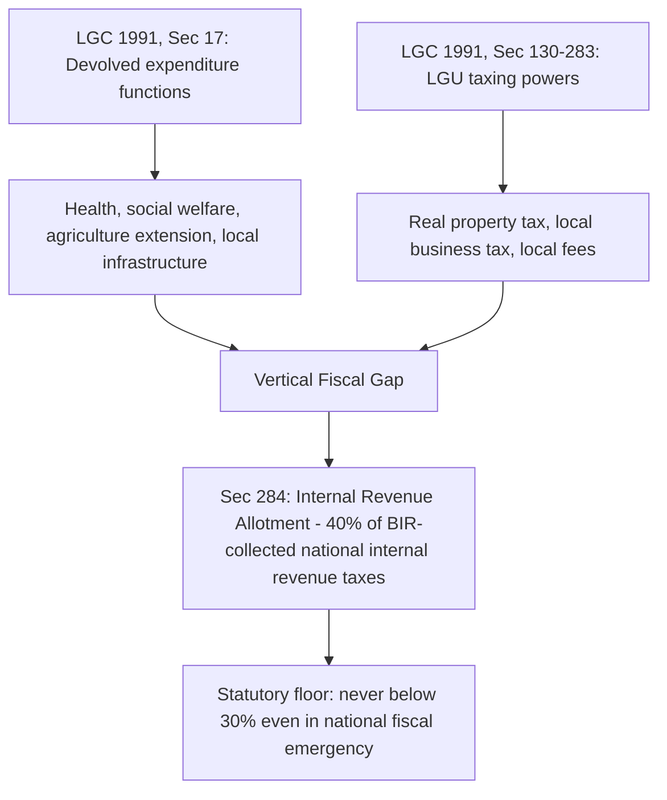

## The Philippine Local Government Code and the National Tax Allotment

### Statutory Foundation: Republic Act No. 7160

Recall that fiscal decentralization theory establishes normative principles for assigning expenditure and revenue functions across governmental tiers, and that a resulting vertical fiscal gap is typically closed through intergovernmental transfers. The Philippines offers one of the more extensively documented worked implementations of this framework in the developing-country context, both in its original 1991 design and in a significant subsequent constitutional reinterpretation of its central transfer mechanism.

The **Local Government Code of 1991** (Republic Act No. 7160), signed into law by President Corazon Aquino on October 10, 1991 and authored principally by Senator Aquilino Pimentel Jr., is organized into four books covering general provisions, local taxation and fiscal matters, the specific powers of local government units (LGUs), and miscellaneous provisions. Its stated policy objective, per Section 2, is that the territorial and political subdivisions of the state shall enjoy "genuine and meaningful local autonomy," to be achieved through **devolution** — defined in the Code itself as the act by which the national government confers power and authority upon LGUs to perform specific functions and responsibilities previously exercised by national line agencies.

**Section 17** operationalizes this devolution by enumerating the basic services and facilities LGUs are responsible for providing, spanning agricultural extension and support services (planting-material distribution, farm produce collection stations), health and social welfare services (barangay health centers, day-care centers), and a broad residual clause covering "such other powers and functions... necessary, appropriate, or incidental to efficient and effective provision" of these services — an expansive, non-exhaustive assignment consistent with the allocation-function decentralization logic established in this chapter's foundational theory item. The Code mandated that national agencies devolve responsibility for these enumerated services within six months of the Code's effectivity, and explicitly provided, under Section 17(f), a national-government backstop: the national government or a higher-tier LGU may provide or augment services assigned to a lower-tier LGU where that unit's own provision proves unavailable or inadequate — a safety-valve provision addressing the risk that devolution outpaces subnational institutional capacity.

### The Original Revenue-Assignment Design and Its Statutory Financing Clause

Consistent with the tax-assignment principles established earlier in this chapter, the Code assigned LGUs taxing authority over predominantly immobile, benefit-linked bases — real property tax, local business taxes, and a defined set of local fees and charges — while leaving the major mobile and macro-sensitive bases (income tax, VAT, corporate tax, customs duties) under national administration via the Bureau of Internal Revenue and Bureau of Customs. Section 17(g) directly links this structure to the vertical-fiscal-gap-closure framework established earlier in this chapter, stipulating that devolved basic services "shall be funded from the share of local government units in the proceeds of national taxes and other local revenues and funding support from the national government" — an explicit statutory acknowledgment that own-source LGU revenue alone was not expected to fully finance the devolved expenditure mandate.

The specific transfer mechanism financing this gap was the **Internal Revenue Allotment (IRA)**, established under **Section 284** of the Code: LGUs were entitled to a 40% share of national internal revenue taxes collected by the Bureau of Internal Revenue, computed on a three-year lag (based on collections in the third fiscal year preceding the current one, a design choice giving national and local budget offices advance certainty in allotment planning). Section 284 further included a fiscal-emergency provision: in the event the national government incurred an "unmanageable public sector deficit," the President — upon joint recommendation of the Finance, Interior and Local Government, and Budget and Management secretaries, and subject to consultation with congressional leadership and local-government league presidents — could adjust the IRA downward, but never below a statutory floor of 30% of the relevant national internal revenue tax collections, a hard constraint limiting the extent to which national fiscal distress could be passed through to LGU transfer entitlements.

### The Constitutional Basis and the Mandanas-Garcia Reinterpretation

The IRA's statutory design under Section 284 rested on a specific textual reading of the Code's constitutional mandate. **Article X, Section 6 of the 1987 Philippine Constitution** provides that LGUs "shall have a just share, as determined by law, in the **national taxes**," to be automatically released. For nearly three decades, Section 284 of the Local Government Code implemented this constitutional guarantee by computing the LGU share against the narrower base of "national **internal revenue** taxes" collected specifically by the BIR — a statutory interpretation that, on its face, excluded other national tax collections, most consequentially customs duties collected by the Bureau of Customs, from the base against which the 40% share was calculated.

This interpretive gap became the subject of consolidated petitions before the Philippine Supreme Court, decided July 3, 2018 in *Mandanas, et al. v. Ochoa, Jr., et al.* and *Garcia, Jr. v. Ochoa, Jr., et al.* (G.R. Nos. 199802 and 208488), with the ruling becoming final and executory on April 10, 2019. The Court held that the constitutional term "national taxes" in Article X, Section 6 could not be validly narrowed by statute to mean only "national internal revenue taxes" — the just share owed to LGUs was constitutionally required to be computed against **all** national tax collections, excepting only those accruing to special purpose funds and special allotments for the development and utilization of national wealth, and specifically including customs duties collected by the Bureau of Customs alongside BIR collections.

### Transition to the National Tax Allotment

Implementation of the ruling proceeded through **Executive Order No. 138 (2021)**, later amended by **Executive Order No. 103**, which extended the transition period for full devolution of the executive-branch functions affected and formally renamed the resulting transfer the **National Tax Allotment (NTA)**, effective beginning **fiscal year 2022**. The mechanical effect preserved the 40% share ratio established under the original Section 284 formula but broadened its base: the Department of Budget and Management's own comparative fiscal-impact analysis found that, absent the ruling, FY2022 allotments would have totaled approximately ₱773.87 billion, whereas the Mandanas-Garcia-compliant NTA computation yielded approximately ₱959.04 billion — an increase of roughly ₱185 billion in a single fiscal year, or ₱263.55 billion in year-on-year growth from FY2021 to FY2022, reflecting both the ruling's base expansion and underlying tax-collection growth.

Executive Order No. 138 additionally created a **Committee on Devolution** and mandated a structured, phased transition of full devolved-function responsibility from national line agencies to LGUs, explicit recognition that a large, sudden increase in unconditional transfer resources needed to be paired with a corresponding, deliberately paced transfer of institutional and administrative capacity — directly analogous to the capacity-building caveats attached to decentralization reforms in the comparative fiscal federalism literature more broadly.

### Table: IRA versus NTA — Formula Comparison

| Element | Pre-Mandanas-Garcia (IRA, Sec. 284 as originally applied) | Post-Mandanas-Garcia (NTA, effective FY2022) |
| --- | --- | --- |
| Constitutional basis | Article X, Sec. 6 — "national taxes" | Same provision, reinterpreted |
| Statutory share | 40% | 40% (ratio preserved) |
| Tax base | National internal revenue taxes (BIR collections only) | All national taxes, including Bureau of Customs collections, excluding special-purpose/national-wealth funds |
| Computation lag | Third fiscal year preceding current year | Same lagged-computation structure retained |
| Emergency floor | 30% of national internal revenue tax collections | Analogous floor provisions carried forward under implementing issuances |
| FY2022 fiscal impact | ₱773.87 billion (counterfactual, pre-ruling basis) | ₱959.04 billion (actual, post-ruling basis) — approx. ₱185B higher |

### Fiscal Sustainability Implications for the National Government

The Mandanas-Garcia expansion, precisely because it operates as an unconditional, formula-driven transfer under the classification established earlier in this chapter, directly illustrates the vertical-gap-closure trade-offs surveyed there: it substantially increased LGU aggregate resources without a corresponding increase in own-source LGU taxing authority, meaning the accountability benefits second-generation fiscal federalism theory attributes to locally-raised, benefit-linked taxation were not proportionately strengthened even as total LGU budgetary resources rose sharply. From the national government's side, the same expansion represents a significant and permanent contraction of centrally retained fiscal space — contemporaneous Philippine policy analysis flagged that the ruling would "significantly diminish the fiscal resources available to the National Government for its key priorities" in poverty reduction, infrastructure, and human-capital development, precisely because the NTA's automatic-release, formula-based design leaves the national government comparatively little year-to-year discretion over the allotment's size, a structural feature of the constitutional "automatically released" language itself.

### Key Points

**Key Points**

- The Local Government Code of 1991 assigns expenditure responsibility through Section 17 and revenue authority through its local-taxation provisions in a pattern broadly consistent with standard tax-assignment theory (immobile, benefit-linked bases assigned locally), while explicitly acknowledging in Section 17(g) that devolved services would require national-transfer financing beyond own-source LGU revenue.
- The Mandanas-Garcia ruling is a constitutional-interpretation case, not a legislative reform: it did not alter the 40% share ratio Congress originally set in Section 284, but corrected the tax base against which that ratio is computed, per the Supreme Court's reading of the phrase "national taxes" in Article X, Section 6.
- The NTA's fiscal impact was substantial and immediate — approximately ₱185 billion in additional FY2022 LGU allotments relative to the pre-ruling counterfactual — with corresponding and largely irreversible fiscal-space implications for the national government's own budget given the constitutional "automatically released" requirement.
- The reform illustrates a recurring pattern identified earlier in this chapter: expanding unconditional, formula-based transfer volume closes the vertical fiscal gap numerically but does not by itself strengthen the own-source-revenue accountability mechanisms that fiscal federalism theory treats as a distinct and equally important design objective.

### Related Topics

- Theories of fiscal decentralization and the assignment of taxing powers
- Revenue assignment versus expenditure assignment across levels of government
- Intergovernmental transfers and equalization grant design
- Executive Order No. 138 and the Committee on Devolution transition framework
- LGU own-source revenue mobilization and real property tax administration reform
- Subnational borrowing, hard budget constraints, and bailout dynamics