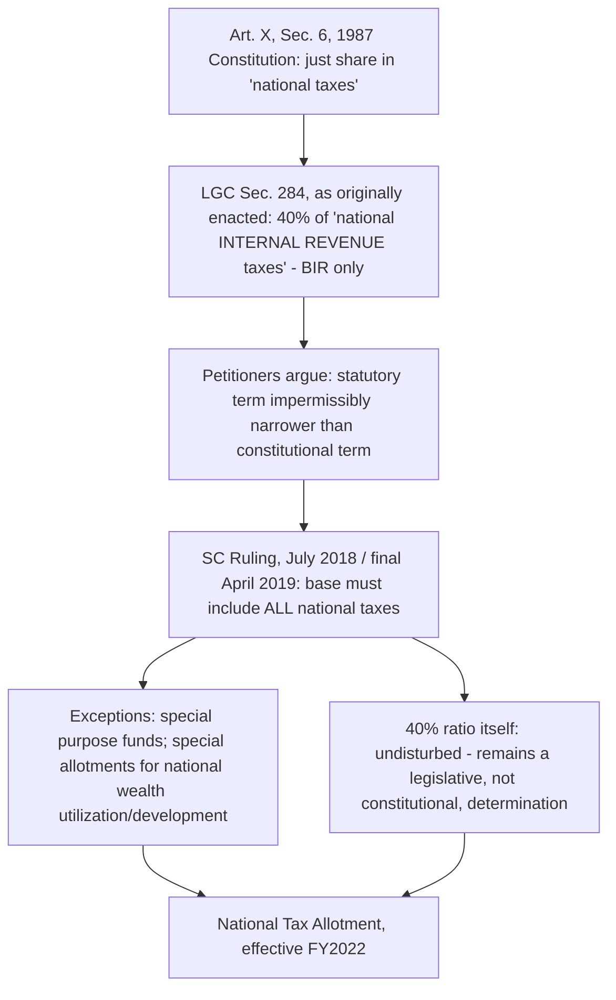

## The Mandanas-Garcia Ruling and Its Fiscal Implications for Local Government Units

### Scope Relative to the Prior Treatment

Recall that the Local Government Code of 1991 (Republic Act No. 7160) financed devolved LGU expenditure responsibilities primarily through the Internal Revenue Allotment established under Section 284, a 40% share of national internal revenue taxes collected by the Bureau of Internal Revenue, and that the 2018 Mandanas-Garcia ruling reinterpreted the constitutional basis of that entitlement to broaden its tax base, yielding the National Tax Allotment (NTA) effective fiscal year 2022. This item examines the ruling itself in greater legal and fiscal-mechanics detail — its reasoning, its precise quantitative consequences, and the specific implementation and sustainability challenges that followed, treating the case as a worked example of how a constitutional-interpretation shift can reshape an entire subnational transfer architecture without any accompanying legislative amendment to the underlying revenue-sharing ratio.

### The Legal Reasoning in Detail

The consolidated petitions before the Philippine Supreme Court — *Mandanas, et al. v. Ochoa, Jr., et al.* and *Garcia, Jr. v. Ochoa, Jr., et al.* (G.R. Nos. 199802 and 208488), decided July 3, 2018 and rendered final and executory April 10, 2019 — turned on a single interpretive question: whether Congress, in enacting Section 284 of the Local Government Code, had validly implemented the constitutional guarantee in **Article X, Section 6 of the 1987 Constitution**, which provides that LGUs "shall have a just share, as determined by law, in the **national taxes** which shall be automatically released to them."

The petitioners' core argument, which the Court accepted, was that Section 284's operative language — computing the LGU share against "national **internal revenue** taxes" specifically — impermissibly narrowed a constitutional term. "National taxes" as used in Article X, Section 6 is a broader category than "national internal revenue taxes," a term of art referring specifically to the tax types administered by the Bureau of Internal Revenue (income tax, VAT, excise taxes, and similar levies). By using the narrower statutory term as the computational base, Congress had — whether inadvertently or not — excluded from the LGU sharing base a substantial category of other national tax collections, most significantly customs duties collected by the **Bureau of Customs**, as well as other national taxes collected by agencies other than the BIR.

The Court's ruling established that **all** collections of national taxes must be included in computing the just share owed to LGUs, with only two categories of exception: collections accruing to special purpose funds, and special allotments earmarked for the utilization and development of national wealth (a carve-out relevant to natural-resource revenue, which in the Philippine system is subject to separate sharing arrangements with resource-producing LGUs distinct from the general NTA mechanism). The ruling did **not** disturb the 40% share ratio itself, which remained a matter of legislative determination under the "as determined by law" language of Article X, Section 6 — the Court's intervention was confined to correcting the *base* against which that ratio is applied, not the ratio's magnitude.

### Quantifying the Fiscal Implications

The reinterpretation's fiscal consequence was immediate and substantial upon implementation. Comparative Department of Budget and Management analysis found that, computed under the pre-ruling IRA formula, FY2022 LGU allotments would have totaled approximately ₱773.87 billion; computed under the Mandanas-Garcia-compliant NTA base, the actual FY2022 figure rose to approximately ₱959.04 billion — a one-time base-expansion impact of roughly ₱185.17 billion, compounding with underlying tax-collection growth to produce a year-on-year increase from FY2021 to FY2022 of approximately ₱263.55 billion. This is not a one-time adjustment but a permanent structural change to the transfer base: because customs duties and other previously excluded national tax collections are now permanently included in the NTA computation, the fiscal impact compounds in every subsequent fiscal year the collections base grows, rather than representing a single-year windfall.

### Table: Illustrative NTA Base Expansion Effect

| Fiscal year | Pre-ruling counterfactual (IRA basis, ₱ billions) | Actual post-ruling (NTA basis, ₱ billions) | Base-expansion impact (₱ billions) |
| --- | --- | --- | --- |
| FY2021 (pre-implementation) | 695.49 | 695.49 | — (ruling not yet implemented) |
| FY2022 (first implementation year) | 773.87 | 959.04 | ~185.17 |

*Figures per Department of Budget and Management comparative analysis; year-on-year FY2021→FY2022 growth under the NTA basis was approximately ₱263.55 billion, reflecting both the base-expansion effect and underlying national tax collection growth.*

### Implementation Mechanics: Executive Orders and the Devolution Transition

Because the ruling altered a constitutional entitlement computed on a three-year collections lag (per the original Section 284 formula structure, preserved under the NTA), full implementation required coordinated executive action rather than taking effect immediately upon finality. **Executive Order No. 138 (2021)** formally operationalized the transition, renaming the allotment the National Tax Allotment and establishing a **Committee on Devolution** tasked with managing the corollary and arguably more consequential policy challenge the ruling created: since the NTA substantially increased LGU transfer resources on the assumption that LGUs would correspondingly assume *full* responsibility for previously devolved functions (some of which national line agencies had continued performing or co-financing in practice, notwithstanding the Local Government Code's original 1991 devolution mandate), the transition required a structured, phased handover of actual functional responsibility to match the now-larger resource transfer. **Executive Order No. 103** subsequently amended EO 138 specifically to extend this transition period, an acknowledgment that the pace of genuine functional devolution was lagging behind the pace of fiscal-resource transfer — precisely the capacity-matching concern flagged in the comparative fiscal-decentralization literature when expenditure and revenue reforms are not sequenced together.

### Fiscal Sustainability Tension for the National Government

The ruling's zero-sum arithmetic — since the NTA is computed as a share of the same national tax collections that fund the national government's own budget, every peso of NTA base expansion is, by construction, a peso of reduced discretionary national fiscal space — generated substantial contemporaneous concern within Philippine fiscal policy circles. Analysis published around the ruling's implementation flagged that the increased NTA burden would "significantly diminish the fiscal resources available to the National Government for its key priorities," specifically citing constraints on poverty-reduction programs, infrastructure investment, and human-capital development spending, with the concern compounded by the fact that the ruling's implementation coincided with the fiscal aftermath of the COVID-19 pandemic, a period in which the national government was simultaneously managing elevated deficit-to-GDP ratios from pandemic response and economic-recovery spending.

The Department of Finance has subsequently emphasized transparency and strict compliance in NTA computation as an explicit policy commitment, a response to LGU-side concerns — given the scale and structural nature of the resource shift — that computation methodology might not fully capture the ruling's constitutional mandate in practice; current Department of Finance communications affirm ongoing dialogue with LGUs specifically aimed at helping them strengthen fiscal capacity and optimize utilization of the substantially larger resource base the ruling created.

### Interpreting the Case Within the Chapter's Analytical Framework

Read against the vertical-fiscal-gap and equalization frameworks established earlier in this chapter, the Mandanas-Garcia case is best characterized as a **large, one-time expansion of vertical-gap-closing transfer volume achieved through constitutional reinterpretation rather than through any change to underlying revenue-assignment or expenditure-assignment principles**. It did not alter which taxes LGUs may themselves levy, nor did it change which functions are assigned to LGUs under Section 17 of the Local Government Code — it changed only the size of the unconditional transfer LGUs receive to help finance an expenditure mandate that was already theirs. This distinction matters directly for the accountability analysis developed earlier in this chapter: because the NTA remains a formula-based, unconditional transfer rather than an expansion of own-source LGU taxing authority, the ruling's fiscal windfall, however substantial, does not by itself strengthen the benefit-tax accountability link that second-generation fiscal federalism theory identifies as a distinct and independently important objective from adequate transfer-financed resourcing.

**Key Points**

- The Mandanas-Garcia ruling is a constitutional-interpretation decision correcting the statutory tax base used to compute LGUs' constitutionally guaranteed "just share," not a legislative reform of the 40% sharing ratio itself, which Congress had originally set and which remained undisturbed.
- The ruling's fiscal effect was immediate and large — approximately ₱185 billion in additional FY2022 allotments relative to the pre-ruling counterfactual — and structurally permanent, since it broadened the NTA's underlying collections base going forward rather than granting a one-time supplemental amount.
- Implementation required deliberate sequencing (Executive Orders 138 and 103, and the Committee on Devolution) because the resource transfer's scale assumed a corresponding full functional devolution that had not, in practice, fully occurred under the original 1991 Code's implementation.
- The ruling increased transfer-based LGU resources without expanding LGU own-source taxing authority, meaning its fiscal-adequacy benefits and the accountability benefits associated with locally-raised taxation remain analytically and practically distinct outcomes, consistent with the general pattern established in this chapter's treatment of intergovernmental transfer design.

### Related Topics

- The Philippine Local Government Code and the National Tax Allotment
- Intergovernmental transfers and equalization grant design
- Revenue assignment versus expenditure assignment across levels of government
- Theories of fiscal decentralization and the assignment of taxing powers
- Executive Order No. 138 and the Committee on Devolution transition framework
- Philippine national fiscal sustainability and deficit management post-devolution