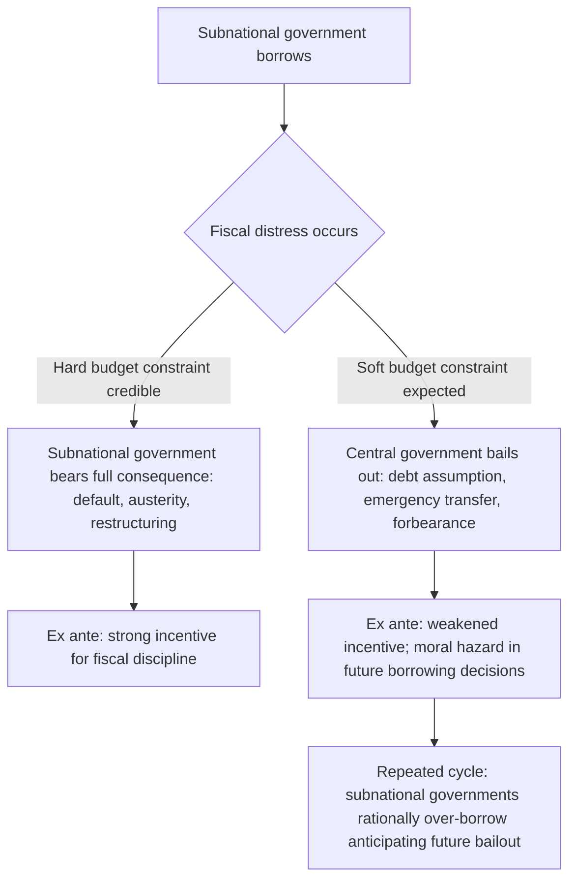

## Subnational Borrowing Rules and Hard Budget Constraints

### The Soft Budget Constraint Problem, Formally Stated

Recall that second-generation fiscal federalism theory, introduced earlier in this chapter, models governments as self-interested political actors rather than benevolent planners, and identifies the **hard budget constraint** — the credible absence of expectation that a higher level of government will bail out a subnational government's fiscal distress — as a necessary institutional condition for decentralization to deliver its theorized efficiency gains rather than fiscal indiscipline. This item develops that concept into its full analytical and policy-design form: the **soft budget constraint (SBC)** problem, originally formalized by János Kornai in the context of centrally planned enterprises and subsequently extended by Jonathan Rodden and others to subnational government finance, and the specific borrowing-rule architectures states have adopted to prevent it.

A subnational government faces a **soft** budget constraint when it can reasonably anticipate that a higher-tier government will, ex post, absorb some or all of the fiscal consequences of its own overborrowing or fiscal mismanagement — whether through explicit bailout, debt assumption, emergency transfers, or implicit forbearance (allowing arrears to accumulate without consequence). This expectation, once established, changes ex ante behavior: a subnational government facing a soft constraint has a diminished incentive to exercise fiscal discipline, because it does not fully internalize the cost of its own borrowing decisions — the classic moral hazard structure, here operating not between a lender and a private borrower but between tiers of government within a single sovereign.

$$\text{Subnational borrowing incentive} \propto \left(1 - P_{bailout}\right)^{-1}$$

where $P_{bailout}$ is the subnational government's subjectively perceived probability of receiving central bailout in the event of distress — as this perceived probability rises toward 1, the effective marginal cost of borrowing faced by the subnational decision-maker falls toward zero, independent of the loan's actual contractual terms.

### Why Soft Budget Constraints Emerge Even When Not Intended

The SBC literature's key insight, distinguishing it from simple political favoritism, is that soft constraints frequently emerge from structural features of the intergovernmental system rather than from any single deliberate bailout decision. Several mechanisms recur across country cases.

**Political-economy commitment problems.** A central government may wish, ex ante, to credibly commit to never bailing out a distressed subnational government, but if a large subnational unit's fiscal collapse threatens systemic financial-sector stability, essential public-service continuity, or the central government's own political standing, the central government's ex post incentive to intervene is strong — and subnational governments, correctly anticipating this ex post incentive, do not find the ex ante "no bailout" commitment credible regardless of how firmly it was originally stated. This is a formal **time-inconsistency problem**: the policy that is optimal to announce in advance differs from the policy that is optimal to actually implement once the contingency arises, and rational subnational actors respond to the latter, not the former.

**Transfer-dependency amplification.** Recall from earlier in this chapter that heavy reliance on intergovernmental transfers to close the vertical fiscal gap is the empirically dominant condition across decentralized systems. This dependency structurally worsens the SBC problem: a subnational government whose budget is already substantially transfer-financed has less "skin in the game" from own-source revenue, and the central government retains an ongoing, repeated-interaction relationship with that subnational unit through the transfer system itself, making credible one-time non-intervention correspondingly harder to sustain — the central government cannot easily wall off "the transfer relationship" from "the bailout decision" when both flow through the same fiscal channel.

**Common creditor pools and cross-jurisdictional externalities.** Where subnational governments borrow from the same domestic banking system the central government relies on for its own financing, or where one subnational government's default risks destabilizing the perceived creditworthiness of subnational borrowing generally (a contagion effect analogous to sovereign-spread contagion across countries), the central government's incentive to intervene is strengthened by systemic considerations distinct from any specific favoritism toward the distressed jurisdiction.

### Institutional Responses: The Rule-Based versus Market-Based Debate

The comparative fiscal federalism literature identifies two broad families of institutional response to the SBC problem, frequently combined rather than treated as mutually exclusive.

**Rule-based (administrative) constraints** impose ex ante quantitative limits on subnational borrowing, set and enforced by statute or constitutional provision rather than left to market discipline. Common instruments include: **debt-to-revenue or debt-service-to-revenue ceilings** (a maximum ratio of outstanding debt, or annual debt service, to a subnational government's own revenue base); **the golden rule**, restricting subnational borrowing to capital expenditure only, on the theory (established generally in this chapter's treatment of vertical fiscal gap closure mechanisms) that debt-financed capital investment is intertemporally appropriate while debt-financed recurrent spending is not, since the latter provides no future benefit stream against which to match the debt-service obligation; and **central government approval requirements**, under which subnational borrowing above a threshold requires prior central authorization, functioning as a direct administrative check rather than a self-enforcing formula.

**Market-based (fiscal-discipline-through-creditors) approaches** rely instead on the disciplining effect of credit markets themselves: if lenders correctly price subnational default risk — and, critically, if lenders believe the central government will *not* bail out a distressed borrower — then subnational governments face rising borrowing costs as their fiscal position deteriorates, providing an automatic, market-generated discipline mechanism without requiring administrative rule enforcement. This approach's effectiveness depends entirely on the credibility of the no-bailout commitment: if lenders themselves do not believe the central government will allow a subnational default (an expectation frequently justified by historical precedent), market pricing fails to discipline subnational borrowing, since the market is effectively pricing the *central* government's implicit guarantee rather than the *subnational* borrower's own standalone creditworthiness — precisely the failure mode the SBC literature identifies as the core problem to be solved, now reproduced at the level of credit-market pricing rather than administrative rule design.

### Table: Rule-Based versus Market-Based Constraint Mechanisms

| Mechanism type | Instrument | Self-enforcing? | Primary vulnerability |
| --- | --- | --- | --- |
| Rule-based | Debt-to-revenue ceiling | No — requires monitoring and enforcement capacity | Ceilings can be circumvented via off-budget borrowing or contingent liabilities |
| Rule-based | Golden rule (capital-only borrowing) | Partially — requires accurate capital/recurrent expenditure classification | Reclassification gaming; blurred capital-recurrent boundaries |
| Rule-based | Central approval requirement | No — requires credible central refusal capacity | Political economy pressure to approve; undermines subnational autonomy if overused |
| Market-based | Creditor risk pricing | Yes, if no-bailout credible | Entirely dependent on market's belief about bailout probability — self-defeating if bailout history exists |

### Comparative Illustration: Contrasting Institutional Designs

**Brazil's 1990s fiscal-federalism crisis** is the paradigmatic case establishing the SBC literature's empirical grounding: state governments accumulated substantial debt through the 1980s and early 1990s under a system where states owned their own banks and could effectively monetize deficits through those institutions, with a well-established pattern of repeated federal bailouts reinforcing the expectation of future rescue. The crisis was ultimately addressed through the **Fiscal Responsibility Law (2000)**, which imposed binding debt-to-revenue ceilings, personnel-expenditure limits, and — critically for the SBC framework — explicit statutory prohibitions on the federal government providing new bailout financing to states or municipalities, an attempt to legislate credibility into what had previously been a non-credible no-bailout commitment.

**China's local government financing vehicle (LGFV) system** illustrates a contemporary variant of the same underlying dynamic in a different institutional context: because Chinese local governments faced formal legal restrictions on direct borrowing for an extended period, they financed infrastructure investment through off-budget special-purpose corporate entities (LGFVs) whose debt did not appear on formal local government balance sheets, while carrying a strong implicit expectation of local-government backing. This structure illustrates a distinct SBC-adjacent failure mode from the Brazilian case: rather than *market* mispricing risk due to bailout expectations, the mechanism here was *statistical invisibility* — a formal rule-based constraint (the direct-borrowing restriction) was circumvented through an off-balance-sheet structure, producing debt that was effectively subnational and effectively backed by implicit government guarantee, while not being formally captured by any of the standard rule-based ceilings designed to constrain exactly this kind of borrowing — directly connecting to the hidden-debt and reporting-transparency problems established earlier in this course's treatment of debt transparency initiatives, here reproduced at the subnational rather than sovereign-external level.

### Application: Philippine Subnational Borrowing Framework

The Philippine system offers a comparatively rule-based design consistent with the golden-rule and ceiling-based instruments surveyed above. Under the Local Government Code and subsequent Bangko Sentral ng Pilipinas and Department of Finance regulatory issuances, LGU borrowing is subject to a statutory debt-service ceiling — generally limiting annual debt service to a defined percentage of an LGU's regular income — combined with a requirement that most LGU borrowing be channeled through, or certified by, national financial institutions (the Land Bank of the Philippines and Development Bank of the Philippines being the principal LGU lenders), giving the national government a supervisory vantage point functionally similar to the central-approval-requirement mechanism described above, even where formal prior approval is not always required for every transaction. Because LGU fiscal capacity is heavily shaped by the National Tax Allotment — the large, transfer-dependent revenue base established in this chapter's treatment of the Mandanas-Garcia ruling — Philippine LGU creditworthiness assessments in practice weight NTA receipts heavily as a revenue base against which debt-service ceilings are calculated, a structural feature directly illustrating the transfer-dependency-amplifies-SBC-risk mechanism described above: an LGU's *perceived* debt-service capacity is substantially a function of a centrally-determined, formula-driven transfer rather than of locally-generated own-source revenue, complicating a lender's ability to distinguish genuine subnational creditworthiness from the credit quality of the national transfer system itself.

### Key Points

**Key Points**

- The soft budget constraint problem is a time-inconsistency problem at its core: a central government's ex ante commitment to no bailout is frequently not credible given its ex post incentive to intervene when subnational fiscal distress threatens systemic stability or essential services.
- Transfer dependency, established earlier in this chapter as the empirically dominant condition in decentralized systems, structurally worsens the SBC problem by reducing subnational "skin in the game" and maintaining an ongoing central-subnational fiscal relationship that makes credible non-intervention harder to sustain.
- Rule-based constraints (debt ceilings, golden-rule capital-only borrowing, central approval) and market-based discipline are complementary rather than substitutable, since market discipline requires a credible no-bailout expectation that rule-based instruments alone cannot always establish.
- Off-balance-sheet and quasi-fiscal borrowing structures (the Chinese LGFV case being the clearest illustration) represent a distinct failure mode from simple rule violation: formally compliant rule-based systems can still generate soft-budget-constraint-equivalent risk if borrowing is structured to evade the formal reporting perimeter the rules were designed to monitor.
- Where subnational creditworthiness assessment depends heavily on centrally-determined transfer receipts, as in the Philippine NTA-dependent LGU case, the line between genuine subnational fiscal discipline and the credit quality of the central transfer system itself becomes difficult for lenders to cleanly separate — a structural vulnerability distinct from, but related to, the classic SBC bailout-expectation problem.

### Related Topics

- Theories of fiscal decentralization and the assignment of taxing powers
- Revenue assignment versus expenditure assignment across levels of government
- The Mandanas-Garcia ruling and its fiscal implications for local government units
- Debt transparency initiatives and the problem of hidden bilateral debt
- Brazil's Fiscal Responsibility Law and subnational fiscal-rule design
- China's local government financing vehicles and off-balance-sheet subnational debt
- Municipal credit ratings and subnational bond market development