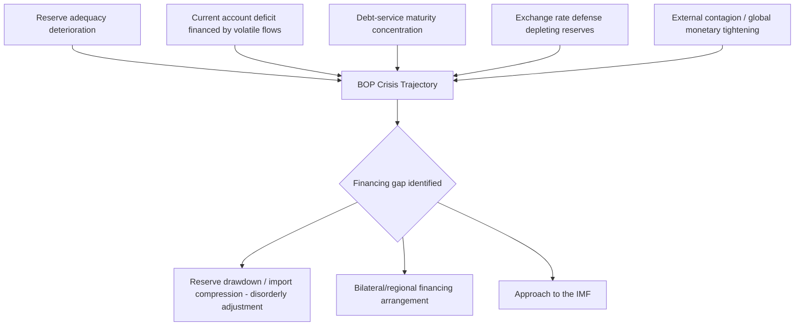

## Balance-of-Payments Crisis Triggers and the Decision to Approach the Fund

### Framing the Borrower-Side Decision Problem

This chapter shifts perspective from the structural, cross-cutting themes of the prior chapters to the specific institutional sequence a finance ministry navigates when its own state approaches acute fiscal and external distress. A **balance-of-payments (BOP) crisis** occurs when a country's external financing needs — the sum of its current account deficit and scheduled external debt amortization — exceed the foreign-exchange resources available to meet them, at prevailing or sustainable exchange rates and reserve levels, forcing either a disorderly adjustment (reserve depletion, currency collapse, import compression) or recourse to external official financing. The decision to approach the International Monetary Fund is, from the borrower's side, rarely a single discrete moment; it is the endpoint of a deteriorating sequence that a well-run debt-management and macro-fiscal function should be positioned to recognize well before the crisis becomes acute, since earlier recognition materially changes the menu of available program options and their associated conditionality burden.

### Anatomy of BOP Crisis Triggers

**Reserve adequacy deterioration.** The most direct and closely monitored trigger is the trajectory of usable foreign-exchange reserves relative to standard adequacy benchmarks — commonly expressed in months of import cover, as a ratio to short-term external debt (the **Guidotti-Greenspan rule**, holding that reserves should at minimum cover one year of maturing short-term external debt), or under the IMF's own composite **Reserve Adequacy (ARA) metric**, which weights reserve needs against export receipts, broad money, short-term debt, and other portfolio liabilities to produce a country-specific adequacy benchmark rather than a single universal threshold. A sustained decline toward or below these benchmarks, particularly when driven by persistent intervention to defend an exchange rate under speculative pressure, is the clearest quantitative early-warning signal available to a debt-management office.

**Current account deterioration beyond sustainable financing.** A widening current account deficit is not itself a crisis trigger — many fast-growing economies run sustained, investment-financed current account deficits without distress — but becomes one when the deficit's financing composition shifts toward volatile, reversible capital flows (short-term portfolio inflows, foreign-currency bank deposits) rather than stable flows (foreign direct investment, long-term concessional borrowing), a composition risk the literature terms the **"sudden stop"** vulnerability: a country financed predominantly by flows that can reverse on short notice is exposed to a self-fulfilling crisis dynamic in which the anticipation of reversal itself triggers the reversal.

**External debt service concentration and rollover risk.** A BOP crisis frequently crystallizes around a specific, identifiable point of stress — a large Eurobond maturity, a bullet repayment on a syndicated loan, or a cluster of amortization falling due within a narrow window — rather than emerging as a smooth, gradual deterioration. Debt-service concentration in the **maturity profile** is therefore a distinct and independently monitorable trigger from the aggregate debt stock: a moderate debt-to-GDP ratio with a dangerously concentrated near-term maturity wall can precipitate crisis faster than a higher but well-distributed debt stock, because the country faces a discrete, large financing requirement at a specific date rather than a manageable, smoothed annual obligation.

**Exchange rate pressure and the defense-versus-adjustment choice.** Where a country operates a pegged, managed, or heavily-intervened exchange rate regime, sustained downward pressure forces an explicit policy choice between reserve-depleting defense of the peg and an adjustment (devaluation or float) that itself carries balance-sheet risk for any foreign-currency-denominated domestic liabilities — the classic **"original sin"** problem in emerging-market macroeconomics, where a country's inability to borrow internationally in its own currency means devaluation, while correcting the external imbalance, mechanically worsens the domestic-currency value of foreign-currency debt service.

**Contagion and regional spillover triggers.** A BOP crisis can be triggered or accelerated by events entirely external to a country's own fundamentals — a regional neighbor's default or currency crisis prompting investors to reassess risk across an entire asset class or geography (contagion), or a global monetary-policy shift (a major central bank tightening cycle) that simultaneously tightens financing conditions for a wide range of emerging-market borrowers independent of country-specific fundamentals, as documented in the treatment of Sri Lanka's exposure to the Federal Reserve's post-2013 taper elsewhere in this course.

### The Decision Calculus: Why Approaching the Fund Is Not Automatic

A finance ministry facing a deteriorating BOP position does not face a binary "crisis versus no crisis" choice but a genuine decision problem with real trade-offs on both sides, and understanding this calculus is central to grasping why some governments delay Fund engagement well past the point outside observers regard as obviously necessary.

**Costs of approaching the Fund.** An IMF program carries **conditionality** — policy commitments (fiscal, monetary, structural) attached to the disbursement schedule, reviewed at defined intervals — which constrains the government's near-term policy discretion and is frequently domestically unpopular, particularly where conditionality touches subsidy removal, public-sector wage restraint, or exchange-rate liberalization with direct and visible effects on households. There is also a **signaling cost**: publicly approaching the Fund can itself be interpreted by markets and rating agencies as confirmation of distress, potentially accelerating the capital flight or rollover refusal the program is meant to address — a risk sometimes termed the **"stigma" effect**, which has historically led some governments to delay approach until a program becomes unavoidable, at the cost of a larger financing gap and correspondingly larger required adjustment by the time the program is finally negotiated.

**Costs of not approaching the Fund.** The alternative to Fund engagement is either **disorderly adjustment** — reserve exhaustion, forced import compression, and potentially an uncontrolled currency collapse, all typically more economically and politically costly than a negotiated program — or reliance on alternative, non-Fund external financing, which carries its own trade-offs: bilateral financing (including from non-traditional creditors, as established in this course's treatment of Belt and Road Initiative lending) may come with less standardized conditionality but often at higher cost, shorter maturity, or the collateralization and confidentiality risks previously documented, while regional financing arrangements (such as the Chiang Mai Initiative Multilateralization in Asia, or the European Stability Mechanism) offer an intermediate option in regions where such architecture exists, though typically with more limited firepower than the Fund's global resource base.

**The catalytic-financing argument for earlier approach.** A frequently underweighted consideration in the delay calculus is the IMF program's **catalytic effect**: a Fund arrangement, by certifying a credible policy-adjustment path and unlocking Fund disbursements, is designed to catalyze additional financing from other official and private creditors who would not lend, or would lend only at prohibitive cost, absent that certification — meaning the effective financing benefit of a program frequently exceeds the Fund's own direct disbursement, an effect that erodes the longer a country delays approach and allows its own credibility to deteriorate further in the interim.

### Table: Trigger Type and Typical Detection Lead Time

| Trigger category | Typical monitoring indicator | Approximate lead time before acute crisis |
| --- | --- | --- |
| Reserve adequacy erosion | Months of import cover; ARA metric ratio | Months to a few years, if monitored continuously |
| Current account financing-quality shift | Composition of capital account financing (FDI vs. portfolio/short-term) | Months to a year |
| Maturity concentration | Debt-service profile / upcoming bullet maturities | Known with certainty well in advance — a scheduling, not forecasting, problem |
| Exchange rate defense | Reserve drawdown rate under peg defense | Weeks to months once defense begins |
| Contagion / global tightening | External — largely outside domestic control | Days to weeks once triggering event occurs |

### The Article IV Consultation as a Pre-Crisis Information Channel

A finance ministry's relationship with the Fund is not confined to crisis periods. Under **Article IV of the IMF's Articles of Agreement**, the Fund conducts regular — typically annual — bilateral surveillance consultations with every member country, producing an assessment of the country's macroeconomic and financial position, including an explicit judgment on external and public debt sustainability. A well-functioning borrower-side debt-management office treats the Article IV process not as a passive external audit but as a structured, recurring opportunity to obtain independent, internationally benchmarked assessment of exactly the trigger indicators enumerated above — reserve adequacy, debt sustainability, exchange rate misalignment — well before those indicators reach crisis thresholds, and a pattern of increasingly urgent Article IV language in consecutive consultation cycles is itself among the clearest available signals that the decision to approach the Fund for program financing, rather than surveillance alone, is approaching.

### Key Points

**Key Points**

- BOP crisis triggers are rarely singular; the standard pattern is a compounding interaction among reserve erosion, financing-composition deterioration, and a specific maturity-concentration event that converts a gradual vulnerability into an acute, dated financing gap.
- The decision to approach the Fund is a genuine cost-benefit calculus, not an automatic response to distress: conditionality and stigma costs are real and help explain empirically documented patterns of delayed approach, but must be weighed against the compounding cost of disorderly adjustment and the erosion of the program's catalytic-financing benefit the longer approach is delayed.
- Debt-service maturity concentration is analytically distinct from aggregate debt stock as a trigger and is uniquely valuable for a finance ministry's own planning, since — unlike reserve trajectories or capital-flow reversals — the maturity schedule itself is known with certainty years in advance, making it the most actionable point for pre-crisis planning.
- The Article IV consultation cycle functions as a standing, non-crisis-contingent surveillance channel that a well-run debt-management office should use proactively to benchmark its own internal trigger indicators, rather than treating Fund engagement as beginning only once a program is sought.

### Related Topics

- IMF program conditionality: structural, fiscal, and monetary policy commitments
- Debt Sustainability Analysis (DSA) methodology under the IMF-World Bank framework
- The "stigma" effect and empirical patterns in delayed IMF program approach
- Regional financing arrangements: Chiang Mai Initiative Multilateralization and comparative architecture
- Reserve adequacy metrics and the Guidotti-Greenspan rule in practice
- Original sin and currency mismatch risk in emerging-market sovereign balance sheets