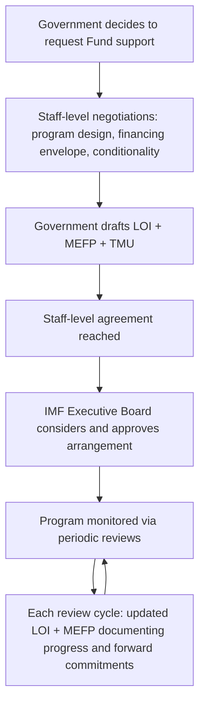

## Drafting the Letter of Intent and Memorandum of Economic and Financial Policies

### Institutional Function Within the Program Cycle

Recall that the decision to approach the Fund concludes a borrower-side trigger-assessment process; once a member government determines it will seek Fund financial support, that request must be formalized in a specific pair of documents that together constitute the borrower's own statement of the program it is requesting support for — critically, drafted and owned by the member government, not by IMF staff, a distinction with real substantive consequences for how these documents should be approached from the finance ministry's side.

The **Letter of Intent (LOI)** is a short covering letter, addressed to the IMF Managing Director and typically signed by the minister of finance, central bank governor, and in some cases the head of government, formally requesting Fund financial support (or, in review cycles, continued support) and transmitting the attached policy documents. The **Memorandum of Economic and Financial Policies (MEFP)** is the substantive policy document attached to the LOI: a comprehensive statement of the government's own diagnosis of its economic situation, its policy objectives, and the specific quantitative and structural commitments it is making as conditions of the arrangement. A third document, the **Technical Memorandum of Understanding (TMU)**, is frequently attached alongside the MEFP and defines the precise technical and statistical methodology by which each quantitative commitment in the MEFP will be measured and verified — a distinction that matters because a program's actual conditionality bite is often determined as much by the TMU's measurement definitions as by the MEFP's headline commitments.

A critical drafting principle, consistently reflected across decades of published LOI/MEFP pairs, is that these documents are formally the **property of the member country**, made available on the IMF's website only by agreement with the member — meaning the government's own name, its own first-person voice ("we," "the government"), and its own policy authorship are the document's defining formal characteristics, not IMF staff's assessment of the country. This ownership convention is not merely stylistic; it reflects the IMF's own governance principle that conditionality is meant to operationalize commitments the *member* has chosen, with Fund staff acting as technical counterparty and reviewer rather than author.

### Standard Structure of the Letter of Intent

Across a wide range of published LOIs — spanning Stand-By Arrangements (SBA), Extended Fund Facility (EFF) arrangements, and Extended Credit Facility (ECF) arrangements for both middle-income and low-income members — the LOI follows a consistent structural logic, even though its specific content is bespoke to each country and program.

**Opening: context and request.** The letter opens by establishing the economic context motivating the request — for a new arrangement, a description of the balance-of-payments need being addressed (Argentina's 2022 LOI, for instance, directly stated the arrangement aimed to address balance-of-payments needs "which mostly reflect the schedule of payments to the IMF resulting from" a prior Stand-By Arrangement, an unusually direct acknowledgment that the immediate financing need was itself driven by amortization of previous Fund borrowing); for a continuing arrangement under a periodic review, a report on progress against previously agreed performance criteria and structural benchmarks.

**Statement of policy adequacy and commitment.** A near-universal formulaic element across LOIs is an explicit sentence affirming the government's own judgment that the attached policies are sufficient to achieve the program's objectives — language to the effect that "the government believes that the policies set forth in the attached MEFP are adequate to achieve the objectives of its program." This is a substantively significant sentence, not boilerplate: it constitutes the government's own formal attestation of program adequacy, distinct from and independent of the IMF staff's own assessment in the accompanying staff report.

**Consultation and modification clause.** LOIs standardly include a commitment to consult with the Fund in advance of any policy revisions or additional measures beyond those specified in the MEFP, establishing the ongoing bilateral communication channel that governs the program between formal review dates — a provision with direct practical significance for a finance ministry's day-to-day program management, since it establishes the threshold at which a policy change requires prior Fund consultation versus routine implementation.

**Transparency and publication consent.** Since the IMF's move toward presumed publication of program documents, LOIs standardly include an explicit consent clause authorizing publication of the letter, the attached MEFP, and related Executive Board documents on the IMF's website, subject to Executive Board approval — a clause a finance ministry should treat as a deliberate, consequential transparency choice, not a routine formality, since it determines whether the government's own specific commitments become part of the permanent public record against which domestic and international audiences can later hold it accountable.

**Signature block.** Signatories vary by program and country but typically include the minister of finance and, particularly for programs with significant monetary-policy or exchange-rate dimensions, the central bank governor jointly — a joint signature that itself signals to Fund staff and to markets that fiscal and monetary authorities are aligned on the program's design, an alignment the Fund's own internal review process specifically probes for during negotiation.

### Standard Structure of the Memorandum of Economic and Financial Policies

The MEFP is substantially longer and more technical than the LOI, and its internal structure, while not rigidly standardized, follows a recurring logical sequence across published examples.

**Background and recent economic developments.** The memorandum typically opens with the government's own account of recent macroeconomic performance and, for a continuing program, a review of performance against the previous MEFP's commitments — explicitly cross-referencing prior memoranda by date, since a program's MEFP sequence across successive reviews forms a running, cumulative policy record rather than a series of unrelated documents.

**Macroeconomic and policy objectives.** A statement of the program's medium-term objectives — typically spanning fiscal consolidation or fiscal-space targets, external sector and reserve objectives, inflation and monetary-policy objectives, and, particularly for low-income-country ECF arrangements, explicit poverty-reduction and social-protection objectives, often linked to the country's own Poverty Reduction Strategy Paper where one exists.

**Quantitative performance criteria and indicative targets.** The MEFP's technical core: a table (often a formal annexed table, as in Indonesia's 2000 EFF documentation, which specified performance criteria for defined test dates alongside indicative targets for subsequent periods) setting out the specific, numerically defined fiscal, monetary, and external targets against which program compliance will be assessed at each review. **Performance criteria** are the binding conditions whose non-observance can interrupt disbursement absent a waiver; **indicative targets** are softer benchmarks providing an early signal of program trajectory without the same binding consequence — a distinction a finance ministry's own program-management team must track carefully, since the two categories carry materially different consequences for a missed target.

**Structural benchmarks and prior actions.** Distinct from the quantitative criteria above, structural benchmarks and prior actions address specific institutional or legislative reforms (financial-sector strengthening, tax-administration reform, public-financial-management improvements) whose completion is either a precondition for Board approval or first disbursement (**prior action**) or a monitored commitment for a defined future date (**structural benchmark**) — a category of commitment that has historically generated more domestic political friction than quantitative fiscal targets precisely because structural reforms frequently require legislative action beyond the finance ministry's own unilateral authority to deliver.

**Forward-looking policy commitments.** The memorandum's final substantive sections detail the specific policy measures the government commits to undertake over the arrangement's remaining duration — the most heavily negotiated portion of the document from the borrower's side, since these are the commitments the government's own ministries beyond finance (energy, social welfare, state-owned-enterprise oversight) will be bound to deliver.

### Table: LOI versus MEFP versus TMU — Functional Comparison

| Document | Primary function | Typical length | Binding character |
| --- | --- | --- | --- |
| Letter of Intent | Formal request/renewal; policy-adequacy attestation; publication consent | Short (1–3 pages) | The formal instrument of request itself |
| Memorandum of Economic and Financial Policies | Substantive policy program: objectives, quantitative targets, structural commitments | Long, technical (often 10–40+ pages) | Contains the actual performance criteria and benchmarks |
| Technical Memorandum of Understanding | Precise measurement/verification methodology for MEFP quantitative targets | Technical annex | Defines how compliance with MEFP targets is actually assessed |

### Practical Drafting Considerations for the Borrower-Side Team

**Key Points**

- Because the LOI and MEFP are formally the member government's own documents, the drafting process — even where heavily shaped by staff-level negotiation — should be approached by a finance ministry as an exercise in accurately representing the government's *own* considered policy commitments, not merely as accepting IMF staff's draft language; the explicit "policies... are adequate" attestation carries real institutional weight precisely because it is a first-person government statement.
- The distinction between performance criteria (binding, waiver-requiring if missed) and indicative targets (softer, early-warning) should shape which commitments a ministry negotiates hardest to soften or reschedule during program design, since the consequence of a miss differs substantially between the two categories.
- The Technical Memorandum of Understanding's definitional details — precisely how a fiscal balance, a reserve target, or a debt ceiling is measured — frequently matter as much in practice as the MEFP's headline numbers, and deserve comparable drafting attention from a ministry's technical staff rather than being treated as a routine annex.
- The publication-consent clause is a deliberate transparency choice with lasting accountability consequences; a finance ministry should treat the decision to consent (near-universal in modern practice, but not compulsory) as substantively significant rather than a formality to sign without separate consideration.
- Because successive MEFPs in a multi-review program form a cumulative, cross-referenced policy record, drafting discipline in early reviews — precise, achievable, clearly measurable commitments — pays a compounding dividend in later reviews, where the government's credibility is assessed partly against the clarity and follow-through of its own prior memoranda.

### Related Topics

- Balance-of-payments crisis triggers and the decision to approach the Fund
- IMF program conditionality: performance criteria, structural benchmarks, and prior actions
- Debt Sustainability Analysis (DSA) as the technical foundation for MEFP fiscal targets
- The IMF Executive Board approval process and program review cycles
- Extended Credit Facility versus Stand-By Arrangement versus Extended Fund Facility: instrument selection
- Poverty Reduction Strategy Papers and their integration into low-income-country MEFPs