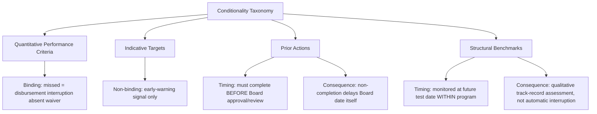

## Negotiating Conditionality: Structural Benchmarks Versus Performance Criteria

### Scope Relative to the Prior Treatment

Recall that the Memorandum of Economic and Financial Policies contains two functionally distinct categories of policy commitment: quantitative performance criteria and indicative targets on one hand, and structural benchmarks and prior actions on the other, with the prior item noting only that these carry materially different consequences for a missed target. This item develops the full conditionality taxonomy and — more consequentially for a finance ministry's negotiating posture — the specific negotiation strategy each category rewards, since the two conditionality types are not merely differently labeled but respond to entirely different leverage dynamics at the bargaining table.

### The Conditionality Taxonomy in Full

**Quantitative Performance Criteria (QPCs)** are numerically specified conditions — typically covering fiscal balances, monetary aggregates, external reserve levels, and non-accumulation of external payment arrears — tested against defined dates and formally binding: non-observance of a QPC, absent a waiver granted by the IMF Executive Board, interrupts the program's disbursement schedule. Because QPCs are numerical and objectively verifiable against the Technical Memorandum of Understanding's measurement methodology, they are, from a borrower's negotiating perspective, comparatively low-ambiguity commitments — a government either meets a fiscal deficit ceiling or it does not, with limited room for interpretive dispute once the TMU definitions are settled.

**Indicative Targets (ITs)** are the same category of numerical, macro-financial commitment as QPCs, but carry no binding consequence for non-observance; they function as an early-warning and program-trajectory signal, frequently used for variables further out on the test-date horizon where forecast uncertainty is too great to justify a binding commitment, or for variables the Fund and government agree are useful to monitor but not appropriate to make disbursement-conditional.

**Prior Actions (PAs)** are specific, discrete policy measures — most commonly legislative, regulatory, or administrative steps — that a government must complete *before* the IMF Executive Board will approve a new arrangement or complete a scheduled review. Because prior actions must be delivered before Board consideration rather than being tested after the fact, they carry the most immediate and least negotiable timing pressure of any conditionality category from the borrower's side: a prior action that slips derails the Board date itself, not merely a future disbursement.

**Structural Benchmarks (SBs)** are similarly discrete, non-numerical policy or institutional reform measures — but, unlike prior actions, are monitored against a future test date within an ongoing program rather than required before approval, and unlike quantitative performance criteria, non-observance of a structural benchmark does not automatically interrupt disbursement; it instead triggers a qualitative assessment by IMF staff and the Executive Board of whether the program nonetheless remains on track, giving this category the most interpretive latitude of the four.

### Table: The Four-Way Conditionality Comparison

| Category | Nature | Timing relative to disbursement | Consequence of non-observance | Negotiating characteristic |
| --- | --- | --- | --- | --- |
| Quantitative Performance Criterion | Numerical, macro-financial | Tested at defined future date | Binding — disbursement interrupted absent waiver | Low ambiguity; negotiation centers on the *level* set |
| Indicative Target | Numerical, macro-financial | Tested at defined future date | Non-binding — informational only | Lower-stakes; used for longer-horizon or less certain variables |
| Prior Action | Discrete, structural/legislative | Before Board approval or review completion | Board date itself delayed or at risk | High immediate pressure; least room for post-hoc negotiation |
| Structural Benchmark | Discrete, structural/institutional | Within program, at future test date | Qualitative track-record assessment, not automatic | Highest interpretive latitude; negotiation centers on *definition and evidence of completion* |

### Why the Categories Reward Different Negotiating Strategies

**Negotiating quantitative performance criteria: the level, not the category, is the battleground.** Because QPCs are numerically defined and binding, borrower-side negotiation appropriately concentrates on the *specific level* set for each criterion — the size of a fiscal deficit ceiling, the floor on net international reserves, the ceiling on net domestic assets — rather than on the criterion's existence or general form, which is typically not genuinely contestable once a country has accepted the broad macroeconomic framework of the program. The principal technical lever available to a finance ministry here is the underlying macroeconomic forecast feeding the Debt Sustainability Analysis and program baseline: since QPC levels are derived from projected fiscal and external trajectories, disputing or refining the underlying growth, revenue, or exchange-rate assumptions that generate those projections is a more productive negotiating avenue than disputing the criteria's binding character itself, which is a structural feature of QPCs the Fund will not typically concede.

**Negotiating structural benchmarks: definition and sequencing are the battleground.** Because SB non-observance triggers a qualitative rather than automatic assessment, and because SBs typically require legislative or administrative action that may depend on actors and processes outside the finance ministry's direct control (parliamentary approval, cabinet-level coordination across ministries, regulatory rule-making by an independent body), the more consequential borrower-side negotiation for this category concerns **precise definition of what counts as completion**, and **realistic sequencing relative to the country's own legislative calendar**. A structural benchmark phrased as "submit legislation to parliament" is a materially easier commitment to satisfy than one phrased as "enact legislation," and a finance ministry's technical negotiating team should treat this drafting-level distinction as substantively important, not a matter of stylistic preference, precisely because the qualitative assessment triggered by a miss will hinge on exactly this kind of definitional precision.

**Negotiating prior actions: front-loaded political capital versus program credibility.** Because prior actions must be delivered before Board approval, they concentrate maximum negotiating leverage at a specific moment: the government's demonstrated willingness (or inability) to deliver a prior action is the clearest, most immediate signal of program credibility available to the Fund's own Executive Board before it commits any resources. This creates an asymmetric negotiating dynamic distinct from the other three categories — a finance ministry has genuine leverage to negotiate the *number and difficulty* of prior actions during pre-Board negotiation (since an excessive prior-action list risks delaying the entire program, a cost the Fund itself wishes to avoid), but comparatively little leverage to renegotiate an agreed prior action's substance once staff-level agreement is reached and the political process of securing Board approval is underway.

### The Political Economy of Structural Conditionality

A specific negotiating tension recurs across country cases and merits explicit attention: structural benchmarks frequently address politically sensitive reforms — energy subsidy reform, state-owned enterprise restructuring, public-sector wage bill measures — precisely because these are the reforms a government's own domestic political economy has historically made difficult to enact absent external commitment pressure. This creates a distinctive borrower-side negotiating posture sometimes explicitly deployed by finance ministries: **using conditionality itself as a domestic political-economy tool**, in which a finance minister presents an externally negotiated structural benchmark to domestic stakeholders (legislature, affected interest groups, cabinet colleagues) as a binding external requirement rather than a discretionary government choice, thereby shifting domestic political blame for an unpopular reform onto the external conditionality framework — a dynamic the political economy literature on IMF programs has documented as a genuine and sometimes deliberate negotiating strategy from the borrower's side, not merely an incidental byproduct of program design.

This dynamic has a direct implication for how a finance ministry should approach SB negotiation: where a structural reform is one the ministry itself favors but has struggled to build sufficient domestic coalition support for, negotiating that reform explicitly as a structural benchmark — rather than resisting its inclusion — can be a rational strategic choice, converting external conditionality into a domestic coalition-building resource rather than treating all conditionality as an externally imposed constraint to be minimized.

### Waivers and Program Flexibility

Both QPCs and SBs admit a formal flexibility mechanism relevant to negotiation strategy: a **waiver of non-observance**, or a **waiver of applicability**, can be granted by the Executive Board where a missed criterion or benchmark is judged not to signal a genuine departure from program objectives — for instance, where a fiscal deficit ceiling was breached due to a natural disaster or externally driven revenue shortfall clearly outside the government's control, rather than a policy-driven fiscal slippage. From the borrower's negotiating perspective, this means the *ex ante* level set for a QPC and the *ex post* waiver process function as complementary, not independent, flexibility channels — a finance ministry facing a genuinely uncertain macroeconomic outlook may rationally accept a tighter headline QPC in exchange for staff's informal or formal acknowledgment that specific, well-defined contingencies (a commodity price shock, a natural disaster) would be treated as waiver-eligible circumstances, rather than exhausting negotiating capital attempting to loosen the headline number itself.

### Application: Conditionality Design in Low-Income-Country ECF Programs

Recall from the treatment of the Letter of Intent and MEFP that Extended Credit Facility programs for low-income countries typically link conditionality explicitly to a country's Poverty Reduction Strategy Paper objectives. This linkage has a specific consequence for structural benchmark negotiation in ECF contexts: because ECF-supported structural reforms frequently touch social-protection and poverty-sensitive expenditure categories (subsidy reform, cash-transfer program design), borrower-side negotiating teams in these programs have historically placed particular emphasis on **sequencing structural benchmarks alongside, rather than ahead of, compensatory social-protection measures** — for example, negotiating a benchmark requiring fuel-subsidy reform to be sequenced concurrently with, rather than prior to, the rollout of a targeted cash-transfer mitigation program, so that the reform's completion date does not precede the protective measure meant to offset its distributional impact. This sequencing negotiation is a direct, practical illustration of the definitional and sequencing leverage available in structural benchmark negotiation generally, applied to the specific political-economy sensitivities that recur in low-income-country program contexts.

### Key Points

**Key Points**

- The four-category conditionality taxonomy (QPCs, indicative targets, prior actions, structural benchmarks) rewards fundamentally different borrower-side negotiating strategies: QPC negotiation centers on the numerical level and its underlying macro assumptions; SB negotiation centers on definitional precision and sequencing; prior-action negotiation centers on front-loaded scope and count before Board approval.
- Structural benchmarks' qualitative, non-automatic consequence for non-observance gives this category the greatest post-agreement negotiating latitude, making precise drafting of the completion criterion — not merely the reform's substance — a first-order concern for a borrower-side technical team.
- Conditionality can function as a deliberate domestic political-economy tool from the borrower's side, not merely an externally imposed constraint — a finance ministry favoring a politically difficult reform may rationally seek its inclusion as a structural benchmark to shift domestic political responsibility onto the external program.
- Waiver mechanisms function as an ex post complement to ex ante QPC-level negotiation; a finance ministry's negotiating capital is often better spent clarifying waiver-eligible contingencies than attempting to loosen headline numerical targets, particularly under genuine macroeconomic uncertainty.

### Related Topics

- Drafting the Letter of Intent and Memorandum of Economic and Financial Policies
- Balance-of-payments crisis triggers and the decision to approach the Fund
- Debt Sustainability Analysis (DSA) as the technical foundation for performance-criteria levels
- Poverty Reduction Strategy Papers and Extended Credit Facility program design
- The political economy of IMF conditionality and domestic coalition-building
- IMF Executive Board review process and the waiver mechanism