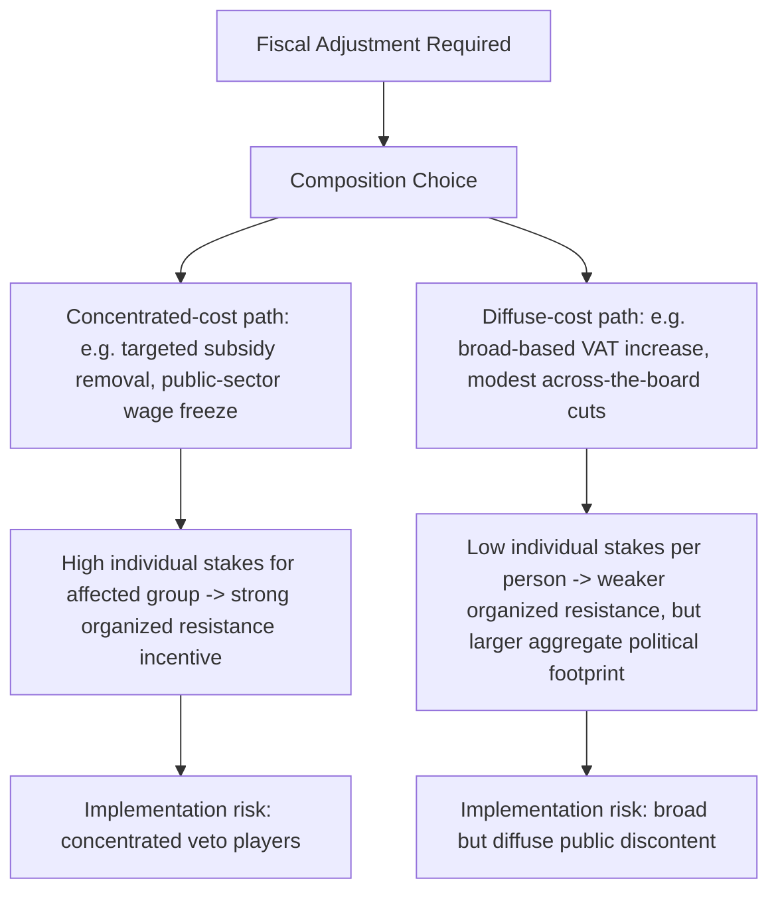

## The Political Economy of Fiscal Adjustment Under a Borrower Government

### Distinguishing the Technical and Political Adjustment Problems

Recall that the preceding items in this chapter treated the borrower's engagement with the Fund as a sequence of technical and negotiating decisions — recognizing crisis triggers, drafting the Memorandum of Economic and Financial Policies, negotiating specific conditionality categories. Each of those items addressed conditionality as if the government's principal constraint were technical capacity and Fund-side negotiation. This item addresses the analytically distinct problem that determines whether an agreed program is actually *implementable*: fiscal adjustment is not merely a technical exercise in identifying a sustainable deficit path, but a domestic political process in which the burden of adjustment must be distributed across identifiable social and political constituencies, each with the capacity to resist, delay, or reverse the adjustment through domestic political channels a finance ministry does not fully control.

### The Core Political Economy Problem: Concentrated Costs, Diffuse Benefits

The foundational insight of the political economy literature on fiscal adjustment, developed across a substantial body of comparative work on stabilization episodes, is that fiscal consolidation typically imposes **concentrated, visible, near-term costs** on identifiable groups (public-sector workers facing wage restraint, subsidy beneficiaries facing price increases, import-dependent sectors facing tariff or exchange-rate adjustment) while its **benefits — macroeconomic stability, restored market access, avoided crisis — are diffuse, delayed, and comparatively difficult for any single domestic constituency to attribute to the adjustment program specifically**. This asymmetry generates a structural collective-action advantage for the groups bearing adjustment costs: concentrated losers have strong individual incentive to organize and resist, while diffuse beneficiaries have comparatively weak individual incentive to mobilize in the program's defense, even where the aggregate welfare calculation clearly favors adjustment.

This dynamic has a direct and measurable consequence for program design that a borrower-side finance ministry must internalize distinctly from the pure fiscal-arithmetic question of *how much* adjustment is needed: the *composition* of adjustment — which specific taxes rise, which specific expenditures fall, which specific groups bear the visible cost — is frequently as politically consequential as the adjustment's aggregate size, and a technically optimal adjustment path that concentrates costs on a politically well-organized constituency can be less implementable than a technically inferior path that distributes costs more broadly, even at some efficiency cost.

### Veto Players and the Ratification Problem

A useful formal lens for the implementation risk described above is the **veto-player framework**, developed in the comparative political economy literature (most closely associated with George Tsebelis), which identifies the specific institutional and political actors whose consent is required for a given policy change to be enacted and sustained. For fiscal adjustment specifically, the relevant veto players extend well beyond the finance ministry that negotiated the IMF program: a legislature that must pass enabling budget or tax legislation, a cabinet in which line ministries controlling subsidized services have their own bureaucratic and political stakes, sub-national governments whose own fiscal position may be affected by intergovernmental transfer adjustments (directly connecting to this course's earlier treatment of vertical fiscal gaps and transfer dependency), organized labor where public-sector wage measures are involved, and — in coalition governments specifically — coalition partners whose continued political support for the government as a whole may be contingent on protecting their own core constituencies from adjustment costs.

The number and heterogeneity of veto players relevant to a specific adjustment measure is a strong predictor of implementation risk independent of the measure's technical merit: a reform requiring only executive or regulatory action (many exchange-rate or monetary measures) faces materially lower ratification risk than a reform requiring primary legislation passed by a fragmented, multi-party legislature, a distinction directly relevant to the structural-benchmark sequencing and definitional-precision negotiating strategies established in the prior item — a finance ministry negotiating a structural benchmark's completion definition should explicitly map the veto-player chain the underlying reform must clear domestically, and calibrate the negotiated timeline against the empirically observed cycle time of that specific domestic ratification process rather than against an externally convenient Fund review calendar.

### The Timing Problem: Front-Loading, Back-Loading, and the Electoral Cycle

A second recurring political economy dynamic concerns the **intertemporal sequencing** of adjustment relative to a government's own political survival calendar. The literature identifies a persistent tension between the technically preferred adjustment path — which may call for front-loaded fiscal consolidation to restore credibility and market confidence quickly — and the politically preferred path from an incumbent government's perspective, which frequently favors back-loading the most painful measures toward the end of the program period, particularly where an election falls within or shortly after the program's expected duration.

This tension is not merely a matter of political convenience; it has genuine implications for program credibility that a finance ministry negotiating team must navigate carefully. A back-loaded adjustment path carries two distinct risks from the Fund's own perspective: first, that a change of government before the painful measures are implemented could result in outright reversal, since a successor administration bears none of the political ownership of commitments made by its predecessor; and second, that back-loading itself can be read by markets as a signal of weak political commitment to adjustment, potentially undermining the very credibility-restoration and catalytic-financing effects the program is meant to achieve, as established in this chapter's treatment of the decision to approach the Fund. Borrower-side negotiators must therefore weigh the genuine domestic political-economy case for a more gradual path against this credibility cost — a trade-off with no universally correct resolution, but one that should be made explicitly rather than defaulting to back-loading purely as a path of least domestic resistance.

### Compensatory Mechanisms: Buying Political Sustainability

A recurring and empirically well-documented strategy for managing the concentrated-cost problem is the deliberate pairing of adjustment measures with **compensatory mechanisms** targeted at the specific groups bearing concentrated costs — a strategy already introduced in this chapter's prior treatment of sequencing fuel-subsidy reform alongside targeted cash-transfer rollout in Extended Credit Facility contexts, and generalizable well beyond that specific case.

The underlying logic is that a well-designed compensatory mechanism can convert a politically difficult concentrated-cost measure into a more implementable one by directly addressing the specific constituency most likely to organize resistance, without requiring the government to abandon the underlying adjustment objective. Effective compensatory design in the literature is characterized by several recurring features: **targeting** (directing compensation specifically at the population bearing the concentrated cost, rather than broad and therefore fiscally expensive universal transfers that dilute the adjustment's net fiscal benefit); **timing** (implementing the compensatory measure concurrently with, or where administratively feasible slightly ahead of, the cost-imposing measure, rather than as a delayed and therefore less politically credible promise); and **visibility** (ensuring the compensatory mechanism is as publicly identifiable and attributable to the government as the adjustment cost itself, since an invisible or poorly communicated compensation scheme does little to offset the political salience of a visible price increase or wage freeze).

### Table: Political Economy Risk Factors and Mitigation Strategies

| Risk factor | Underlying mechanism | Borrower-side mitigation strategy |
| --- | --- | --- |
| Concentrated cost on organized group | Strong individual incentive to resist; collective action advantage over diffuse beneficiaries | Targeted, timely, visible compensatory mechanisms |
| Multiple heterogeneous veto players | Each required consenting actor is an independent point of implementation failure | Map veto-player chain explicitly; calibrate SB timelines to real domestic ratification cycles |
| Adverse electoral timing | Incumbent incentive to back-load painful measures past election date | Weigh domestic political-sustainability case against credibility cost of back-loading explicitly |
| Coalition government fragility | Coalition partners protect core constituencies from adjustment | Sequence measures to distribute cost burden across coalition partners' constituencies, not concentrate on one partner's base |
| Sub-national fiscal spillover | Central adjustment measures (transfer cuts) shift burden to sub-national governments | Coordinate adjustment design with sub-national fiscal-rule and hard-budget-constraint framework established earlier in this course |

### The Finance Ministry's Distinctive Institutional Position

A finance ministry negotiating an IMF program occupies a structurally distinctive position relative to the domestic political economy dynamics described above: it is simultaneously the government's technical negotiating counterpart to the Fund and a domestic cabinet actor whose own adjustment proposals must survive the same veto-player ratification process facing scrutiny from colleague ministries with competing constituency interests. This dual position generates a specific and well-documented negotiating dynamic — sometimes termed the **"Two-Level Game"** in the broader international political economy literature (Robert Putnam's framework, applied here to fiscal-adjustment negotiation specifically) — in which a finance minister's negotiating leverage with Fund staff can be, and frequently is, strengthened by credibly representing the *domestic* political constraints as genuine limits on what the government can deliver, converting domestic political weakness into external negotiating leverage, while simultaneously representing the *external* conditionality requirements to domestic constituencies as binding constraints beyond the government's own discretion — precisely the strategic use of conditionality as a domestic political tool introduced in the prior item's treatment of structural benchmark negotiation, here generalized to the full fiscal adjustment program rather than a single structural reform.

### Key Points

**Key Points**

- Fiscal adjustment's political implementability depends substantially on the *composition* and *sequencing* of the adjustment burden across domestic constituencies, not solely on its aggregate fiscal size — a technically optimal path that concentrates costs on a well-organized veto-player group can be less implementable than a technically inferior but more broadly distributed alternative.
- The veto-player framework provides a systematic method for anticipating implementation risk before a program is finalized: a finance ministry should map the full chain of domestic actors (legislature, line ministries, sub-national governments, coalition partners, organized labor) whose consent a given measure requires, and calibrate negotiated timelines accordingly.
- Front-loading versus back-loading adjustment relative to a government's electoral calendar involves a genuine trade-off between domestic political sustainability and external program credibility, with back-loading carrying specific reversal and signaling risks that should be weighed explicitly rather than defaulted into.
- Well-designed compensatory mechanisms — targeted, timely, and visible — are among the most empirically effective tools for converting a politically difficult concentrated-cost adjustment measure into an implementable one, and should be treated as integral to fiscal adjustment design rather than an optional add-on negotiated separately.
- A finance ministry's dual position as both external negotiator and domestic cabinet actor creates genuine two-level-game leverage, allowing domestic political constraints to be deployed as external negotiating leverage and external conditionality to be deployed as domestic political cover — a dynamic borrower-side negotiators should use deliberately rather than treating domestic politics as an exogenous constraint on an otherwise purely technical negotiation.

### Related Topics

- Negotiating conditionality: structural benchmarks versus performance criteria
- Drafting the Letter of Intent and Memorandum of Economic and Financial Policies
- Balance-of-payments crisis triggers and the decision to approach the Fund
- Subnational borrowing rules and hard budget constraints
- Poverty Reduction Strategy Papers and targeted social-protection design
- Coalition government stability and fiscal policy credibility in comparative political economy