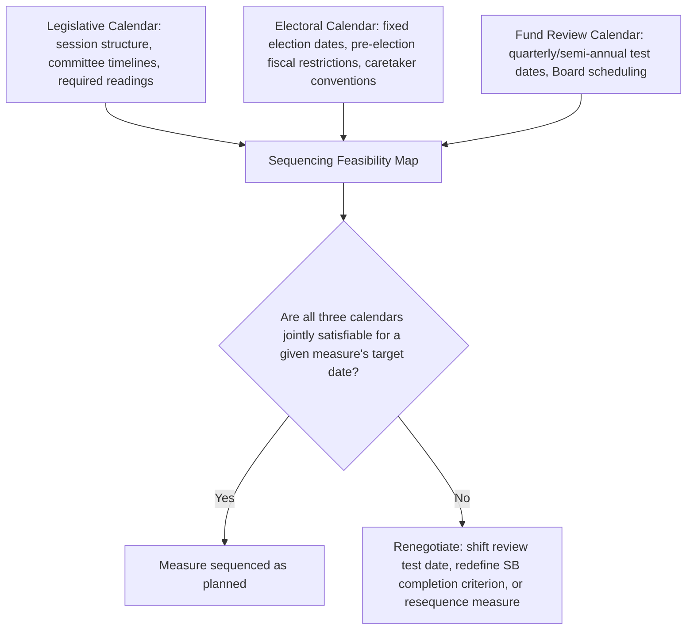

## Sequencing Program Measures Against Domestic Legislative and Electoral Constraints

### From General Political Economy to Concrete Sequencing Practice

Recall that the prior item established the veto-player framework and the front-loading-versus-back-loading tension as general analytical tools for anticipating a fiscal adjustment program's political implementability. This item narrows that general framework into the specific, operational discipline a finance ministry's program-management team must actually practice: **constructing a measure-by-measure implementation calendar that is jointly feasible against the country's real legislative calendar, its electoral timetable, and the Fund's own program review schedule** — three distinct timelines that frequently do not align, and whose misalignment is among the most common sources of program slippage in practice, independent of the underlying policy measures' technical merit.

### The Three Competing Calendars

**The legislative calendar** is defined by a country's own constitutionally and procedurally fixed session structure — regular and special legislative sessions, committee review periods, mandated public consultation or notice-and-comment windows for certain categories of legislation, and, in many systems, a defined number of required readings or chamber passages before a bill becomes law. This calendar is frequently far less flexible than program negotiators from either the ministry or Fund side initially assume: a structural benchmark requiring "enactment" of tax legislation is not merely a matter of political will once drafted, but is bound by the legislature's own institutionally fixed processing time, which can span months even absent any political resistance to the substance of the measure.

**The electoral calendar** is defined by a country's constitutionally fixed election dates (for presidential and most legislative systems) or the more variable, government-discretion-dependent dissolution timing common in parliamentary systems. As established in the prior item, proximity to an election materially affects a government's willingness and practical capacity to enact politically costly measures, but the electoral calendar's relevance to sequencing is broader than the pure willingness question: many jurisdictions impose formal or informal constraints on new fiscal measures during a defined pre-election period (caretaker-government conventions limiting a government's authority to commit future fiscal resources, or formal fiscal-responsibility-law provisions restricting new spending commitments within a defined pre-election window), meaning a measure scheduled too close to an election date may be not merely politically difficult but procedurally or legally foreclosed regardless of political will.

**The Fund program review calendar** is defined by the periodic review structure built into the arrangement itself — typically quarterly or semi-annual test dates at which quantitative performance criteria are assessed and structural benchmark completion is evaluated for Executive Board consideration. This calendar is comparatively more flexible than the other two in principle (review dates can be rescheduled by mutual agreement, and the Fund's own internal Board calendar has its own scheduling constraints), but functions as the calendar against which the other two must ultimately be reconciled, since a review's outcome is what determines continued disbursement.

### Diagnostic Practice: Building the Joint Feasibility Map

The core practical discipline this item recommends, extending the veto-player mapping introduced in the prior item into a genuinely calendar-based tool, is for a finance ministry's program-management unit to construct an explicit joint feasibility map for every structural benchmark and legislatively dependent quantitative measure in the program — cross-referencing the measure's required domestic process against the specific legislative session in which it must be processed, any electoral-proximity restrictions that might apply to its target date, and the Fund review date against which its completion will be assessed.

This exercise frequently surfaces infeasibilities that are invisible at the point of initial program negotiation, when attention is naturally focused on the substance of each measure rather than its calendar mechanics. A structural benchmark negotiated for a test date that falls during a legislature's scheduled recess, for instance, is procedurally guaranteed to slip regardless of the government's political commitment — a failure mode entirely distinct from, and more easily avoidable than, the substantive political resistance the prior item's veto-player framework addresses, yet one that produces an identical negative outcome (a missed benchmark, requiring the qualitative track-record reassessment established in this chapter's treatment of conditionality negotiation) if not caught during initial sequencing.

### Sequencing Principles for Legislatively Dependent Measures

**Front-load legislative submission relative to the substantive policy timeline.** Because legislative processing time is comparatively fixed and often underestimated, the practical implication for structural benchmark negotiation — extending directly from the prior chapter item's emphasis on precise completion-criterion drafting — is that a benchmark's target date should be set with the legislature's actual minimum processing time built in as a floor, not as an optimistic best case; negotiating a benchmark phrased as "submit to parliament by date X" with X set early enough to allow full statutory processing time before the *next* review date is generally more robust than negotiating "enact by date X" with X set close to that same review date, since the latter formulation leaves no buffer for ordinary legislative delay.

**Cluster related measures within a single legislative session where feasible.** Where multiple program measures require legislative action, bundling substantively related measures into a single legislative vehicle (an omnibus fiscal or budget-adjustment bill, where a country's legislative procedure permits this) can reduce the total number of discrete legislative windows the program depends on, lowering aggregate sequencing risk — though this strategy carries its own political economy trade-off directly connected to the prior item's veto-player analysis, since bundling can also concentrate opposition from multiple affected constituencies onto a single vote, potentially making that vote harder to secure than the same measures processed separately would have been individually.

**Avoid scheduling contested measures within statutory or conventional pre-election restriction windows.** Where a country's fiscal-responsibility framework, as established in this course's earlier treatment of subnational and national fiscal rules, imposes formal restrictions on new fiscal commitments during a defined pre-election period, program sequencing must treat that window as a hard constraint on measure timing, not merely a political-preference consideration — a structural benchmark scheduled to fall due during a legally restricted pre-election period may be not merely difficult but formally non-compliant with domestic law, a distinct and more serious risk than ordinary political delay.

**Build explicit contingency buffers around scheduled elections, regardless of formal restrictions.** Even absent formal legal restriction, the caretaker-government conventions common across parliamentary and many presidential systems — under which an outgoing or transitional government's authority to commit new policy is informally but substantially constrained pending a new government's formation — mean that a program's sequencing should generally avoid scheduling critical structural benchmarks or major legislative measures in the weeks immediately surrounding a scheduled election date, treating this as a standing sequencing principle independent of the specific country's formal legal framework.

### Renegotiating the Fund Review Calendar as a Sequencing Tool

Because the Fund review calendar is, as noted above, comparatively more flexible than the legislative and electoral calendars, borrower-side negotiators should treat **review-date scheduling itself** as an active sequencing tool rather than a fixed parameter to be worked around. Where a joint feasibility mapping exercise reveals that a substantively important measure cannot realistically clear the domestic legislative and electoral calendars before an already-scheduled review date, the more robust negotiating response is frequently to propose adjusting the review date itself — or restructuring which specific measures are tested at which review — rather than accepting a review date against which the measure is procedurally destined to be reported as missed. This is directly continuous with the structural-benchmark definitional-precision negotiating strategy established in the prior chapter item: since a missed structural benchmark triggers a qualitative rather than automatic consequence, a finance ministry demonstrating to Fund staff, with genuine calendar evidence, that a proposed test date is procedurally infeasible domestically is negotiating from a position of factual clarity rather than mere political preference, generally a stronger negotiating position than requesting schedule relief after a miss has already occurred.

### Table: Common Sequencing Failure Modes and Preventive Practice

| Failure mode | Underlying calendar conflict | Preventive sequencing practice |
| --- | --- | --- |
| SB test date falls during legislative recess | Legislative calendar vs. Fund review calendar | Cross-check legislative session calendar against every proposed test date at initial program design |
| "Enactment" benchmark set too close to review date | Legislative processing time underestimated | Set target dates for submission, not enactment, with statutory minimum processing time built in as floor |
| Fiscal measure scheduled within legal pre-election restriction window | Electoral calendar (formal) vs. measure target date | Treat statutory pre-election restrictions as a hard constraint, not a negotiable preference |
| Major reform scheduled near election despite no formal restriction | Electoral calendar (informal/caretaker convention) | Build standing buffer around all scheduled elections regardless of formal legal restriction |
| Bundled omnibus bill fails due to concentrated multi-constituency opposition | Veto-player concentration (from prior item) interacting with legislative clustering | Weigh bundling's calendar-efficiency benefit against its opposition-concentration risk case by case |

### Key Points

**Key Points**

- Program sequencing failure is frequently a calendar-mechanics problem distinct from, and more preventable than, the substantive political resistance addressed by the veto-player framework in the prior item — a joint feasibility mapping exercise against the legislative, electoral, and Fund review calendars should be standard practice at initial program design, not a reactive exercise undertaken only after a benchmark is missed.
- Structural benchmarks should generally be phrased and dated around legislative *submission* with statutory processing-time buffers built in, rather than around *enactment* dated close to a review test date, to avoid procedurally near-certain slippage.
- Formal legal pre-election fiscal restrictions and informal caretaker-government conventions both function as sequencing constraints, but the former is a hard compliance issue while the latter is a risk-management judgment — a finance ministry's sequencing practice should distinguish between the two rather than treating all electoral-proximity concerns identically.
- The Fund's own review calendar is the most negotiable of the three competing calendars and should be actively used as a sequencing tool — proposing review-date or measure-allocation adjustments backed by genuine domestic calendar evidence is a stronger negotiating position than requesting relief after a benchmark has already been missed.

### Related Topics

- The political economy of fiscal adjustment under a borrower government
- Negotiating conditionality: structural benchmarks versus performance criteria
- Drafting the Letter of Intent and Memorandum of Economic and Financial Policies
- Subnational borrowing rules and hard budget constraints
- Fiscal responsibility laws and statutory pre-election spending restrictions
- IMF Executive Board review scheduling and program restructuring mechanics