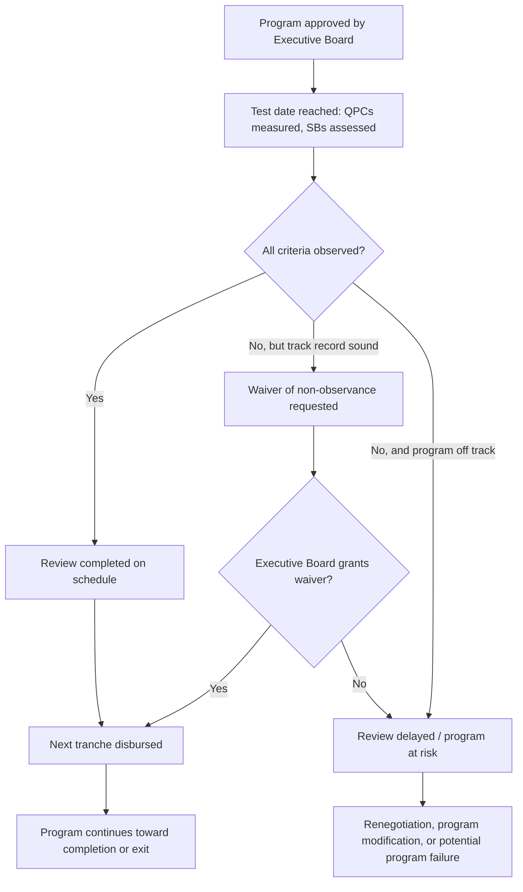

## Program Reviews, Waivers, and the Borrower's Exit Strategy from Fund Support

### Closing the Program Life Cycle

Recall that this chapter has followed the borrower-side program sequence from crisis recognition through drafting the Memorandum of Economic and Financial Policies, negotiating conditionality categories, understanding the domestic political economy constraints on adjustment, and sequencing measures against legislative and electoral calendars. This item addresses the program's remaining life-cycle stages: the recurring review mechanism that governs disbursement throughout the arrangement, the waiver process that provides flexibility when specific commitments are missed, and — the stage borrower-side literature has historically underweighted relative to program entry — the deliberate design of an **exit strategy** from Fund support, since a program's ultimate success is measured not merely by successful reviews but by a country's capacity to graduate from Fund financing without recurrent need to return.

### The Review Mechanism: Structure and Function

Each IMF-supported arrangement is structured around a series of **periodic reviews** — typically quarterly for Stand-By Arrangements and many Extended Fund Facility programs, sometimes semi-annual for longer Extended Credit Facility arrangements — at which IMF staff assess the government's observance of quantitative performance criteria tested at the relevant test date, evaluate progress on structural benchmarks, and, critically, review updated macroeconomic projections against the program's original baseline. A successfully completed review is the precondition for Executive Board approval of the next scheduled disbursement (or "tranche"), meaning the review process is not a retrospective audit alone but the operative mechanism determining the pace of the borrower's actual access to program financing.

Each review is documented through an updated Letter of Intent and Memorandum of Economic and Financial Policies — as established in this chapter's earlier treatment of these instruments — meaning a multi-review program generates a *sequence* of MEFPs, each explicitly cross-referencing and updating its predecessors, cumulatively building the running policy record referenced in that earlier item. From a borrower-side program-management perspective, each review cycle involves three parallel tracks of preparatory work: **compiling and certifying the quantitative outturns** against each performance criterion per the Technical Memorandum of Understanding's measurement definitions; **documenting structural benchmark completion status**, including, where a benchmark has slipped, preparing the evidentiary basis for the qualitative track-record argument established in this chapter's treatment of conditionality negotiation; and **updating the forward-looking MEFP commitments** for the remaining program period, incorporating any revisions to the macroeconomic baseline that have emerged since the previous review.

### The Waiver Mechanism in Operational Detail

Recall that a **waiver of non-observance** was introduced in this chapter's treatment of conditionality negotiation as an ex post flexibility mechanism complementing ex ante QPC-level negotiation. This item develops the mechanism's operational logic more fully, since understanding how waivers are actually assessed and granted is directly relevant to a finance ministry's review-preparation strategy.

A waiver request is not a routine or automatic feature of program continuation; it requires the Executive Board's affirmative judgment that, notwithstanding the specific missed criterion, the program remains adequate to achieve its objectives and the government retains a credible commitment to the underlying policy framework. The evidentiary burden this creates for a borrower-side team is therefore not merely demonstrating *that* a criterion was missed and by how much, but constructing a persuasive **causal narrative** distinguishing the miss from genuine policy slippage — a narrative most successful when it can point to specific, verifiable, and ideally exogenous factors (a commodity price shock, a natural disaster, an unanticipated external financing disruption of the kind established in this course's treatment of contagion effects) rather than factors plausibly within the government's own policy control.

A distinct and narrower instrument, the **waiver of applicability**, is used specifically where a test date has been reached but final data confirming observance is not yet available — allowing a review and disbursement to proceed on the basis of preliminary information, subject to confirmation, rather than for a criterion that has been definitively missed. Distinguishing correctly between circumstances calling for a waiver of non-observance versus a waiver of applicability is a matter of some practical importance for a borrower-side team's own internal data and reporting discipline, since the two instruments address genuinely different situations and are assessed against different evidentiary standards.

**Repeated reliance on waivers carries a distinct, cumulative credibility cost** that a finance ministry's negotiating team should weigh explicitly, separate from any single review's outcome: while an isolated, well-justified waiver — particularly one grounded in a clearly exogenous shock — typically does not meaningfully damage program credibility, a pattern of recurring waivers across successive reviews signals to markets, to the Fund's own Executive Board, and to the government's own domestic constituencies that the program's baseline targets were either poorly calibrated at the outset or that underlying policy implementation is genuinely off track, undermining precisely the catalytic-financing and credibility-restoration functions established as central to the initial decision to approach the Fund at this chapter's outset.

### Program Modification and Augmentation

Where a review process reveals that the original program design — its financing envelope, its macroeconomic baseline, or its underlying policy framework — has become substantially inadequate to the country's actual circumstances (a materially worse external shock than originally projected, for instance), the appropriate mechanism is not repeated waiver requests but formal **program modification**, potentially including **augmentation** of the arrangement's total financing envelope, negotiated as a discrete revision to the original arrangement rather than as an accumulating series of individually waived criteria. From a borrower-side strategic perspective, recognizing the point at which a program has shifted from "needing waivers" to "needing modification" is itself a consequential negotiating judgment: pursuing formal modification proactively, with a revised and internally consistent macroeconomic baseline and financing plan, is generally a stronger position than allowing successive reviews to accumulate waivers against an increasingly implausible original baseline.

### Designing the Exit Strategy

The borrower-side literature on program design has historically devoted more explicit attention to program entry and negotiation than to program **exit** — the deliberate strategy by which a government transitions from active Fund financial support back to reliance on own-resource and market financing, without near-term recourse to a successor arrangement. This is a meaningful design gap, since a program's ultimate measure of success, from the borrower's own long-run perspective, is not merely successful completion of scheduled reviews but durable **graduation**: sustained market access, sustained fiscal and external sustainability, and avoidance of the repeat-borrower pattern in which a country cycles through successive IMF arrangements without achieving lasting stabilization.

**Precautionary arrangements as a bridging exit instrument.** A frequently used intermediate step between an active, fully drawn program and full market independence is a transition to a **precautionary arrangement** — a program under which the country retains Fund backing and continues to meet program conditionality, but draws down little or none of the associated financing, using the arrangement's continued existence primarily as a credibility signal to markets rather than as an active financing source. This structure allows a government to maintain the catalytic-credibility benefit of Fund engagement while visibly reducing its actual financial dependence, and functions as a deliberate, gradual off-ramp rather than an abrupt transition from full program financing to none.

**Market-access sequencing.** A successful exit strategy typically requires deliberate sequencing of a country's own return to capital-market access — commonly beginning with smaller, shorter-maturity, or partially guaranteed instruments (a first post-program Eurobond issuance sometimes carrying a partial World Bank or other multilateral guarantee to reduce initial market risk pricing) before a full return to unguaranteed, benchmark-sized sovereign issuance — a sequencing directly analogous in logic to the catalytic-financing function of the initial program itself, now applied in reverse to re-establish independent market credibility.

**Institutional and fiscal-rule anchoring beyond program completion.** Because program conditionality's disciplining effect necessarily ends when the arrangement itself ends, a genuinely durable exit strategy frequently involves embedding key program-era fiscal discipline commitments into **domestic legal or institutional structures** that persist independent of the IMF relationship — fiscal responsibility legislation of the kind examined in this course's earlier treatment of subnational hard budget constraints, an independent fiscal council with a continuing mandate to assess budget proposals against sustainability benchmarks, or medium-term fiscal frameworks with their own domestic legal standing. This connects directly to this chapter's earlier treatment of using conditionality as a domestic political-economy tool: a government that has successfully used program conditionality to build domestic political coalition support for a difficult reform has a genuine opportunity, at program exit, to lock that reform into durable domestic institutions rather than allowing the disciplining framework to lapse entirely once external conditionality ends.

### Table: Program Life-Cycle Stage and Primary Borrower-Side Task

| Stage | Primary mechanism | Key borrower-side task |
| --- | --- | --- |
| Initial negotiation | LOI/MEFP drafting, conditionality negotiation | Establish realistic baseline and sequencing (prior chapter items) |
| Active review cycle | Quarterly/semi-annual reviews | Compile outturns; manage waiver requests judiciously |
| Program stress | Waiver requests, potential modification | Distinguish isolated shocks (waiver-appropriate) from structural baseline failure (modification-appropriate) |
| Late-program transition | Precautionary arrangement conversion | Shift from active drawing to credibility-signaling posture |
| Exit | Market-access sequencing, institutional anchoring | Re-establish independent market access; embed discipline in durable domestic institutions |

### Key Points

**Key Points**

- The periodic review cycle is the operative mechanism pacing actual disbursement access, not merely a retrospective compliance check, and each review generates an updated MEFP that becomes part of the program's cumulative policy record.
- Waiver requests require constructing a persuasive causal narrative distinguishing a specific miss from genuine policy slippage, ideally grounded in verifiable, exogenous factors; a pattern of recurring waivers carries a distinct cumulative credibility cost beyond any single review's outcome.
- Recognizing when a program has moved from needing isolated waivers to needing formal modification or augmentation is a consequential strategic judgment — proactively pursuing modification with a revised, internally consistent baseline is generally stronger than allowing waivers to accumulate against an implausible original baseline.
- A deliberate exit strategy — precautionary-arrangement transition, sequenced market-access re-entry, and embedding program-era fiscal discipline into durable domestic institutions — is as important to a program's ultimate success as the entry and active-review stages, and should be planned for explicitly rather than treated as an afterthought once program completion approaches.
- Institutional anchoring at exit offers a genuine opportunity to convert externally imposed conditionality into durable domestic reform, directly extending the two-level-game dynamic established earlier in this chapter from the active-program period into the post-program period.

### Related Topics

- Sequencing program measures against domestic legislative and electoral constraints
- Negotiating conditionality: structural benchmarks versus performance criteria
- The political economy of fiscal adjustment under a borrower government
- Drafting the Letter of Intent and Memorandum of Economic and Financial Policies
- Precautionary and Liquidity Line instruments in comparative IMF facility design
- Post-program market access and sovereign credit-rating restoration