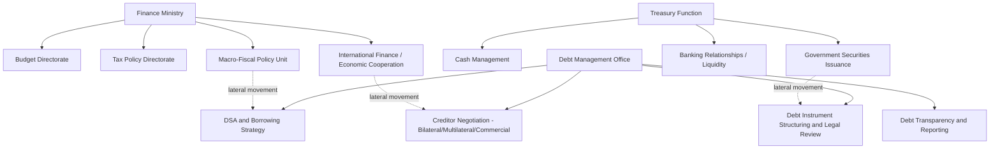

## Career Tracks Across Finance Ministries, Treasuries, and Debt Management Offices

### Purpose and Scope of This Chapter's Opening Item

This chapter shifts register from the analytical and institutional content of the preceding chapters to a practitioner-oriented treatment of the career pathways through which the substantive expertise developed across this course — fiscal federalism, debt diplomacy, IMF program negotiation — is actually built and exercised over a career. This item surveys the principal institutional tracks a public finance career can take, the distinct skill profiles and progression logics each rewards, and the points of lateral movement between them, providing the structural map the remaining items in this chapter will build on.

### The Core Institutional Landscape

**Finance ministries** (variously named Ministry of Finance, Department of Finance, Treasury, or Ministry of Economy and Finance depending on jurisdiction) are the central institutional locus of the fiscal-statecraft functions surveyed throughout this course: budget formulation and execution, tax policy design, macro-fiscal forecasting, and — centrally relevant to this course's later chapters — the negotiating function that engages with the IMF, bilateral creditors, and multilateral development banks on behalf of the sovereign. A finance ministry career track is typically organized around functional bureaus or directorates — budget, tax policy, international finance/economic cooperation, and macro-fiscal policy being the most common — with career progression frequently, though not universally, involving rotation across several of these functional areas before reaching senior policy or directorial rank, a rotation pattern deliberately designed to produce generalist policy leadership with cross-functional fluency rather than narrow technical specialization alone.

**Treasuries**, in the narrower operational sense distinct from the ministry-wide usage common in some Commonwealth systems, refer to the specific institutional function responsible for cash management, government securities issuance and debt servicing execution, and — in many systems — the government's own banking relationships and liquidity management. Where a treasury function is organizationally distinct from the broader finance ministry (as in the United States' distinction between the Department of the Treasury as a cabinet department and its internal Bureau of the Fiscal Service, or in the more common developing-country pattern of a dedicated National/Bureau of Treasury operating semi-autonomously within or alongside the finance ministry), treasury career tracks tend to reward deep technical specialization in cash-flow forecasting, auction mechanics, and government securities market operations — skills with substantial overlap to, but distinct emphasis from, the debt-management function addressed next.

**Debt Management Offices (DMOs)**, whether organized as a dedicated unit within the finance ministry, a semi-autonomous agency, or in some systems housed within the central bank, are the institutional locus of the debt-diplomacy and creditor-negotiation content developed in this course's earlier chapters: DSA preparation, borrowing-strategy design, creditor negotiation (bilateral, multilateral, and commercial), debt-instrument structuring, and the transparency and reporting functions addressed in this course's treatment of hidden bilateral debt. DMO career tracks, more than the other two institutional types, reward specialized quantitative and legal-financial expertise — debt sustainability modeling, bond documentation and covenant analysis, and increasingly, given this course's treatment of collateralized lending structures, contract-level scrutiny of complex financing instruments.

### Comparative Skill Emphasis Across Tracks

| Institutional track | Core technical skill emphasis | Typical entry qualification profile | Distinctive career reward |
| --- | --- | --- | --- |
| Finance ministry (policy) | Budget analysis, tax policy design, macro-fiscal forecasting, cross-agency coordination | Economics, public policy, public administration | Broad policy generalism; pathway to senior civil-service leadership |
| Treasury (operations) | Cash-flow forecasting, securities auction mechanics, liquidity management | Finance, quantitative economics, sometimes direct market experience | Deep operational specialization; frequent pathway to central-bank or market-operations roles |
| Debt Management Office | DSA modeling, creditor negotiation, bond/loan documentation, legal-financial structuring | Economics, finance, law (increasingly common as a dual qualification) | Specialized international-finance expertise; strong pathway to multilateral institutions |

### Entry Pathways and Qualification Profiles

Across the three tracks, entry pathways cluster around a few recurring patterns, though national civil-service systems vary substantially in formality and rigidity.

**Competitive civil-service examination systems**, common across much of Asia, continental Europe, and many Commonwealth-tradition systems, recruit entry-level finance-ministry and treasury staff through structured, often highly competitive written and interview examinations, with subsequent career progression governed substantially by seniority, examination performance, and internal rotation assignment rather than purely by open lateral hiring — a system that rewards early, sustained investment in examination preparation and tends to produce career-long institutional tenure as the norm rather than the exception.

**Direct professional hiring**, more common in DMO contexts specifically and in finance ministries organized along a less rigid civil-service model, recruits based on demonstrated technical qualification — an economics, finance, or law degree, often at the graduate level, combined with relevant quantitative or legal-financial skill — and typically offers more flexible lateral entry at various seniority levels, including direct entry from the private sector (investment banking, sovereign advisory, or credit-rating-agency backgrounds being common feeder profiles specifically for DMO debt-structuring and negotiation roles) or from multilateral institutions.

**Secondment and rotation programs**, increasingly common as a deliberate capacity-building tool, place finance-ministry or DMO staff on temporary assignment at the IMF, World Bank, regional development banks, or peer-country debt offices — a pathway directly relevant to the borrower-side IMF program negotiation content developed earlier in this course, since staff who have served on secondment inside these institutions bring a materially different, insider perspective to subsequent borrower-side negotiation than staff whose entire career has been on the borrowing side of the table exclusively.

### Progression Logic and the Generalist-versus-Specialist Trade-off

A recurring structural tension across all three tracks, with direct relevance to a practitioner planning a multi-decade career, is the trade-off between **generalist rotation**, which builds the broad cross-functional fluency finance-ministry leadership positions typically require, and **specialist depth**, which builds the internationally portable, technically deep expertise that DMO and treasury-operations roles reward and that is most readily recognized by multilateral institutions and the private sector in lateral-hiring decisions.

Finance ministries structured around rotation-based career civil services typically default toward the generalist pathway, deliberately limiting how long any individual officer remains in a single functional bureau specifically to prevent the narrow specialization that a DMO or treasury-operations career would instead cultivate. This has a direct practical implication for a practitioner weighing where to build a career: an officer aiming primarily toward eventual finance-ministry leadership (permanent secretary, deputy minister, or equivalent senior civil-service rank) is generally better served accepting the rotation logic and building genuine cross-functional breadth, even at some cost to specialized depth in any single area; an officer aiming primarily toward specialized international-finance expertise — the kind directly transferable to a DMO leadership role, a multilateral institution position, or private-sector sovereign-advisory work — is generally better served resisting excessive rotation and building sustained depth within debt management, macro-fiscal analysis, or a comparable specialized function.

### Lateral Movement Between Tracks

The three tracks are not hermetically sealed career silos; lateral movement between them, while requiring some deliberate positioning, is a well-established pattern. A finance-ministry international-finance or economic-cooperation officer, having built familiarity with creditor relationships and international financial institution engagement through that role's ordinary functions, is a natural lateral candidate for a DMO creditor-negotiation position, since the two roles share substantial subject-matter overlap even though their institutional home differs. Similarly, a treasury-operations specialist with deep securities-market expertise is a natural lateral candidate for a DMO debt-instrument-structuring role, since government securities issuance mechanics and sovereign debt instrument structuring draw on closely related technical skill.

The reverse movement — from DMO or treasury specialization back into broader finance-ministry policy leadership — is comparatively less common but not unheard of, particularly at senior levels where a track record of successful, high-stakes debt-management or crisis-negotiation experience (of exactly the kind developed in this course's treatment of BOP crisis response and IMF program negotiation) can serve as a distinctive credential for finance-ministry leadership candidacy, precisely because that experience demonstrates the capacity to manage the kind of acute, high-consequence negotiation that broader ministry leadership periodically requires even outside the DMO's narrower day-to-day mandate.

### Key Points

**Key Points**

- Finance ministries, treasury functions, and debt management offices represent three institutionally distinct but functionally interconnected career tracks, each rewarding a different balance of generalist policy breadth versus specialized technical depth.
- Entry pathways vary substantially by jurisdiction and track — competitive civil-service examination systems favor early, sustained career investment within a single national system, while DMO-specific direct professional hiring favors demonstrated technical qualification and permits more flexible lateral entry, including from the private sector and multilateral institutions.
- The generalist-versus-specialist trade-off is a genuine, deliberate career-strategy choice rather than an incidental outcome: a practitioner's own long-run objective (ministry leadership versus specialized international-finance expertise) should actively inform whether to embrace or resist a given institution's default rotation logic.
- Secondment to the IMF, World Bank, or peer debt offices is a distinctive and increasingly valued pathway specifically because it builds insider familiarity with the creditor/multilateral side of the negotiating table this course's IMF program chapter addressed exclusively from the borrower's perspective.
- Lateral movement between the three tracks is well-established and often flows along natural subject-matter adjacencies (finance-ministry international-finance roles into DMO negotiation roles; treasury securities expertise into DMO instrument-structuring roles), making early-career track choice a meaningful but not irreversible determinant of long-run career trajectory.

### Related Topics

- Building technical competency in debt sustainability analysis and macro-fiscal modeling
- Secondment pathways to the IMF, World Bank, and regional development banks
- Credentialing and professional qualification: economics, finance, and law dual-track preparation
- Transitioning from public-sector debt management to sovereign advisory and private-sector roles
- Comparative civil-service systems and their effect on public finance career structure
- Building negotiation competency for creditor and IMF program engagement