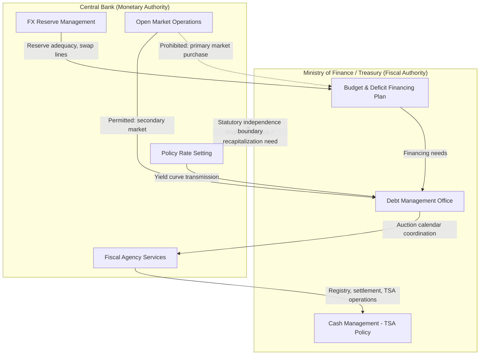

## Central Bank and Monetary-Authority Roles Adjacent to Fiscal Policymaking

### Why This Matters to a Finance-Ministry Official

A finance ministry does not manage the sovereign balance sheet in isolation. The central bank sits at nearly every pressure point of fiscal statecraft: it is the government's banker, the primary dealer network's counterparty, the debt manager's partner in auction calendars, and — in stressed states — a potential (and legally fraught) source of deficit financing. Understanding where central bank operations end and fiscal operations begin, and where the boundary is deliberately blurred, is core professional literacy for anyone managing a sovereign's fiscal position from the borrower side.

This item maps the specific institutional interfaces: fiscal agency functions, monetary financing prohibitions, the interest rate transmission channel into debt service costs, foreign exchange reserve management as a fiscal buffer, and central bank profit remittance as a quasi-fiscal revenue source.

---

### 1. The Central Bank as Fiscal Agent

Most central banks perform **fiscal agency** functions for the treasury — banking services rendered to the government distinct from monetary policy conduct. This typically comprises three operational roles:

- **Government banker**: holding the Treasury Single Account (TSA), the consolidated account structure into which most government cash balances are swept, giving the finance ministry real-time visibility over its cash position and reducing idle balances scattered across commercial bank accounts.
- **Registrar and settlement agent for government securities**: operating the auction platform, maintaining the registry of debt holders, and settling coupon and principal payments on behalf of the debt management office.
- **Advisor on debt issuance calendars**: because the central bank holds the clearest real-time view of banking-system liquidity, it typically advises (and in many jurisdictions co-determines) the timing and tenor mix of primary auctions to avoid crowding out private credit or destabilizing money markets.

**Philippine case**: the Bangko Sentral ng Pilipinas (BSP) acts as the National Government's fiscal agent under Republic Act No. 7653 (the New Central Bank Act), operating the Treasury's principal accounts and serving as registrar for Retail Treasury Bonds and most peso-denominated government securities, while the Bureau of the Treasury (BTr) retains sole authority over issuance decisions and debt strategy. The fiscal agency relationship is thus a service relationship, not a policy one — the BSP executes; the BTr decides.

---

### 2. The Monetary Financing Prohibition

**Monetary financing** (also called "deficit monetization" or, informally, "printing money to pay the bills") refers to a central bank directly purchasing government debt from the treasury or extending it overdraft credit, thereby financing the fiscal deficit through base money creation rather than through market borrowing.

The near-universal modern prohibition on this practice is not merely a monetary-policy preference — it is frequently a **binding legal constraint** written into central bank charters, precisely because historical episodes of monetary financing are the most consistent empirical predictor of high and persistent inflation.

**Legal mechanics, Philippine example**: RA 7653 originally barred the BSP from directly purchasing government securities in the primary market except to provide provisional advances to the National Government, capped at 20% of average government revenue for the last three years and repayable within three months. Republic Act No. 11211 (2019) tightened this further. However, during the COVID-19 fiscal emergency, RA 11469 (Bayanihan Act) and its successor briefly authorized the BSP to purchase government securities directly from the BTr — an explicit, time-bound, legislatively-authorized exception to the general prohibition, illustrating that monetary financing bans are statutory defaults that legislatures can suspend under emergency conditions, not immutable constitutional walls.

For a finance ministry official, the operative distinction is:

| Channel | Primary market purchase | Secondary market purchase |
| --- | --- | --- |
| Legal status (typical) | Prohibited or tightly capped | Generally permitted as monetary policy tool |
| Fiscal effect | Direct deficit monetization | Indirect — affects yields, not new financing |
| Example | Central bank buys new T-bond issue directly from treasury | Central bank buys existing T-bond in open market operations |

Secondary-market purchases under quantitative easing programs are legally distinct from monetary financing even though both expand the central bank balance sheet with government paper — the operative test is *whose decision triggers the purchase and at what price*. A primary purchase finances the deficit at a price the treasury can influence; a secondary purchase executes independent monetary policy at a market-discovered price.

---

### 3. Interest Rate Transmission into Sovereign Debt Service

The central bank's policy rate decisions are not fiscally neutral. The **policy rate** — the rate at which the central bank lends to or accepts deposits from commercial banks, used to steer short-term money market rates — anchors the entire government yield curve, meaning every basis point of tightening raises the government's marginal cost of new borrowing and rollover.

This creates a structural interdependency finance ministries must model explicitly:

- **Rollover risk amplification**: a state with a short average time-to-maturity on its debt stock (a high share of debt maturing within 1–3 years) experiences its interest bill re-pricing quickly after a tightening cycle, since a large share of the stock must be refinanced at new, higher rates within a short window.
- **Debt service as automatic fiscal drag**: rising interest costs consume budget space that would otherwise fund discretionary spending, tightening the **fiscal space** available to the government — defined as the room in a budget that allows a government to provide resources for a desired purpose without jeopardizing the sustainability of its financial position.
- **Feedback into debt sustainability analysis (DSA)**: a debt sustainability analysis projects a state's debt-to-GDP trajectory under baseline and stress scenarios to assess repayment capacity; the effective interest rate on the debt stock (r) relative to nominal GDP growth (g) is the central determinant of whether the debt-to-GDP ratio is self-stabilizing. When $r > g$, the debt ratio rises mechanically absent a primary surplus, meaning central bank tightening that pushes $r$ above $g$ directly worsens the DSA baseline even with unchanged fiscal policy.

$$\Delta d_t = \frac{r_t - g_t}{1+g_t} d_{t-1} - pb_t + sfa_t$$

Where $d_t$ is the debt-to-GDP ratio, $r_t$ the effective (nominal) interest rate, $g_t$ nominal GDP growth, $pb_t$ the primary balance (percent of GDP), and $sfa_t$ stock-flow adjustments. A finance ministry monitoring central bank policy signals is, in effect, monitoring a direct input to its own debt dynamics equation.

**Philippine case**: the BSP's policy tightening cycle from 2022–2023 (raising the overnight reverse repurchase rate cumulatively by 450 basis points to combat imported inflation) coincided with rising yields on Treasury bonds, directly increasing the BTr's weighted average cost of new peso issuance and prompting a shift in the government's borrowing mix toward more foreign-currency and multilateral financing to manage the blended cost of funds — a concrete illustration of monetary policy transmission constraining fiscal financing choices.

---

### 4. Foreign Exchange Reserves as a Quasi-Fiscal Buffer

Central banks hold **gross international reserves (GIR)** — foreign currency assets, gold, and IMF reserve position holdings — primarily for exchange rate management and import/external-debt coverage, but these reserves also function as a de facto fiscal backstop in several respects:

- **External debt service coverage**: reserve adequacy metrics (e.g., months of import cover, or reserves relative to short-term external debt under the Greenspan-Guidotti rule of thumb) are a standard input to sovereign credit ratings, and rating actions feed directly into the government's external borrowing cost.
- **Swap line and standby credit capacity**: bilateral and multilateral swap lines (e.g., Chiang Mai Initiative Multilateralization in ASEAN+3, or IMF Flexible Credit Lines) are typically negotiated by the central bank but represent contingent fiscal insurance the finance ministry factors into contingency financing plans.
- **Reserve accumulation as sterilized fiscal cost**: when a central bank accumulates reserves through foreign exchange intervention, it typically **sterilizes** the resulting peso liquidity injection by issuing its own central bank securities or conducting reverse repos — an operation that carries an interest cost to the central bank (and, via profit remittance discussed below, an indirect cost to the treasury) distinct from and often larger than the yield earned on the reserve assets themselves.

---

### 5. Central Bank Profit Remittance and Quasi-Fiscal Deficits

Central banks are typically required by charter to remit a share of net profits to the national treasury, making central bank profitability a genuine — if volatile — line item in fiscal revenue.

Conversely, a central bank can run **quasi-fiscal deficits**: operating losses arising not from monetary policy per se but from carrying out policy-adjacent functions with fiscal character — subsidized lending facilities, foreign exchange losses on reserve holdings during currency appreciation, or the sterilization costs described above. When a central bank posts sustained losses, it faces **recapitalization** — an equity injection, usually from the treasury — which is itself a fiscal outlay that must be budgeted and often reflected in headline deficit or debt figures depending on the statistical treatment (below-the-line financing versus above-the-line expenditure) under the IMF's *Government Finance Statistics Manual*.

**Philippine case**: under RA 7653 as amended, the BSP remits a portion of its net income to the National Government after allocating to statutory reserves; conversely, the BSP's own paid-in capital has periodically been the subject of legislative recapitalization measures (as under RA 11211) precisely because a chronically undercapitalized central bank is understood to weaken confidence in currency stability, an outcome no finance ministry wants transmitted into its own borrowing costs via country risk premia.

---

### 6. Central Bank Independence and the Fiscal Dominance Risk

**Central bank independence (CBI)** — the institutional insulation of monetary policy decisions from short-term political or fiscal pressure, typically operationalized through fixed-term, non-removable-at-will governor appointments and a statutory price stability mandate — exists specifically to prevent **fiscal dominance**: a regime in which fiscal financing needs override monetary policy objectives, forcing the central bank to keep rates artificially low or monetize deficits to keep government debt service manageable.

From the borrower-state perspective, fiscal dominance risk is a *self-inflicted* threat to market access: rating agencies and bond investors price in perceived central bank independence as a proxy for inflation-control credibility, meaning that legislative pressure to compel central bank financing of the deficit — even when technically feasible — tends to raise, not lower, the government's overall cost of capital by signaling weakened institutional discipline.

This produces the core practitioner tension finance ministry officials must navigate: the central bank is simultaneously the treasury's most important operational partner (fiscal agency, debt settlement, reserve backstop) and the institution most legally and normatively insulated from direct fiscal instruction — a deliberate design feature, not an oversight.

---

### Institutional Interface Map

---

### Key Points

- **Fiscal agency** (banking, registry, settlement) is a service function performed *for* the treasury and is legally and operationally distinct from **monetary policy conduct**, even when the same institution performs both.
- The **monetary financing prohibition** typically targets primary-market central bank purchases of government debt, not secondary-market operations — the distinction matters for interpreting quantitative easing programs correctly.
- Central bank policy rate decisions transmit directly into the government's cost of new borrowing and rollover, making the DSA's $r - g$ differential partly a function of monetary policy independent of fiscal choices.
- Foreign exchange reserves function as a quasi-fiscal buffer via credit rating channels and contingent swap-line access, while reserve accumulation carries a sterilization cost that can itself become a quasi-fiscal drag.
- Central bank profit remittance is a genuine fiscal revenue source; central bank losses can require treasury-funded recapitalization, creating a bidirectional balance-sheet linkage.
- Central bank independence is structurally protective of the state's own borrowing costs by signaling inflation-control credibility to creditors — fiscal pressure to override it tends to be self-defeating for the borrower.

**Related Topics**

- Treasury Single Account (TSA) design and cash management consolidation
- Sovereign credit rating methodology and the role of reserve adequacy metrics
- Quantitative easing versus monetary financing: legal and operational distinctions
- Local-currency debt market development and the role of primary dealer systems
- IMF Government Finance Statistics (GFS) treatment of central bank recapitalization
- Currency board and dollarization regimes as extreme cases of fiscal-monetary separation