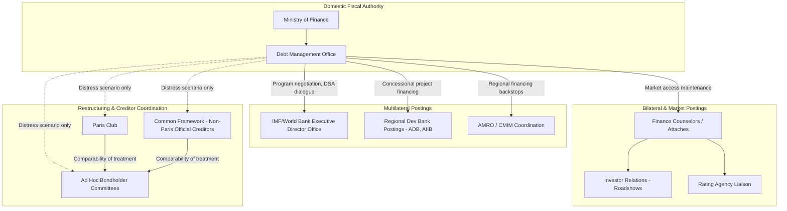

## Diplomatic and Multilateral Postings in Sovereign Debt and Finance Diplomacy

### Why This Matters to a Finance-Ministry Official

Fiscal statecraft is not conducted solely from a treasury desk in the capital. A significant share of sovereign debt strategy — negotiating restructuring terms, securing concessional financing windows, coordinating creditor committees, and defending a state's macroeconomic narrative before rating agencies and bondholders — is executed through a network of overseas postings that sit at the intersection of finance ministry, central bank, and foreign ministry mandates. Understanding the institutional map of these postings, their formal authorities, and how they interlock with domestic debt management is essential professional literacy for anyone building a career path in sovereign fiscal affairs.

This item catalogs the principal posting types, their legal and operational mandates, and the coordination mechanisms that connect them back to the domestic debt management office.

---

### 1. Executive Director Offices at the IMF and World Bank

Each IMF member state is represented not individually but through **constituency offices**, each headed by an **Executive Director (ED)** who sits on the IMF's Executive Board and votes a bloc of shares held by the constituency's member countries, weighted by each country's IMF quota — the capital subscription that determines both financial contribution and voting power.

For a borrower-side finance ministry, the ED office is the primary channel through which:

- **Article IV consultation outcomes** are negotiated and defended at the Board level. An Article IV consultation is the IMF's mandatory annual bilateral surveillance exercise assessing a member's exchange rate and macroeconomic policies; the staff report's language on debt sustainability directly affects market perception and borrowing costs even absent a program.
- **Program design terms** (for states under an IMF-supported program) are negotiated — Extended Fund Facility access levels, conditionality calibration, and disbursement schedules are shaped through both staff-level negotiation and ED-level advocacy.
- **Debt Sustainability Analysis (DSA) classifications** are contested. A country's assessed risk of debt distress (low, moderate, high, or in distress under the Low-Income Country Debt Sustainability Framework) has direct consequences for concessional borrowing eligibility, and finance ministry officials seconded to or coordinating with the ED office often engage in technical dialogue over DSA assumptions (growth projections, contingent liability treatment, discount rates).

**Philippine case**: the Philippines sits in a Southeast Asian IMF constituency, and BTr and Department of Finance officials coordinate closely with the Manila-based mission and the ED office in Washington during Article IV missions, with technical staff frequently seconded for multi-year rotations to build institutional fluency in Fund methodology before returning to domestic debt management roles — a common career pathway for debt office professionals.

---

### 2. Sovereign Debt Attachés and Finance Counselors in Bilateral Embassies

Larger or more debt-active states post **finance counselors** or **economic/financial attachés** in embassies located in major creditor or financial-center capitals (Washington, London, Tokyo, Beijing, Brussels for EU institutional access). Their functions typically include:

- **Bilateral creditor relationship management**: for states with significant official bilateral debt, the attaché maintains the working relationship with the creditor country's export credit agency or development finance institution (e.g., China's Ministry of Finance and China Eximbank, Japan's JICA, or the U.S. DFC), which is distinct from and complements multilateral engagement.
- **Investor relations support**: coordinating non-deal roadshows — investor meetings held without an accompanying bond issuance, used to maintain market familiarity and support secondary-market pricing between actual issuances — ahead of planned sovereign bond issuance.
- **Rating agency liaison**: scheduling and substantively preparing for the periodic sovereign rating review meetings with S&P, Moody's, and Fitch analysts, ensuring the fiscal narrative presented is consistent with the finance ministry's official medium-term fiscal framework.

---

### 3. The Paris Club and Ad Hoc Official Creditor Coordination

The **Paris Club** is an informal group of predominantly OECD official bilateral creditors that coordinates debt rescheduling and restructuring terms for distressed sovereign borrowers, operating on the principle of **comparability of treatment** — the requirement that a debtor obtain terms from non-Paris Club creditors (including private bondholders) no more favorable than those granted by the Paris Club, to prevent free-riding.

A borrower state engaging the Paris Club typically requires:

- **A prior IMF-supported program**, since Paris Club treatment has historically been conditioned on an active Fund arrangement establishing the financing need and adjustment path.
- **A dedicated negotiating delegation**, usually led by the finance ministry's debt management office in coordination with the ED office and, increasingly, external legal and financial advisors specializing in sovereign restructuring.

The Paris Club's traditional dominance has eroded as bilateral lending from non-Paris Club official creditors — principally China — has grown to exceed Paris Club exposure for many low-income borrowers, prompting the **Common Framework for Debt Treatment**, a G20-endorsed 2020 initiative extending Paris Club-style coordination to include major non-Paris Club official creditors (China, India, Saudi Arabia) for eligible low-income countries. [Inference: the Common Framework's practical efficacy remains contested — as of the last several cases processed (Chad, Zambia, Ghana, Ethiopia), completion timelines have substantially exceeded original expectations, and empirical assessment of the framework's long-run credibility is not yet settled.]

---

### 4. Bondholder Committee Negotiations and Legal Diplomacy

When a sovereign restructures privately-held debt (as opposed to official bilateral or multilateral debt), the counterparty is typically an **ad hoc bondholder committee** — a self-organized group of institutional creditors (asset managers, hedge funds) representing a critical mass of outstanding bond exposure, retaining their own financial and legal advisors.

Key mechanisms a finance ministry delegation must navigate:

- **Collective Action Clauses (CACs)**: contractual provisions embedded in sovereign bond documentation allowing a qualified supermajority of bondholders (commonly 75%) to bind all bondholders, including dissenters, to restructuring terms — designed to prevent **holdout creditors** from blocking a restructuring to extract preferential settlement.
- **Aggregated voting / single-limb CACs**: post-2014 ICMA (International Capital Market Association) model CAC language allows voting to be aggregated across multiple bond series rather than requiring separate supermajorities in each series, substantially reducing holdout leverage — a direct legal-diplomacy lesson from Argentina's 2001–2016 holdout litigation saga.
- **Comparability of treatment across creditor classes**: private bondholder committees routinely demand assurance that official bilateral creditors are bearing commensurate relief, creating a three-way negotiating triangle (state, official creditors, private creditors) that finance ministry delegations must sequence carefully.

**Philippine case**: the Philippines has not undergone a sovereign debt restructuring in the CAC-litigation sense in recent decades, maintaining investment-grade status; its debt diplomacy posture is therefore oriented toward *preventive* investor relations and proactive liability management (voluntary bond exchanges, buybacks) rather than distressed-debt renegotiation — illustrating that finance diplomacy skill sets span both crisis restructuring and routine market-access maintenance.

---

### 5. Regional Multilateral Postings

Beyond the IMF and World Bank, regional development banks and monetary cooperation bodies host their own constituency or delegate postings relevant to fiscal statecraft:

- **Asian Development Bank (ADB)**, headquartered in Manila, where Philippine officials hold both a natural proximity advantage and a formal ED seat given the Philippines' founding-member status.
- **ASEAN+3 Macroeconomic Research Office (AMRO)**, the surveillance unit supporting the **Chiang Mai Initiative Multilateralization (CMIM)** — a regional network of bilateral currency swap arrangements functioning as a supplementary liquidity backstop to IMF facilities for ASEAN+3 members.
- **AIIB (Asian Infrastructure Investment Bank)** and other newer multilateral development banks, where postings increasingly matter for states diversifying financing sources away from traditional Bretton Woods institutions.

---

### Institutional Posting Map

---

### Key Points

- IMF/World Bank engagement runs through **constituency Executive Director offices**, not direct bilateral channels, making ED-office relationship management a distinct professional skill from domestic debt management.
- Finance counselors and attachés handle bilateral creditor relations and investor relations, functioning as the forward-deployed extension of the domestic debt management office in creditor and financial-center capitals.
- The **Paris Club** and the newer **Common Framework** coordinate official bilateral creditor treatment, bound together by the **comparability of treatment** principle that also extends to private bondholder negotiations.
- **Collective Action Clauses**, particularly post-2014 aggregated/single-limb variants, are the primary contractual technology for managing holdout creditor risk in private bond restructurings.
- Regional multilateral bodies (ADB, AMRO/CMIM, AIIB) provide supplementary financing and surveillance channels increasingly material to diversified fiscal statecraft, distinct from Bretton Woods institutions.
- These postings collectively represent a distinct career pathway within public finance: technical rotation through multilateral secondments and bilateral finance-diplomacy postings is a common route to senior debt management office leadership.

**Related Topics**

- Debt Sustainability Analysis (DSA) methodology under the IMF/World Bank Low-Income Country and Market-Access frameworks
- Collective Action Clauses and the mechanics of sovereign bond restructuring litigation (Argentina, Greece case studies)
- Liability management operations: voluntary bond exchanges, buybacks, and pre-emptive restructuring
- The Common Framework for Debt Treatment: case review (Chad, Zambia, Ghana, Ethiopia)
- Sovereign credit rating methodology and the investor relations function
- Regional financial safety nets: Chiang Mai Initiative Multilateralization and comparable arrangements