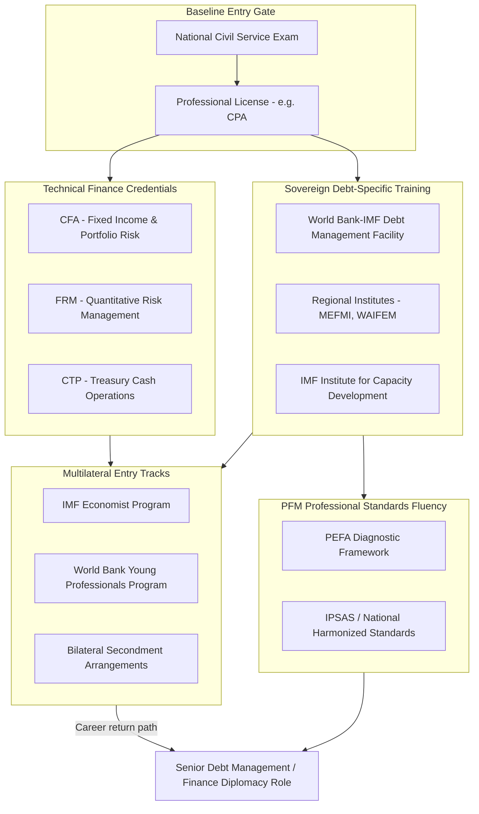

## Credentials, Examinations, and Professional Bodies in Public Finance

### Why This Matters to a Finance-Ministry Official

Entry into and advancement within sovereign fiscal institutions — treasury departments, debt management offices, central banks, and the multilateral bodies that surround them — is gated by a specific, if fragmented, credentialing landscape. Unlike corporate finance, where the CFA charter functions as a near-universal signal, public finance credentialing splits across national civil-service examinations, sovereign-specific debt management certifications, multilateral recruitment tracks, and general finance credentials repurposed for public-sector use. Knowing which credential signals which competency — and to which institution — is directly relevant to career planning for an aspiring finance-ministry official or diplomat.

This item catalogs the principal credentialing pathways, their examination structure, and their institutional recognition, with the Philippine civil-service and BTr/BSP recruitment pathway as the concrete national example.

---

### 1. National Civil-Service Examinations as the Baseline Gate

In most sovereign states, entry into finance ministry and treasury roles first requires clearing a **general civil-service examination**, distinct from any finance-specific credential, testing general aptitude, ethics, and public administration competency rather than technical fiscal knowledge.

**Philippine case**: entry-level positions in the Department of Finance, Bureau of the Treasury, and most national government agencies require passing the **Civil Service Commission (CSC) Career Service Examination** (Professional or Sub-Professional level, depending on position grade), administered under the Civil Service Commission's constitutional mandate as the central personnel agency of government. For professional and technical roles specifically within finance offices, many positions additionally require or strongly prefer a **Certified Public Accountant (CPA)** license issued by the Professional Regulation Commission (PRC), given that the CPA licensure examination covers financial accounting, taxation, management advisory services, and — critically for fiscal roles — **regulatory framework for business transactions**, giving CPA holders a baseline fluency in public financial management that pure civil-service passage does not guarantee.

This two-tier structure (general civil service eligibility plus, often, a professional license) is common across many sovereign bureaucracies, though the specific credentialing body and examination content vary by jurisdiction.

---

### 2. Chartered and Professional Finance Credentials with Public-Sector Relevance

Several internationally recognized finance credentials, though not designed exclusively for the public sector, carry substantial weight in debt management office and treasury recruitment because their curricula cover fixed income, portfolio risk, and macroeconomic analysis directly applicable to sovereign debt management:

- **Chartered Financial Analyst (CFA)**: a three-level examination administered by the CFA Institute covering equity and fixed-income valuation, portfolio management, ethics, and economics. While originally designed for asset management, its **fixed income and derivatives curriculum** (particularly duration, convexity, and yield curve analysis) maps closely onto sovereign debt portfolio risk management, making it a common credential among debt management office professionals managing interest rate and refinancing risk on the government's own liability portfolio.
- **Financial Risk Manager (FRM)**, administered by the Global Association of Risk Professionals (GARP): more narrowly focused on quantitative risk measurement (Value-at-Risk, stress testing, credit risk modeling), relevant to the risk management units within debt management offices responsible for producing the **Medium-Term Debt Management Strategy (MTDS)** — the analytical framework, jointly developed by the IMF and World Bank, that debt managers use to evaluate the cost-risk tradeoffs of alternative borrowing compositions (currency mix, maturity structure, fixed versus floating rate exposure).
- **Certified Treasury Professional (CTP)**, administered by the Association for Financial Professionals (AFP): oriented toward corporate and institutional treasury operations (cash management, liquidity forecasting), with partial applicability to the government cash management function performed by treasury single account operations.

None of these credentials is a formal requirement for public finance roles in most jurisdictions; they function as **market signals** that a candidate has technical fixed-income and risk-management fluency, and are frequently pursued mid-career by debt management office staff seeking secondment to multilateral institutions where such credentials are more commonly held by peer staff.

---

### 3. Sovereign Debt-Management-Specific Training and Certification

A narrower set of programs target sovereign (rather than corporate or personal) debt management specifically:

- **Debt Management Facility (DMF)** training programs, jointly operated by the World Bank and IMF, providing structured technical assistance and capacity-building curricula (not a formal certification exam, but a recognized training pathway) covering debt recording systems, MTDS formulation, and DSA methodology, specifically targeted at low- and middle-income country debt management offices.
- **Macroeconomic and Financial Management Institute of Eastern and Southern Africa (MEFMI)** and comparable regional training institutes elsewhere (e.g., the **West African Institute for Financial and Economic Management, WAIFEM**) provide regional certificate-level training in debt management, macroeconomic modeling, and financial sector management for government officials, functioning as a regional analog to a professional credentialing body even without conferring a globally portable credential.
- **IMF Institute for Capacity Development (ICD)** and **IMF-Singapore Regional Training Institute (STI)** courses: short-form (typically 1–3 week) technical courses on public financial management, DSA methodology, and macro-fiscal analysis, widely used as continuing professional development for finance ministry staff and, in some jurisdictions, treated as a career-track credential contributing to promotion eligibility.

[Unverified: whether completion of specific DMF, MEFMI, or IMF Institute courses formally counts toward civil-service promotion point systems varies by country and is generally governed by each finance ministry's internal human-resource regulations rather than any standardized international accreditation body; officials should confirm applicability against their own jurisdiction's civil-service rules rather than assuming portability.]

---

### 4. Multilateral Institution Recruitment Tracks

The IMF, World Bank, and regional development banks maintain their own internal professional entry pathways, which function as de facto credentialing routes into international fiscal-diplomacy careers:

- **IMF Economist Program (EP)**: a structured, roughly 2–3 year entry-level track for PhD or equivalent-credentialed economists, involving rotational assignments across area and functional departments, widely regarded as a primary pipeline into senior IMF country-desk and mission-chief roles that finance ministries interact with directly during Article IV consultations and program negotiations.
- **World Bank Young Professionals Program (YPP)**: a highly selective annual recruitment track (advanced degree plus development-relevant experience) feeding into World Bank operational and policy roles, including public finance and governance global practice units.
- **Secondment and Fund-Bank Visiting Scholar arrangements**: finance ministries and central banks frequently negotiate bilateral secondment slots allowing domestic officials to rotate through IMF or World Bank departments for fixed terms (commonly 1–2 years), which — while not a formal credential — functions as a significant career-signaling device for subsequent promotion into senior domestic debt management or international finance roles.

**Philippine case**: BSP and BTr officials have historically used **IMF technical assistance missions and STI course attendance**, combined with periodic secondments to the ADB (headquartered in Manila) and the IMF, as the principal non-credential pathway for building the institutional fluency later required for ED-office or senior multilateral liaison roles.

---

### 5. Public Financial Management (PFM)-Specific Academic and Professional Frameworks

Beyond examinations and licenses, two frameworks function as de facto professional standards that practitioners are expected to be fluent in, even absent a formal certifying exam:

- **PEFA (Public Expenditure and Financial Accountability) framework**: a diagnostic methodology, jointly developed by the World Bank, IMF, European Commission, and several bilateral partners, that scores a country's public financial management systems (budget credibility, transparency, asset/liability management) against standardized indicators. Fluency in PEFA assessment methodology is a recognized (though not formally certified) competency expected of senior PFM officials and is frequently a prerequisite skill set for World Bank or IMF PFM advisory roles.
- **International Public Sector Accounting Standards (IPSAS)**, issued by the IPSAS Board under the International Federation of Accountants (IFAC): the accrual-accounting standard framework increasingly adopted by governments (including the Philippines, via the **Philippine Public Sector Accounting Standards**, harmonized substantially with IPSAS) for government financial reporting, relevant to officials working in government accounting and financial reporting roles adjacent to debt management.

---

### Credentialing Pathway Map

---

### Key Points

- Public finance credentialing is **layered, not unitary**: a general civil-service examination gates entry, a professional license (e.g., CPA) is often separately required, and technical finance credentials (CFA, FRM) are market signals rather than formal prerequisites.
- Sovereign debt management has its own specialized (non-exam-based) training ecosystem — the World Bank-IMF Debt Management Facility, regional institutes like MEFMI and WAIFEM, and IMF Institute courses — distinct from generalist finance credentials.
- Multilateral institution recruitment tracks (IMF Economist Program, World Bank YPP, bilateral secondments) function as career-defining credentialing routes into international fiscal-diplomacy roles, even though they are employment programs rather than formal certifications.
- Fluency in **PEFA** and **IPSAS** frameworks is an expected, largely self-directed competency for senior public financial management officials, reflecting the diagnostic and accounting standards multilateral advisors and domestic reformers both operate against.
- The Philippine pathway illustrates the layered model concretely: CSC examination plus CPA licensure for entry, followed by IMF/ADB technical assistance and secondment exposure as the principal route to senior debt management and finance-diplomacy roles.

**Related Topics**

- Medium-Term Debt Management Strategy (MTDS) methodology and cost-risk tradeoff analysis
- PEFA assessment methodology and its use in donor budget-support conditionality
- IPSAS accrual accounting transition and government financial reporting reform
- Civil service reform and merit-based recruitment systems in public financial management institutions
- Career pathways from domestic debt management office to multilateral secondment roles