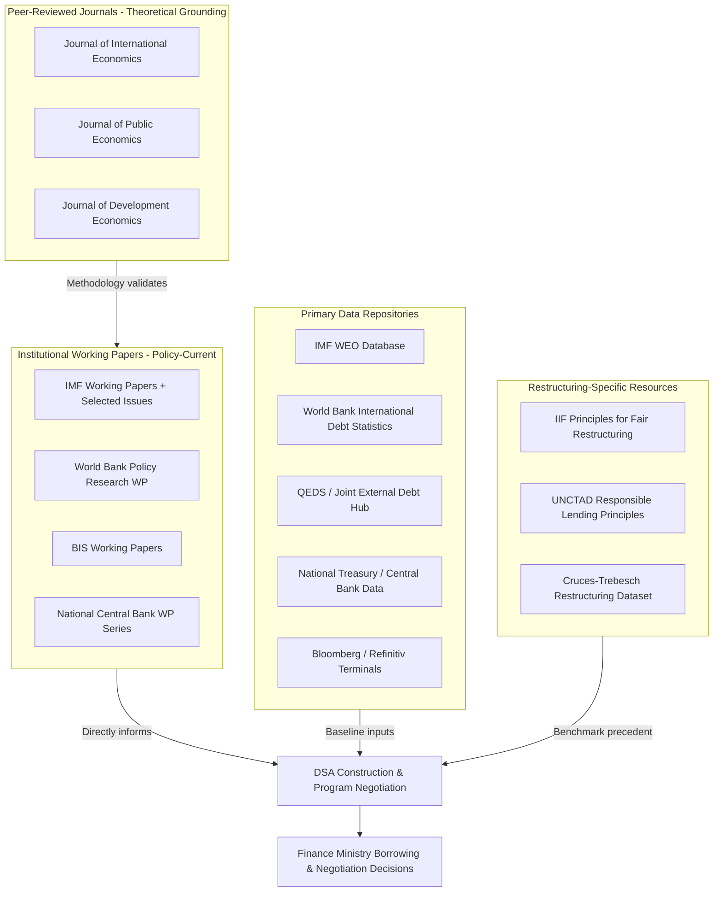

## Foundational Journals, Working-Paper Series, and Data Sources for Practitioners

### Why This Matters to a Finance-Ministry Official

Fiscal statecraft practitioners operate under continuous pressure to ground borrowing decisions, DSA assumptions, and negotiating positions in defensible empirical and analytical literature — both to withstand internal scrutiny (legislative budget hearings, Commission on Audit review) and external scrutiny (rating agency analysts, bondholder due diligence, IMF mission teams). Unlike academic finance, where publication venues are relatively settled, public finance practitioners draw on a hybrid ecosystem: peer-reviewed journals, institutional working-paper series that often move faster and more directly on policy-relevant questions than journals, and primary data repositories that are frequently the actual analytical inputs rather than secondary commentary. Knowing which source to consult for which purpose — and which carry institutional authority in DSA and program negotiation contexts — is a core practitioner skill.

This item catalogs the principal venues and repositories, organized by function: academic literature, institutional working-paper series, and primary data sources, with note on how the Philippine debt management office draws on each.

---

### 1. Peer-Reviewed Academic Journals

Academic journals establish the theoretical and empirically-validated foundations for concepts practitioners apply operationally (debt sustainability thresholds, fiscal multiplier estimates, sovereign spread determinants). The most operationally relevant venues include:

- **Journal of International Economics** and **Journal of Monetary Economics**: primary venues for peer-reviewed sovereign debt theory, including the foundational literature on sovereign default models (e.g., the Eaton-Gersovitz framework underlying most modern quantitative sovereign default models) and exchange rate regime analysis relevant to currency composition decisions in debt portfolios.
- **Journal of Public Economics**: the leading venue for tax policy, fiscal multiplier, and public expenditure efficiency research, directly relevant to revenue mobilization strategy — a core determinant of the **primary balance** ($pb_t$) term in the debt dynamics equation.
- **Journal of Development Economics**: emphasizes low- and middle-income country fiscal and debt issues specifically, including empirical work on debt overhang effects and the growth impact of debt distress episodes, directly relevant to DSA stress-test calibration.
- **IMF Economic Review** (published by Palgrave Macmillan in partnership with the IMF): a peer-reviewed academic journal (distinct from IMF staff working papers) publishing rigorous empirical and theoretical work with direct policy relevance, often authored by a mix of academics and Fund staff.

[Inference: for a practitioner audience, academic journals are generally consulted for methodological validation and literature grounding rather than as a primary daily information source, given publication lag times of 1–3 years relative to the working-paper series described below, which typically circulate findings months to a year ahead of formal journal publication.]

---

### 2. Institutional Working-Paper Series

Working-paper series from the IMF, World Bank, and central banks function as the practitioner's primary technical literature, because they are policy-oriented, faster to publish, and frequently authored by the same staff conducting live Article IV missions and DSA reviews.

- **IMF Working Papers (WP series)**: the single most operationally relevant series for a debt management office, frequently containing the methodological updates underlying revisions to the DSA framework itself (e.g., papers formally proposing changes later adopted into the Low-Income Country DSF or the Sovereign Risk and Debt Sustainability Framework for market-access countries, adopted in 2022). Country-specific selected issues papers accompanying Article IV consultations are also published in this series and are frequently the most detailed technical analysis of a specific sovereign's fiscal position publicly available.
- **World Bank Policy Research Working Papers**: broader development-economics scope, including systematic empirical work on debt transparency (notably the World Bank's own research on hidden and collateralized debt disclosure gaps, directly relevant to DSA data quality assessments) and public investment management.
- **BIS (Bank for International Settlements) Working Papers and Quarterly Review**: the primary source for cross-border capital flow analysis, sovereign bond market functioning, and central bank policy transmission research, particularly relevant to understanding how domestic monetary tightening interacts with sovereign spread determination in international markets.
- **National central bank working paper series** (e.g., BSP's own **Working Paper Series** and the **BSP Economic Newsletter**): country-specific applied research directly informing domestic monetary-fiscal interaction analysis, often the most granular source for understanding a specific jurisdiction's transmission mechanisms.
- **NBER Working Papers** (National Bureau of Economic Research): broader macro-finance scope, less public-finance-specific, but a standard reference point for sovereign risk premium and fiscal multiplier estimation methodology that filters into IMF and World Bank applied work.

---

### 3. Primary Data Sources and Statistical Repositories

For DSA construction, program monitoring, and market analysis, practitioners rely on a specific set of primary data repositories rather than secondary literature:

- **IMF World Economic Outlook (WEO) database**: the standard source for medium-term macroeconomic projections (growth, inflation, current account) used as baseline DSA inputs, updated semi-annually (April and October).
- **World Bank International Debt Statistics (IDS)**: the primary cross-country external debt stock and flow database, including the **Debtor Reporting System** data disaggregating debt by creditor type (multilateral, bilateral official, commercial), essential for comparability-of-treatment analysis in restructuring negotiations.
- **World Bank/IMF Quarterly External Debt Statistics (QEDS)** and the **Joint External Debt Hub (JEDH)**: higher-frequency external debt position data reconciling creditor- and debtor-reported figures.
- **BIS International Banking Statistics**: cross-border bank lending exposure data, useful for triangulating a sovereign's or its private sector's external liability exposure against national reporting.
- **National treasury and central bank primary data**: for the Philippines specifically, the **BTr's Bureau of the Treasury website** publishes the government securities auction results, outstanding debt stock by instrument, and the **National Government Debt Report**; the **BSP's Depository, Corporation, and other Financial Statistics** publications provide balance-of-payments and external debt data reconciled against BTr figures.
- **Institute of International Finance (IIF) Capital Flows Tracker** and comparable private-sector data services: proprietary but widely referenced by debt management offices for real-time portfolio flow monitoring ahead of planned issuance windows, since official data typically lags market-moving flow shifts by weeks to months.
- **Bloomberg, Refinitiv (LSEG) terminals**: the standard commercial data infrastructure for real-time yield curve, credit default swap spread, and comparable-sovereign benchmark tracking used operationally in auction pricing decisions — distinct from the above research-oriented sources in being transaction-grade rather than analytical.

---

### 4. Sovereign Debt Restructuring-Specific Resources

A narrower set of specialized resources serve practitioners specifically engaged in or preparing for distressed-debt scenarios:

- **Institute of International Finance's Principles for Stable Capital Flows and Fair Debt Restructuring**: a voluntary code of conduct developed jointly by private creditors and sovereign issuers, frequently referenced as a normative benchmark during restructuring negotiations even though not legally binding.
- **UNCTAD Principles on Promoting Responsible Sovereign Lending and Borrowing**: a complementary framework emphasizing borrower-side responsible debt management practices, relevant to finance ministries seeking to benchmark their own debt governance against an international normative standard.
- **Debt Data Portal (jointly maintained by the World Bank)** and academic sovereign restructuring databases (e.g., the **Cruces-Trebesch sovereign debt restructuring dataset**, widely cited in DSA haircut assumption calibration): empirical repositories of historical restructuring terms (haircuts, maturity extensions) used to benchmark negotiating positions against comparable precedent cases.

---

### Practitioner Source Map

---

### Key Points

- Academic journals establish theoretical and empirical grounding but lag policy relevance; **institutional working-paper series** (especially IMF WP and country Selected Issues papers) are the practitioner's primary current-technical-literature source.
- The **IMF WEO database**, **World Bank International Debt Statistics**, and **QEDS/JEDH** together form the standard primary-data backbone for DSA construction and cross-country debt comparability analysis.
- National-level data (BTr auction results, National Government Debt Report, BSP external statistics) must be actively reconciled against multilateral cross-country databases, since reporting definitions and timing can diverge.
- Restructuring-specific resources (IIF Principles, UNCTAD Principles, Cruces-Trebesch dataset) function as both normative benchmarks and empirical precedent repositories during distressed-debt negotiations, distinct from routine market-access data sources.
- Commercial terminal data (Bloomberg, Refinitiv) serves a transaction-grade operational function distinct from the analytical/research sources above, and is typically the input used for live auction pricing decisions rather than medium-term strategy formulation.

**Related Topics**

- Debt Sustainability Analysis (DSA) input construction and data reconciliation practices
- The Sovereign Risk and Debt Sustainability Framework (SRDSF) for market-access countries
- Debt transparency and hidden/collateralized debt disclosure gaps in World Bank research
- Historical sovereign restructuring precedent analysis using the Cruces-Trebesch dataset
- Article IV Selected Issues papers as a technical analysis resource for country-specific fiscal research