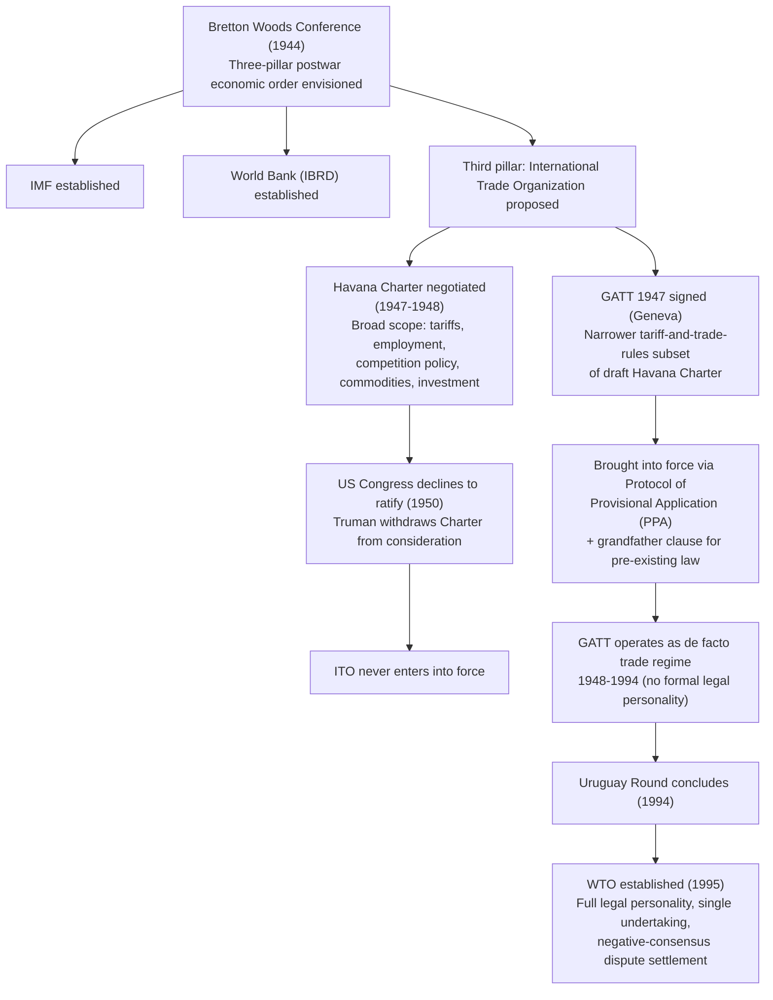

## GATT 1947 and the Failed International Trade Organization (Havana Charter)

### Institutional Context: What Was Supposed to Happen

The postwar economic order was designed around three pillars agreed at Bretton Woods (1944): the International Monetary Fund for currency stability, the International Bank for Reconstruction and Development (World Bank) for reconstruction financing, and a proposed third pillar for trade. That third pillar was never built as intended. What exists in its place—the General Agreement on Tariffs and Trade (GATT)—was conceived as a stopgap, not a permanent institution, and it operated as the de facto trade regime for 47 years (1948–1995) precisely because its intended replacement collapsed.

Understanding this failure matters to a trade negotiator because it explains a structural peculiarity that persists even after the WTO's creation in 1995: the WTO inherited GATT's culture of consensus-based, member-driven governance rather than the more autonomous, ITO-style institutional authority that was originally negotiated. The path not taken shapes the path that was.

### The Havana Charter: Institutional Ambition

**Legal basis and negotiating history.** The United States, drawing on a 1945 proposal for an International Trade Organization (ITO), convened negotiations that culminated in the Havana Conference on Trade and Employment (November 1947–March 1948). The result was the Havana Charter, a comprehensive 106-article treaty establishing the ITO as a full specialized agency of the United Nations, comparable in institutional weight to the IMF and World Bank.

The Havana Charter's scope was far broader than tariff reduction. It covered:

- **Commercial policy**: tariffs, quantitative restrictions, customs administration, and non-discrimination (most-favored-nation treatment).
- **Employment policy**: member commitments to pursue full employment as a precondition for trade liberalization, reflecting the interwar lesson that unemployment drove protectionism.
- **Restrictive business practices**: an early competition-law chapter empowering the ITO to investigate international cartels.
- **Commodity agreements**: rules for managing price volatility in primary commodities.
- **Economic development**: provisions allowing developing members to use protective measures for industrialization—a precursor to what GATT/WTO law later formalized as special and differential treatment (S&DT), meaning derogations or extended timelines granted to developing-country members from otherwise generally applicable disciplines.
- **Investment**: rules touching foreign direct investment, which proved especially contentious.

Structurally, the ITO would have had a Conference (plenary), an Executive Board, and a Secretariat—an institutional architecture with genuine legal personality and organizational autonomy, unlike the GATT's later status as a mere multilateral treaty administered by a Secretariat with no independent international legal personality.

### Why the ITO Failed

**The proximate cause**: the U.S. Congress never ratified the Havana Charter. President Truman submitted it for consideration but, facing a hostile Congress and organized business opposition, withdrew it from consideration in December 1950 without a ratification vote. Since the entire postwar trade order was being architected around U.S. leadership and U.S. market access, non-ratification by the U.S. was fatal; other governments had little incentive to bind themselves to an organization the principal market power would not join.

**The substantive causes** a negotiator should understand, because they recur as fault lines in trade politics generally:

1. **Sovereignty cost of institutional strength.** The ITO's binding dispute mechanisms and broad regulatory scope (competition policy, employment policy, commodity controls) were seen by U.S. business interests and congressional skeptics as ceding excessive regulatory sovereignty to an international body.
2. **Ideological asymmetry.** The Charter's accommodations to developing-country industrial policy and full-employment commitments were viewed by free-market critics as compromising the liberal trade principles the U.S. sought to export, while some developing countries viewed the Charter as insufficiently protective of infant industries.
3. **Competing domestic priorities.** By 1950, Cold War geopolitics and the Korean War had displaced trade institution-building on the U.S. legislative agenda.

**[Inference]** The scale of the Havana Charter's ambitions—regulating employment policy and competition law alongside tariffs—likely made it a larger target for domestic political opposition than a narrower tariff-focused agreement would have been; this is a widely held historical interpretation among trade historians rather than a documented causal finding.

### GATT 1947: The Provisional Fragment That Endured

**Legal basis.** While the Havana Charter negotiations were still underway, a subset of ITO negotiators concluded a narrower agreement—the General Agreement on Tariffs and Trade, signed in Geneva in October 1947—covering only the tariff-and-trade-rules chapter of the draft Charter. It was intended to lock in the tariff concessions from the 1947 Geneva Round while the fuller ITO was being ratified.

Crucially, GATT 1947 was brought into force not as a ratified treaty but through the **Protocol of Provisional Application (PPA)**, signed by the original contracting parties. The PPA allowed signatories to apply GATT's provisions without submitting them to full domestic legislative ratification, subject to a critical carve-out: the **grandfather clause**, under which existing domestic legislation inconsistent with GATT Part II (Articles III–XXIII, covering national treatment, non-tariff measures, and most substantive obligations) could remain in force if it predated the country's accession. Only GATT Part I (Article I, MFN; Article II, tariff schedules) and Part III (procedural/administrative articles) had to be applied in full.

This provisional, patchwork legal basis had lasting consequences:

- GATT had no formal international legal personality; it operated as a treaty-based arrangement among "CONTRACTING PARTIES" (capitalized in GATT usage to denote the collective body acting jointly, as distinct from individual signatories).
- The Secretariat that grew up to administer GATT (eventually the "Interim Commission for the ITO," or ICITO) existed in a legally ambiguous, ad hoc status for nearly five decades.
- The grandfather clause allowed longstanding protectionist measures (this is the historical origin of exceptions such as U.S. agricultural quotas and the Jones Act shipping restrictions) to persist outside GATT discipline indefinitely, weakening the credibility of GATT's core obligations from the outset.

### Enforcement Reality Under GATT 1947

Dispute settlement under GATT rested on the thin textual basis of **Articles XXII and XXIII**. Article XXIII permitted a contracting party to bring a complaint where a benefit under the Agreement was being "nullified or impaired," and authorized the CONTRACTING PARTIES to investigate and, if warranted, authorize retaliatory suspension of concessions. In practice, this evolved into the GATT panel system: an ad hoc panel of trade experts would review a complaint and issue a report.

The mechanism's structural weakness, which a negotiator must internalize as the baseline GATT reformed away from in 1994–95, was that **panel reports required consensus adoption by the full membership, including the losing party**, to become binding. This is known as the "positive consensus" or unanimity requirement: any single member—including the respondent found to be in violation—could block adoption of an adverse ruling, and could also block the authorization of retaliation.

**Illustrative case**: In the 1980s "chicken war" and various oilseed and citrus disputes between the U.S. and the European Community, losing parties intermittently blocked or delayed panel report adoption, demonstrating that GATT enforcement depended on the losing party's political willingness to accept an adverse finding rather than on any automatic legal compulsion. **[Unverified]** Precise adoption-blocking statistics vary across secondary sources and depend on how "blocking" is defined (formal veto versus prolonged stalling), so exact counts should be checked against the original GATT dispute settlement records rather than cited from memory.

This consensus-blocking flaw is the single most important enforcement lesson from the GATT era: it directly motivated the WTO's 1994 Dispute Settlement Understanding shift to **negative** (reverse) **consensus**, under which panel and Appellate Body reports are adopted automatically unless *all* members, including the winning party, agree to reject them—making adoption in practice unblockable by a single dissenting respondent.

### Diagram: Institutional Lineage

### Practitioner Takeaways

For a negotiator or dispute-settlement lawyer, the GATT-ITO history yields three durable institutional lessons still visible in WTO practice:

1. **Consensus is a double-edged design choice.** The WTO retains consensus decision-making for rule *creation* (why the Doha Round has stalled since 2001) while having abandoned consensus for *dispute enforcement* (via the 1994 reform). Recognizing which type of consensus applies in a given WTO procedural context is essential; conflating the two leads to misreading how "stuck" any given process actually is.
2. **Provisional arrangements can become permanent.** GATT's supposedly temporary, provisionally-applied status lasted 47 years. This is a cautionary precedent when assessing plurilateral or "interim" arrangements proposed today (e.g., the Multi-Party Interim Appeal Arbitration Arrangement, MPIA, created after the Appellate Body's 2019 paralysis)—interim fixes in the multilateral trading system have historically proven durable substitutes for formal reform.
3. **Scope discipline in institution-building has domestic political limits.** The Havana Charter's failure demonstrates that broader institutional mandates (linking trade to employment, competition, and investment policy) generate broader domestic coalitions of opposition. This logic reappears in the WTO context whenever "trade and X" linkage issues (labor standards, environment, investment) are proposed for negotiation—each expansion of scope recruits new veto players.

**Related Topics**

- The Protocol of Provisional Application and the grandfather clause's lasting effect on GATT-era exceptions
- Article XXIII nullification-or-impairment complaints and the evolution of GATT panel practice
- The Uruguay Round's Dispute Settlement Understanding and the shift to negative consensus
- Special and differential treatment: from Havana Charter development provisions to GATT Part IV (1965) and WTO S&DT clauses
- The Interim Commission for the ITO (ICITO) and GATT's ambiguous legal personality (1948–1995)
- Attempted revivals of ITO-style competition policy at the WTO (the Singapore Issues, 1996)