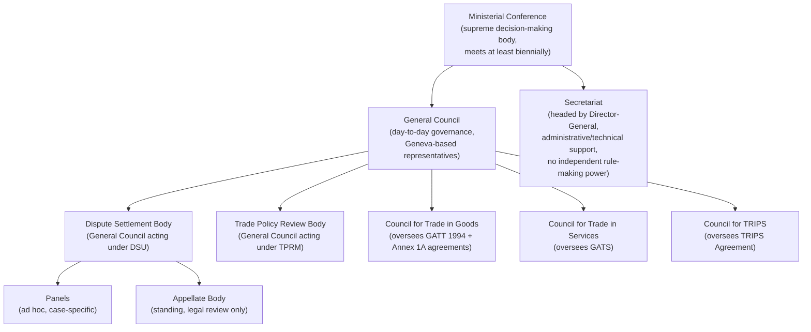

## The Uruguay Round (1986–1994) and the Marrakesh Agreement Establishing the WTO

### Why This Round Was Different

Seven prior GATT rounds (Geneva 1947 through Tokyo 1973–1979) had progressively reduced industrial tariffs among developed economies but left the trading system's core institutional and legal weaknesses untouched: no binding dispute enforcement, no coverage of services or intellectual property, and persistent carve-outs for agriculture and textiles. The Uruguay Round, launched at Punta del Este in September 1986 and concluded in Marrakesh in April 1994, was the first round to treat institutional reform and subject-matter expansion as inseparable objectives. A negotiator should understand it not as "another tariff round" but as the round that converted GATT from a provisional tariff-concessions agreement into a codified, judicially enforceable legal order.

### Negotiating Structure: The Single Undertaking

**Legal basis and mechanism.** The Round was organized under the principle of the **single undertaking**—"nothing is agreed until everything is agreed"—meaning member states could not selectively accept only the agreements favorable to them while rejecting others (as had been possible with the Tokyo Round's optional "codes"). This is codified in the outcome document itself: acceding to the WTO requires accepting the entire package of Multilateral Trade Agreements in Annexes 1, 2, and 3 of the Marrakesh Agreement as a bloc.

**Practitioner implication**: the single undertaking is the structural reason the Doha Round (launched 2001) has been unable to conclude piecemeal. Any member can hold the entire negotiation hostage to a single unresolved issue (historically, agricultural market access), because there is no legal mechanism to lock in partial agreement absent a negotiated exception (as eventually occurred with the 2013 Bali "trade facilitation early harvest" and later plurilateral workarounds).

### What the Round Actually Created

The Marrakesh Agreement Establishing the World Trade Organization (signed 15 April 1994, entered into force 1 January 1995) is a short framework treaty; its substance lies in the annexed agreements it binds together:

- **Annex 1A**: Multilateral Agreements on Trade in Goods — the revised GATT 1994, plus new agreements on Agriculture, Sanitary and Phytosanitary Measures (SPS), Technical Barriers to Trade (TBT), Trade-Related Investment Measures (TRIMs), Antidumping (Article VI implementation), Subsidies and Countervailing Measures (SCM), and Safeguards.
- **Annex 1B**: The General Agreement on Trade in Services (GATS) — the first multilateral, legally enforceable framework covering services trade, using a positive-list scheduling approach (members list only the sectors and modes of supply they commit to liberalize, rather than committing to all sectors by default).
- **Annex 1C**: The Agreement on Trade-Related Aspects of Intellectual Property Rights (TRIPS) — establishing minimum IP protection standards (patents, copyright, trademarks, geographical indications) enforceable through WTO dispute settlement, a significant departure from the World Intellectual Property Organization's non-binding administrative approach.
- **Annex 2**: The Understanding on Rules and Procedures Governing the Settlement of Disputes (DSU) — discussed below.
- **Annex 3**: The Trade Policy Review Mechanism (TPRM) — periodic, non-adversarial peer review of members' trade policies.
- **Annex 4**: Plurilateral agreements (e.g., Government Procurement) binding only on members that opt in, the sole exception to the single undertaking.

**[Inference]** The decision to bundle goods, services, and IP into one single undertaking rather than negotiate them as separate tracks is generally read by trade historians as a deliberate strategy by developed-country demandeurs (principally the U.S. and EC) to trade agricultural and textile concessions to developing countries in exchange for TRIPS and GATS commitments; this is a widely cited interpretation of the Round's political economy rather than a claim documented in the treaty text itself.

### The Institutional Reform: From GATT to WTO

Recall that GATT 1947 operated without formal international legal personality, applied provisionally under the Protocol of Provisional Application, and lacked a permanent institutional charter. The Marrakesh Agreement corrected this directly:

| Feature | GATT 1947 | WTO (post-1995) |
| --- | --- | --- |
| Legal personality | None (treaty administered by contracting parties) | Full international legal personality (Marrakesh Agreement, Art. VIII) |
| Membership term | "Contracting Parties" | "Members" |
| Scope | Goods only | Goods (GATT 1994), Services (GATS), IP (TRIPS) |
| Institutional structure | Ad hoc Secretariat (ICITO) | Ministerial Conference, General Council, Secretariat with Director-General |
| Dispute settlement | Positive consensus (losing party can block adoption) | Negative/reverse consensus (adoption automatic unless all members reject) |
| Accession basis | Provisional application, grandfather clause exceptions | Full treaty ratification, single undertaking |

### The Dispute Settlement Understanding: Solving GATT's Core Flaw

This is the Round's most consequential legal innovation for a dispute-settlement lawyer. Under GATT 1947, panel reports required consensus adoption by the full membership, including the respondent found in violation—meaning a losing party could unilaterally block an adverse ruling from ever taking legal effect.

The DSU (Annex 2) replaced this with **negative consensus** at two stages:

1. **Panel establishment**: a complaining party can obtain an automatic right to a panel; the respondent cannot block panel formation after a second request.
2. **Report adoption**: panel reports (and, after 1995, Appellate Body reports reviewing them) are adopted automatically by the Dispute Settlement Body (DSB) unless *all* members—including the complainant who won—agree by consensus to reject the report.

This inverted the veto: under GATT, the loser held the blocking power; under the WTO, adoption is effectively unblockable by any single member. The DSU also created:

- A standing **Appellate Body** (a novel feature; GATT panels had no appeal mechanism) for review of legal (not factual) findings, with fixed procedural deadlines.
- Binding timelines for each stage of the process (consultations, panel composition, report circulation), addressing GATT-era delay tactics.
- Authorized retaliation (suspension of concessions) if a losing respondent fails to bring itself into compliance within a "reasonable period of time."

**Illustrative case**: The *United States – Gasoline* dispute (WT/DS2, 1996) was the first case decided under the new system and the first Appellate Body report, establishing early interpretive practice for Article XX general exceptions under GATT 1994. Its procedural completion—panel report, appeal, adoption—within the DSU's structured timeline, contrasted starkly with GATT-era disputes that could be blocked indefinitely, and is commonly cited as proof of concept for the reformed system. **[Unverified]** Characterizations of *US–Gasoline* as definitively "proving" the new system's superiority reflect a widely shared practitioner assessment rather than a formally quantified comparison; such comparative claims should be checked against the original panel and Appellate Body reports.

### Institutional Structure Established at Marrakesh

### The Unfinished Business: Agriculture and the Doha Legacy

The Round's agricultural outcome—the Agreement on Agriculture, which began the process of converting non-tariff barriers into bound tariffs ("tariffication") and disciplining domestic support and export subsidies—was widely regarded as a partial compromise rather than a resolution. Developing countries' dissatisfaction with residual developed-country agricultural protection, combined with unmet expectations on textiles and clothing integration (the Agreement on Textiles and Clothing's decade-long phase-out of the Multi-Fibre Arrangement quota system), fed directly into the mandate for the Doha Development Round in 2001. Recall that the single undertaking principle, which allowed the Uruguay Round's diverse package to be concluded as one bloc, is the same structural feature now preventing Doha's partial results from being locked in without a comprehensive final deal—a direct institutional throughline from Marrakesh's design choices to the WTO's current negotiating paralysis.

### Practitioner Takeaways

1. **The single undertaking is a negotiating-leverage tool, not a neutral drafting convention.** A negotiator should recognize when a proposed package structure recreates single-undertaking dynamics (all-or-nothing linkage) versus when a plurilateral or "critical mass" structure (as later used for the Information Technology Agreement expansion and e-commerce plurilaterals) allows subset agreement.
2. **Negative consensus is the reason WTO dispute settlement had teeth that GATT's lacked**—but a lawyer should also know this teeth-granting mechanism is precisely what triggered the U.S.'s systemic objections to the Appellate Body's expansive interpretive practice, leading to its effective paralysis in December 2019 when the U.S. blocked new appointments.
3. **TRIPS and GATS were the price of agricultural and market-access concessions from developing countries**, a bargain whose perceived imbalance remains the central legitimacy critique developing-country delegations invoke in current negotiations over TRIPS flexibilities and special and differential treatment.

**Related Topics**

- The Agreement on Agriculture: tariffication, the Aggregate Measurement of Support, and the "peace clause"
- TRIPS flexibilities and the 2001 Doha Declaration on TRIPS and Public Health
- GATS modes of supply and the positive-list scheduling architecture
- The Appellate Body crisis (2016–2019) and the Multi-Party Interim Appeal Arbitration Arrangement
- Why the Doha Development Round (2001–present) has failed to conclude under the single undertaking
- The Trade Policy Review Mechanism as a non-adversarial transparency tool