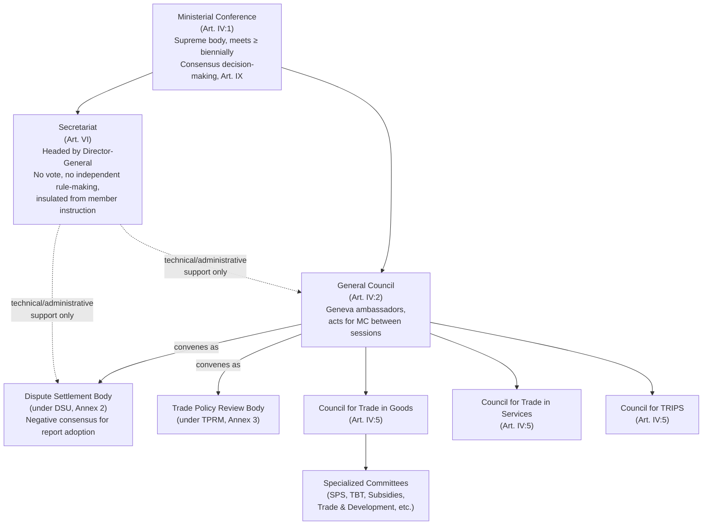

## The WTO's Institutional Architecture: Ministerial Conference, General Council, and Secretariat

### Legal Basis

The WTO's governance structure is established directly in the **Marrakesh Agreement Establishing the World Trade Organization** (1994), principally Articles IV through VI. Recall that the Marrakesh Agreement gave the WTO full international legal personality, correcting GATT 1947's ad hoc administrative status. Article IV creates the tiered body structure described below; Article VI establishes the Secretariat. Unlike many international organizations, the WTO's structure is deliberately **member-driven**: there is no independent executive body with autonomous rule-making authority. Every substantive decision flows from the membership acting through consensus, and the Secretariat has no vote and no power to initiate binding legal obligations.

This member-driven design is the single most important structural fact for a negotiator to internalize: unlike the IMF or World Bank, where weighted voting or executive boards can act with some independence from the full membership, WTO decision-making authority is formally undelegated. Every body described below is ultimately either the full membership itself or a subset of the full membership acting in a delegated committee capacity.

### Tier 1: The Ministerial Conference

**Legal basis**: Article IV:1 of the Marrakesh Agreement establishes the Ministerial Conference (MC) as the WTO's supreme decision-making body, composed of representatives of all members (typically trade ministers), required to meet **at least once every two years**.

**Powers and functions**:

- Authority to take decisions on all matters under any of the Multilateral Trade Agreements, if requested by a member under the agreement's specific decision-making procedures.
- Authority to grant waivers of obligations under Article IX:3 (requiring a three-fourths majority vote if consensus cannot be reached, though consensus is the practiced norm).
- Authority to adopt interpretations of the WTO agreements under Article IX:2 (also requiring a three-fourths majority as a formal fallback).
- Formal launch point for new negotiating rounds (e.g., the Doha Ministerial Conference in 2001 launching the Doha Development Agenda) and for major package outcomes (e.g., the Bali Ministerial's 2013 Trade Facilitation Agreement, the Nairobi Ministerial's 2015 agreement to eliminate agricultural export subsidies).

**Practitioner note**: a Ministerial Conference is where high-visibility political deals get ratified, but the substantive text is negotiated in advance through the General Council and subsidiary bodies. A negotiator should treat MC outcomes as the endpoint of a process, not the process itself—by the time ministers arrive, the technical negotiating room has usually narrowed to a small number of politically sensitive brackets.

**Illustrative case**: The **MC11 (Buenos Aires, 2017)** ended without a formal ministerial declaration—the first Ministerial Conference in WTO history to do so—illustrating that even the supreme decision-making body cannot manufacture consensus where the underlying membership divide (in that instance, over fisheries subsidies and e-commerce moratorium renewal) is unresolved.

### Tier 2: The General Council

**Legal basis**: Article IV:2 establishes the General Council (GC), composed of representatives of all members (typically Geneva-based ambassadors/permanent representatives), which "shall carry out the functions of the Ministerial Conference" between MC sessions.

**Functions and dual identity**: The General Council is legally the same body wearing different institutional hats depending on which function it is performing:

- As the **General Council proper**: day-to-day oversight of WTO operations, budget and staffing matters (Article VII), relations with other international organizations, and general administrative governance.
- As the **Dispute Settlement Body (DSB)**: convenes under the Understanding on Rules and Procedures Governing the Settlement of Disputes (DSU) to establish panels, adopt panel and Appellate Body reports (via negative consensus), and authorize retaliation.
- As the **Trade Policy Review Body (TPRB)**: convenes under the Trade Policy Review Mechanism to conduct periodic review of members' trade policies.

**Practitioner implication**: this is a structural efficiency—rather than creating three separate standing memberships, the WTO reuses the same ambassadorial body under different procedural hats. A negotiator following a dispute should know that the DSB's composition is identical to the General Council's, meaning political dynamics between members carry across from trade-policy discussions into dispute-adoption discussions, even though the DSU's negative-consensus rule limits how much that political carryover can actually block outcomes.

**Reporting bodies beneath the General Council** (Article IV:5–7) include the **Council for Trade in Goods**, **Council for Trade in Services**, and **Council for TRIPS**, each overseeing implementation of their respective Annex 1 agreements, plus numerous specialized committees (e.g., the Committee on Trade and Development, addressing special and differential treatment; the Committee on Subsidies and Countervailing Measures; the Committee on Sanitary and Phytosanitary Measures) that handle technical implementation questions without requiring full General Council engagement on routine matters.

### Tier 3: The Secretariat

**Legal basis**: Article VI establishes the Secretariat, headed by a **Director-General** appointed by the Ministerial Conference, with powers, duties, and terms of service determined by the MC (currently four-year renewable terms by convention, though this is set by MC regulation rather than the Marrakesh Agreement text itself).

**Critical structural limitation**: Article VI:4 explicitly states that the Director-General and Secretariat staff "shall not seek or accept instructions from any government or any other authority external to the WTO," and, conversely, members "shall not seek to influence" Secretariat staff in the discharge of their duties. This is a formal insulation provision, but its practical corollary is equally important: the Secretariat also has **no independent legal authority to bind members**, propose rule changes with legal force, or adjudicate disputes. It provides technical, legal, and administrative support—drafting assistance, dispute settlement registry functions, economic research, and technical cooperation for developing-country members—but final authority in every substantive area remains with the membership.

**[Inference]** This limited-agency design is frequently interpreted by scholars of international organizations as a deliberate legacy of GATT's historically weak Secretariat (the Interim Commission for the ITO never received full institutional authority) combined with member-state reluctance, particularly among larger economies, to cede rule-making power to an international bureaucracy; this is an interpretive claim about institutional design intent rather than a textually stated rationale in the Marrakesh Agreement itself.

**Illustrative case**: The selection of Director-General **Ngozi Okonjo-Iweala** in 2021 required Ministerial Conference-level consensus-building after the United States initially blocked the leading candidate under the outgoing administration, then reversed its position—demonstrating that even an ostensibly administrative appointment (the DG role has no independent decision-making vote) requires full-membership political consensus, reflecting the same consensus-based DNA that governs substantive rule-making.

### Consensus as the Operating Principle Across All Tiers

**Legal basis**: Article IX:1 establishes that the WTO "shall continue the practice of decision-making by consensus followed under GATT 1947." Consensus is defined (per a footnote to Article IX:1) as existing when no member present at the meeting formally objects to a proposed decision—**it does not require unanimous affirmative support**, only the absence of a formal objection.

This single decision rule cuts across all three tiers: Ministerial Conference, General Council, and every subsidiary committee operate by consensus as the default practice, with formal voting (simple majority, two-thirds, or three-fourths, depending on the matter under Article IX and Article X for amendments) available only as a fallback almost never invoked in practice for substantive rule-making.

**Practitioner implication—the central paradox of WTO governance**: consensus decision-making at the rule-creation level (Ministerial Conference, General Council negotiating functions) is the same design feature that produces negotiating paralysis (a single member's objection can block a package, as has occurred repeatedly since the Doha Round's 2001 launch), while the DSU's negative consensus at the dispute-adjudication level inverts this logic entirely to prevent blocking. A negotiator must track *which* consensus rule applies to *which* WTO function—conflating "consensus blocks negotiations" with "consensus blocks dispute rulings" is a common analytical error, since these are structurally opposite mechanisms sharing only the word "consensus."

### Institutional Architecture Diagram

### Practitioner Takeaways

1. **Distinguish the body from the hat it is wearing.** The General Council, DSB, and TPRB are the same ambassadorial membership convening under different procedural mandates—understanding this prevents misreading cross-body political dynamics as separate constituencies.
2. **Consensus means "no formal objection," not unanimous support.** This threshold is lower than it sounds and explains why some contested decisions do get adopted (silent acquiescence counts as consensus) while others remain permanently blocked by a single vocal objector.
3. **The Secretariat's neutrality is a double-edged constraint.** Its Article VI:4 insulation from government instruction makes it a credible technical resource for smaller delegations with limited capacity, but its lack of independent authority means it cannot break a genuine political deadlock among members—unlike a Bretton Woods institution's executive board, which can sometimes act with delegated authority the WTO's design deliberately withholds.

**Related Topics**

- Article IX voting fallback provisions: waivers, interpretations, and amendments compared
- The Dispute Settlement Body's negative consensus mechanism and its relationship to the General Council
- The Committee on Trade and Development and special and differential treatment implementation
- Director-General selection procedures and the 2021 Okonjo-Iweala appointment process
- Why consensus-based rule-making has stalled the Doha Round since 2001
- The Trade Policy Review Mechanism's non-adversarial peer-review function