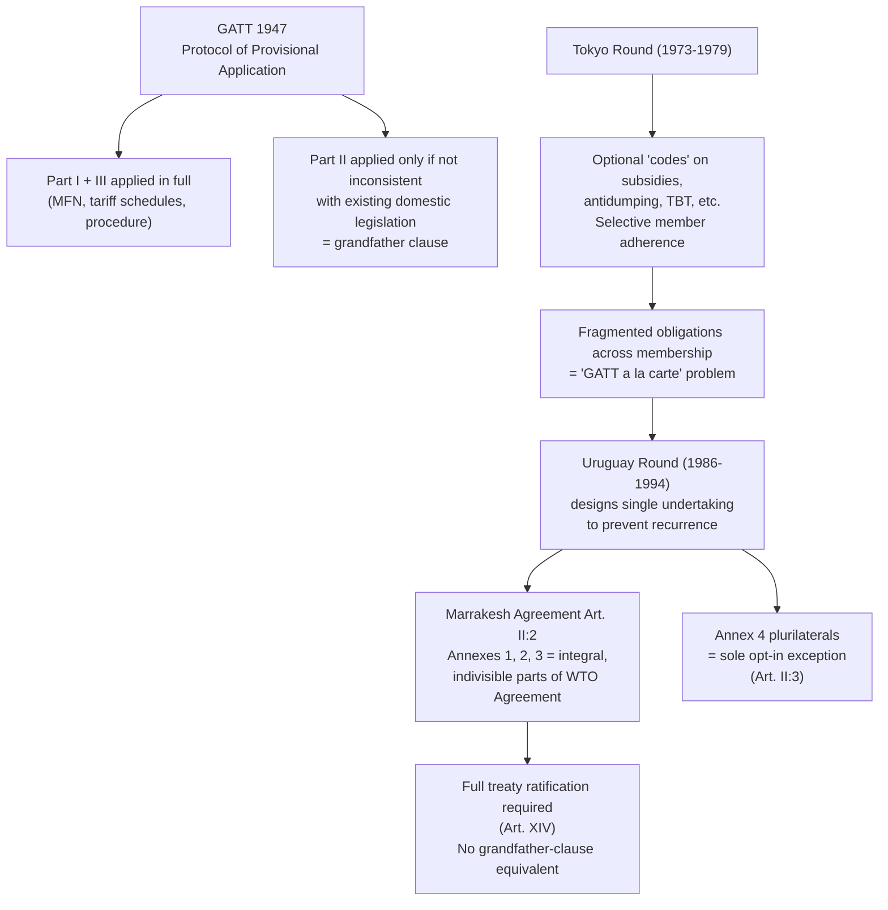

## The Single Undertaking Principle and the Shift from Provisional to Permanent Treaty Status

### Two Distinct Legal Transformations

This item addresses two related but analytically separate legal developments from the Uruguay Round (1986–1994): first, the **single undertaking** as a negotiating and ratification methodology; second, the underlying shift in the trading system's **treaty status** from GATT 1947's provisional application to the WTO's permanent, fully ratified legal foundation. A negotiator must keep these distinct, because the single undertaking is a *procedural* design choice about how agreements are packaged and accepted, while the shift to permanent status is a *substantive* change in the legal character of the obligations themselves. The two developments occurred simultaneously in 1994–1995 and reinforce each other, but neither is logically dependent on the other.

### GATT 1947's Provisional Legal Status: The Baseline Problem

Recall that GATT 1947 never entered into force as a ratified treaty. It was brought into effect through the **Protocol of Provisional Application (PPA)**, under which signatories agreed to apply GATT's disciplines "provisionally" pending the anticipated ratification of the Havana Charter establishing the International Trade Organization. When the ITO failed to materialize after the U.S. Congress declined to ratify the Havana Charter in 1950, GATT—intended as a temporary bridge—became the permanent architecture of the trading system by default, while retaining its provisional legal form for 47 years.

This provisional status had two specific legal consequences that a negotiator or lawyer must understand as the baseline the Uruguay Round corrected:

1. **The grandfather clause**: under the PPA, contracting parties were required to apply GATT Part I (Article I, most-favored-nation treatment; Article II, tariff schedules) and Part III (procedural articles) in full, but Part II obligations (Articles III–XXIII, covering most substantive disciplines such as national treatment) applied only "to the fullest extent not inconsistent with existing legislation." This meant domestic laws predating a country's GATT accession that violated GATT Part II could remain in force indefinitely, exempted from discipline. This is the legal origin of long-standing exceptions such as U.S. maritime cabotage restrictions (the Jones Act) and certain agricultural quota regimes.
2. **No international legal personality**: GATT had no formal charter establishing it as a legal entity capable of holding property, entering into headquarters agreements in its own name, or possessing standing distinct from its contracting parties. The administering body—the Interim Commission for the ITO (ICITO)—existed in an improvised, legally ambiguous status throughout GATT's operational life.

**[Inference]** The persistence of a "provisional" instrument as the operative trade law framework for nearly five decades is commonly cited by international law scholars as one of the more unusual features of the postwar economic order, since most multilateral treaties either enter into force through ratification within a reasonable window or are abandoned; GATT's durability despite its provisional form is a historically distinctive case rather than a common pattern.

### The Single Undertaking: Legal Basis and Mechanism

**Definition**: the single undertaking is the negotiating principle, formalized in the 1986 Punta del Este Declaration launching the Uruguay Round and given binding legal effect through the Marrakesh Agreement Establishing the WTO (1994), under which "virtually all of the results of the Round shall be treated as parts of a whole and be implemented as such." In plain terms: a country cannot accede to the WTO and select only the constituent agreements it prefers—it must accept the entire negotiated package as a single, indivisible legal commitment.

**Legal basis in the Marrakesh Agreement**: Article II:2 states that "the agreements and associated legal instruments included in Annexes 1, 2, and 3 (referred to as 'Multilateral Trade Agreements') are integral parts of this Agreement, binding on all Members." This is the operative textual mechanism: by making Annexes 1–3 legally inseparable from the parent treaty itself, the Marrakesh Agreement makes acceptance of the WTO Agreement and acceptance of GATT 1994, GATS, TRIPS, the DSU, and the TPRM one single act of accession. There is no legal pathway to join the WTO while opting out of, say, TRIPS or GATS.

**The sole exception—plurilateral agreements**: Article II:3 carves out Annex 4 plurilateral agreements (originally including the Agreement on Trade in Civil Aircraft and the Agreement on Government Procurement) as binding only on members that separately accept them, explicitly *not* part of the single undertaking. This exception is significant precedent: it establishes that the single undertaking is a deliberate design choice rather than an unavoidable legal necessity, and it is the textual basis current members point to when proposing plurilateral pathways (e.g., the Joint Statement Initiatives on e-commerce and investment facilitation launched after 2017) to circumvent single-undertaking gridlock in areas the full membership cannot agree to negotiate multilaterally.

### Why the Single Undertaking Was Chosen: The Tokyo Round Problem

**Mechanism before case, as the pedagogical convention requires**: the single undertaking was a direct response to the structural failure of the preceding Tokyo Round (1973–1979), which produced a set of optional side agreements ("codes") on subjects like subsidies, antidumping, and technical barriers to trade that members could accept or decline individually. This created a fragmented "GATT à la carte" system in which different members were bound by different subsets of rules, undermining the predictability and non-discrimination that MFN treatment is supposed to guarantee, and complicating dispute settlement since a respondent might not be bound by the code a complainant sought to invoke.

The single undertaking was designed to prevent this fragmentation from recurring at a moment when the Round was adding subject matter far more consequential than the Tokyo Round's codes—services (GATS) and intellectual property (TRIPS) being the two most significant expansions. By forcing developing countries, who were skeptical of TRIPS and GATS obligations, to accept them as the price of admission to the market-access gains available elsewhere in the package (particularly the phase-out of the Multi-Fibre Arrangement's textile quotas and agricultural tariffication), the single undertaking functioned as a deliberate cross-issue bargaining leverage device, not merely a drafting tidiness measure.

**Illustrative case**: The accession of large developing economies is the clearest evidence of single-undertaking leverage in action. **China's WTO accession (2001)**, negotiated over 15 years, required China to accept the full package—including TRIPS obligations requiring substantial intellectual property law reform—as an indivisible condition of membership, rather than being permitted to join under GATT-era-style selective adherence. **[Unverified]** The specific weighting of which concessions were most decisive in China's domestic calculus is a matter of scholarly interpretation and negotiating-history reconstruction rather than settled documented fact, and should be checked against the original accession protocol and contemporaneous trade-policy analysis.

### The Shift to Permanent, Fully Ratified Status

**Legal basis**: the Marrakesh Agreement Establishing the World Trade Organization is a conventional multilateral treaty requiring formal ratification, acceptance, or approval by each signatory according to its own domestic constitutional procedures (Article XIV), in sharp contrast to GATT's provisional application mechanism. This is not a minor technical distinction—it converts the trading system's foundational legal instrument from a treaty applied *as if* ratified (with the grandfather-clause escape hatch) to one that *is* ratified, with no equivalent grandfathering mechanism for the WTO agreements themselves.

**Consequence 1 — elimination of the grandfather clause**: WTO members were required to bring domestic legislation into conformity with WTO obligations (including GATT 1994) upon accession, with no automatic exemption for pre-existing inconsistent law. Transition periods were negotiated for specific obligations (e.g., TRIPS implementation timelines varying by development status), but these are explicit, time-bound derogations set out in the text—qualitatively different from GATT's open-ended, uncodified grandfathering.

**Consequence 2 — full international legal personality**: Article VIII of the Marrakesh Agreement grants the WTO "such legal capacity as may be necessary for the exercise of its functions," including the capacity to contract, acquire and dispose of property, and enter into legal proceedings—resolving GATT's institutional ambiguity as an unincorporated administrative arrangement.

**Consequence 3 — permanence of dispute settlement obligations**: because DSU obligations (Annex 2) are now part of a single, permanently ratified undertaking rather than an ad hoc GATT-era practice built on Articles XXII and XXIII, negative consensus adoption of panel and Appellate Body reports rests on firmer treaty-law footing than GATT's dispute practice, which had developed through custom rather than explicit, ratified textual authorization for automatic adoption.

### Comparative Summary

| Dimension | GATT 1947 | WTO (Marrakesh Agreement, 1995) |
| --- | --- | --- |
| Entry into force | Protocol of Provisional Application | Formal ratification (Art. XIV) |
| Domestic law conformity | Grandfather clause exempts pre-existing inconsistent legislation | No open-ended grandfathering; only explicit, time-bound transition periods |
| Acceptance structure | Tokyo Round-era optional codes permitted selective adherence | Single undertaking: Annexes 1–3 accepted as one indivisible package (Art. II:2) |
| Exceptions to package acceptance | N/A (codes were inherently optional) | Annex 4 plurilaterals only (Art. II:3) |
| Legal personality | None | Full international legal personality (Art. VIII) |

### Diagram: From Provisional Application to Single Undertaking

### Practitioner Takeaways

1. **The single undertaking is a leverage mechanism, not a drafting formality.** Whenever assessing whether a proposed WTO reform or new negotiating track will succeed, ask whether it preserves single-undertaking linkage (which enables cross-issue bargaining but risks total gridlock) or adopts a plurilateral/critical-mass structure (which sacrifices universal leverage for the possibility of partial progress).
2. **The elimination of the grandfather clause means legacy inconsistencies must be litigated, not assumed exempt.** A lawyer analyzing whether a member's longstanding domestic measure survives WTO scrutiny cannot invoke GATT-era grandfathering logic post-1995 unless a specific, textually negotiated transition period applies.
3. **Ratification, not provisional application, is now the legal foundation—raising the domestic political stakes of accession.** Because WTO membership requires genuine treaty ratification under each member's constitutional procedures (unlike GATT's provisional-application shortcut), accession negotiations, such as China's 15-year process, are inherently higher-stakes and slower than GATT-era contracting-party additions.

**Related Topics**

- Article XIV ratification procedures and domestic implementing legislation requirements
- Annex 4 plurilateral agreements and post-2017 Joint Statement Initiatives as single-undertaking workarounds
- The Tokyo Round codes and the "GATT à la carte" fragmentation problem
- China's WTO accession protocol (2001) as a case study in single-undertaking leverage
- TRIPS transition periods and differentiated implementation timelines by development status
- Why the Doha Round's attempted "early harvest" packages test the limits of single-undertaking discipline