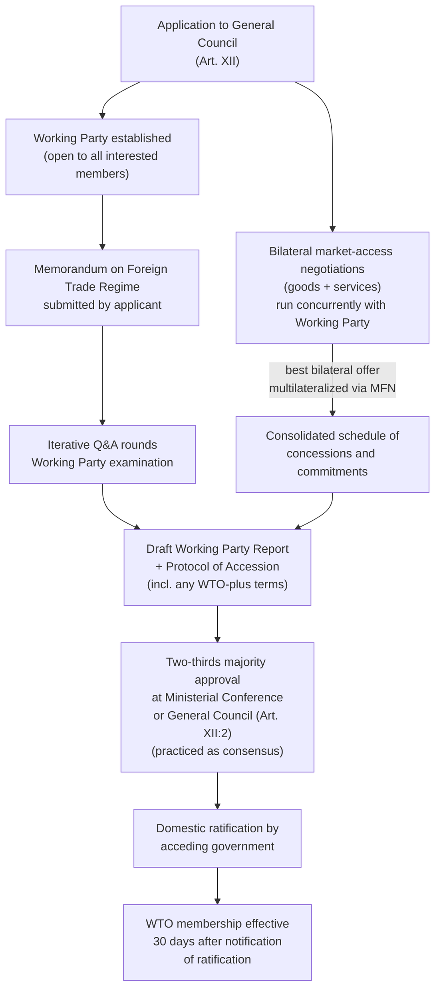

## WTO Accession Protocols and the Negotiation of New Member Commitments

### Legal Basis

Accession to the WTO is governed by **Article XII of the Marrakesh Agreement Establishing the World Trade Organization**, which provides that "any State or separate customs territory possessing full autonomy in the conduct of its external commercial relations... may accede to this Agreement, on terms to be agreed between it and the WTO." This single sentence conceals a deliberately open-ended, negotiated process rather than a fixed, codified accession procedure—unlike, for instance, EU accession, which follows the Copenhagen criteria as a defined checklist. Recall that the single undertaking principle requires an acceding member to accept the entire package of Multilateral Trade Agreements (Annexes 1–3) as one indivisible commitment; accession negotiations determine the *specific terms* on which that acceptance occurs, not whether the package itself can be modified.

The critical practitioner distinction: accession is not a matter of a candidate simply declaring adherence to existing rules. It is a bilateral-then-multilateral negotiation in which the acceding government must negotiate individually with every interested existing member, and the terms extracted are typically **more restrictive than the WTO's baseline multilateral obligations**—a phenomenon usually referred to as "WTO-plus" commitments.

### The Procedural Architecture

**Step 1 — Application and the Memorandum on Foreign Trade Regime.** The applicant government submits a formal request to the General Council, which establishes a **Working Party** open to all interested members. The applicant then submits a Memorandum on Foreign Trade Regime (MFTR), a comprehensive disclosure document covering the entirety of its trade-relevant legal and institutional framework: tariff structure, customs valuation, SPS and TBT regimes, state trading enterprises, subsidies, IP law, services regulation, and investment measures.

**Step 2 — Working Party examination.** Members submit written questions on the MFTR; the applicant responds in iterative rounds. This phase functions as a comprehensive audit of the entire domestic trade-and-investment legal order, often extending for years, and frequently surfaces the need for extensive domestic legislative reform before accession can proceed. This examination is multilateral in form (conducted through the Working Party) but its substance is shaped heavily by the interests of major trading partners with the largest stake in the applicant's market.

**Step 3 — Bilateral market-access negotiations.** Concurrent with the Working Party process, the applicant negotiates **bilateral goods and services market-access agreements** with each interested member individually. Under the **most-favored-nation principle** (recall: MFN, GATT Article I, requires that any advantage granted to one trading partner be extended unconditionally to all members), the *best* tariff and services commitment negotiated bilaterally with any single member is multilateralized automatically to the entire membership upon accession—meaning each bilateral partner has an incentive to extract the maximum concession, since it will benefit every other member too, and no bilateral partner wants to settle for less than what another partner might obtain.

**Step 4 — Draft Working Party Report and Protocol of Accession.** Once bilateral negotiations conclude and the Working Party's questions are resolved, the Working Party adopts a report summarizing the applicant's commitments, alongside a draft **Protocol of Accession**—the binding legal instrument specifying the acceding member's schedule of concessions on goods, schedule of specific commitments on services, and any accession-specific WTO-plus obligations.

**Step 5 — Ministerial Conference or General Council approval and domestic ratification.** The accession package requires approval by a **two-thirds majority** of the WTO membership at the Ministerial Conference or General Council (Article XII:2)—though in practice this vote is by consensus, consistent with the broader Article IX default. The acceding government must then ratify the Protocol domestically according to its own constitutional procedures, becoming a WTO member 30 days after notifying the WTO Secretariat of ratification.

### WTO-Plus Commitments: The Central Negotiating Reality

**Mechanism**: because accession terms are individually negotiated rather than derived from a fixed template, existing members routinely extract commitments from acceding governments that go beyond what the Multilateral Trade Agreements require of existing members. This asymmetry is the single most contested feature of the accession process from a developing-country perspective, and a negotiator representing an acceding government must anticipate it as the default negotiating dynamic rather than an exceptional demand.

Common categories of WTO-plus commitments:

- **Accelerated tariff bindings** at levels lower than comparable existing members' bound rates.
- **Non-market economy (NME) status clauses** in antidumping methodology, permitting importing members to use third-country "surrogate" pricing rather than the acceding country's own domestic prices when calculating dumping margins.
- **Transitional Review Mechanisms**, subjecting the new member to additional post-accession monitoring not applied to original members.
- **Extended or accelerated TRIPS implementation timelines**, sometimes tighter than the general transition periods available to existing developing-country members.
- **Additional transparency and notification obligations** beyond the baseline requirements in the Agreement on Import Licensing Procedures or the SPS/TBT Agreements.

**Illustrative case**: **China's accession Protocol (2001)** is the canonical case study in WTO-plus commitments and remains directly relevant to ongoing trade disputes. Recall that TRIPS and market-access commitments extracted through the single undertaking during the Uruguay Round; China's accession negotiation, conducted separately over roughly 15 years (1986–2001, spanning both the GATT and WTO eras), extracted commitments including a 15-year non-market-economy clause for antidumping purposes (Section 15 of the Accession Protocol) and a **Transitional Review Mechanism** requiring annual multilateral review of China's implementation for the first eight years of membership—obligations with no parallel in the general Multilateral Trade Agreements. The expiration of the NME clause's technical basis in December 2016 became the subject of significant, still-unresolved legal disagreement between China and major trading partners (particularly the U.S. and EU) over whether its expiry obligated automatic abandonment of surrogate-country antidumping methodology; this dispute (raised at the WTO as *EU – Price Comparison Methodologies*, DS516, later suspended) illustrates how accession-era WTO-plus terms can generate protracted legal controversy decades after accession itself. **[Unverified]** The current procedural status of DS516 and related disputes should be verified against the WTO Dispute Settlement Gateway, as panel proceedings in politically sensitive, long-suspended cases can change status without wide public notice.

### Accession Timeline Variance and Its Causes

Accession negotiation length varies enormously and is a useful diagnostic of negotiating complexity for a practitioner assessing any pending accession:

| Acceding Member | Approx. Negotiation Length | Notable Feature |
| --- | --- | --- |
| China | ~15 years (1986–2001) | Extensive WTO-plus terms, NME clause, Transitional Review Mechanism |
| Russia | ~18 years (1993–2012) | Prolonged by bilateral disputes, notably with Georgia over border-monitoring |
| Vanuatu | Multiple attempts; acceded 2012 (first application 1995) | Illustrates least-developed-country capacity constraints in meeting MFTR disclosure burden |
| Kazakhstan | ~19 years (1996–2015) | Extensive services and SOE-related commitments |

**[Inference]** The general pattern that larger, more geopolitically significant economies face longer and more demanding accession negotiations (China, Russia) while smaller or least-developed economies face capacity-driven delays (documentation burden rather than negotiating leverage disputes) is a widely observed trend in WTO accession literature, though the underlying causal drivers likely differ by case and should not be treated as a single unified mechanism.

### Special Provision for Least-Developed Countries

The WTO General Council adopted **Guidelines for LDC Accession** (2002, revised 2012) recognizing that least-developed countries should not be expected to undertake commitments beyond their institutional and financial capacity, and that existing members should exercise "restraint" in seeking market-access concessions from LDC applicants. **[Inference]** In practice, the extent to which this restraint guideline has measurably shortened LDC accession timelines or reduced WTO-plus burdens relative to non-LDC developing-country applicants is contested in the accession literature, since case-specific bilateral negotiating dynamics still vary considerably; this should be treated as an aspirational procedural norm rather than a guaranteed outcome, and verified against specific accession protocols (e.g., Cambodia, Nepal, Vanuatu) if precision is required.

### Diagram: The Accession Process

### Practitioner Takeaways

1. **Accession is negotiated leverage, not template compliance.** A negotiator advising an acceding government must anticipate that bilateral partners will seek the maximum extractable concession precisely because MFN will multilateralize it—meaning the "first mover" bilateral partners often set the baseline that shapes every subsequent negotiation.
2. **WTO-plus commitments outlive their original political context.** China's NME clause dispute demonstrates that accession-era concessions, negotiated under specific historical bargaining conditions, can generate multi-decade legal controversy once their underlying rationale (a 15-year sunset clause) expires—a lawyer reviewing any accession protocol should flag time-limited WTO-plus provisions as future dispute risk.
3. **The Memorandum on Foreign Trade Regime functions as a comprehensive regulatory audit.** For a government contemplating accession, the domestic legislative reform burden triggered by Working Party questioning is often the practical rate-limiting step, independent of the political will to negotiate market access—a distinction relevant to any technical-assistance planning for capacity-constrained applicants.

**Related Topics**

- The most-favored-nation principle and its multilateralizing effect on bilateral accession concessions
- China's Accession Protocol Section 15 and the non-market-economy antidumping methodology dispute
- The Transitional Review Mechanism as a post-accession monitoring tool
- LDC-specific accession guidelines and the restraint principle in market-access demands
- Comparing WTO accession to regional-bloc accession processes (e.g., EU Copenhagen criteria)
- The role of Article XXVIII renegotiation for existing members modifying bound tariff schedules post-accession