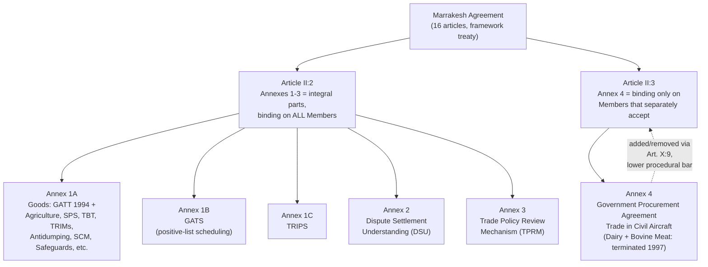

## The Annex Structure of the WTO Agreement: Annexes 1 through 4

### Legal Function of the Annex Structure

The Marrakesh Agreement Establishing the World Trade Organization is itself a short framework instrument—sixteen articles establishing the WTO's institutional existence, decision-making rules, and legal personality. Its substantive legal content is entirely contained in four annexes, incorporated by explicit textual reference. **Article II:2** provides the operative incorporation mechanism: "The agreements and associated legal instruments included in Annexes 1, 2, and 3... are integral parts of this Agreement, binding on all Members." Recall that this incorporation clause is the specific textual mechanism giving legal effect to the single undertaking—by declaring Annexes 1 through 3 legally inseparable from the parent treaty, accession to the WTO Agreement is, as a matter of treaty law, simultaneous accession to every instrument those annexes contain.

Annex 4 is deliberately excluded from this incorporation formula. **Article II:3** states that Annex 4 plurilateral agreements "are also part of this Agreement for those Members that have accepted them, and are binding on those Members"—explicitly conditional acceptance, the single carve-out from the single undertaking's otherwise indivisible package.

A negotiator or lawyer should read the Annex structure as a hierarchy of legal bindingness: Annexes 1–3 are compulsory and universal; Annex 4 is optional and selective. Getting this distinction wrong—for instance, assuming a plurilateral agreement binds the full membership—is a common analytical error with direct consequences for dispute-settlement standing, since a member cannot bring a claim under an Annex 4 agreement it has not separately accepted.

### Annex 1: The Multilateral Trade Agreements

Annex 1 is subdivided into three parts by subject-matter domain, each domain governed by its own dedicated council under the General Council (recall the institutional architecture: the Council for Trade in Goods, Council for Trade in Services, and Council for TRIPS each oversee their respective Annex 1 subdivision).

**Annex 1A — Multilateral Agreements on Trade in Goods.** This is the largest and most legally dense annex, comprising:

- **GATT 1994**, which is not a re-negotiation of GATT 1947 but rather GATT 1947 *as legally modified* by all decisions, protocols, and understandings adopted under it through 1994, incorporated as a distinct instrument from the original.
- Agreement on Agriculture
- Agreement on the Application of Sanitary and Phytosanitary Measures (SPS)
- Agreement on Technical Barriers to Trade (TBT)
- Agreement on Trade-Related Investment Measures (TRIMs)
- Agreement on Implementation of Article VI of GATT 1994 (the Antidumping Agreement)
- Agreement on Implementation of Article VII of GATT 1994 (Customs Valuation)
- Agreement on Preshipment Inspection
- Agreement on Rules of Origin
- Agreement on Import Licensing Procedures
- Agreement on Subsidies and Countervailing Measures (SCM)
- Agreement on Safeguards
- Agreement on Textiles and Clothing (its Multi-Fibre Arrangement phase-out provisions expired by design in 2005 and the agreement is now spent, though it remains part of the historical Annex 1A text)

**Annex 1B — General Agreement on Trade in Services (GATS).** A single agreement (not a subdivided list like 1A), structured with a general framework of obligations plus member-specific **Schedules of Specific Commitments** using the positive-list approach: recall that under GATS scheduling, a member's market-access and national-treatment obligations apply only to the services sectors and modes of supply it has explicitly listed, in contrast to GATT 1994's negative-list-style universal coverage of goods.

**Annex 1C — Agreement on Trade-Related Aspects of Intellectual Property Rights (TRIPS).** A single, comprehensive agreement establishing minimum standards for copyright, trademarks, geographical indications, industrial designs, patents, integrated circuit layout designs, and undisclosed information (trade secrets), together with enforcement obligations and a built-in linkage to WTO dispute settlement.

### Annex 2: The Dispute Settlement Understanding

**Annex 2 — Understanding on Rules and Procedures Governing the Settlement of Disputes (DSU)** is a single, standalone instrument, structurally distinct from the goods/services/IP division because it governs a cross-cutting *procedural* function rather than a substantive trade domain. The DSU applies uniformly to disputes arising under virtually every other covered agreement (goods, services, and IP alike), which is why it merits its own annex rather than being embedded within Annex 1.

Recall that the DSU's negative-consensus adoption mechanism for panel and Appellate Body reports is the central legal innovation distinguishing WTO dispute settlement from GATT-era practice, where a losing respondent could unilaterally block adoption of an adverse ruling under positive consensus.

### Annex 3: The Trade Policy Review Mechanism

**Annex 3 — Trade Policy Review Mechanism (TPRM)** establishes a non-adversarial, periodic peer-review process under which the Secretariat and the reviewed member each prepare a report examining the member's trade policies and practices, discussed by the Trade Policy Review Body (the General Council convening in this specific capacity). Review frequency is tiered by economic weight: the four largest trading entities (historically the U.S., EU, Japan, and China) are reviewed most frequently, with smaller economies and LDCs reviewed at longer intervals.

**Practitioner distinction**: the TPRM is explicitly not a compliance or enforcement mechanism—Annex 3 states its function is to contribute to improved adherence by all members to WTO disciplines through transparency, not to serve as a basis for enforcement of specific obligations or for new commitments. A negotiator should not conflate a Trade Policy Review's critical findings with a legally actionable dispute-settlement claim; the two are procedurally and legally separate tracks entirely.

### Annex 4: Plurilateral Trade Agreements

**Annex 4** originally comprised four agreements, of which two remain in force:

- **Agreement on Government Procurement (GPA)** — currently in force, binding only on its subset of signatories (a mix of developed and some developing economies), governing non-discriminatory treatment in covered public procurement above specified thresholds.
- **Agreement on Trade in Civil Aircraft** — currently in force among its signatories.
- **International Dairy Agreement** and **International Bovine Meat Agreement** — both terminated in 1997 by decision of their respective signatories and are no longer in force, illustrating that Annex 4 status is itself dynamic; plurilateral agreements can be added or removed from Annex 4 by decision of the Ministerial Conference under Article X:9, a substantially lower procedural bar than amending Annexes 1–3.

**[Inference]** The post-2017 **Joint Statement Initiatives** (covering e-commerce, investment facilitation for development, and MSME issues), while structurally similar in spirit to Annex 4's selective-acceptance model, have not to date been formally incorporated into Annex 4 through Article X:9 procedure; whether and how they might eventually acquire Annex 4 status (versus remaining informal plurilateral tracks outside the WTO's formal annex structure) is an unresolved institutional design question actively debated among members, rather than a settled matter. **[Unverified]** The precise current legal status of JSI negotiations should be checked against the General Council's most recent decisions, as this is an area of active institutional evolution.

### Comparative Structure at a Glance

| Annex | Content | Binding Scope | Governing Body |
| --- | --- | --- | --- |
| 1A | GATT 1994 + goods-specific agreements (Agriculture, SPS, TBT, TRIMs, Antidumping, SCM, Safeguards, etc.) | All members (single undertaking) | Council for Trade in Goods |
| 1B | GATS | All members (single undertaking); commitments scheduled per member | Council for Trade in Services |
| 1C | TRIPS | All members (single undertaking) | Council for TRIPS |
| 2 | DSU | All members (single undertaking) | Dispute Settlement Body |
| 3 | TPRM | All members (single undertaking) | Trade Policy Review Body |
| 4 | GPA, Civil Aircraft (others terminated) | Only members that separately accept | Committee on Government Procurement (for GPA) |

### Diagram: The Annex Hierarchy

### Practitioner Takeaways

1. **Check which annex an obligation sits in before assessing dispute standing.** A claim under an Annex 4 agreement (e.g., the GPA) can only be brought by, and against, members that have separately accepted that specific plurilateral—unlike Annex 1–3 obligations, which bind the entire membership by default.
2. **GATT 1994 is legally distinct from GATT 1947, not merely a renaming.** GATT 1994 incorporates the accumulated body of decisions, protocols, and interpretive understandings adopted under GATT 1947 through 1994; a lawyer citing "GATT" in a post-1995 dispute should specify which instrument is operative, since GATT 1947's original text is technically superseded (though substantively continuous) for WTO members.
3. **Annex 4's lower amendment threshold (Article X:9) makes it the structural pressure valve for expanding WTO subject-matter coverage without reopening the single undertaking.** This is the precedent members currently point to when debating whether initiatives like e-commerce or investment facilitation should eventually be formalized as new Annex 4 agreements rather than pursued as informal plurilateral tracks outside the treaty structure.

**Related Topics**

- GATT 1994's incorporation of GATT 1947-era protocols, decisions, and understandings
- GATS positive-list scheduling versus GATT 1994's default coverage model
- The Government Procurement Agreement's non-discrimination disciplines and covered-entity thresholds
- Article X amendment procedures and the differential thresholds for Annexes 1-3 versus Annex 4
- The termination of the International Dairy and Bovine Meat Agreements as precedent for plurilateral exit
- Joint Statement Initiatives and the unresolved question of future Annex 4 incorporation