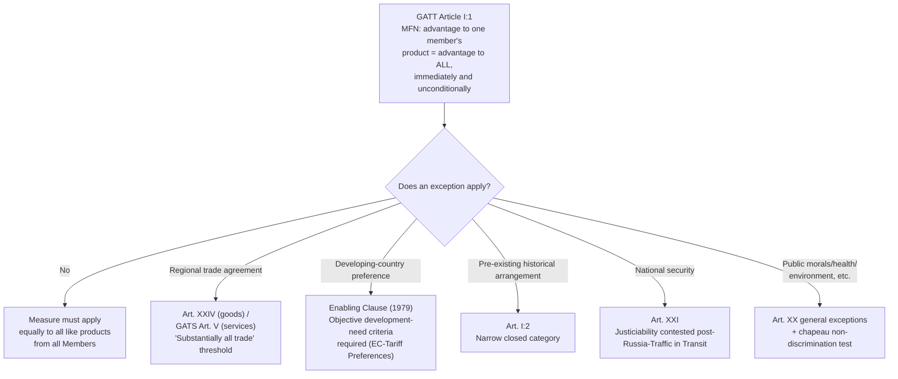

## Most-Favored-Nation Treatment Under GATT Article I and Its Exceptions

### Legal Basis and Textual Structure

**Most-favored-nation (MFN) treatment**, codified in **Article I:1 of GATT 1994**, is the foundational non-discrimination obligation of the multilateral trading system: any advantage, favor, privilege, or immunity granted by a member to any product originating in or destined for any other country must be accorded "immediately and unconditionally" to the like product originating in or destined for the territories of all other WTO members. Recall that GATT 1994 is the legally distinct successor instrument incorporating GATT 1947's text plus all subsequent decisions and protocols adopted through 1994.

The obligation applies to four specific categories of measure: customs duties and charges of any kind imposed on or in connection with importation or exportation; the method of levying such duties and charges; all rules and formalities connected with importation and exportation; and internal taxes or regulatory measures of the kind covered by Article III (national treatment). A negotiator must note the phrase "immediately and unconditionally"—this textual language is the basis for the WTO jurisprudential position that MFN treatment cannot be made contingent on reciprocity from the recipient country; a concession granted to one member must flow to all, with no legally permissible condition attached at the moment of extension.

**Defining "like products"**: MFN's operative scope turns entirely on the concept of "like products," a term left undefined in the GATT text itself. WTO panels and the Appellate Body have developed an interpretive framework—drawing on the properties, nature and quality of products, their end-uses, consumer tastes and habits, and tariff classification—to determine likeness on a case-by-case basis. This is a critical practitioner point: likeness determinations are fact-intensive and precedent-driven rather than governed by a fixed legal test, meaning MFN disputes frequently turn on product-classification arguments as much as on the discriminatory measure itself.

### Practitioner Function: Why MFN Matters Structurally

MFN treatment is what makes the WTO a genuinely *multilateral* system rather than a web of bilateral deals. Recall from the discussion of WTO accession that MFN's automatic-extension effect is precisely why bilateral market-access concessions negotiated with an acceding member get multilateralized to the entire membership—the best deal any single member negotiates becomes the floor for all. For a negotiator, this means MFN functions as a **standing multiplier on every bilateral negotiating outcome**: no concession can practically be "contained" to a single trading partner without falling under a specific, legally recognized exception.

**Illustrative case**: *EC – Bananas III* (WT/DS27, one of the WTO's most litigated disputes, initiated 1996) centered on the European Communities' preferential tariff-quota regime favoring banana imports from African, Caribbean, and Pacific (ACP) countries over Latin American producers. The Appellate Body found the EC's differential treatment violated MFN under Article I:1 because it granted an advantage (preferential tariff-quota access) to bananas from certain origins without extending it unconditionally to like products from all members, and the EC's claimed justification did not fit within the Article I:2 historical preference exception or Lomé Convention waiver as structured. **[Unverified]** The full procedural history of *EC – Bananas III*, including its multiple compliance proceedings extending into the 2000s, is unusually complex even by WTO standards and should be verified against the original panel and Appellate Body reports rather than summarized from memory if precise dates or holdings are required for a specific brief.

### The Exceptions: Where MFN Does Not Apply

MFN is a foundational rule, not an absolute one. A negotiator must know each recognized exception precisely, because the boundary between legitimate exception and impermissible discrimination is the single most litigated question in MFN jurisprudence.

**1. GATT Article XXIV — Regional Trade Agreements (customs unions and free trade areas).** Members forming a customs union or free trade area may grant each other preferential treatment not extended to third countries, provided the arrangement meets specific conditions: it must eliminate duties and restrictions on "substantially all the trade" among constituent territories, and it must not raise the overall level of restriction against non-members beyond what existed before the arrangement's formation. This is the single most economically significant MFN exception in practice—it is the legal basis for essentially every bilateral and regional free trade agreement in force globally (e.g., NAFTA/USMCA, the EU's internal market, ASEAN Free Trade Area).

**Practitioner note on enforcement weakness**: Article XXIV compliance review, conducted through notification to the Committee on Regional Trade Agreements, has historically been criticized as toothless—the "substantially all trade" threshold has never been authoritatively defined by a WTO panel or Appellate Body ruling with binding precedential weight applicable across all RTAs, and the Committee has rarely reached consensus condemning a notified RTA as non-compliant. **[Inference]** This enforcement gap is widely characterized in the trade-law literature as a structural weakness allowing the proliferation of RTAs (numbering in the several hundreds by the 2020s) to proceed largely unchecked by rigorous multilateral scrutiny; this is an interpretive assessment of institutional practice rather than a formally adjudicated finding.

**2. GATS Article V — Economic Integration Agreements.** The services-sector parallel to GATT Article XXIV, permitting preferential services liberalization among parties to an economic integration agreement meeting analogous "substantial sectoral coverage" conditions.

**3. GATT Article I:2 and the Enabling Clause — Historical and development-related preferences.** Article I:2 preserved certain pre-existing preferential arrangements in force at GATT's founding (a narrow, closed category). More significantly, the 1979 **Enabling Clause** (formally the "Decision on Differential and More Favourable Treatment, Reciprocity and Fuller Participation of Developing Countries") permits developed members to grant **Generalized System of Preferences (GSP)** tariff preferences to developing countries without extending them to all members, and permits preferential arrangements among developing countries themselves. Recall that this is the legal ancestor of the broader special and differential treatment (S&DT) principle: derogations from otherwise generally applicable disciplines granted specifically to developing-country members.

**Illustrative case**: *EC – Tariff Preferences* (WT/DS246, 2004) tested the boundaries of the Enabling Clause. India challenged the EC's GSP scheme, which granted additional tariff preferences to a subset of developing countries meeting specific drug-trafficking-combat criteria, arguing this violated MFN by discriminating among developing countries rather than applying preferences generally. The Appellate Body held that the Enabling Clause permits differentiation among developing countries, provided such differentiation responds to a "development, financial or trade need" applied on the basis of an objective standard capable of being met by all similarly situated beneficiaries—meaning GSP schemes cannot be structured so narrowly that they function as disguised preferences for specific favored countries rather than genuine responses to broad development criteria.

**4. GATT Article XXI — Security Exceptions.** Permits members to take action "necessary for the protection of its essential security interests" without regard to MFN or other GATT obligations, historically treated as largely self-judging and rarely subjected to substantive panel review. **[Inference]** This exception's practical significance has grown considerably since 2018–2019, as an increasing number of members have invoked national-security justifications for trade-restrictive measures previously defended under other GATT exceptions; whether this represents a durable jurisprudential shift or a period-specific pattern is a matter of ongoing scholarly and practitioner debate rather than settled doctrine, particularly following the *Russia – Traffic in Transit* (DS512, 2019) panel's finding that Article XXI is justiciable (subject to objective review) rather than purely self-judging—a holding that remains contested by some members' systemic positions.

**5. GATT Article XX — General Exceptions.** Not an MFN-specific exception but a cross-cutting defense (covering measures necessary to protect public morals, human/animal/plant life or health, and exhaustible natural resources, among other categories) that can be invoked against an Article I claim, subject to the Article XX chapeau's requirement that the measure not be applied in a manner constituting "arbitrary or unjustifiable discrimination" between countries where the same conditions prevail.

### Comparative Summary of Exceptions

| Exception | Legal Basis | Scope | Key Case |
| --- | --- | --- | --- |
| Customs unions / FTAs | GATT Art. XXIV | Preferential treatment among RTA members meeting "substantially all trade" threshold | N/A (rarely definitively adjudicated) |
| Services economic integration | GATS Art. V | Services-sector parallel to Art. XXIV | N/A |
| GSP / developing-country preferences | Enabling Clause (1979) | Preferences to developing countries under objective development criteria | *EC – Tariff Preferences* (DS246) |
| Historical preferences | GATT Art. I:2 | Narrow, closed category of pre-1947 arrangements | N/A |
| National security | GATT Art. XXI | Essential security interests; increasingly subject to justiciability debate | *Russia – Traffic in Transit* (DS512) |
| General exceptions | GATT Art. XX | Public morals, health, natural resources, etc., subject to chapeau discipline | Multiple (e.g., *US – Gasoline*, DS2) |

### Diagram: MFN Obligation and Exception Pathways

### Practitioner Takeaways

1. **"Like products" is the hinge on which most MFN disputes turn.** Before analyzing whether differential treatment violates Article I, a lawyer must first establish product likeness using the properties/end-use/consumer-perception/tariff-classification framework—skipping this step and jumping directly to the discrimination analysis is a common analytical shortcut that weakens legal argumentation.
2. **Article XXIV's weak enforcement is a known systemic gap, not evidence that RTAs are legally uncontroversial.** A negotiator should not assume an RTA is automatically WTO-compliant merely because it has not been formally challenged; the absence of Committee condemnation reflects institutional gridlock as much as substantive compliance.
3. **The Enabling Clause requires objective, generally applicable criteria—preferences cannot be reverse-engineered for a single favored country.** *EC – Tariff Preferences* establishes that a GSP-plus or similar differentiated preference scheme must be defensible as responding to a genuine, broadly assessable development need, a standard any government designing preferential arrangements for developing-country partners must build into the scheme's structure from the outset.

**Related Topics**

- National treatment under GATT Article III and its relationship to MFN
- The "like products" interpretive framework across GATT Article I, III, and antidumping jurisprudence
- Article XXIV's "substantially all trade" threshold and the Committee on Regional Trade Agreements' review practice
- The Enabling Clause and special and differential treatment for developing-country members
- Article XXI's justiciability debate post-*Russia – Traffic in Transit*
- Article XX general exceptions and the chapeau's non-discrimination discipline