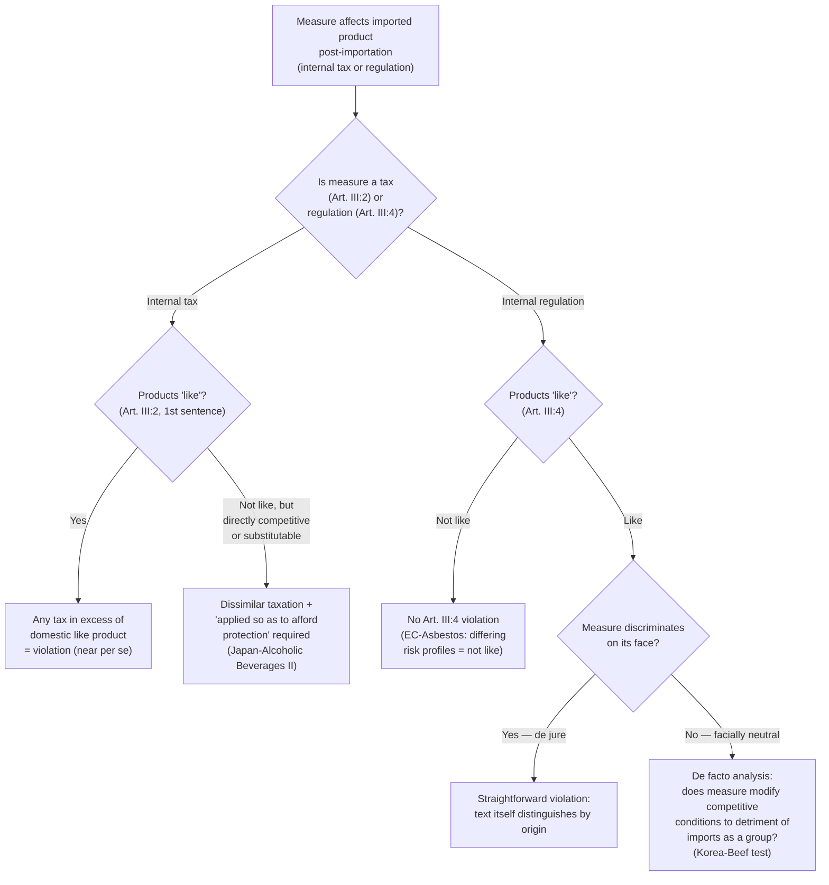

## National Treatment Under GATT Article III and De Jure Versus De Facto Discrimination

### Legal Basis and Relationship to MFN

**National treatment**, codified in **GATT Article III**, is the second pillar of GATT's non-discrimination architecture alongside most-favored-nation treatment (Article I). Recall that MFN governs discrimination *between* trading partners (a member cannot favor imports from one WTO member over like imports from another); national treatment governs discrimination *between imported and domestic* products, requiring that imported products, once they have cleared the border and entered the domestic market, be treated no less favorably than like or directly competitive domestic products with respect to internal taxation and internal regulation.

The distinction matters structurally: Article I disciplines a member's treatment of different foreign sources; Article III disciplines a member's treatment of foreign versus domestic products within its own internal market. A tariff applied at the border is not an Article III measure at all—it is disciplined by Article II (tariff bindings) and Article I (MFN); Article III applies specifically to measures affecting products *after* importation.

**Article III:1** states the general principle: internal taxes and regulations "should not be applied to imported or domestic products so as to afford protection to domestic production." This is the interpretive lens through which the more specific operative obligations in Article III:2 (internal taxation) and Article III:4 (internal regulation) are read.

### Article III:2 — Internal Taxation

**First sentence**: imported products shall not be subject, directly or indirectly, to internal taxes "in excess of" those applied to **like domestic products**. WTO jurisprudence treats this as close to a per se rule: any tax differential, however small, in excess of that applied to like products violates Article III:2, first sentence, without need to separately prove protective intent or effect—the "in excess of" language itself does the work.

**Second sentence**, read together with the interpretive note (Ad Article III), extends the discipline to internal taxes applied to products that are not "like" but are **"directly competitive or substitutable"**, provided the tax treatment is applied "so as to afford protection to domestic production." This is a more demanding standard requiring (per WTO jurisprudence, notably *Japan – Alcoholic Beverages II*, WT/DS8/DS10/DS11, 1996) three elements: the imported and domestic products must be directly competitive or substitutable; they must not be similarly taxed; and the dissimilar taxation must be applied so as to afford protection.

**Illustrative case**: *Japan – Alcoholic Beverages II* remains the foundational precedent distinguishing "like products" from "directly competitive or substitutable products." The Appellate Body found that Japan's liquor tax system, which taxed shochu at a substantially lower rate than vodka, whisky, and other imported spirits, violated Article III:2 second sentence because even though shochu and vodka were not identical "like products," they were directly competitive or substitutable, and the magnitude of the tax differential (shochu taxed far below competing imported spirits) was itself evidence that the measure was "applied so as to afford protection," without requiring separate proof of protectionist legislative intent.

### Article III:4 — Internal Regulation

**Article III:4** requires that imported products be accorded treatment "no less favourable" than that accorded to like domestic products with respect to all laws, regulations, and requirements affecting internal sale, offering for sale, purchase, transportation, distribution, or use. Unlike Article III:2's two-tiered taxation test, Article III:4 uses a single "like products" threshold combined with a "no less favourable treatment" standard, which the Appellate Body has interpreted (notably in *EC – Asbestos*, WT/DS135, 2001, and *Korea – Various Measures on Beef*, WT/DS161/169, 2001) as requiring an assessment of whether the measure modifies the conditions of competition in the marketplace to the detriment of imported products as a group, relative to domestic products as a group—not whether every individual imported product is treated identically to every individual domestic product.

**Practitioner distinction**: Article III:4's "no less favourable treatment" standard does not require formal identical treatment; it requires that the *competitive opportunities* available to imported products not be diminished relative to domestic like products. This distinction is precisely where the de jure/de facto discrimination framework becomes analytically essential.

### De Jure Versus De Facto Discrimination: The Central Analytical Framework

This is the conceptual core a trade lawyer must master to litigate or defend a national treatment claim.

**De jure discrimination** exists where a measure discriminates **on its face**—the legal text itself draws a distinction based on the origin of the product (e.g., a regulation stating "imported widgets shall be subject to inspection fee X; domestic widgets shall be subject to inspection fee Y," where X exceeds Y). De jure discrimination is generally straightforward to establish: the measure's text is the evidence.

**De facto discrimination** exists where a measure is **origin-neutral on its face**—it does not formally distinguish between imported and domestic products—but its structure, design, or practical operation results in less favorable treatment of imported products as a class. This is considerably harder to establish because it requires an evidentiary showing connecting a facially neutral rule to a discriminatory effect, and WTO jurisprudence has developed specific analytical tools for this purpose.

**The critical jurisprudential holding**: Article III's national treatment obligation prohibits *both* forms of discrimination. This was authoritatively established across a line of cases beginning with early GATT panel practice and consolidated by the Appellate Body, most notably in ***Korea – Various Measures on Beef***, where Korea's dual retail distribution system for beef—requiring imported beef to be sold in separate specialized stores rather than alongside domestic beef—was found to violate Article III:4 despite being formally origin-neutral in its regulatory text, because the practical effect was to modify competitive conditions to the detriment of imported beef by substantially restricting its retail distribution channels relative to domestic beef's unrestricted access to the general retail market.

**Illustrative case, de facto discrimination**: *EC – Asbestos* is the leading case establishing that "likeness" itself must be assessed in light of a measure's regulatory purpose, but also illustrates de facto reasoning: France's ban on asbestos-containing products (facially applicable to both imported and domestic products alike, since France produced negligible domestic asbestos) was upheld, with the Appellate Body finding that asbestos-containing and asbestos-free substitute products were not "like products" given their vastly different health-risk profiles—meaning the facially neutral ban did not constitute discrimination at all because the products being compared were not legally "like" to begin with. This case is instructive precisely because it shows a facially neutral, non-discriminatory measure can still survive Article III scrutiny on the threshold likeness question, without needing to reach a full de facto discrimination analysis.

### Diagnostic Framework for Identifying De Facto Discrimination

A practitioner analyzing a facially neutral measure for potential de facto Article III violation should examine:

1. **Design and structure of the measure**: does the regulatory criterion (even though origin-neutral in wording) correlate closely with product origin in practice? (E.g., a technical standard drafted around specifications only domestic producers currently meet.)
2. **Disproportionate impact**: does the measure's practical burden fall predominantly or exclusively on imported products, even though domestic products are technically subject to the same rule?
3. **Effect on competitive conditions**: applying the *Korea – Beef* / *EC – Asbestos* competitive-opportunities test, does the measure alter the conditions of competition in the marketplace to the detriment of the imported product group, considered collectively?
4. **Absence of a legitimate, non-protectionist regulatory rationale**: while Article III:4 itself does not contain a general "necessity" test (unlike Article XX), the overarching Article III:1 principle against measures "applied so as to afford protection to domestic production" informs how panels weigh whether a facially neutral measure's discriminatory effect is incidental to a legitimate regulatory objective or is the measure's practical purpose.

### Comparative Summary

| Dimension | De Jure Discrimination | De Facto Discrimination |
| --- | --- | --- |
| Textual basis | Measure explicitly distinguishes by origin | Measure is origin-neutral on its face |
| Evidentiary burden | Generally straightforward — text is the evidence | Requires showing of discriminatory design, structure, or effect |
| Leading case | Early GATT panel practice; explicit tax/regulatory distinctions | *Korea – Various Measures on Beef* (dual retail system) |
| Article III provision most litigated | III:2 first sentence (tax); III:4 (regulation) | III:4 (regulation), III:2 second sentence (tax on competitive products) |
| Key defense | Show products are not "like" or not "directly competitive/substitutable" | Show no adverse effect on competitive conditions, or products not "like" |

### Diagram: National Treatment Analytical Pathway

### Practitioner Takeaways

1. **Always identify which sentence of Article III:2 (or which likeness threshold under III:4) governs before building a national treatment argument.** The "like products" standard (III:2 first sentence, III:4) and the "directly competitive or substitutable" standard (III:2 second sentence) carry different evidentiary burdens—conflating them weakens legal argument considerably.
2. **A facially neutral measure is not automatically safe.** Governments drafting domestic regulations with legitimate non-trade objectives (health, safety, environmental standards) must still assess whether the measure's practical design or effect disproportionately burdens imports—*Korea – Beef*'s dual-retail-system finding demonstrates that facial neutrality is not a complete defense.
3. **Product "likeness" itself can resolve a case before reaching the discrimination analysis.** *EC – Asbestos* shows that establishing non-likeness (due to differing risk or competitive profiles) can dispose of an Article III claim entirely, making the likeness determination frequently the most strategically important battleground in national treatment litigation.

**Related Topics**

- The "like products" interpretive framework across GATT Articles I, III, and antidumping law
- Article XX general exceptions as a defense once an Article III violation is established
- *Korea – Various Measures on Beef* and the competitive-opportunities test for internal regulation
- *EC – Asbestos* and the role of health/risk profiles in likeness determinations
- Article III:1's general principle as an interpretive aid to III:2 and III:4
- The relationship between national treatment and Technical Barriers to Trade (TBT) Agreement disciplines