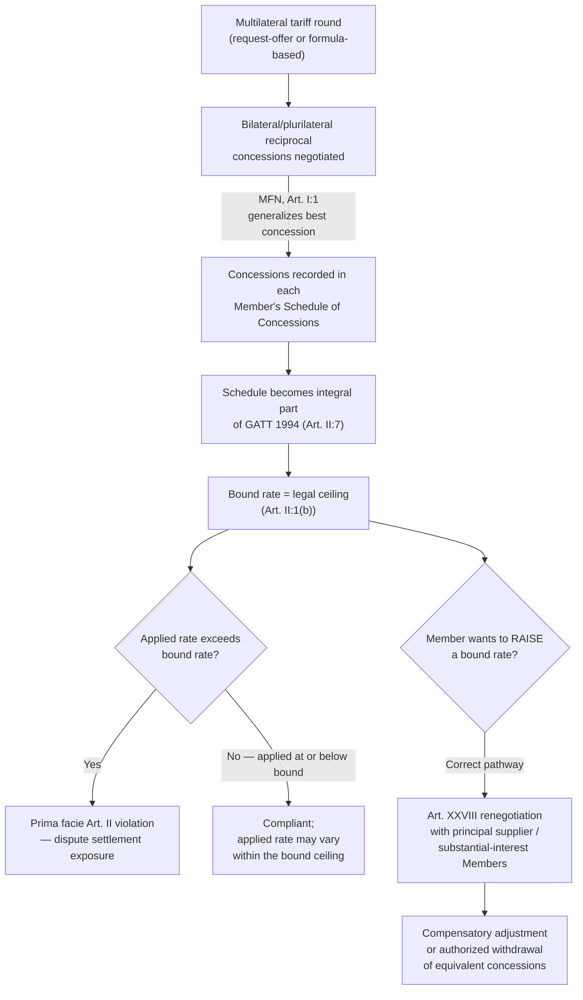

## Tariff Bindings, Schedules of Concessions, and the Principle of Reciprocity

### Legal Basis: GATT Article II

**GATT Article II** establishes the legal mechanism through which negotiated tariff commitments become binding obligations. Article II:1(a) requires each member to accord to the commerce of other members treatment "no less favourable" than that provided in the appropriate **Schedule of Concessions** annexed to GATT 1994. Article II:1(b) specifies that products described in a member's Schedule shall, on importation, be exempt from ordinary customs duties **in excess of** those set forth in the Schedule. This is the textual source of the **tariff binding**: once a member has recorded a rate in its Schedule for a given tariff line, that rate becomes a ceiling the member cannot legally exceed, enforceable through WTO dispute settlement.

A negotiator must internalize a distinction that is frequently confused by non-specialists: a **bound rate** is the legal ceiling recorded in a member's Schedule; the **applied rate** is the tariff a member actually charges on a given day, which can be anywhere at or below the bound rate. Members retain full sovereign discretion to set applied rates below their bindings and to adjust them (subject to MFN, meaning any reduction must be extended to all members), but raising an applied rate above the bound ceiling constitutes a *prima facie* violation of Article II, independent of whether the increase causes demonstrable trade damage.

### Schedules of Concessions: Structure and Legal Status

Each WTO member maintains its own **Schedule of Concessions**, a legal instrument annexed to and forming an integral part of GATT 1994 (per Article II:7). Schedules are organized by tariff line, typically using the **Harmonized System (HS)** product classification nomenclature, and record for each line: the bound tariff rate (or, for agricultural products particularly, both an in-quota and over-quota rate under a tariff-rate quota structure), and any other terms, conditions, or qualifications attached to the concession.

**Practitioner note on legal weight**: because Schedules are legally part of GATT 1994 itself under Article II:7, a dispute alleging a member has applied a tariff in excess of its bound rate is litigated as a claim under Article II directly, with the Schedule serving as the primary documentary evidence of the obligation's precise scope—making Schedule interpretation (product description ambiguities, HS classification disputes, and quota-administration terms) a frequent and often outcome-determinative feature of tariff-related disputes.

**Illustrative case**: *EC – Chicken Cuts* (WT/DS269/DS286, 2005) turned substantially on Schedule interpretation: the dispute concerned whether the European Communities' reclassification of frozen, salted chicken cuts under a different tariff heading (attracting a higher duty) was consistent with the tariff commitments in the EC's Schedule. The Appellate Body's approach applied principles of treaty interpretation under the Vienna Convention on the Law of Treaties—looking to the ordinary meaning of the Schedule's terms in context, informed by the Harmonized System nomenclature and the circumstances of the Schedule's negotiation—demonstrating that Schedule commitments are interpreted with the same interpretive rigor as any other treaty text, not read as mere administrative tariff tables.

### Reciprocity as the Negotiating Principle

**Reciprocity**, while not itself a single codified GATT article, is the organizing negotiating principle underlying the entire tariff-binding architecture and is referenced in the GATT Preamble's call for negotiations "on a reciprocal and mutually advantageous basis." In practice, reciprocity means that tariff concessions are negotiated as an exchange: a member reduces or binds a tariff on a given product in exchange for reciprocal concessions from negotiating partners on products of export interest to it.

**Mechanism**: multilateral tariff negotiations (historically conducted in GATT "rounds," e.g., the Kennedy Round, Tokyo Round, Uruguay Round) proceed through techniques such as the **request-offer approach** (bilateral exchanges of specific product requests and offers, later multilateralized via MFN) and **linear/formula-based cuts** (an agreed percentage or formula reduction applied across broad tariff categories, used increasingly from the Kennedy Round onward to accelerate negotiations beyond the slower product-by-product request-offer method).

**Critical interaction with MFN**: recall that most-favored-nation treatment under Article I requires any tariff concession granted to one member to be extended unconditionally to all members. This creates the foundational strategic tension a negotiator must manage: reciprocity is bilaterally or plurilaterally *negotiated*, but its *result* is multilaterally *generalized*. This generates a persistent **free-rider dynamic**—a member that offers minimal concessions of its own can still receive the full benefit of concessions negotiated between other large trading partners, since MFN extends those benefits automatically. This dynamic is a standard analytical point in trade-negotiation literature explaining why the largest trading powers (with the most negotiating leverage to extract reciprocal concessions) have historically driven the pace and scope of multilateral tariff rounds, while smaller economies benefit disproportionately from the generalized outcome without matching contribution.

**[Inference]** This free-rider dynamic is frequently cited as one contributing factor—among several—in the shift toward differentiated treatment for developing countries (recall the Enabling Clause and special and differential treatment) as a negotiated recognition that strict reciprocity is not always achievable or appropriate given differing levels of economic development; this is an interpretive point drawn from trade-negotiation literature rather than a claim stated in GATT's own text.

### Modifying Bound Concessions: Article XXVIII Renegotiation

A member wishing to increase a bound tariff rate above its Schedule commitment cannot simply do so unilaterally; recall this would constitute an Article II violation. **GATT Article XXVIII** provides the formal legal mechanism for **renegotiation**: a member may modify or withdraw a concession, but must first negotiate compensatory adjustment with members holding **initial negotiating rights**, **principal supplying interest**, or **substantial interest** in the product concerned—categories of standing defined by the historical negotiating relationship and current trade volume in the affected product. If negotiations fail to produce agreement, the withdrawing member may still proceed, but affected members retain the right to withdraw "substantially equivalent concessions" of their own in response—a structured, legally sanctioned form of retaliation distinct from DSU-authorized retaliation, since Article XXVIII renegotiation is not a dispute-settlement remedy but a pre-authorized adjustment mechanism.

**Practitioner implication**: Article XXVIII renegotiation is the correct legal pathway for a member that, for domestic policy reasons (e.g., protecting a newly sensitive industry), wishes to raise a bound rate—attempting to do so through domestic legislation alone without following Article XXVIII procedure exposes the measure to a straightforward Article II dispute-settlement challenge with little available defense, since Article II contains no general exception analogous to Article XX.

### Tariff-Rate Quotas and Agricultural Schedules

A specific Schedule structure worth flagging: many agricultural product lines carry a **tariff-rate quota (TRQ)**, under which imports up to a specified quota volume enter at a lower "in-quota" bound rate, while imports above that volume are subject to a higher "over-quota" bound rate. TRQs originated substantially from the Uruguay Round's Agreement on Agriculture "tariffication" process, which converted many pre-existing non-tariff quantitative restrictions into this tariff-plus-quota structure as part of the broader shift toward tariffs as the primary, more transparent instrument of agricultural protection. Quota administration methods (e.g., first-come-first-served, license-on-demand, historical allocation) are themselves a frequent source of dispute, since an administratively restrictive quota-allocation method can functionally nullify the value of an ostensibly generous in-quota rate.

### Diagram: The Tariff Binding and Reciprocity Cycle

### Practitioner Takeaways

1. **Always distinguish bound from applied rates before assessing compliance risk.** A member raising its applied rate toward (but not above) its bound ceiling is exercising ordinary sovereign tariff policy; only breaching the bound ceiling itself triggers Article II exposure—confusing the two is a common error in trade-policy analysis.
2. **Schedule interpretation disputes are treaty-interpretation exercises, not mere tariff-classification lookups.** *EC – Chicken Cuts* demonstrates that ambiguous product descriptions in a Schedule are resolved using Vienna Convention interpretive principles, meaning the negotiating history and context behind a Schedule entry can be as legally significant as its literal text.
3. **Article XXVIII is the exclusive lawful route for raising a bound tariff—there is no unilateral escape hatch.** A government considering increased protection for a bound product line should route the request through Article XXVIII renegotiation with affected principal suppliers rather than domestic legislative action alone, to avoid a near-certain, difficult-to-defend Article II dispute.

**Related Topics**

- The Harmonized System nomenclature and its role in Schedule classification disputes
- Tariff-rate quotas and quota-administration methods under the Agreement on Agriculture
- Request-offer versus formula-based tariff-cutting techniques across GATT negotiating rounds
- Article XXVIII bis and the general legal framework for tariff negotiations
- The free-rider dynamic in MFN-generalized reciprocal bargaining
- Vienna Convention treaty-interpretation principles as applied to WTO covered agreements