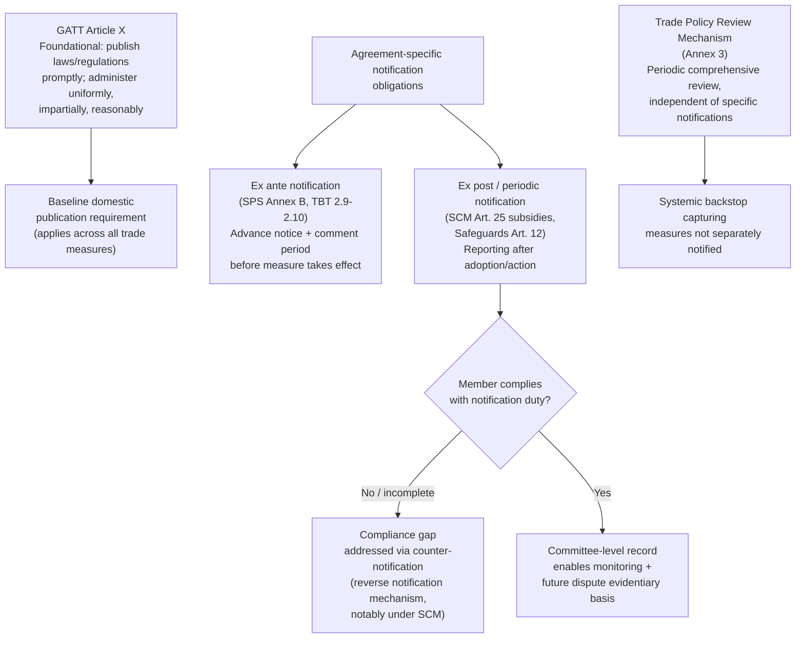

## Transparency and Notification Obligations Under the WTO Agreements

### The Structural Role of Transparency in the WTO System

Transparency is not a single codified WTO principle in the way MFN or national treatment are singular articles; rather, it is a **cross-cutting discipline embedded in dozens of provisions** across the covered agreements, requiring members to publish, notify, and make available information about their trade-relevant laws, regulations, and measures. A negotiator should understand transparency obligations as serving a distinct function from the substantive non-discrimination principles: MFN and national treatment discipline *what* a member can do; transparency obligations discipline whether other members and traders **know** what a member is doing, enabling both dispute-settlement enforcement and informed commercial decision-making. Without transparency, non-discrimination obligations would be difficult to monitor and even harder to enforce, since a violation cannot be challenged if it cannot first be identified.

### GATT Article X: The Foundational Transparency Provision

**Legal basis**: **GATT Article X ("Publication and Administration of Trade Regulations")** is the foundational transparency obligation, requiring that laws, regulations, judicial decisions, and administrative rulings of general application affecting trade be **published promptly**, in a manner enabling governments and traders to become acquainted with them, and administered in a **uniform, impartial, and reasonable manner**. Article X:2 additionally prohibits enforcement of a measure effecting an increase in duty or imposing a new restriction before it has been officially published.

**Practitioner significance**: Article X's "uniform, impartial and reasonable administration" standard has been interpreted by panels and the Appellate Body as a distinct, independently actionable obligation—meaning a measure can be substantively consistent with a member's tariff bindings or other obligations, yet still violate Article X if its *administration* is arbitrary, inconsistent across ports of entry, or otherwise unpredictable. This is a frequently underappreciated cause of action: a trade lawyer facing inconsistent customs treatment of ostensibly identical shipments should consider an Article X administrative-consistency claim independent of any substantive tariff or classification dispute.

**Illustrative case**: *US – Underwear* and subsequent Article X jurisprudence, along with the more developed treatment in *EC – Poultry* and later customs-administration disputes, established that Article X:3(a)'s uniform-administration requirement can be violated even where the underlying substantive measure is not itself challenged, focusing scrutiny specifically on procedural and administrative consistency. **[Unverified]** The precise doctrinal boundaries of what constitutes insufficiently "uniform" administration remain a developing area of jurisprudence with relatively few definitive Appellate Body rulings compared to substantive obligations like Articles I and III; specific case citations should be verified against current panel and Appellate Body practice before use in a brief.

### Agreement-Specific Notification Obligations

Beyond Article X's general publication requirement, individual covered agreements impose **specific, formalized notification obligations** requiring members to proactively report measures to the relevant WTO body, rather than merely publishing them domestically. Key examples:

- **SPS Agreement, Annex B**: requires advance notification to the SPS Committee of proposed sanitary or phytosanitary regulations that are not substantially the same as an international standard and that may have a significant effect on trade, with a comment period for other members before adoption (except in urgent circumstances).
- **TBT Agreement, Article 2.9–2.10**: parallel notification requirements for proposed technical regulations, again with exceptions for urgent safety, health, or environmental circumstances.
- **Agreement on Subsidies and Countervailing Measures, Article 25**: requires members to notify all specific subsidies (as defined under Article 1 and 2 of the SCM Agreement) to the Committee on Subsidies and Countervailing Measures, on a periodic basis (originally annual, later shifted toward less frequent but still regular reporting cycles).
- **GATT Article XXIV:7 / GATS Article V**: requires notification of regional trade agreements to the Committee on Regional Trade Agreements, including the agreement's text and a plan/schedule for its formation, enabling the multilateral review process discussed in relation to MFN exceptions.
- **Agreement on Import Licensing Procedures**: requires notification of the institution or modification of licensing procedures, including sufficient information for other members to assess trade impact.
- **Agreement on Safeguards, Article 12**: requires immediate notification to the Committee on Safeguards upon initiating an investigation, making a finding of serious injury, and taking a decision to apply or extend a safeguard measure.

**Practitioner pattern across agreements**: notification obligations consistently serve two functions—an **ex ante** function (advance notice enabling other members to comment or object before a measure takes effect, most developed in SPS/TBT) and an **ex post** function (periodic reporting enabling monitoring and providing an evidentiary record for potential future dispute settlement, most developed in SCM subsidy notification). A negotiator drafting or challenging a domestic measure should identify which function applies, since failure to meet an ex ante notification requirement can itself independently support a procedural claim distinct from the underlying measure's substantive WTO-consistency.

### The Compliance Gap: Notification Rates as a Persistent Problem

**[Inference]** Member compliance with notification obligations, particularly under the SCM Agreement's subsidy-notification requirement, has been widely and persistently characterized in Secretariat reports and academic literature as significantly incomplete—many members do not submit required subsidy notifications on schedule or omit measures entirely, undermining the transparency function's practical effectiveness. This characterization is broadly consistent across sources but the precise current compliance statistics fluctuate and should be checked against the most recent Committee on Subsidies and Countervailing Measures reports rather than cited from memory, since compliance rates are actively tracked and reported on an ongoing basis. **[Unverified]** Specific numerical compliance percentages are not stable enough figures to state reliably without direct verification against a current Secretariat or Committee report.

This compliance gap has generated a specific institutional response: the WTO Secretariat has increasingly relied on a **"reverse notification"** or counter-notification mechanism (permitting one member to notify a *measure of another member* that the affected member believes should have been but was not notified), a practice most developed and formalized under the SCM Agreement, precisely because self-reporting compliance has proven structurally unreliable. **Illustrative case/practice**: the counter-notification mechanism has been actively used in the SCM Committee, where members (notably the United States and EU in various periods) have submitted counter-notifications identifying subsidies they assess other members should have reported, functioning as a transparency-enforcement tool distinct from formal dispute settlement.

### The Trade Policy Review Mechanism as Systemic Transparency Reinforcement

Recall that the **Trade Policy Review Mechanism (TPRM, Annex 3 of the Marrakesh Agreement)** provides periodic, comprehensive peer review of each member's trade policies, conducted through Secretariat and member-government reports discussed by the Trade Policy Review Body. The TPRM functions as a systemic backstop to the agreement-specific notification obligations described above: because individual notification compliance is uneven, the TPRM's comprehensive periodic review (with the largest trading entities reviewed most frequently) captures measures and policies that may not have been separately and specifically notified under the relevant agreement-specific mechanism, providing a second, less easily evaded transparency channel.

### Consolidated Notification Architecture

| Instrument | Notification Trigger | Timing | Recipient Body |
| --- | --- | --- | --- |
| GATT Art. X | General laws/regulations of trade application | Prompt publication (domestic) | Public/traders generally, not a WTO body |
| SPS Agreement, Annex B | Proposed SPS measures not based on international standards, significant trade effect | Advance (pre-adoption), with comment period | SPS Committee |
| TBT Agreement, Arts. 2.9-2.10 | Proposed technical regulations | Advance (pre-adoption), with comment period | TBT Committee |
| SCM Agreement, Art. 25 | Specific subsidies | Periodic (regular reporting cycle) | Committee on Subsidies and Countervailing Measures |
| GATT Art. XXIV:7 / GATS Art. V | Regional trade agreements | Upon formation | Committee on Regional Trade Agreements |
| Safeguards Agreement, Art. 12 | Investigation initiation, injury finding, measure application | Immediate at each stage | Committee on Safeguards |
| TPRM, Annex 3 | Comprehensive trade policy | Periodic (frequency tied to trade weight) | Trade Policy Review Body |

### Diagram: Transparency Obligation Layers

### Practitioner Takeaways

1. **A procedural transparency violation can be an independent cause of action, not merely a supporting fact.** Article X's uniform-administration requirement and agreement-specific advance-notification obligations (SPS/TBT) can be litigated on their own terms even where the underlying substantive measure survives scrutiny—a negotiator or lawyer should not overlook procedural claims in favor of substantive ones by default.
2. **Notification compliance is unevenly enforced, so absence of a formal notification is not proof a measure doesn't exist or isn't WTO-inconsistent.** Given documented compliance gaps, particularly in SCM subsidy notification, a lawyer building a case around another member's measures should not rely solely on the WTO notification record as a complete inventory—independent research and, where available, counter-notification data should supplement it.
3. **The TPRM and agreement-specific notifications serve complementary, not redundant, functions.** A negotiator preparing for a Trade Policy Review should recognize it captures a broader policy picture than any single committee's notification record, making TPRM reports a useful due-diligence resource precisely because they are not dependent on the reviewed member's own self-reporting completeness.

**Related Topics**

- GATT Article X's uniform-administration requirement as an independent basis for dispute settlement claims
- SPS and TBT Agreement advance-notification and comment-period procedures compared
- The SCM Agreement's subsidy-notification obligation and the counter-notification enforcement mechanism
- The Trade Policy Review Mechanism's review-frequency tiering by trading-entity size
- Regional Trade Agreement notification under the Committee on Regional Trade Agreements
- Transparency compliance gaps and Secretariat monitoring of notification rates