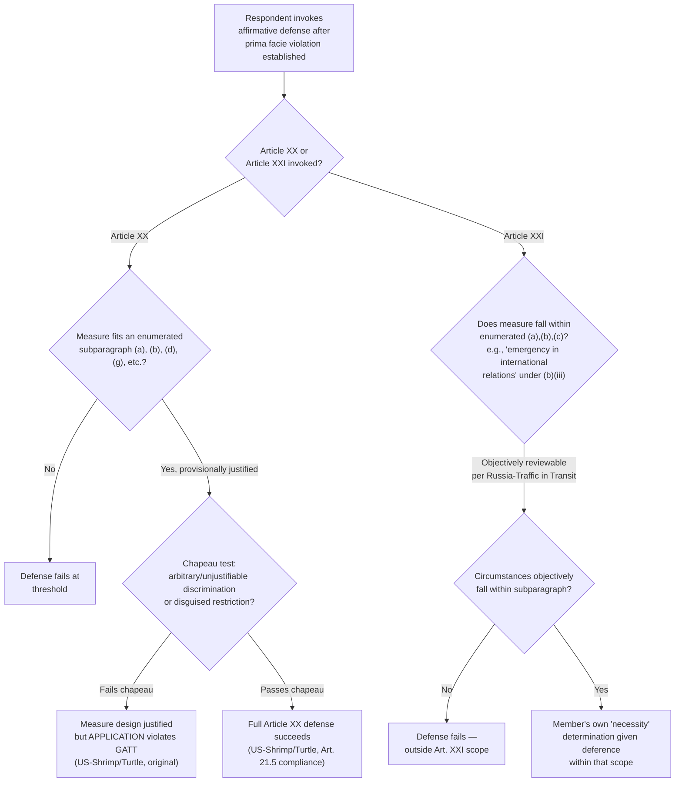

## General and Security Exceptions Under GATT Articles XX and XXI

### Structural Function of the Exceptions

Articles XX and XXI occupy a distinct analytical position from the substantive obligations discussed elsewhere in this chapter (recall MFN under Article I and national treatment under Article III): they are not independent sources of obligation but **affirmative defenses**, invoked only after a complaining party has already established a *prima facie* violation of another GATT provision. A negotiator or dispute-settlement lawyer must understand that the burden of proof shifts once this stage is reached: the *complainant* bears the burden of establishing the underlying violation (e.g., an Article III national treatment breach), while the *respondent* bears the burden of establishing that its measure falls within an Article XX or XXI exception. This burden-shifting structure is itself a settled point of WTO procedural jurisprudence, established early in Appellate Body practice (*US – Gasoline*, WT/DS2, 1996, and *US – Wool Shirts and Blouses*, WT/DS33, 1997, regarding burden of proof generally in WTO dispute settlement).

### GATT Article XX: General Exceptions

**Legal basis and structure**. Article XX permits members to maintain measures otherwise inconsistent with GATT obligations if they fall within one of ten enumerated categories (subparagraphs (a) through (j)), subject to an overarching introductory clause known as the **chapeau**. The most frequently litigated subparagraphs are:

- **Article XX(a)**: measures "necessary to protect public morals."
- **Article XX(b)**: measures "necessary to protect human, animal or plant life or health."
- **Article XX(d)**: measures "necessary to secure compliance" with domestic laws or regulations not themselves inconsistent with GATT (e.g., customs enforcement, consumer protection, competition law).
- **Article XX(g)**: measures "relating to the conservation of exhaustible natural resources," conditioned on being made effective "in conjunction with restrictions on domestic production or consumption."

**The two-tier analytical test**. WTO jurisprudence, most authoritatively articulated in *US – Gasoline* and refined in subsequent cases, requires a **two-step analysis**: first, the measure must be provisionally justified under one of the specific subparagraphs (requiring, for "necessary" measures under (a), (b), and (d), a weighing-and-balancing test considering the importance of the interest protected, the contribution the measure makes to that objective, and the trade-restrictiveness of the measure, including whether a reasonably available less-trade-restrictive alternative exists); second, if provisionally justified, the measure must satisfy the **chapeau**, which requires that the measure not be applied in a manner constituting "arbitrary or unjustifiable discrimination between countries where the same conditions prevail," or a "disguised restriction on international trade."

**Practitioner distinction—the chapeau's independent function**: a measure can be legitimately designed to pursue a listed policy objective (satisfying a subparagraph) yet still fail the chapeau if its *application* is discriminatory or arbitrary. This is a critical two-stage litigation strategy point: a respondent government must defend both the measure's *design* (subparagraph analysis) and its *administration* (chapeau analysis) as separate, sequential burdens.

**Illustrative case**: *US – Shrimp/Turtle* (WT/DS58, 1998) is the canonical Article XX(g) case demonstrating the chapeau's independent bite. The United States banned shrimp imports from countries whose fishing fleets did not use turtle-excluder devices, a measure the Appellate Body found provisionally justified under Article XX(g) as relating to conservation of an exhaustible natural resource (sea turtles, a living resource, were held capable of exhaustion). However, the measure initially **failed the chapeau** because the U.S. applied it in a manner that constituted unjustifiable and arbitrary discrimination: it provided different phase-in periods and levels of technical assistance to different exporting countries without adequate justification, and applied a rigid, non-flexible certification requirement effectively demanding that other countries adopt an essentially identical regulatory program to the U.S.'s own, rather than a program comparably effective in achieving the conservation objective. In the subsequent compliance proceeding (*US – Shrimp/Turtle, Article 21.5*), the U.S. revised its implementation to allow greater flexibility and engage in genuine, serious negotiation efforts with affected exporting countries, and the revised measure was found to satisfy the chapeau—demonstrating that chapeau compliance turns substantially on procedural fairness and genuine engagement with affected trading partners, not merely on the substantive stringency of the underlying standard.

### GATT Article XXI: Security Exceptions

**Legal basis and structure**. Article XXI permits a member to take action it considers "necessary for the protection of its essential security interests" in three enumerated circumstances: (a) relating to fissionable materials; (b) relating to traffic in arms, ammunition, and implements of war, or other goods and materials supplied for military establishment purposes, or measures taken in time of war or other emergency in international relations; and (c) actions taken in pursuance of obligations under the UN Charter for the maintenance of international peace and security.

**The self-judging controversy**. For most of GATT and WTO history, Article XXI was widely treated as **effectively self-judging**—the phrase "which it considers necessary" was read by many members and commentators as textually insulating a member's security determination from meaningful panel review, since the measure need only be one the invoking member itself considers necessary. This interpretation, if fully accepted, would functionally place Article XXI outside ordinary dispute-settlement scrutiny.

**The jurisprudential shift**: *Russia – Traffic in Transit* (WT/DS512, panel report 2019) marked the first substantive panel ruling directly addressing Article XXI's justiciability. The panel held that Article XXI is **not entirely self-judging**: while the phrase "which it considers necessary" does grant the invoking member discretion regarding whether a measure is *necessary*, the existence of an "essential security interest" and whether the circumstances fall within one of the enumerated subparagraphs (particularly the "emergency in international relations" language in subparagraph (b)(iii)) remain **objectively reviewable** by a panel. The panel found that Russia's transit restrictions on Ukraine-origin goods were adopted during a period constituting an "emergency in international relations" (given the situation between Russia and Ukraine at the time), and therefore fell within Article XXI(b)(iii)'s scope, ultimately ruling in Russia's favor on the merits of the exception while still asserting the principle of objective reviewability.

**Practitioner significance and ongoing contestation**: *Russia – Traffic in Transit*'s justiciability holding has been highly consequential but remains contested at a systemic level. **[Inference]** A number of members, historically including the United States across multiple administrations, have maintained the institutional position that Article XXI is and should remain purely self-judging, viewing any panel review of a member's essential-security determination as an overreach into matters of national sovereignty not appropriate for adjudication by a trade dispute panel; this represents a genuine, unresolved systemic disagreement about the proper scope of WTO adjudicative authority rather than settled doctrine binding on all members' future conduct, since panel reports do not carry formal stare decisis effect under WTO practice even though they carry substantial persuasive weight. Subsequent panels (including in disputes brought by Qatar against Saudi Arabia and the UAE, and by Hong Kong/China against the United States regarding steel and aluminum tariffs) have applied and further developed this justiciability framework, but the underlying political controversy over whether panels should review security determinations at all remains active. **[Unverified]** The current status and outcomes of these subsequent Article XXI disputes should be verified against the WTO Dispute Settlement Gateway, since this remains an area of live, evolving jurisprudence with direct relevance to contemporary trade-and-security policy questions (e.g., steel/aluminum tariffs, export controls on strategic technologies).

### Comparative Analytical Framework

| Dimension | Article XX (General Exceptions) | Article XXI (Security Exceptions) |
| --- | --- | --- |
| Structure | Enumerated categories (a)-(j) + chapeau | Enumerated categories (a)-(c), no chapeau |
| Core interpretive test | Two-tier: subparagraph justification + chapeau non-discrimination | Contested: self-judging "necessity" element + objectively reviewable factual predicate |
| Leading case | *US – Shrimp/Turtle* (chapeau application) | *Russia – Traffic in Transit* (justiciability) |
| Degree of panel deference | Substantial scrutiny of both design and application | Contested — narrower scrutiny of "necessity" itself, but objective review of factual predicate (post-2019) |
| Systemic status | Well-settled, extensively litigated | Actively evolving, politically contested |

### Diagram: Exception Analysis Pathways

### Practitioner Takeaways

1. **Article XX defense strategy requires defending design and application as separate stages.** A government should not assume that demonstrating a legitimate regulatory objective (subparagraph justification) is sufficient; *US – Shrimp/Turtle* demonstrates that discriminatory or inflexible *implementation*, even of an otherwise legitimate measure, independently fails the chapeau.
2. **Article XXI is no longer safely assumed to be unreviewable.** Since *Russia – Traffic in Transit*, a lawyer advising a government considering a security-justified trade measure should assume the factual predicate (existence of an emergency in international relations, or fit within another enumerated category) will face objective panel scrutiny, even though the "necessity" determination itself retains member discretion.
3. **The Article XXI justiciability question remains a live systemic fault line, not settled law binding all future panels.** A negotiator should track this as an area of ongoing institutional contestation—particularly relevant to trade measures framed around national-security justifications for tariffs or export controls on strategic goods and technologies—rather than treating the 2019 panel holding as the final word.

**Related Topics**

- The chapeau's "arbitrary or unjustifiable discrimination" standard across Article XX subparagraphs
- Burden of proof allocation in WTO dispute settlement for affirmative defenses
- *US – Shrimp/Turtle* Article 21.5 compliance proceeding and genuine negotiation requirements
- Article XXI invocations in steel and aluminum tariff disputes (Section 232 measures)
- The "necessity" test and least-trade-restrictive-alternative analysis under Article XX(b) and (d)
- National security exceptions under GATS Article XIV bis as the services-sector parallel