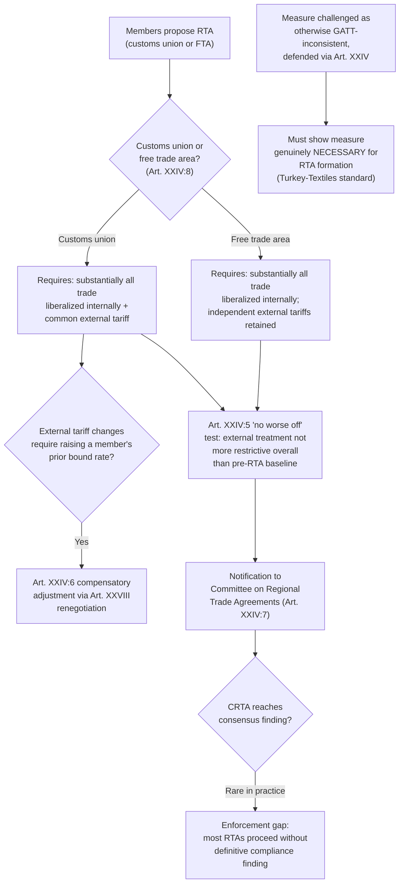

## Regional Trade Agreements and the Article XXIV Exception to Non-Discrimination

### Legal Basis and the Tension with MFN

Recall that most-favored-nation treatment under **GATT Article I** requires any advantage granted to one member's products to be extended immediately and unconditionally to all members. Regional trade agreements (RTAs)—customs unions and free trade areas granting preferential treatment exclusively among a subset of the membership—are, on their face, a direct departure from this principle. **GATT Article XXIV** is the specific legal exception permitting this departure, alongside its services-sector counterpart, **GATS Article V** (Economic Integration Agreements), and the **Enabling Clause** (1979) for preferential arrangements among developing countries specifically. This item addresses Article XXIV's goods-focused framework in detail, as the historically dominant and most heavily litigated of the three pathways.

A negotiator must treat Article XXIV as a **conditional** exception, not an open license: an RTA is permitted only if it satisfies specific textual requirements designed to ensure that regional preference does not become a vehicle for raising overall protection against non-parties, or for eroding the multilateral system's non-discrimination baseline more broadly than the exception's rationale (deeper regional integration) justifies.

### The Substantive Conditions: Article XXIV:5 and XXIV:8

**Article XXIV:8** defines the two qualifying forms of RTA and sets the internal-liberalization threshold:

- **Customs union** (Art. XXIV:8(a)): requires (i) elimination of duties and other restrictive regulations of commerce on "substantially all the trade" between constituent territories in products originating in such territories, and (ii) substantially the same duties and other regulations of commerce applied by each constituent to trade with non-members (a common external tariff).
- **Free trade area** (Art. XXIV:8(b)): requires elimination of duties and restrictive regulations of commerce on "substantially all the trade" between constituent territories in originating products, but—unlike a customs union—each member retains its own independent external tariff schedule toward non-members.

**The "substantially all the trade" threshold** is the single most contested interpretive question in Article XXIV jurisprudence. The GATT text does not define this phrase numerically or qualitatively, and no WTO panel or Appellate Body ruling has definitively resolved whether it should be measured quantitatively (a percentage of trade volume or tariff lines covered) or qualitatively (no major sector may be excluded, regardless of the numerical share it represents), or some combination. **[Unverified]** Various informal benchmarks (commonly cited figures in the 85–95% range of trade coverage) circulate in trade-policy literature and have appeared in some negotiating contexts, but no such figure carries binding legal authority as an interpretation of Article XXIV:8, and any specific percentage cited should be understood as a policy convention rather than adjudicated law.

**Article XXIV:5** requires, for the external dimension, that duties and regulations of commerce applicable to non-members at the time an RTA is formed not be "on the whole" higher or more restrictive than those applicable prior to the formation of the customs union or free trade area—the "no worse off" baseline protecting third-country trading partners from being made worse off, in aggregate, by the RTA's formation. For a customs union specifically, Article XXIV:6 provides a mechanism (linked to Article XXVIII renegotiation, discussed in relation to tariff bindings) for compensatory adjustment where a common external tariff requires increasing a bound rate above what an individual constituent member had previously bound.

### The Enforcement Weakness: A Structural Practitioner Concern

**Mechanism**: RTAs must be notified to the WTO under Article XXIV:7 and are reviewed by the **Committee on Regional Trade Agreements (CRTA)**, established in 1996 to consolidate what had previously been a fragmented, working-party-by-working-party review process. The Committee's mandate includes examining notified RTAs for consistency with Article XXIV's substantive requirements and monitoring systemic implications of RTA proliferation generally.

**The practical reality**: since the CRTA's establishment, it has reached **consensus findings of full Article XXIV consistency in only a small number of the several hundred RTAs reviewed**, with most examinations concluding without a definitive consensus determination either way—not because the agreements were found compliant, but because consensus-based review (recall Article IX's default decision-making rule) allows any single member, including a party to the RTA under review, to prevent an adverse finding from being adopted. This has produced what trade-law literature widely characterizes as a substantial **enforcement gap**: the "substantially all the trade" and "no worse off" thresholds exist as binding legal text, but the institutional mechanism designed to police compliance with them has rarely, if ever, produced an authoritative multilateral finding of non-compliance against a notified RTA.

**[Inference]** This enforcement gap is consistently identified across trade-law scholarship as a structural weakness enabling RTA proliferation—the number of RTAs in force has grown from a relative handful at GATT's founding to several hundred by the 2020s—to proceed with limited rigorous multilateral scrutiny; the precise causal weight of consensus-review gridlock versus other contributing factors (such as members' general preference for RTA flexibility over multilateral negotiation) is a matter of ongoing interpretive debate rather than a single settled causal finding, and current RTA counts should be verified against the WTO's RTA database if precision is required.

### Judicial Treatment of Article XXIV: The Limited Direct Adjudication

Unlike Article I, III, XX, or XXI, Article XXIV has been the subject of comparatively **few dispositive panel or Appellate Body rulings** directly interpreting its core substantive thresholds, despite being invoked as a defense in numerous disputes. Most panels facing an Article XXIV defense have either found it unnecessary to rule definitively on the provision's precise requirements (resolving the dispute on other grounds) or have addressed only narrow procedural aspects.

**Illustrative case**: *Turkey – Textiles* (WT/DS34, 1999) is the most significant case squarely addressing Article XXIV's substantive application. Turkey imposed quantitative restrictions on textile and clothing imports from India, justifying the measure as necessary to align Turkey's trade policy with the European Communities' policy as part of the Turkey-EC customs union then being formed. The Appellate Body held that Article XXIV can, in principle, justify a measure otherwise inconsistent with GATT obligations (here, the quantitative restrictions), but only where the measure is genuinely **necessary** for formation of the customs union—meaning the customs union could not have been formed without the challenged measure. The Appellate Body found Turkey had not demonstrated this necessity, since alternative means of forming the customs union without imposing new India-specific restrictions were reasonably available, and ruled against Turkey. This case established that Article XXIV's exception is not a blanket shield for any measure a customs union's constituents deem convenient—it requires a genuine, demonstrated necessity linkage between the challenged measure and the union's formation.

**Practitioner implication of *Turkey – Textiles***: a government defending a trade-restrictive measure by reference to RTA-formation requirements must be prepared to demonstrate—not merely assert—that the specific measure was indispensable to forming the customs union, a considerably higher bar than showing the measure is merely consistent with or convenient for regional integration objectives.

### The Systemic Legitimacy Debate: RTA Proliferation and the Multilateral System

A negotiator should be conversant with the strongest form of both sides of an active, unresolved debate regarding RTA proliferation's relationship to the multilateral trading system.

**The "building blocks" view** holds that RTAs, by achieving deeper integration among willing subsets of members than is currently achievable multilaterally (particularly given the Doha Round's stalled single-undertaking negotiations), generate experimentation with liberalization approaches, disciplines, and issue coverage (e.g., digital trade, investment, regulatory cooperation) that can eventually inform and be multilateralized into WTO-wide rules, functioning as incremental progress toward, rather than away from, deeper multilateral integration.

**The "stumbling blocks" view** holds that RTA proliferation fragments the trading system into overlapping, inconsistent preferential arrangements (the "spaghetti bowl" phenomenon, referring to the complex tangle of overlapping rules of origin and preference margins across hundreds of agreements), diverts negotiating political capital and attention away from multilateral rounds, and—given the enforcement gap described above—allows discriminatory preferential treatment to expand with limited multilateral discipline, undermining MFN's role as the system's organizing non-discrimination baseline.

**[Inference]** Both positions are well-represented and actively argued in trade-policy and academic literature, with the empirical evidence on RTAs' net effect on multilateral liberalization (trade creation versus trade diversion effects, and dynamic effects on subsequent multilateral negotiating behavior) genuinely mixed and dependent on the specific RTAs and sectors studied; this is a live, unresolved empirical and policy debate rather than one with a clearly dominant, well-established consensus answer.

### Diagram: Article XXIV Compliance Pathway

### Practitioner Takeaways

1. **Article XXIV compliance is a legal requirement independent of whether it is ever authoritatively adjudicated.** A negotiator structuring a new RTA should design it to genuinely meet the "substantially all the trade" and "no worse off" thresholds on the merits, rather than relying on the CRTA's demonstrated reluctance to reach adverse consensus findings as a practical safe harbor—dispute settlement remains available to individual affected members even absent CRTA action, as *Turkey – Textiles* demonstrates.
2. **"Necessity" for RTA-justified measures is a demanding, case-specific standard, not a general integration rationale.** Following *Turkey – Textiles*, a government cannot successfully invoke Article XXIV merely by showing a challenged measure aligns with or facilitates regional integration—it must show the measure was indispensable to the union's formation, with no reasonably available less-restrictive alternative.
3. **The building-blocks/stumbling-blocks debate should inform, not be assumed away in, RTA strategy advice.** A trade-policy advisor recommending an RTA strategy to a government should present both the genuine multilateral-liberalization benefits some RTAs have historically demonstrated and the documented risks of preference erosion, rules-of-origin complexity, and diversion of multilateral negotiating capital, rather than treating either position as self-evidently correct.

**Related Topics**

- The Committee on Regional Trade Agreements' review procedures and consensus-based limitations
- *Turkey – Textiles* and the "necessity" standard for RTA-justified GATT-inconsistent measures
- GATS Article V Economic Integration Agreements as the services-sector parallel to Article XXIV
- The Enabling Clause and preferential arrangements among developing countries
- Rules of origin and the "spaghetti bowl" problem in overlapping RTA networks
- Article XXIV:6 compensatory adjustment and its interaction with Article XXVIII renegotiation