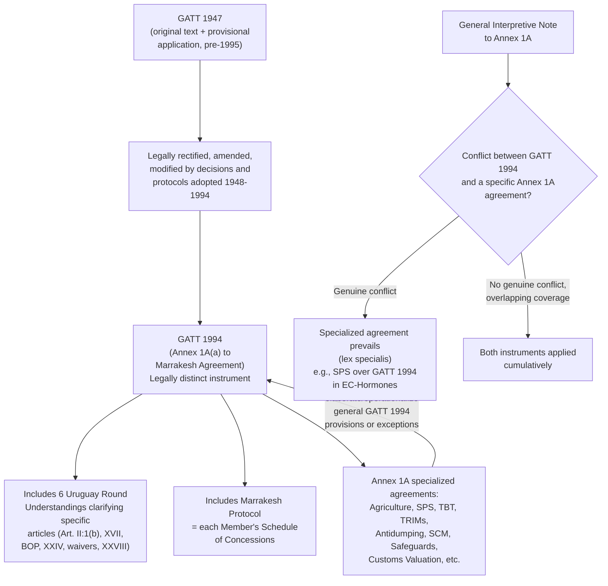

## GATT 1994 and Its Incorporation of the Annex 1A Goods Agreements

### GATT 1994 as a Legally Distinct Instrument

Recall that GATT 1947 was brought into force through the Protocol of Provisional Application and never acquired formal treaty ratification status, persisting as the trading system's operative legal framework for 47 years despite its provisional design. **GATT 1994**, established as **Annex 1A(a)** to the Marrakesh Agreement, is not a re-negotiation or replacement of GATT 1947's substantive text—it is a legally distinct instrument that **incorporates** GATT 1947 as legally rectified, amended, and modified by the accumulated body of decisions, protocols, and interpretive understandings adopted under it through 1994.

**Precise textual composition**: the Annex to the Marrakesh Agreement defining GATT 1994 specifies that it consists of: (i) the provisions of GATT 1947 (excluding the Protocol of Provisional Application itself); (ii) provisions of legal instruments that entered into force under GATT 1947 before the WTO Agreement's entry into force (protocols and certifications of tariff concessions, protocols of accession, decisions on waivers granted under Article XXV, and other GATT-era decisions); (iii) six specific **Uruguay Round Understandings** clarifying the interpretation of particular GATT articles (on Article II:1(b), Article XVII, balance-of-payments provisions, Article XXIV, waivers, and Article XXVIII); and (iv) the **Marrakesh Protocol to GATT 1994**, which contains each member's Schedule of Concessions.

**Practitioner significance of this distinction**: because GATT 1994 is textually and legally separate from GATT 1947 (even though substantively continuous), a lawyer citing GATT provisions in a post-1995 WTO dispute must cite GATT 1994, not GATT 1947, as the operative legal instrument—GATT 1947 technically ceased to be the applicable multilateral goods-trade treaty for WTO members upon the WTO's establishment, though its substantive Articles I through XXXVIII were carried forward essentially unchanged in numbering and core content. This is also why the Uruguay Round Understandings matter independently: they resolved specific interpretive ambiguities that had accumulated during GATT 1947's operational history, and a dispute implicating one of the six specifically clarified articles (for instance, Article XXIV's "substantially all the trade" ambiguity, addressed in part by the Understanding on the Interpretation of Article XXIV) requires consulting the relevant Understanding alongside the base article text.

### The Relationship Between GATT 1994 and the Annex 1A Goods Agreements

Recall from the discussion of the Annex structure that **Annex 1A** comprises GATT 1994 itself plus a series of subject-specific goods agreements: Agriculture, SPS, TBT, TRIMs, Antidumping (Article VI implementation), Customs Valuation (Article VII implementation), Preshipment Inspection, Rules of Origin, Import Licensing Procedures, Subsidies and Countervailing Measures (SCM), Safeguards, and the now-spent Agreement on Textiles and Clothing. A negotiator or lawyer must understand precisely how these instruments relate to GATT 1994 as a matter of legal hierarchy and interpretive practice, since this relationship determines which text governs when GATT 1994's general language and a more specific Annex 1A agreement's provisions appear to overlap or conflict.

**The General Interpretive Note to Annex 1A**: this note, appended to Annex 1A itself, provides the governing rule: "In the event of conflict between a provision of the General Agreement on Tariffs and Trade 1994 and a provision of another agreement in Annex 1A... the provision of the other agreement shall prevail to the extent of the conflict." This establishes a clear hierarchy—the specialized Annex 1A agreements take precedence over GATT 1994's more general provisions where they genuinely conflict, reflecting the standard interpretive principle that specific rules govern over general ones (*lex specialis*) within a unified treaty structure.

**Practitioner application**: this interpretive note is frequently invoked in disputes where a measure is challenged simultaneously under GATT 1994 (e.g., Article III national treatment or Article XI on quantitative restrictions) and a specific Annex 1A agreement (e.g., the SPS Agreement or the Agreement on Agriculture) covering the same subject matter. WTO panels have generally interpreted "conflict" narrowly—not every instance of overlapping coverage constitutes a "conflict" triggering the interpretive note; the specialized agreement displaces GATT 1994 only where the two instruments impose genuinely irreconcilable obligations, and where no such irreconcilable conflict exists, panels have applied both instruments cumulatively.

**Illustrative case**: *EC – Hormones* (WT/DS26/DS48, 1998) illustrates the layered relationship between GATT 1994 and a specific Annex 1A agreement. The European Communities' ban on hormone-treated beef was challenged under both GATT 1994 (potentially Article III or XI) and the SPS Agreement, which contains detailed, science-based disciplines (risk assessment requirements, the "sufficient scientific evidence" standard under SPS Article 2.2, and international-standard-harmonization provisions under SPS Article 3) specifically tailored to sanitary and phytosanitary measures. The Appellate Body's approach effectively proceeded through the more specific SPS Agreement disciplines as the primary framework for assessing a measure of this type, consistent with the *lex specialis* logic embedded in the General Interpretive Note, finding the EC's ban inconsistent with SPS Agreement requirements (specifically, the absence of an adequate risk assessment supporting the measure) without needing to reach an independent, freestanding GATT 1994 analysis of the same measure. **[Unverified]** The precise sequencing and specific GATT 1994 provisions formally at issue alongside the SPS claims in *EC – Hormones* involved procedural complexity across multiple compliance and retaliation phases extending over more than a decade; specific procedural details should be verified against the original panel and Appellate Body reports if required for precise citation.

### Structural Pattern: General Discipline, Specialized Elaboration

A consistent structural pattern across Annex 1A explains why the multiple specialized agreements exist alongside GATT 1994 rather than GATT 1994 alone: each Annex 1A agreement typically **elaborates and operationalizes** a general GATT 1994 obligation or exception for a specific subject-matter domain where the general text proved insufficiently precise to govern modern regulatory complexity:

- The **Agreement on Agriculture** elaborates GATT 1994's general framework specifically for agricultural products, introducing tariffication (converting non-tariff barriers to tariffs, recall the tariff-rate quota discussion), domestic support disciplines, and export subsidy commitments not addressed with comparable specificity in GATT 1994's general text.
- The **SPS Agreement** elaborates the food-safety and health-protection rationale embedded in GATT Article XX(b)'s general exception into a detailed, science-based regulatory framework with its own necessity and risk-assessment tests, as seen in *EC – Hormones*.
- The **TBT Agreement** similarly elaborates Article XX(b) and related rationales for technical regulations and standards more broadly (beyond SPS-specific health measures), with its own non-discrimination and "not more trade-restrictive than necessary" disciplines.
- The **Antidumping Agreement** and **SCM Agreement** operationalize GATT Article VI's brief textual authorization for antidumping and countervailing duties into comprehensive procedural and substantive codes governing investigation, calculation methodology, and duty imposition.
- The **Safeguards Agreement** operationalizes GATT Article XIX's general safeguard authorization (emergency action on imports of particular products) into detailed procedural and substantive disciplines, including the requirement of a formal "unforeseen developments" and "serious injury" finding.
- **TRIMs** clarifies that certain investment measures (e.g., local-content requirements) affecting trade in goods fall within the scope of GATT Article III (national treatment) and Article XI (quantitative restrictions) obligations, rather than creating wholly new disciplines.

**[Inference]** This general-discipline-to-specialized-elaboration pattern is widely understood among trade-law scholars as reflecting the Uruguay Round negotiators' recognition that GATT 1947's brief, general-purpose text—adequate for the tariff-focused trade environment of 1947—required detailed, subject-specific supplementation to address the more complex non-tariff and regulatory trade barriers that had become increasingly significant by the 1980s and 1990s; this is a reasonable historical-contextual interpretation rather than a claim stated explicitly as such in the negotiating history itself.

### Diagram: GATT 1994's Position Within Annex 1A

### Practitioner Takeaways

1. **Cite GATT 1994, not GATT 1947, in any post-1995 legal analysis.** While the substantive continuity is high, the instruments are legally distinct, and GATT 1994's composition (including the six Uruguay Round Understandings) means some interpretive questions are resolved by text that did not exist in GATT 1947 itself.
2. **Identify whether a measure is genuinely governed by a specialized Annex 1A agreement before defaulting to a general GATT 1994 analysis.** Following the General Interpretive Note and *EC – Hormones*, a measure implicating food safety, technical standards, subsidies, or safeguards should generally be analyzed first and primarily through its specialized agreement's tailored disciplines, since panels have consistently treated these as the more specific and therefore controlling framework where genuine conflict exists.
3. **"Conflict" under the General Interpretive Note is a narrow, specific legal threshold, not a general overlap test.** A lawyer should not assume that any measure touching both GATT 1994 and a specialized agreement automatically triggers the specialized agreement's exclusive application—cumulative application of both instruments remains the default absent a genuinely irreconcilable textual conflict.

**Related Topics**

- The six Uruguay Round Understandings incorporated into GATT 1994's legal composition
- The SPS Agreement's risk-assessment and scientific-evidence requirements, illustrated by *EC – Hormones*
- The Agreement on Agriculture's tariffication process and its relationship to GATT Article XI
- GATT Article VI as the textual basis for the Antidumping and SCM Agreements' detailed procedural codes
- The TRIMs Agreement and its clarification of Articles III and XI for investment-related measures
- The General Interpretive Note to Annex 1A and its narrow "conflict" threshold in WTO jurisprudence