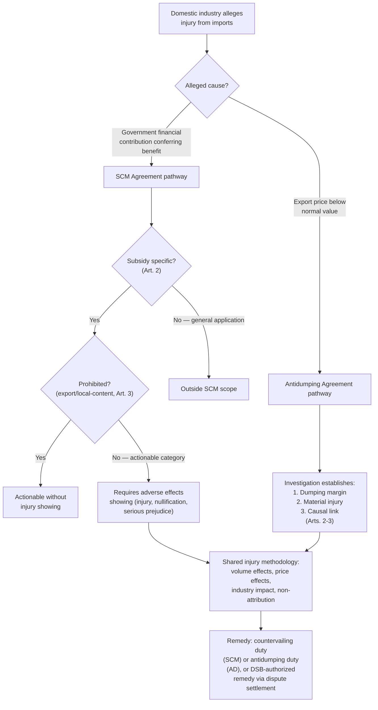

## The Agreement on Subsidies and Countervailing Measures and Anti-Dumping Disciplines

### Two Distinct Legal Regimes Sharing a Structural Logic

This item covers two textually and procedurally separate Annex 1A agreements that are frequently discussed together because they address a common underlying phenomenon—unfairly priced or subsidized trade causing injury to a competing domestic industry—through parallel remedial architectures. The **Agreement on Subsidies and Countervailing Measures (SCM Agreement)** operationalizes GATT Article XVI (subsidies) and Article VI (countervailing duties); the **Antidumping Agreement** (formally the Agreement on Implementation of Article VI of GATT 1994) operationalizes GATT Article VI's dumping provisions specifically. A negotiator or trade-remedies lawyer must keep them analytically distinct: dumping is a **pricing practice by a private firm** (exporting below normal value); a subsidy is a **government financial contribution** conferring a benefit. The remedies address different actors and require different evidentiary showings, even though both culminate in a similar type of import duty and share overlapping injury-determination methodology.

### The SCM Agreement: Defining and Disciplining Subsidies

**Legal basis and the subsidy definition**. **SCM Article 1** provides the foundational two-part definition: a subsidy exists where there is a **financial contribution** by a government or public body (direct transfer of funds, foreclosed government revenue otherwise due, provision of goods or services other than general infrastructure, or income/price support) that confers a **benefit**. Both elements must be established; a government measure that does not confer a benefit relative to market terms does not constitute a subsidy under the Agreement, regardless of its financial-contribution character.

**Specificity**: SCM Article 2 adds a critical qualifying requirement—only **specific** subsidies (those limited to an enterprise, industry, group of enterprises/industries, or a designated region within the granting member's jurisdiction) are subject to SCM disciplines. Subsidies of general application (available economy-wide, such as general infrastructure or broadly available tax provisions) fall outside the Agreement's scope, reflecting the policy judgment that only subsidies distorting competition in specific, identifiable markets warrant multilateral discipline.

**The traffic-light categorization**. The original SCM Agreement classified subsidies into three categories using a widely referenced "traffic light" framework:

- **Prohibited (red light) subsidies** (Article 3): export subsidies (contingent on export performance) and local-content subsidies (contingent on using domestic over imported goods), prohibited outright without need for injury demonstration.
- **Actionable (yellow light) subsidies** (Article 5): specific subsidies causing "adverse effects" to another member's interests—injury to a domestic industry, nullification/impairment of GATT benefits, or serious prejudice—actionable through dispute settlement or countervailing duty investigation upon such a showing.
- **Non-actionable (green light) subsidies** (Article 8, covering certain R&D, regional development, and environmental-adaptation subsidies meeting specific conditions): this category was subject to a five-year sunset clause and **expired at the end of 1999**, having never been renewed by subsequent Committee decision—meaning no non-actionable category currently exists under the operative SCM Agreement, a frequently overlooked point given the "traffic light" framework's continued informal use in commentary.

**Practitioner note on the green-light expiration**: a lawyer or negotiator encountering references to "green light" or "non-actionable" subsidies in older literature must recognize this category no longer has operative legal effect; all specific subsidies not falling into the prohibited category are now, by default, actionable if they cause adverse effects, with no automatically safe-harbor category remaining.

**Remedial pathways**: the SCM Agreement provides two parallel remedial routes—**multilateral dispute settlement** (a complaining member brings a claim through the DSB, following the standard DSU procedure, recall the negative-consensus adoption mechanism) and **unilateral countervailing duty investigation** (a member's domestic authorities investigate and, if warranting criteria are met, impose a countervailing duty on subsidized imports causing injury to the domestic industry, following SCM Part V's detailed procedural code governing initiation, evidence, calculation, and duty imposition).

**Illustrative case**: *US – Large Civil Aircraft* and *EC/Airbus* (the Boeing-Airbus disputes, WT/DS353 and WT/DS316, spanning roughly 2004–2019) are the most extensively litigated SCM disputes, involving mutual claims that the United States and the European Union (on behalf of Boeing and Airbus respectively) provided prohibited and actionable subsidies to their respective civil aircraft manufacturers, including R&D funding, tax measures, and infrastructure support. The proceedings produced findings of both prohibited and actionable subsidies on both sides across multiple compliance rounds, and ultimately authorized substantial retaliatory tariff measures by both parties before a negotiated truce was reached. **[Unverified]** The precise final compliance status, retaliation amounts authorized, and the durability of the negotiated truce should be verified against current WTO Dispute Settlement Gateway records and any subsequent bilateral agreements, as this dispute's resolution evolved over an unusually long period and its current status may have developed further.

### The Antidumping Agreement: Disciplining Price Discrimination

**Legal basis and the dumping definition**. **Antidumping Agreement Article 2** defines dumping as the introduction of a product into the commerce of another country at less than its **normal value**—typically the comparable price for the like product in the exporting country's domestic market, or, where domestic sales are insufficient or unrepresentative, a constructed value based on cost of production plus a reasonable margin for profit, or the price to a third country. Unlike a subsidy, dumping is not itself a government action; it is private firm-level pricing behavior, though it is disciplined at the state-to-state level because GATT/WTO law addresses dumping through the importing member's authority to impose remedial duties rather than through obligations on the exporting government directly.

**The three-part investigatory requirement**: before imposing an antidumping duty, a member's investigating authority must establish, through a formal investigation following Antidumping Agreement procedural requirements (Articles 5–6, governing initiation, evidence-gathering, and due-process protections for interested parties): (1) dumping (export price below normal value); (2) **material injury** (or threat thereof) to the domestic industry producing the like product; and (3) a **causal link** between the dumped imports and the injury.

**Zeroing**: this is one of the most heavily litigated technical methodologies in antidumping law. "Zeroing" refers to a calculation practice, historically used particularly by the United States, in which an investigating authority calculates the dumping margin by comparing export prices to normal value transaction-by-transaction (or in other comparison methods), but when a given comparison shows the export price *above* normal value (a negative margin, meaning no dumping on that transaction), the authority treats that negative margin as **zero** rather than allowing it to offset positive margins found on other transactions—inflating the overall calculated dumping margin relative to a methodology that permits full offsetting.

**Illustrative case**: The zeroing methodology was successfully challenged by the European Communities and Japan (among others) across a long series of disputes, most notably *US – Zeroing (EC)* (WT/DS294, 2006) and *US – Zeroing (Japan)* (WT/DS322, 2007). The Appellate Body found the zeroing methodology, as applied in various contexts (original investigations, administrative reviews, and sunset reviews), inconsistent with Antidumping Agreement Article 2.4's requirement of a "fair comparison" between export price and normal value, on the reasoning that disregarding negative margins systematically overstates dumping margins and does not reflect prices actually charged across the full range of transactions under investigation. **[Inference]** The zeroing line of cases is widely regarded in trade-remedies literature as among the clearest examples of sustained, repeated Appellate Body findings against a specific, persistent member practice, generating significant and prolonged compliance friction; the practical extent to which the United States has fully abandoned zeroing across all contexts following these rulings is a matter that should be verified against current U.S. Department of Commerce practice and subsequent compliance proceedings rather than assumed resolved.

### Injury Determination: The Shared Methodological Core

Both the SCM Agreement (Part V, for countervailing duties) and the Antidumping Agreement (Article 3) share substantially parallel **injury determination** requirements, reflecting their common remedial logic:

- **Volume effects**: whether there has been a significant increase in dumped/subsidized imports, in absolute terms or relative to domestic production/consumption.
- **Price effects**: whether dumped/subsidized imports have caused significant price undercutting, price depression, or price suppression relative to domestic like-product prices.
- **Impact on the domestic industry**: a comprehensive evaluation of relevant economic factors—output, sales, market share, profits, productivity, employment, cash flow, and other indicators—bearing on the domestic industry's state.
- **Causation and non-attribution**: the investigating authority must ensure injury caused by factors *other than* the dumped/subsidized imports (e.g., a general economic downturn, changes in consumption patterns, or import competition from non-dumped sources) is not attributed to the dumped/subsidized imports themselves—a frequently litigated element, since a weak non-attribution analysis is a common basis for successful WTO challenges to national trade-remedy determinations.

### Comparative Summary

| Dimension | SCM Agreement (Subsidies/CVD) | Antidumping Agreement |
| --- | --- | --- |
| Underlying practice | Government financial contribution conferring benefit | Private firm pricing below normal value |
| GATT textual basis | Article XVI (subsidies) + Article VI (CVDs) | Article VI (dumping) |
| Categorization | Prohibited (export/local-content) vs. actionable; green-light category expired 1999 | No categorization — single injury/causation test applies uniformly |
| Key contested methodology | Benefit benchmarking, specificity determination | Zeroing in margin calculation |
| Landmark dispute | *US – Large Civil Aircraft* / *EC and Certain Member States – Large Civil Aircraft* (Boeing-Airbus) | *US – Zeroing* series (EC, Japan) |
| Remedial pathways | Multilateral dispute settlement + unilateral CVD investigation | Unilateral AD investigation (dispute settlement available to challenge WTO-consistency of resulting duties) |

### Diagram: Trade Remedy Investigation Pathways

### Practitioner Takeaways

1. **Always identify whether the alleged unfair practice is government-attributable (subsidy) or firm-level (dumping) before selecting the applicable legal framework.** The two regimes share injury methodology but diverge completely on the underlying conduct requiring proof—a lawyer conflating financial-contribution analysis with normal-value calculation risks a fundamentally misdirected investigation or challenge.
2. **The green-light non-actionable subsidy category no longer exists.** Any current subsidy analysis should proceed on the basis that all specific subsidies are either prohibited or actionable, with no automatically safe-harbor category available since the 1999 sunset.
3. **Zeroing-type calculation methodology disputes demonstrate that technical calculation choices, not just headline determinations, are independently litigable.** A lawyer reviewing a member's antidumping determination should scrutinize the specific price-comparison methodology employed, not only the ultimate margin and injury findings, since methodology-level WTO-inconsistency (as in the zeroing cases) can independently invalidate an otherwise procedurally sound determination.

**Related Topics**

- The specificity test under SCM Article 2 and its role in distinguishing actionable from general subsidies
- The Boeing-Airbus (*Large Civil Aircraft*) disputes and cross-retaliation authorization
- Zeroing methodology and its successive challenges across original investigations, reviews, and sunset reviews
- Non-attribution analysis in injury determinations under both SCM and Antidumping Agreements
- Sunset reviews and the five-year review requirement for existing antidumping and countervailing duties
- The relationship between GATT Article VI and the detailed procedural codes of the SCM and Antidumping Agreements