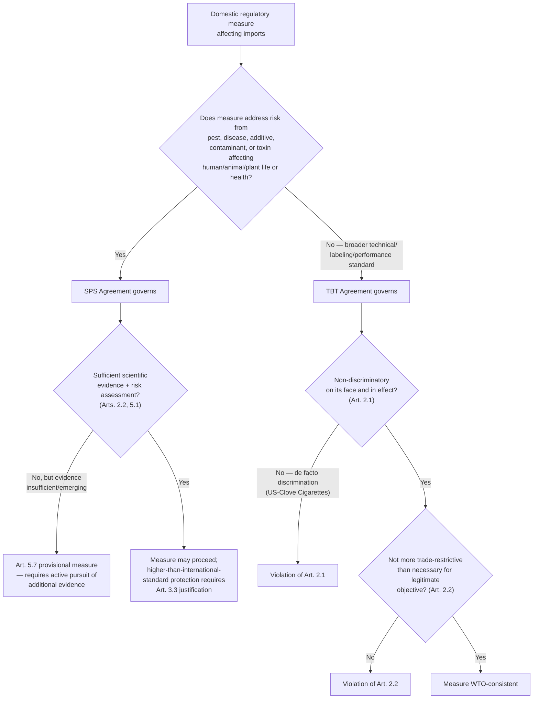

## The Sanitary and Phytosanitary Measures and Technical Barriers to Trade Agreements

### Shared Origin and the Boundary Between Them

Recall that Annex 1A agreements typically elaborate a general GATT 1994 discipline for a specific regulatory domain; both the **SPS Agreement** and the **TBT Agreement** operationalize the health, safety, and consumer-protection rationale embedded in GATT Article XX(b) (necessary to protect human, animal, or plant life or health) into detailed, subject-specific regulatory disciplines. A negotiator's first analytical task when a measure is challenged is determining **which agreement applies**, since the two instruments impose meaningfully different tests.

**The jurisdictional boundary**: the **SPS Agreement, Annex A**, defines its scope precisely—measures applied to protect human or animal life from risks arising from additives, contaminants, toxins, or disease-causing organisms in food; to protect human life from plant- or animal-carried diseases; to protect animal or plant life from pests, diseases, or disease-carrying organisms; and to prevent other damage from pest entry, establishment, or spread. The **TBT Agreement** covers technical regulations, standards, and conformity-assessment procedures **more broadly**, excluding SPS measures and government procurement specifications, but covering everything from product-labeling requirements to technical performance standards, packaging requirements, and product-safety standards not falling within SPS's specific food-safety and pest/disease scope.

**Practitioner rule of thumb**: if a measure addresses a risk arising from a pest, disease, additive, contaminant, or toxin affecting human, animal, or plant life or health, it is presumptively an SPS measure; if it addresses a technical characteristic, labeling requirement, or performance standard for a broader range of policy reasons (consumer information, environmental protection, safety standards not linked to pest/disease/contaminant risk), it is presumptively a TBT measure. Misidentifying which agreement governs a specific measure is a common and consequential analytical error, since the two agreements impose materially different substantive tests, discussed below.

### The SPS Agreement: Science-Based Risk Discipline

**Core substantive requirement — Article 2.2**: SPS measures must be based on scientific principles and not maintained without sufficient scientific evidence, except as provided in Article 5.7 (the provisional-measures/precautionary provision, discussed below). This is a materially more demanding standard than the general "necessity" test under GATT Article XX(b): rather than a weighing-and-balancing necessity analysis, SPS measures require an affirmative scientific evidentiary foundation.

**Risk assessment — Article 5.1**: members must base SPS measures on a risk assessment appropriate to the circumstances, taking into account risk-assessment techniques developed by relevant international organizations. This requirement was central to *EC – Hormones* (recall the discussion of GATT 1994's relationship to Annex 1A agreements): the Appellate Body found the EC's ban on hormone-treated beef inconsistent with Article 5.1 because the EC's risk assessment did not adequately evaluate the specific risk from the hormones as administered for growth-promotion purposes under actual conditions of use, rather than a more general, theoretical risk assessment.

**Harmonization and international standards — Article 3**: SPS measures conforming to international standards (developed by bodies such as the Codex Alimentarius Commission for food safety, the World Organisation for Animal Health (WOAH, historically OIE) for animal health, and the International Plant Protection Convention (IPPC) for plant health) are presumed consistent with the SPS Agreement and GATT 1994. Members may adopt measures providing a **higher level of protection** than the relevant international standard, but doing so requires scientific justification under Article 3.3, subjecting the more stringent measure to the Article 2.2/5.1 evidentiary requirements.

**The precautionary provision — Article 5.7**: where relevant scientific evidence is insufficient, a member may provisionally adopt an SPS measure on the basis of available pertinent information, but must seek to obtain the additional information necessary for a more objective risk assessment and review the measure within a reasonable period. This provision is frequently invoked by members defending precautionary measures against emerging or scientifically uncertain risks, but its "provisional" character and the obligation to actively pursue additional evidence distinguish it from a general, indefinite right to precaution—a member cannot invoke Article 5.7 to justify a permanent measure absent an active, ongoing scientific investigation.

**Illustrative case**: *EC – Hormones* remains the foundational SPS case, but the precautionary-measure question was more squarely addressed in *Japan – Agricultural Products II* (WT/DS76, 1999) and *Japan – Apples* (WT/DS245, 2003), both of which found Japan's measures failed to satisfy Article 5.7's requirements because Japan had not demonstrated an active pursuit of additional scientific information sufficient to justify the provisional measure's continuation. **[Unverified]** Specific procedural sequencing and the precise scientific evidentiary findings across these cases are technical and case-specific; a practitioner citing them for a live regulatory question should verify current status and holding details against the original reports.

### The TBT Agreement: Non-Discrimination Plus Necessity for Technical Regulations

**Core substantive requirements — Article 2**: TBT Article 2.1 imposes MFN and national-treatment-style non-discrimination obligations on technical regulations (recall Articles I and III of GATT 1994; TBT Article 2.1 applies parallel logic specifically to technical regulations). Article 2.2 requires that technical regulations not be "more trade-restrictive than necessary to fulfil a legitimate objective," with legitimate objectives explicitly including national security, prevention of deceptive practices, and protection of human health/safety, animal/plant life or health, or the environment—a broader and more open-ended list of legitimate objectives than SPS's narrower food-safety/pest/disease focus, but subject to a **necessity** test rather than SPS's science-based evidentiary test.

**International standards — Article 2.4**: parallel to SPS Article 3, TBT Article 2.4 requires members to use relevant international standards as a basis for technical regulations, except where such standards would be ineffective or inappropriate for fulfilling the legitimate objective pursued, given, for example, fundamental climatic or geographical factors or fundamental technological problems.

**"Likeness" and regulatory purpose**: TBT disputes frequently turn on how "like products" is assessed for the purposes of Article 2.1's non-discrimination obligation, and on whether a facially origin-neutral technical regulation nonetheless discriminates de facto (recall the de jure/de facto framework from the discussion of national treatment under GATT Article III).

**Illustrative case**: *US – Clove Cigarettes* (WT/DS406, 2012) is a leading TBT case: the United States banned flavored cigarettes, including clove cigarettes (predominantly imported from Indonesia), while exempting menthol cigarettes (predominantly domestically produced) from the ban. The Appellate Body found this violated TBT Article 2.1's national-treatment obligation, holding that clove and menthol cigarettes were "like products" for TBT purposes (both being flavored cigarettes appealing to similar consumer segments, particularly youth smokers) and that the menthol exemption meant the measure afforded less favorable treatment to the predominantly imported product group, illustrating a de facto discrimination finding in the TBT context analogous to the *Korea – Beef* logic under GATT Article III. **[Inference]** *US – Clove Cigarettes* is widely cited as establishing that TBT "likeness" analysis incorporates competitive-relationship reasoning similar to GATT Article III jurisprudence, though the TBT Agreement's specific textual structure and objectives (Article 2.1 read together with the Agreement's preamble) mean the analysis is not simply a mechanical transplant of GATT III doctrine; this is a widely held interpretive characterization in TBT scholarship rather than an explicit doctrinal holding equating the two provisions.

### Comparative Framework: SPS Versus TBT

| Dimension | SPS Agreement | TBT Agreement |
| --- | --- | --- |
| Scope | Food safety, animal/plant life/health from pests, diseases, additives, contaminants, toxins | Broader: technical regulations, standards, conformity assessment for any legitimate objective |
| Core substantive test | Science-based: sufficient scientific evidence + risk assessment (Arts. 2.2, 5.1) | Necessity: not more trade-restrictive than necessary for legitimate objective (Art. 2.2) |
| International standard-setting bodies | Codex Alimentarius, WOAH (OIE), IPPC | Varies by sector (ISO, IEC, and others); no single designated body |
| Precautionary allowance | Explicit provisional-measure provision (Art. 5.7), tied to active evidence-gathering | No equivalent explicit precautionary provision |
| Presumption of consistency | Conformity with relevant international standard presumed WTO-consistent (Art. 3.2) | Conformity with international standard presumed not to create unnecessary obstacle (Art. 2.5) |
| Landmark case | *EC – Hormones*; *Japan – Apples* (precaution) | *US – Clove Cigarettes* (de facto discrimination) |

### Notification Obligations: A Shared Transparency Architecture

Recall from the discussion of transparency obligations that both agreements impose **advance notification requirements** for proposed measures not substantially based on an international standard and likely to have a significant trade effect (SPS Annex B; TBT Articles 2.9–2.10), each with a comment period allowing other members to raise concerns before adoption, subject to expedited or emergency procedures where urgent health, safety, or environmental circumstances require immediate action. This shared notification architecture reflects the common recognition that ex ante transparency, allowing affected trading partners to comment before a measure crystallizes into binding law, reduces the likelihood of disputes arising after the fact.

### Diagram: SPS/TBT Jurisdictional and Substantive Pathway

### Practitioner Takeaways

1. **Determine SPS versus TBT applicability first, since the two tests are not interchangeable.** A government defending a food-safety-adjacent measure under a general "necessity" TBT-style argument when SPS's stricter science-based evidentiary standard actually applies (or vice versa) is litigating under the wrong framework entirely.
2. **Article 5.7's precautionary allowance is provisional and evidence-generating, not a permanent alternative to risk assessment.** A government relying on scientific uncertainty to justify an SPS measure must demonstrate active, ongoing efforts to obtain the additional information needed for a full risk assessment, per *Japan – Apples*, or risk losing the Article 5.7 defense over time.
3. **TBT de facto discrimination analysis closely parallels GATT Article III's competitive-conditions test.** A regulator designing technical regulations with facially neutral criteria (e.g., product-category exemptions) should assess, per *US – Clove Cigarettes*, whether the practical effect systematically disadvantages an imported product group, since facial neutrality alone is not a complete defense under TBT Article 2.1 any more than it is under GATT Article III:4.

**Related Topics**

- Risk assessment methodology under SPS Article 5.1 and its application in *EC – Hormones*
- The precautionary principle under SPS Article 5.7 and its evidentiary limits
- De facto discrimination under TBT Article 2.1, illustrated by *US – Clove Cigarettes*
- International standard-setting bodies (Codex, WOAH, IPPC) and the presumption of consistency
- The TBT Agreement's "legitimate objectives" list and its comparison to GATT Article XX categories
- Notification and comment-period procedures under SPS Annex B and TBT Articles 2.9-2.10