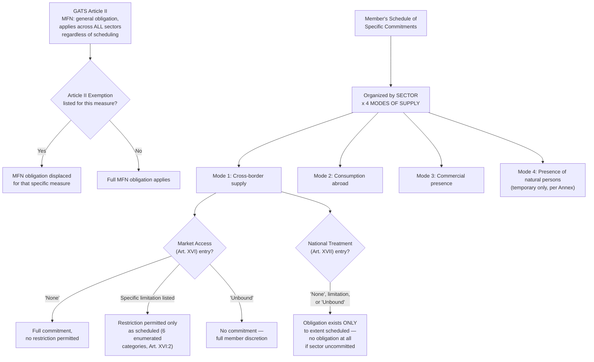

## The General Agreement on Trade in Services: Modes of Supply and Commitment Scheduling

### GATS as a Structural Departure from GATT

The **General Agreement on Trade in Services (GATS)**, established as **Annex 1B** to the Marrakesh Agreement, was the Uruguay Round's principal innovation for services trade, discussed alongside TRIPS as one of the Round's major scope expansions. A negotiator must recognize at the outset that GATS is architecturally distinct from GATT 1994 in a fundamental respect: GATT 1994 applies its core disciplines (MFN, national treatment via the tariff-and-schedule system) essentially universally to trade in goods, subject to negotiated exceptions; GATS instead uses a **hybrid structure** in which some obligations (MFN, transparency) apply generally across all services sectors, while the central market-access and national-treatment disciplines apply **only to the extent a member has specifically committed them**, sector by sector, in its own Schedule. This is the **positive-list** (or "bottom-up") approach, and understanding its mechanics is essential to correctly assessing the legal force of any GATS-related commitment.

### The Four Modes of Supply

**Legal basis — GATS Article I:2**. GATS defines "trade in services" not as a single transaction type but as four distinct **modes of supply**, each carrying its own regulatory and commitment implications:

- **Mode 1 — Cross-border supply**: the service itself crosses the border while the supplier and consumer each remain in their own territories (e.g., a consulting report delivered electronically, an offshore call-center service, or cross-border data processing).
- **Mode 2 — Consumption abroad**: the consumer travels to the supplier's territory to receive the service (e.g., tourism, a foreign student attending university abroad, medical treatment received in another country).
- **Mode 3 — Commercial presence**: the service supplier establishes a commercial presence (a subsidiary, branch, or representative office) in the territory of the consuming member (e.g., a foreign bank opening a branch, a foreign insurance company establishing a local subsidiary). This mode intersects substantially with foreign direct investment policy, since commercial-presence commitments function as market-access and national-treatment guarantees for foreign-owned or foreign-controlled service suppliers operating within the member's territory.
- **Mode 4 — Presence of natural persons**: a service supplier (an individual) temporarily enters the consuming member's territory to supply the service (e.g., a foreign engineer providing on-site technical services, an intra-corporate transferee). Mode 4 is explicitly limited by GATS' Annex on Movement of Natural Persons to *temporary* presence and explicitly does not affect measures regarding citizenship, residence, or employment on a permanent basis—a critical textual limitation distinguishing Mode 4 commitments from general immigration or labor-market access.

**Practitioner significance of the four-mode framework**: because a member schedules commitments **separately for each mode** within each committed sector, a negotiator must always specify which mode of supply a given services market-access question concerns. A member may commit fully to Mode 3 (allowing foreign commercial presence in a sector) while maintaining an "unbound" (uncommitted) status for Mode 4 in the same sector—meaning market access for foreign firms establishing local subsidiaries may be guaranteed while market access for foreign individual professionals seeking temporary entry to supply the same service remains entirely at the member's discretion. This mode-specific granularity is the single most distinctive technical feature of GATS relative to goods-trade liberalization, where no equivalent "mode" concept exists.

### The Positive-List Scheduling Architecture

**Structure of a GATS Schedule**. Each member's **Schedule of Specific Commitments** is organized as a matrix: sectors (drawn from the WTO Secretariat's classification list, itself based substantially on the UN Central Product Classification, though members are not strictly bound to use it) down one axis, and the four modes of supply across the other, with two separate columns of entries for each sector-mode combination:

- **Market access commitments (GATS Article XVI)**: for each committed sector and mode, a member may enter "None" (no restrictions, full commitment), a specific limitation (e.g., a cap on foreign equity participation, a limitation on the number of service suppliers, or an economic-needs test), or "Unbound" (no commitment, member retains full discretion to restrict). Article XVI:2 enumerates the specific categories of restriction that, if maintained, must be listed as limitations (numerical quotas on service suppliers, on the value of transactions, on the number of natural persons employed, restrictions on the type of legal entity or joint-venture requirements, and limitations on foreign capital participation) — meaning any measure falling within these six enumerated categories that is not explicitly listed as a limitation in the Schedule is prohibited for that committed sector-mode combination.
- **National treatment commitments (GATS Article XVII)**: similarly scheduled as "None," a specific limitation, or "Unbound," governing whether foreign services and service suppliers receive treatment no less favorable than like domestic services and suppliers.

**The critical asymmetry with GATT**: recall that GATT 1994's national treatment obligation (Article III) applies generally to all goods once a tariff binding exists, with no equivalent sector-by-sector opt-in structure. GATS national treatment, by contrast, applies **only where scheduled**—a member has no GATS national-treatment obligation whatsoever in an uncommitted sector, regardless of how it treats foreign services in practice in that sector. This is the defining structural feature a lawyer must internalize: absence of a scheduled commitment is not merely a limitation—it is the complete absence of the underlying obligation for that sector and mode.

**Horizontal versus sector-specific commitments**: Schedules typically include a **horizontal section** applying limitations across all scheduled sectors (commonly, Mode 3 limitations on foreign equity participation applicable economy-wide, or Mode 4 limitations applicable to all sectors) in addition to sector-specific entries, requiring a lawyer to read both the horizontal section and the specific sector entry together to determine the full scope of a member's actual commitment in any given sector-mode combination.

### GATS MFN and Its Exemptions

**Article II:1** imposes an MFN obligation applying generally across all services sectors, **independent of specific commitments**—unlike market access and national treatment, MFN under GATS is not scheduled sector-by-sector but applies as a general baseline obligation from the outset of membership. However, **Article II:2 and the Annex on Article II Exemptions** permitted members to list, at the time GATS entered into force (with limited subsequent additions), specific MFN exemptions for measures inconsistent with Article II, subject to periodic review and, originally, a general expectation that such exemptions would not exceed ten years in principle (though in practice many exemptions have persisted considerably longer, as the Annex's review process has not resulted in systematic removal on a fixed schedule).

**Practitioner implication**: because GATS MFN exemptions were meant to be listed at a specific historical moment (essentially, grandfathering pre-existing preferential arrangements, notably many bilateral air-transport and audiovisual-sector arrangements), a lawyer assessing whether a member's differential treatment of services from different trading partners is GATS-consistent must check the specific member's Article II Exemption List, since an exemption listed there displaces the general MFN obligation for that specific measure and sector.

### Illustrative Case: Scheduling Interpretation in Practice

**Illustrative case**: *US – Gambling* (WT/DS285, 2005) is a leading case on GATS scheduling interpretation. Antigua and Barbuda challenged U.S. restrictions on cross-border internet gambling and betting services, arguing the U.S. had made a market-access commitment covering gambling services under its GATS Schedule (through the broader "recreational, cultural and sporting services" sector heading, using a UN classification reference the U.S. had scheduled). The Appellate Body found the U.S. Schedule's sectoral classification did, on its proper interpretation, extend to gambling services, and that certain U.S. federal and state laws restricting cross-border gambling supply (Mode 1) constituted market-access limitations inconsistent with the scheduled commitment, not falling within the enumerated Article XVI:2 categories the U.S. had listed. The U.S. ultimately defended aspects of its measures under GATS Article XIV (the general-exceptions provision, structurally parallel to GATT Article XX, covering measures necessary to protect public morals or maintain public order), succeeding in part on this defense for certain measures but not others. **[Unverified]** The case's lengthy compliance history, including U.S. adjustments to its GATS Schedule following the ruling, involved multiple procedural stages; specific compliance details and the current status of the underlying Schedule modification should be verified against the WTO Dispute Settlement Gateway if needed for a specific brief.

### Diagram: GATS Commitment Architecture

### Practitioner Takeaways

1. **Always identify the specific mode of supply before analyzing a services market-access question.** A member's commitment or restriction in one mode (e.g., Mode 3 commercial presence) carries no implication for its position in another mode (e.g., Mode 4 natural person presence) in the same sector—these are legally and practically independent commitment points.
2. **An uncommitted sector means the complete absence of GATS market-access and national-treatment obligations, not merely weak protection.** Unlike GATT's near-universal application of national treatment once a tariff binding exists, a lawyer must confirm a specific scheduled commitment exists before asserting any GATS Article XVI or XVII violation—the positive-list structure means silence equals no obligation, not a default obligation.
3. **Sectoral classification disputes, as in *US – Gambling*, can be outcome-determinative before reaching the substantive market-access analysis.** A negotiator drafting or interpreting a Schedule entry should anticipate that classification-list references (particularly to the UN Central Product Classification or the WTO Secretariat's services sectoral classification list) carry substantial interpretive weight and are frequently the actual battleground in scheduling disputes.

**Related Topics**

- GATS Article XIV general exceptions and their parallel to GATT Article XX
- The Article II MFN Exemption List and its treatment of pre-existing preferential services arrangements
- Horizontal versus sector-specific limitations in GATS Schedule interpretation
- The Annex on Movement of Natural Persons and Mode 4's temporary-presence limitation
- GATS Article V Economic Integration Agreements as the services-sector RTA exception
- Domestic regulation disciplines under GATS Article VI and ongoing Working Party negotiations