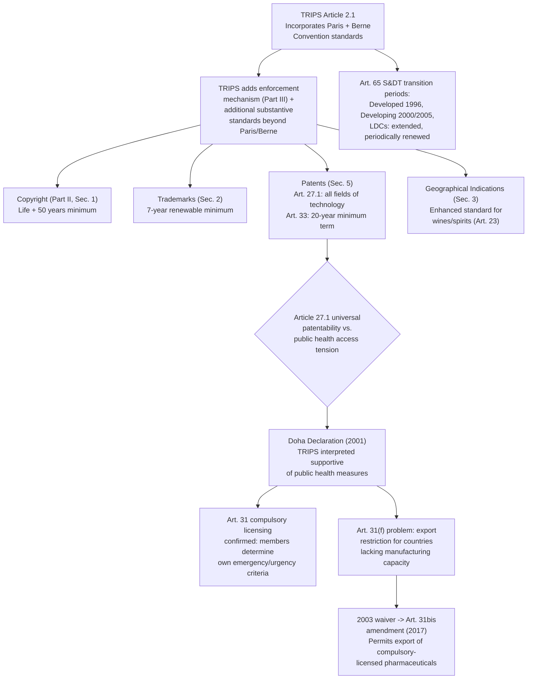

## The TRIPS Agreement: Minimum Standards for Intellectual Property Protection

### TRIPS as a Structural Outlier Among the Three Pillars

The **Agreement on Trade-Related Aspects of Intellectual Property Rights (TRIPS)**, established as **Annex 1C** to the Marrakesh Agreement, is structurally distinct from GATT 1994 and GATS in a way a negotiator must grasp before analyzing any substantive provision: whereas GATT and GATS primarily discipline *border measures and regulatory treatment* of goods and services, TRIPS obligates members to establish and enforce **minimum standards of substantive domestic law** protecting intellectual property. This is often described as a "minimum standards" agreement rather than a market-access agreement—TRIPS does not negotiate tariff reductions or scheduled commitments; it requires every member to legislate specific IP protections meeting defined floors, regardless of that member's own prior domestic IP tradition or policy preference.

**Relationship to prior IP treaties**: TRIPS did not create IP law from nothing. **Article 2.1** incorporates by reference the substantive obligations of several pre-existing IP conventions administered by the World Intellectual Property Organization (WIPO)—principally the **Paris Convention** (industrial property: patents, trademarks, industrial designs) and the **Berne Convention** (literary and artistic works, copyright)—meaning TRIPS obligations must be read as encompassing these conventions' substantive standards *plus* TRIPS' own additional and more detailed requirements ("TRIPS-plus" relative to the Paris/Berne baseline). The critical innovation was not primarily new substantive IP standards in every category, but rather making IP protection **enforceable through WTO dispute settlement**—a mechanism WIPO's own administrative structure lacked, since recall that WIPO's Paris and Berne Conventions had no equivalent to the WTO's negative-consensus dispute settlement mechanism.

### Substantive Minimum Standards by IP Category

**Copyright (Part II, Section 1)**: TRIPS incorporates Berne Convention standards (Articles 1–21, excluding Article 6bis on moral rights) and adds specific extensions, including protection of computer programs as literary works and compilations of data, and rental rights for computer programs and cinematographic works. Copyright term is set at a minimum life of the author plus 50 years (or, for works not calculated on a natural person's life, a minimum of 50 years from publication or creation).

**Trademarks (Part II, Section 2)**: requires protection for any sign or combination of signs capable of distinguishing goods or services, with a minimum initial registration term of 7 years, indefinitely renewable, and prohibits compulsory licensing of trademarks.

**Patents (Part II, Section 5)**: this is the most economically and politically contentious category. **Article 27.1** requires patents be available for inventions in **all fields of technology**, provided they are new, involve an inventive step, and are capable of industrial application—a critical universalizing requirement, since prior to TRIPS many developing countries (most prominently India) had legislated process-patent-only regimes for pharmaceuticals, deliberately excluding product patents on medicines to preserve generic manufacturing capacity. **Article 33** sets a minimum patent term of 20 years from the filing date. Article 27.2 and 27.3 permit limited exclusions (inventions contrary to public order or morality, certain diagnostic/therapeutic/surgical methods, and plants and animals other than microorganisms, though members must provide some form of protection for plant varieties, either by patents, an effective sui generis system, or a combination).

**Geographical indications (Part II, Section 3)**: requires protection against use of a geographical indication that misleads the public as to the product's true origin, with an **enhanced, additional protection standard for wines and spirits** (Article 23) prohibiting use even where the true origin is indicated or accompanied by qualifying terms like "kind" or "style"—a heightened standard reflecting the particular negotiating priority the European Communities placed on wine and spirit GI protection during the Uruguay Round.

**Undisclosed information/trade secrets (Part II, Section 7)**: requires protection of undisclosed information with commercial value against disclosure, acquisition, or use in a manner contrary to honest commercial practices, and specific protection for undisclosed test data submitted to governments for pharmaceutical or agricultural chemical product approval.

### Enforcement Obligations: Part III

Recall that TRIPS' distinguishing feature relative to prior WIPO conventions is enforceability. **Part III** requires members to make available civil judicial procedures for IP rights enforcement, including provisions for injunctions, damages, and evidence preservation; **border measures** (Section 4) requiring customs authorities to suspend release of suspected counterfeit trademark or pirated copyright goods upon a right-holder's application; and, for cases of willful trademark counterfeiting or copyright piracy on a commercial scale, **criminal procedures and penalties** (Article 61) sufficient to provide a deterrent.

### Special and Differential Treatment: Transition Periods

Recall the general concept of special and differential treatment (S&DT) introduced in the discussion of the Enabling Clause and developing-country accession. TRIPS **Article 65** established differentiated implementation timelines: developed-country members were required to implement TRIPS by 1996 (one year after WTO entry into force); developing-country members received a general transition period until 2000, with an additional extension to 2005 specifically for extending product patent protection to areas of technology not previously so protected (most significantly, pharmaceuticals, in countries like India that had maintained process-patent-only regimes). **Least-developed-country members** received extended transition periods that have been repeatedly renewed by subsequent decisions—most significantly, LDC members currently benefit from an extended general transition period, and a **specific, separate extension for pharmaceutical product patents and undisclosed test data protection**, reflecting sustained recognition of the acute public-health stakes involved. **[Unverified]** The precise current expiration dates for LDC transition periods (both general TRIPS obligations and the pharmaceutical-specific extension) have been extended multiple times by Council for TRIPS decisions and should be verified against the most recent Council decision, since this is an area subject to periodic renewal rather than a fixed, one-time deadline.

### The Doha Declaration on TRIPS and Public Health

**Legal and political context**: the tension between Article 27.1's universal patentability requirement (including pharmaceutical products) and public-health access to affordable medicines, particularly amid the HIV/AIDS crisis, became one of the most politically significant TRIPS controversies of the early 2000s. The **Doha Declaration on the TRIPS Agreement and Public Health** (adopted at the 2001 Doha Ministerial Conference, the same conference launching the Doha Development Round) affirmed that TRIPS "does not and should not prevent members from taking measures to protect public health" and that the Agreement "can and should be interpreted and implemented in a manner supportive of WTO members' right to protect public health and, in particular, to promote access to medicines for all."

**Operationalizing flexibilities**: the Declaration confirmed members' rights to grant **compulsory licenses** (authorizing production of a patented invention without the patent holder's consent, subject to conditions in **TRIPS Article 31**, including generally a requirement of prior negotiation with the patent holder except in cases of national emergency, extreme urgency, or public non-commercial use) and to determine what constitutes a national emergency or circumstances of extreme urgency themselves—a significant clarification given ambiguity in the original Article 31 text regarding the scope of national discretion.

**The Article 31bis amendment**: the Doha Declaration also identified a specific unresolved problem—members lacking domestic pharmaceutical manufacturing capacity could issue a compulsory license domestically, but Article 31(f)'s requirement that compulsory-licensed production be "predominantly for the supply of the domestic market" prevented countries with manufacturing capacity from exporting compulsory-licensed generic medicines to countries without such capacity. A 2003 General Council waiver, later formalized as a permanent TRIPS amendment (**Article 31bis**, entering into force in 2017 after achieving the required two-thirds acceptance), created a specific export mechanism allowing compulsory-licensed pharmaceutical production for export to eligible importing members lacking manufacturing capacity. **[Inference]** The Article 31bis mechanism's practical utilization has been widely characterized in public-health and trade-law literature as limited in actual usage relative to its intended scope, given the procedural complexity of its notification and administration requirements; this is a widely noted assessment in the literature rather than a settled quantitative finding, and current utilization data should be verified against Council for TRIPS records if precision is required.

**Illustrative case/practice**: while relatively few formal WTO disputes have directly litigated Article 31 compulsory licensing (much of the practice occurs through domestic legal and administrative action rather than WTO dispute settlement), the Doha Declaration's interpretive authority has been invoked extensively in domestic compulsory-licensing decisions by various developing-country governments (for example, actions concerning HIV/AIDS antiretroviral medications in the 2000s), demonstrating the Declaration's practical significance as an interpretive tool even without extensive formal dispute-settlement litigation directly testing its boundaries.

### Diagram: TRIPS Minimum Standards and Public Health Flexibility Architecture

### Practitioner Takeaways

1. **TRIPS obligations must be read as Paris/Berne-plus, not as a standalone code.** A lawyer analyzing a specific IP protection question should first check whether the relevant Paris or Berne Convention provision applies via Article 2.1 incorporation before assessing TRIPS' own additional textual requirements—treating TRIPS as fully self-contained risks missing incorporated obligations.
2. **The Doha Declaration is an interpretive tool, not a textual amendment to Article 27 or 31 itself (with the exception of Article 31bis).** A negotiator advising a government on compulsory licensing should distinguish between the Declaration's confirmed interpretive latitude (member discretion over emergency/urgency determinations, generally applicable) and the specific, narrower Article 31bis export mechanism (applicable only to the specific manufacturing-capacity export scenario it addresses).
3. **LDC transition periods are subject to periodic renewal, not fixed permanently.** A practitioner advising an LDC government or a pharmaceutical company operating in LDC markets should verify current transition-period expiration dates against the most recent Council for TRIPS decision rather than relying on any previously cited deadline, since these have been extended multiple times.

**Related Topics**

- The Paris and Berne Conventions as incorporated baselines under TRIPS Article 2.1
- Compulsory licensing procedures and conditions under TRIPS Article 31
- The Article 31bis amendment and the pharmaceutical-export mechanism for countries lacking manufacturing capacity
- Geographical indications and the enhanced wines/spirits protection standard under Article 23
- TRIPS enforcement obligations: civil, border, and criminal measures under Part III
- Special and differential treatment transition periods for developing countries and LDCs under Article 65