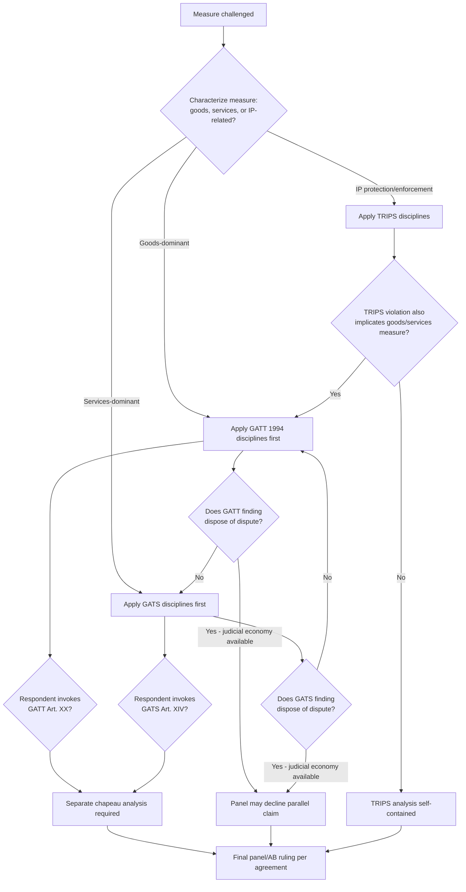

## Overlapping Treaty Coverage: Adjudicating Claims That Span GATT, GATS, and TRIPS

### Legal Basis for Multi-Agreement Claims

The WTO Agreement is structured as a "single undertaking": Article II:2 of the Marrakesh Agreement Establishing the WTO provides that the agreements in Annexes 1A (goods, including GATT 1994), 1B (GATS), and 1C (TRIPS) are binding on all Members. There is no textual hierarchy among them. A single measure — a government regulation, licensing regime, or subsidy scheme — can therefore trigger obligations under two or three of these agreements simultaneously, since GATT disciplines trade in goods, GATS disciplines trade in services, and TRIPS disciplines intellectual property protection, and modern regulatory measures rarely respect those categorical boundaries cleanly.

The Dispute Settlement Understanding (DSU) does not require a complainant to choose one agreement. Article 3.1 DSU preserves the applicability of "the customary rules of interpretation of public international law," and Article 1.1 DSU allows the DSU to govern disputes brought under "the covered agreements" collectively, meaning a single panel request can cite provisions from multiple annexes.

### The Threshold Problem: Characterizing the Measure

Before substantive analysis, a panel must decide which agreement's disciplines even apply to the facts, because GATT and GATS have different obligation structures (GATT national treatment is general; GATS national treatment under Article XVII applies only to scheduled sectors and modes of supply).

The controlling framework comes from **EC – Bananas III** (WT/DS27/AB/R, 1997). The Appellate Body held that GATT and GATS are not mutually exclusive: a measure can fall within both agreements at once, since "the Council for Trade in Goods and the Council for Trade in Services...have different mandates and different competence" but a single measure can still generate obligations under each. The Appellate Body rejected the EC's argument that a licensing measure affecting banana imports should be examined only under GATT because it was "trade in goods" — since the license allocation also regulated wholesale distribution services, GATS applied concurrently.

**Definition on first use — "measure affecting trade in services" (GATS Article I:1):** GATS applies to any measure by a Member that affects the supply of a service, regardless of the measure's formal legal character (a customs regulation, a licensing rule, a tax measure) or which ministry administers it. This functional test — not the measure's label — is what triggers concurrent coverage.

### The Sequencing Doctrine: GATT/GATS Order of Analysis

When a measure implicates both GATT and GATS, panels do not analyze both simultaneously from scratch. **EC – Bananas III** established a practical sequencing approach:

1. Determine whether the measure, in its predominant character, is more readily analyzed under GATT (goods) or GATS (services) first, based on which agreement addresses the "specific aspect" of the measure at issue.
2. Complete that analysis before turning to the second agreement, using findings from the first analysis (e.g., on discrimination or likeness) as relevant context rather than repeating fact-finding from zero.
3. Confirm that the second agreement's disciplines are not rendered moot by the first agreement's findings — a violation found under one agreement does not automatically dispose of claims under the other, since the legal tests differ (e.g., "like products" under GATT Article III is not defined identically to "like services and service suppliers" under GATS Article XVII).

**Practitioner note:** For a complainant, pleading both GATT and GATS claims in the alternative is a standard risk-hedging strategy — if the panel characterizes the measure as goods-dominant and rejects the GATS claim on scope grounds, the GATT claim survives independently. Panel requests (under DSU Article 6.2) must therefore plead the legal basis under each agreement with sufficient particularity to preserve both theories.

### TRIPS Overlap: The Distinctive Problem of IP-as-Barrier-to-Trade

TRIPS overlaps with GATT most commonly where a measure ostensibly protecting intellectual property also functions as a quantitative restriction or discriminatory regulation on the underlying good. TRIPS overlaps with GATS where the intellectual property in question protects a service-delivery method (e.g., software licensing, broadcasting rights).

The leading case is **China – Intellectual Property Rights** (WT/DS362/R, 2009), which involved both TRIPS claims (adequacy of criminal thresholds for trademark and copyright piracy under TRIPS Article 61) and a separate claim about China's denial of copyright protection to works that had not cleared content review — implicating Berne Convention incorporation via TRIPS Article 9.1. The panel kept the TRIPS analysis self-contained, illustrating that TRIPS claims often do *not* require reaching GATT or GATS at all, because Article 61's minimum-enforcement obligation is assessed against domestic legal thresholds, not cross-border trade effects.

Where overlap is unavoidable, **China – Publications and Audiovisual Products** (WT/DS363/R, WT/DS363/AB/R, 2009–2010) is the paradigm case. China's restrictions on entities permitted to import and distribute films, music, and publications were challenged simultaneously as:

- A violation of China's GATT-consistent trading-rights commitments (from its Accession Protocol, not GATT itself, since accession protocols are freestanding but incorporated as part of the WTO Agreement under the Marrakesh Agreement's Annex 1 mechanism);
- A violation of GATS Article XVII (national treatment) and Article XVI (market access) for the distribution *services* bundled with the import restriction;
- Adjacent to TRIPS enforcement questions on the same content.

The Appellate Body upheld findings that a single restriction — who may import a physical good (a DVD or book) — simultaneously regulated market access for wholesale/retail distribution *services*, confirming that goods and services obligations attach to different functional slices of what is, physically, one transaction.

### Article XX/XIV General Exceptions Across Agreements

**Key Points:**

- GATT Article XX and GATS Article XIV are textually parallel (both list exceptions including public morals, human/animal/plant life or health, and both require satisfying the chapeau against arbitrary or unjustifiable discrimination) but are legally distinct provisions requiring separate invocation and separate chapeau analysis.
- A respondent cannot import a GATT Article XX defense into a GATS claim, or vice versa, without pleading the parallel provision — **China – Publications and Audiovisual Products** confirmed China needed to justify its measure under GATS Article XIV separately from its GATT-Accession-Protocol defense, even though the policy rationale (content censorship as "public morals") was argued in materially similar terms under both.
- TRIPS has no equivalent general exceptions clause; instead, it has purpose-built limitations (TRIPS Article 30 for patents, Article 13 for copyright's "three-step test," Article 17 for trademarks) that are narrower and agreement-specific, meaning a respondent cannot invoke GATT Article XX to excuse a TRIPS violation.

### Jurisdictional and Procedural Consequences

**Panel composition and terms of reference:** Under DSU Article 7, a panel's terms of reference are defined by the panel request. A panel exceeds its mandate if it rules on an agreement not properly pleaded — this was central to jurisdictional objections in several disputes where a party attempted to raise a TRIPS or GATS theory only in its first written submission rather than in the original panel request.

**Judicial economy:** Under the doctrine articulated in **US – Wool Shirts and Blouses** (WT/DS33/AB/R, 1997), a panel is not required to rule on every claim raised if resolving one claim (e.g., under GATT) fully resolves the dispute, and it may decline to reach parallel claims under GATS or TRIPS as a matter of judicial economy. [Inference] This creates strategic incentive for complainants to sequence their strongest claim first, since a panel finding on a weaker parallel claim may never be reached, leaving that legal question unresolved for future disputes.

**Standard of review divergence:** GATT national treatment (Article III:4) uses a "no less favourable treatment" test focused on conditions of competition; GATS Article XVII uses textually similar language but is qualified by sector-specific scheduling limitations negotiated by each Member. A panel handling overlapping claims must apply each test independently rather than assuming a GATT finding of discrimination automatically satisfies the GATS test, since a Member may have scheduled limitations under GATS that permit treatment that would be GATT-inconsistent if applied to goods.

### Procedural Flow for a Multi-Agreement Claim

### Practitioner Implications

For a negotiator drafting a domestic regulation with export or import consequences, the practical lesson from **Bananas III** and **China – Publications** is that regulatory design cannot be insulated from GATS or TRIPS scrutiny merely by framing a measure as a goods-trade instrument (a licensing quota, a tariff-rate quota administration rule). Distribution, wholesale, retail, and after-sale services bundled into a goods transaction create independent GATS exposure, and IP-contingent market access conditions create independent TRIPS exposure. For a dispute-settlement lawyer, the practical lesson is drafting discipline in the panel request under DSU Article 6.2: every legal basis intended to be preserved through to the Appellate Body stage must be identified with precision at the outset, since claims not properly within a panel's terms of reference cannot be introduced later in the proceeding.

### Related Topics

- The DSU Article 6.2 pleading standard and consequences of terms-of-reference challenges
- GATS Article XVII national treatment and the mechanics of sector-specific scheduling (positive-list commitments)
- Accession Protocol commitments as freestanding WTO obligations distinct from GATT/GATS/TRIPS text
- TRIPS Article 30/Article 13 "three-step test" limitations as agreement-specific analogues to general exceptions
- Judicial economy doctrine and its effect on the development of WTO jurisprudence over time